## 基于 的 超节点参考架构白皮书

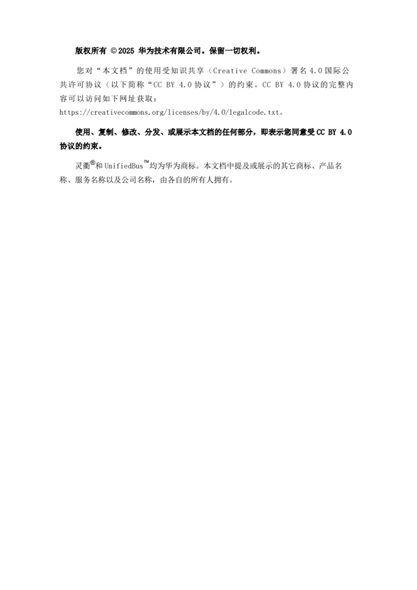

## 版权所有 © 2025 华为技术有限公司。保留一切权利。

您对'本文档'的使用受知识共享（ Creative Commons ）署名 4.0 国际公 共许可协议（以下简称' CC BY 4.0 协议'）的约束。 CC BY 4.0 协议的完整内 容可以访问如下网址获取：

https://creativecommons.org/licenses/by/4.0/legalcode.txt 。

## 使用、复制、修改、分发、或展示本文档的任何部分，即表示您同意受 CC BY 4.0 协议的约束。

灵衢 ® 和 UnifiedBus ™ 均为华为商标。本文档中提及或展示的其它商标、产品名 称、服务名称以及公司名称，由各自的所有人拥有。

## 目 录

| 1 AI            | 时代的挑战 .................................................................................................................................4                                  |
|-----------------|---------------------------------------------------------------------------------------------------------------------------------------------------------------------------|
| 2 超节点参考架构       | ..............................................................................................................................5                                           |
| 3 超节点参考架构的场景化应用 | .....................................................................................................8                                                                    |
| 3.1 大模型预训练      | .............................................................................................................................................................8            |
| 3.2 中心推理        | .....................................................................................................................................................................9    |
| 3.3 后训练与强化学习    | ...................................................................................................................................................10                     |
| 3.4 多模态内容理解与生成  | ...........................................................................................................................................12                             |
| 3.5 Agentic     | AI...................................................................................................................................................................13   |
| 3.6 虚拟化         | .......................................................................................................................................................................14 |
| 3.7 大数据         | .......................................................................................................................................................................15 |
| 3.8 数据库         | .......................................................................................................................................................................16 |
| 3.9 分布式存储       | ...............................................................................................................................................................17         |
| 3.10 高性能计算      | .............................................................................................................................................................19           |
| 4 灵衢协议栈和机制      | ........................................................................................................................21                                                |
| 4.1 灵衢协议栈       | ...............................................................................................................................................................21         |
| 4.2 灵衢使能超节点机制   | ...............................................................................................................................................22                         |
| 4.2.1 总线级互联     | ............................................................................................................................................................22            |
| 4.2.2 协议归一      | ................................................................................................................................................................23        |
| 4.2.3 平等协同      | ................................................................................................................................................................23        |
| 4.2.4 全量池化      | ................................................................................................................................................................24        |
| 4.2.5 大规模组网     | ............................................................................................................................................................25            |
| 4.2.6 高可用性      | ................................................................................................................................................................27        |
| 4.3 灵衢软件配套      | ...........................................................................................................................................................27             |
| 5 总结            | ................................................................................................................................................29                        |

## 1 AI 时代的挑战

AI 时代的到来为全球计算领域带来跨越式变革。算力需求在大模型爆发式演进下呈指 数级增长，平均每 6 个月实现翻倍，大幅超越摩尔定律揭示的硬件迭代速度；组网规模 由过去百卡扩展至当前十万，未来甚至百万卡，需要计算系统实现极致效率与可靠性。 通用计算持续追求资源利用率的提升，同时又面临与 AI 算力紧密结合的新需求，需要 加强多芯片池化和通信能力。计算领域的加速演进对各种算力应用场景带来全新挑战：

- ⚫ 大模型预训练： Scaling Law 曲线持续攀升， SP/TP/EP 总通信数据量相比较小模型 提升近百倍，单批次达到数百 GB ，模型跨节点通信带宽增长速率仅为算力增长速 率的 1/5 ，成为训练性能关键瓶颈。
- ⚫ 大模型推理： Token 输出时延（ TPOT ）是大模型推理核心性能指标，随着多模态 与 AI Agent 发展， TPOT 需进一步下降至 5ms 甚至 1ms ，序列长度向百万 Token 增长， KV Cache 远超 HBM 容量，同时不同的推理阶段算力和内存需求差距大。
- ⚫ Agentic AI ： AI 应用正逐步向 Agentic AI 演进，这类任务通常需要多组件协同，共 同处理包含数据库操作、数据预处理和推理等在内的子任务。
- ⚫ 虚拟化：当前通用计算业务主要部署在虚拟机或容器，传统虚机 30%-50% 内存未 被使用，设备无法在节点间池化，整体资源利用率低；同时如果虚拟机热迁移时 间达到 100~200ms 量级，客户将感知到业务中断。从业务连续性视角，期望 RPO 指 标为 0 ， RTO 指标小于 50ms ，以实现虚机热迁移场景业务无损。
- ⚫ 数据库：为提升数据库线性度，达到峰值性能最优，数据库需要分层解耦的资源 池化架构，而这种架构需要大规模和低时延的内存共享。只有实现百 ns 量级的跨 节点内存访问时延（低于当前 RDMA 的 1/10 ），才能匹配数据库架构发展趋势，使 得数据库峰值性能进一步提升。

为了满足日益增长的业务需求，支持智算、通算及各种融合应用场景，我们针对 AI 时 代数据中心提出超节点参考架构。

## 2 超节点参考架构

超节点参考架构（ SuperPoD Reference Architecture ）是面向 AI 时代数据中心，基于灵衢 （ UnifiedBus ，简称 UB ）的新型计算系统架构，支持 CPU 、 NPU 、 GPU 、 MEM 、 DPU 、 SSU （ Scalable Storage Unit ）和 Switch 中的一种或者多种组件资源池化和平等协同，构 建逻辑上的一台计算机。

图 2-1 基于灵衢的超节点参考架构

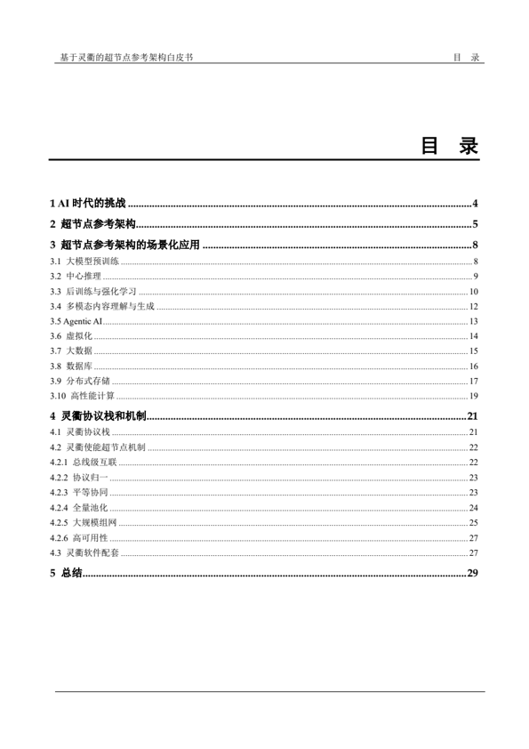

基于灵衢的超节点参考架构具备如下六大特征：

## 1. 总线级互联

基于灵衢的总线级互联，提供百 ns 同步内存语义访问时延和 2~5us 异步内存语义访问时 延，满足算力单元高并发的访问需求；提供组件间 TB/s 级带宽，相比传统数据中心网 络带宽至少提升 10 倍。

## 2. 协议归一

基于灵衢的协议归一，支持超节点内不同类型、不同距离的组件统一互联，访问无协 议转换开销，组件包括 CPU 、 NPU 、 GPU 、 MEM 、 DPU 、 SSU 和 Switch 等；提供统一 的编程模型。

## 3. 平等协同

基于灵衢的平等协同机制，支持超节点内所有组件去中心化的互相访问、调用和协同 工作，提升组件间访存和通信性能。

## 4. 全量池化

基于灵衢和 Linux 操作系统的灵衢扩展组件，提供超节点的设备管理、内存管理、通信 和虚拟化等功能，支持超节点资源的高效池化管理和调用，提升资源弹性和利用率。

## 5. 大规模组网

支持超节点以大于 90% 的线性度从单节点扩展到 8192 卡，未来还将持续提升至 15488 卡， 甚至更大规模；支持超节点通过 UBoE 构建百万卡规模的集群，兼容以太组网。

## 6. 高可用性

基于灵衢的可靠机制，支持超节点内应用无感知的 us 级检错和容错，在 8192 卡超节点范 围内实现光互连 MTBF （ Mean Time Between Failures ）大于 6000 小时。

灵衢是一种面向超节点的互联协议，将 I/O 、内存访问和各类处理单元间的通信统一在 同一互联技术体系，实现数据高性能传输、算力高效协同、资源统一管理和灵活组 合，是超节点参考架构的基础。

图 2-2 灵衢部署示意

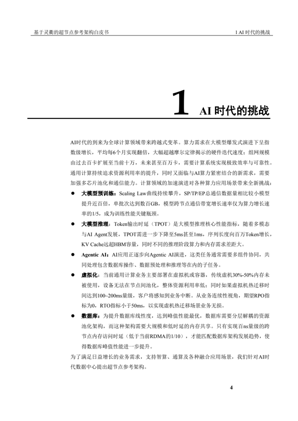

## 灵衢包含以下要素：

- ⚫ UB Processing Unit （ UBPU ）是支持 UB 协议栈的处理单元，实现特定功能。
- ⚫ UB Controller 是 UBPU 中执行 UB 协议栈的组件，并提供软硬件接口。

- ⚫ UB Memory Management Unit （ UMMU ）是 UBPU 中执行内存地址翻译和访问权限 控制的组件。
- ⚫ UB Switch 是 Switch 中的必选组件，在其他 UBPU 中是可选组件，支持在 UB 端口间 转发报文。
- ⚫ UB Link 是 UBPU 间的点到点连接。
- ⚫ UB Domain 是一个全部使用 UB Link 连接起来的 UBPU 集合。
- ⚫ UB Fabric 是 UB Domain 内所有 UB Switch 和 UB Link 的集合。
- ⚫ UB over Ethernet （ UBoE ）通过以太 /IP 网络承载 UB 事务，实现跨 UB Domain 互通。

基于灵衢的超节点参考架构帮助您迎接智能化时代算力基础设施挑战。

## 3 超节点参考架构的场景化应用

以灵衢为基础构建的超节点参考架构，在面向人工智能计算与通用计算领域的 10 大核 心业务场景，如大模型预训练、中心推理、后训练与强化学习、多模态内容理解与生 成、 Agentic AI 、虚拟化、大数据、数据库、分布式存储和高性能计算等，均可提供领 先的系统能力，带来计算业务性能和资源利用率提升。

## 3.1 大模型预训练

为了提升大模型性能，业界主流基础大模型训练的参数量和数据量快速增长，从早期 的数十亿参数发展到如今的万亿级别，如： 2024 年 12 月发布的 DeepSeek V3 参数量达到 671B ， 2025 年 7 月发布的 Kimi K2 参数量突破万亿大关。大模型预训练的业务负载呈现 高并行特征，单一训练任务横跨整个算力中心的所有节点，随着预训练所需要的算力 规模持续增长，对计算基础设施高效并行提出挑战：

## ⚫ 模型参数增长需要多卡并行部署，带来大量集合通信开销

以 GPT4 1.8T 为例，模型部署需要超 10TB 显存占用，远超 GPU 单卡甚至单服务器容量上 限。为了解决这一问题，业界普遍采用张量并行（ TP ）、流水线并行（ PP ）、专家并 行（ EP ）、序列并行（ SP ）和数据并行（ DP ）等技术进行分布式部署，但会带来巨大 通信开销，当采用 TP8/PP16/EP8/SP4/DP64@seq8k/bs8k 的超参设置时，单次 Global Batch Size 迭代过程中，每张卡的 TP 通信量高达 336GB ， EP 通信量为 268GB ， DP 通信量 为 86GB 。如此大量的集合通信对网络基础设施提出了极致低时延和大带宽要求，特别 是在并行域内的通信需求更为迫切。

## ⚫ 传统服务器训练集群节点间通信带宽不满足多卡并行集合通信要求

近 8 年间单节点算力增长约 40 倍，但节点间通信带宽仅增长 4~8 倍，通信与计算能力的 不匹配成为制约大模型训练效率的关键瓶颈，高比例的通信开销无法被计算有效掩盖， 严重影响了模型的算力利用率（ MFU ），使得昂贵的计算资源无法得到充分利用。

大模型预训练超节点参考架构实现 NPU-to-NPU 的大带宽低时延互联，降低了大模型训 练过程中高度并行化部署所带来的通信开销，提升了大模型训练性能。系统在混合专 家（ MoE ）模型、长序列输入等复杂场景下均能取得性能收益。 DeepSeek V3 为例：在 PP8/DP64/EP64 典型配置场景下，超节点集群相比传统服务器集群，未被掩盖的通信比 例降低 80% ，在单 NPU 2 倍裸算力增加的情况下，实现系统最高 3 倍以上的训练性能提 升，充分证明先进架构对大模型训练效率的重要价值。

图 3-1 大模型预训练超节点参考架构

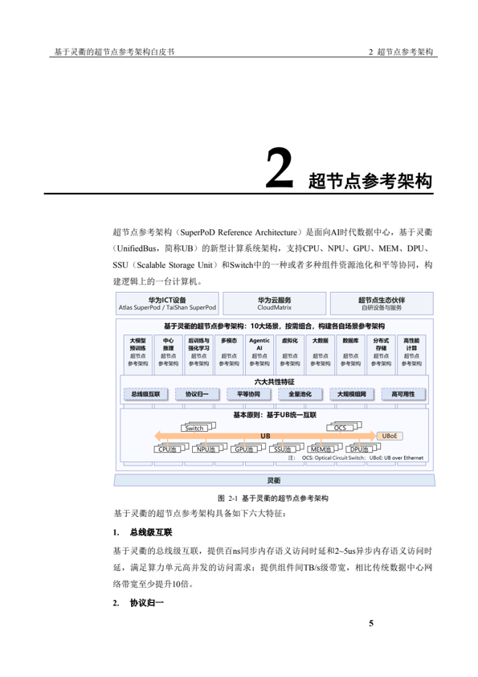

## 3.2 中心推理

主流大语言模型（ LLM ）向万亿参数稀疏化演进，总参数量与专家数量不断增长，如： DeepSeek V3 671B/256 专家和 Kimi K2 1.04T/384 专家；推理模式也从单卡单机走向多机 大专家并行。同时，大语言模型推理序列长度持续增长，豆包 1.6 模型成为国内首个支 持 256K 序列的商业模型。随着 AI 应用持续发展，多图 + 视频等多模态理解类应用预计驱 动序列长度进一步增加到 M 级别。针对大专家并行和长序列输入的发展趋势，中心推理 场景的算力基础设施面临如下关键挑战：

## ⚫ 多专家低时延通信挑战

多机大专家并行推理，小数据高频通信占比高，以 DeepSeek V3 为例，每 Token 推理， 58 层 MoE 需要 58 轮 Dispatch 和 Combine 跨节点动态通信，最小粒度仅为 7KB ，通信量随 Batch Size 线性增加，最大可达百 MB 。推理服务要兼顾单用户体验与多用户并发开销， 需在 TPOT 10ms 甚至更低情况下尽量做大 Batch Size ，那么通信比例应控制在 20% 以内， 这样单次 Dispatch 和 Combine 耗时均需小于 10us ， RoCE 技术挑战很大。

## ⚫ 长序列 KV Cache 缓存挑战

稀疏化注意力是解决长序列推理的关键技术之一，在推理过程中需要保存用户的全量 KV Cache 数据，并卸载到节点内 Memory 或 Nand Flash ，大幅提升 Batch Size 及推理吞吐。 如：基于 DeepSeek V3 模型 64~128K 序列场景测算，通过卸载用户 KV Cache ，提升 4~6 倍 的 Batch Size 和 30%~40% 的推理吞吐。

中心推理超节点参考架构一方面利用 NPU-to-NPU 的大带宽、低时延和高效统一语义能 力实现高性能 Dispatch 和 Combine 通信，大幅降低多专家通信时延；另一方面基于全局 资源池化架构提供多层次 KV Cache 卸载和加载能力，纵向多层级介质扩容缓存空间， 横向 NPU-to-NPU 直通加速传输，以查代算提升计算吞吐。

图 3-2 中心推理超节点参考架构

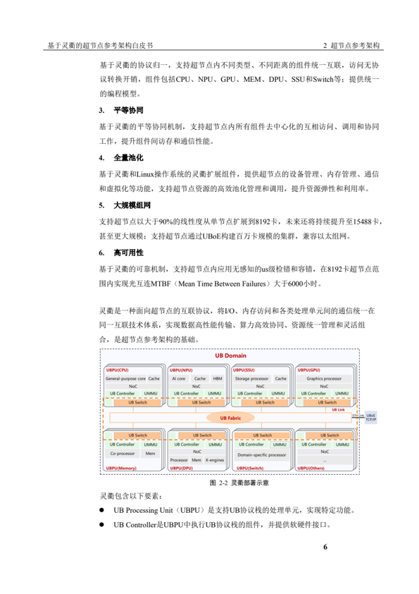

## 3.3 后训练与强化学习

在大模型强化学习训练场景中，随着语言模型规模的不断扩大和人类反馈优化需求的 提升，计算和通信挑战变得更加复杂和严峻。人类反馈强化学习（ RLHF ）训练流程通 常包括监督微调（ SFT ）、奖励模型训练（ RM ）和强化学习优化（ PPO ）三个阶段， 每个阶段都需要百亿甚至万亿参数规模的大模型。以 ChatGPT 和 Claude 等先进对话系统 为例，其 RLHF 训练过程需要同时维护策略模型、价值模型、奖励模型和参考模型等多 个大型神经网络，总参数量可达数万亿级别，对计算资源和通信带宽提出极高要求：

## ⚫ 大量模型参数与梯度同步通信挑战

大模型强化学习训练的独特挑战在于其多模型协同和频繁同步的特征，与传统预训练 不同， RLHF 的 PPO 阶段需要在策略网络推理、奖励计算、优势估计和策略更新之间进 行复杂的数据流转。在分布式 RLHF 架构中， Actor 节点生成响应文本， Critic 节点计算 价值函数， Reward 节点评估响应质量， Learner 节点执行策略优化，这些组件之间需要 进行大量的模型参数传输和梯度同步。

传统服务器堆叠集群在处理 RLHF 的多模型通信模式时面临瓶颈，大量参数和梯度信息 频繁交换，网络带宽很快成为限制因素。模型间复杂的依赖关系导致通信时延被多次 放大。以 GPT3 的训练配置为例，当使用 175B 参数的策略模型和 6.7B 参数的奖励模型时， 单次 PPO 迭代的模型间通信量可达 500GB 以上，传统服务器堆叠集群的网络带宽瓶颈往 往导致整体训练效率下降 40%~60% 。

## ⚫ 大批量样本生成与并行推理性能挑战

大规模 RLHF 训练时，使用当前策略模型生成大量候选响应，然后通过奖励模型进行评 分和排序，通常需要为每个提示生成数十个候选响应，可达数万个样本，这要求系统 能够高效处理大规模的序列生成和并行推理任务。同时，由于奖励模型的评分结果需 要及时反馈给策略优化过程，任何通信时延都会直接影响训练的收敛速度和稳定性。

大模型强化学习超节点参考架构基于 NPU-to-NPU 的大带宽显著降低了多模型组件之间 的参数同步时延，将原本数秒到数十秒级的模型传输时间降低到毫秒到秒级别，使得 PPO 和 GRPO 等算法能够更频繁地进行策略更新，提高学习效率和收敛速度。同时，超 节点可支持数百卡以上的大规模并行推理和生成，在相同硬件资源下可以处理更大的 Batch Size ，从而提高样本生成的吞吐量。在大规模对话模型的 RLHF 训练中，超节点上 部署的四模型系统相比传统服务器堆叠集群，训练的收敛速度有倍级提升，也显著提 升了推理吞吐量。以 70B 参数模型的 RLHF 训练为例，传统服务器堆叠集群在处理 32K Batch Size 的候选生成时，推理时延通常在数十秒级别，而超节点系统可以将这一时延 降低到秒级，提升样本生成效率。

图 3-3 强化学习超节点参考架构

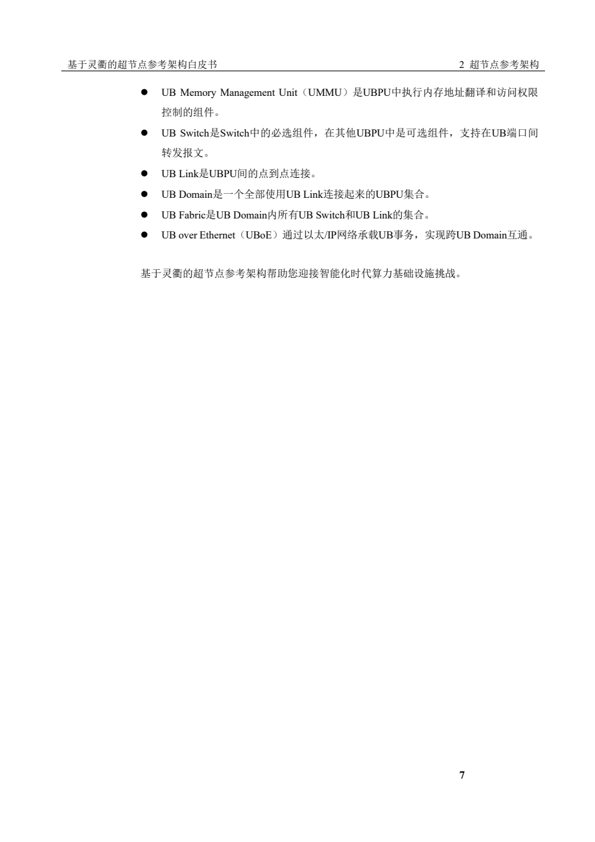

## 3.4 多模态内容理解与生成

多模态内容理解和生成是当前 AI 关键应用，演进趋势包括： 1) 多模态模型向百 B 稀疏 + 实时生成（如 5s 生成 5s 720p 视频）演进，部署形态由单卡单机走向多机并行； 2) 多模 态负载从单一模型 / 任务走向多模型 / 多任务，不同任务（如生成 / 编辑 / 理解）对算力及 访存的需求相差较大，驱动部署方式走向高算力与高带宽 NPU 组合异构部署； 3) 自动 驾驶 / 具身智能多模态仿真生成场景， 3D 高斯溅射（ 3DGS ）技术成为主流，其中千万

级高斯球 + 分钟级 3DGS 重建是重要场景。基于演进趋势，算力基础存在以下挑战：

## ⚫ 多机并行多模态推理挑战

序列并行和专家并行等策略，需百 GB/s 多机并行带宽，当前网络难以满足。

## ⚫ NPU 异构部署多任务并发挑战

多任务需要在 Token 级别对模态进行分组和 Re-order ，实现多任务计算量动态分配，存 在大量小包通信需求，导致通信时延要求高。

## ⚫ 高性能分布式 3DGS 挑战

3DGS 重建在千万级高斯球场景，单轮迭代需压缩至数十毫秒，同步百万级椭球梯度 （位置 / 协方差 / 透明度等）， GPU 间通信需求达到百 GB/s 。

## ⚫ 大量分散高斯球的梯度传输挑战

梯度数据可能分散在离散的显存空间中，需要大量细粒度（如数十个 Byte ）通信行为， 需要支持小包低时延通信。

多模态理解与生成超节点参考架构提供突破性解决方案。 GPU 资源池通过 UB 将多个 GPU 组成逻辑统一资源池，提升分布式 3DGS 重建的生成效率； NPU 异构部署通过 UB 持不同类型 NPU 异构组网，提升资源动态调度能力（如动态配比和动态并行策略寻优 等）及灵活性；内存语义通信通过 UB 实现小包超低时延通信，支持多任务推理 级别分组和 Re-order ，提升推理效率，并支持 3DGS 分散高斯球梯度快速同步，提升 3D

支 Token 渲染视图生成效率。

图 3-4 多模态理解与生成超节点参考架构

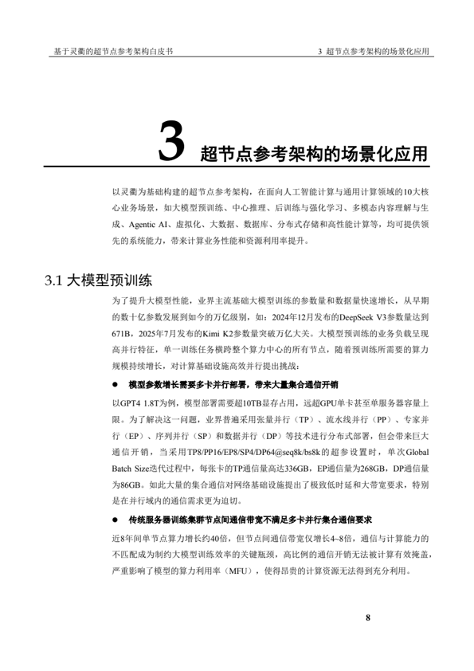

## 3.5 Agentic AI

Gartner 将 Agentic AI 列为 2025 年十大技术趋势之首，并预测到 2028 年，全球 15% 的日常 工作决策将由具备自主决策能力的 AI 代理完成， AI 逐步演变为能够自主感知、推理、 决策并执行任务的智能体 Agentic AI 。如：进一步融合多模态能力（文本、图像和语音 等）和物理世界交互（机器人控制），推动 AI 从'被动响应'转向'主动行动'。 Agentic AI 与互联网结合，形成'分布式智能体网络'，支持大规模协作。

## ⚫ Agentic AI 带来新的业务负载挑战

在 Agentic AI 中，多个 LLM 共同协作增加了系统的复杂性，结合了训练、推理、通算和 数据库管理四个核心环节，除训练、推理、强化学习和多模态等方面的挑战外，还引 入长链条推理和长期记忆带来的存储及访存挑战，长尾任务与异构硬件阻塞带来的资 源利用率难题，以及 Agent 多任务多副本带来的快速上下文切换与频繁镜像拉取开销。

## ⚫ Agentic AI 负载带来新的计算系统挑战

Agentic AI 的负载 Scaling 模式的升级换代给系统设计带来了挑战，包括内存需求激增、 资源调度复杂化、通信随机性增加，以及存储持久化的管理问题。随着多样化环境的 动态变化，系统必须适应不断扩展的负载，确保高效的内存使用、精确的资源调度和 持续的数据存储，满足长期运行的需求。

Agentic AI 超节点参考架构通过多样性算力平等协同计算实现多模态训练数据高吞吐预 处理、检索增强生成（ RAG ）及慢思考推理等高吞吐优化；基于 UB 全局资源池化无损 热迁移，应对 Agent 中长期记忆带来 KV Cache 、 RAG 等异构数据检索指数级增加的挑战； 基于 UB 实现沙箱镜像的毫秒级热频繁加载，实现 Agentic AI 负载亲和。

## 3.6 虚拟化

AgenticAI工作6阶段：阶段1-数据加载；阶段2-预处理；阶段3：同步参数；阶段4-RAG检索；阶段5-Reflection；阶段6-agent探索轨迹收集&amp;存储

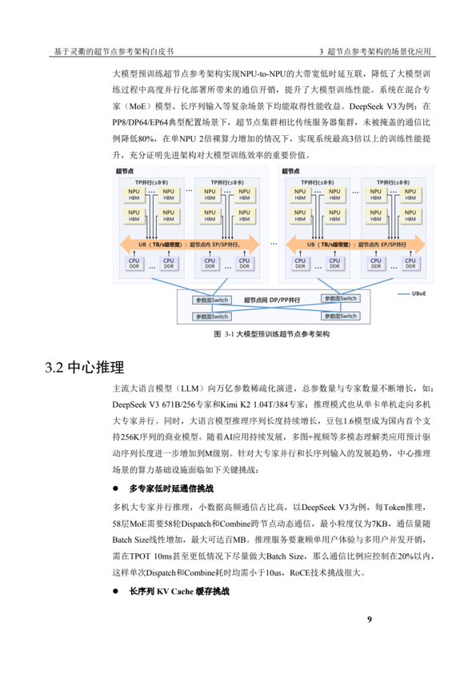

图 3-5 Agentic AI 超节点参考架构

传统云计算虚拟化技术通过计算、存储和网络资源的抽象，提升数据中心部署灵活性 与资源利用率，但实际应用场景仍面临以下关键挑战：

## ⚫ 资源碎片化降低利用率

虚拟机的动态创建与销毁导致物理服务器在 CPU 、内存及存储资源上产生碎片。传统 云服务 20%~25% 内存搁浅，无法有效分配与使用，致使整体资源利用率低于预期水平。

## ⚫ 虚拟机热迁移效率瓶颈

高负载虚拟机迁移时，过高的内存脏页率会显著延长迁移时间甚至导致迁移失败。同 时，目标主机需满足连续资源需求，资源碎片化问题阻碍迁移的顺利完成。

## ⚫ 内存资源利用率低下

受限于内存资源的不可压缩性与实时访问要求，传统云平台普遍采用预留分配机制， 导致内存实际利用率低，接近半数虚拟机 30%~50% 内存未被使用，导致资源浪费。

## ⚫ 固定资源配置限制灵活性

通用服务器预设的 CPU 与内存配比，如 1:4 ，难以适配内存密集型或计算密集型应用的 差异化需求，造成资源配置失衡。

虚拟化超节点参考架构，可实现超过 25% 的内存资源超分，提升资源利用率，为新一代 云 / 虚拟化平台提供优化解决方案：

## ✓ 资源弹性分配

## 3.7 大数据

基于 UB 的全局内存资源池，实现超节点内资源灵活调配，内存分配率从 80% 提升至 95% ，提升资源调度弹性。

## ✓ 高效无损热迁移

基于 UB 提供的大带宽低时延通信，结合统一语义技术，实现低至 50ms 的虚拟机极速热 迁移，有效规避因内存超分导致的内存不足风险。

## ✓ 透明内存冷热分级

基于 UB 的内存页面访问统计机制，实现高效透明的冷热内存识别与交换，性能损失控 制在 5% 以内，提升内存资源利用率。

## ✓ 超大内存实例支持

基于 UB ，构建超大规格内存（大于 3TB ）的云主机实例，满足内存密集型服务的多样 化资源需求。

图 3-6 虚拟化超节点参考架构

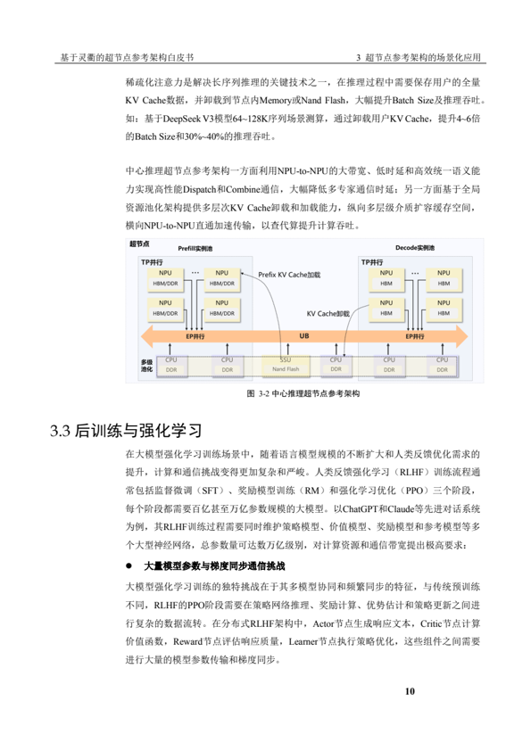

传统大数据平台普遍面临两大关键性能瓶颈，制约了数据处理效率和资源使用效益：

## ⚫ 资源配置失衡与浪费

静态的资源分配机制导致资源配置与实际负载需求脱节，资源使用不均，极端场景下， 仅 30%~40% 内存资源被有效使用。同时，为避免任务失败，运维人员倾向于过度申请 资源，进一步造成资源闲置。

## ⚫ 数据交换效率制约整体性能

跨节点数据混洗（ Shuffle ）过程中的数据读写与交换效率成为系统性能的主要瓶颈，

## 3.8 数据库

网络与磁盘 I/O 压力，导致 CPU 的平均使用率仅为峰值的 50% 。

大数据超节点参考架构通过大带宽低时延通信和全局资源池化等，提供优化方案：

## ✓ 资源池化与智能超分

基于 UB 在超节点域内实现灵活的内存池化借用与共享，结合大数据负载的资源超分策 略与池化算子优化， Spark 任务执行效率提升 30% 。

## ✓ Shuffle 性能深度优化

基于 UB 通信对 Spark shuffle 进行深度优化，提升 10% 的 Spark 处理性能，缩短作业批处理 完成时间。

## ✓ 高效 RPC 通信机制

基于 UB 重构远程过程调用（ RPC ），实现共享内存和大带宽低时延通信，降低序列化 和反序列化开销，减少内存拷贝，为实时计算等场景提供极速高效的通信保障。

图 3-7 大数据超节点参考架构

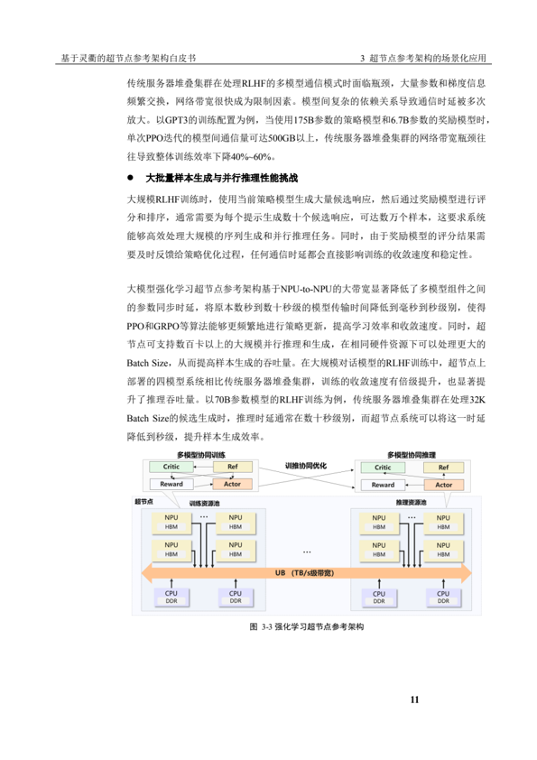

随着算力需求持续增长，数据库应用在传统计算架构下，面临如下问题：

## ⚫ 架构局限性与扩展瓶颈

传统主从架构所有写操作集中于主节点，使其成为性能瓶颈和故障单点，线性度小于 70% ，制约系统的写扩展性与高可用性。

## ⚫ 网络与 I/O 性能制约

跨节点数据同步、分布式事务协调及日志复制带来网络开销和带宽压力，对时延高度 敏感，网络协议栈开销最大超过 33% ，造成 CPU 资源大量浪费。日志同步的 I/O 负担进

一步制约了高并发和高吞吐场景下的性能。 I/O 瓶颈和缓存不命中导致长尾 SQL ，响应 时间大于 10ms 。

数据库超节点参考架构提供的解决方案包括：

## ✓ 实现多主架构

依托 UB 的全局资源池化和大带宽低时延通讯，实现共享内存服务，支持数据库多主架 构。有效消除写性能瓶颈，提升写扩展能力，线性度大于 0.75 ，避免写节点单点故障， 支持数据库实例的动态在线扩容，增强系统可靠性与灵活性。

## ✓ 提升 OLTP 性能

利用 UB 全局资源池化与统一语义访问，扩展数据库缓冲池（全局 Buffer Pool ），构建 高效的多级页面缓存。结合本地与远端内存间透明的冷热数据迁移，提升热数据的本 地内存访问命中率， TPC-C 性能提升 20% 。

## ✓ 优化 OLAP 性能

基于 UB 全局资源池化与统一语义访问的共享内存服务，加速 OLAP SQL 算子执行效率， 实现行列混合存储引擎间的数据高效共享，提升 OLAP 查询性能， TPC-H 性能提升 65% 。

图 3-8 数据库超节点参考架构

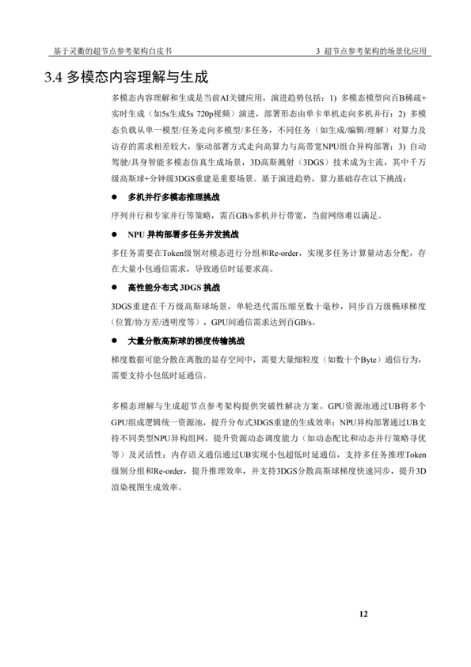

## 3.9 分布式存储

传统分布式存储存在以下问题：

## ⚫ 硬件资源离散化

传统存储每台服务器的 SSD 容量被独立分配，资源利用率受限于单机物理边界， SSD 的

带宽利用率约为 25% ，造成基础设施效率低下，运维复杂。

## ⚫ 软硬协同能力薄弱

以 CPU 为中心的架构设计存在根本性缺陷： EC 编解码、 CRC 校验、数据跨节点搬移等 关键任务抢占主机 CPU 算力，使其成为系统性能瓶颈，制约分布式存储扩展能力。以 分布式存储系统垃圾回收任务为例， CPU 将数据从源盘读出并重新写入目的盘，期间 产生多次网络栈和 I/O 栈开销，挤压业务侧处理能力，导致有效 IOPS 下降 25%~35% 。

分布式存储超节点参考架构基于多样性算力平等协同计算，带来技术创新：

## ✓ 存储池化架构

通过 UB 全局资源池化技术与统一语义访问能力，构建跨节点存储资源池。实现物理介 质的逻辑抽象化与统一调度，支持按需动态分配多节点存储容量及性能资源。消除资 源孤岛， SSD 带宽资源利用率最高提升 60% 。

## ✓ 异构算力卸载引擎

依托多样性算力平等协同计算架构，打通 CPU 、 GPU 和 SSU 等设备的平等互联访问通道。 通过硬件级业务卸载引擎，将存储系统侧的垃圾回收等从主机 CPU 卸载至 SSU ，实测 IOPS 性能提升 25%~35% ，为高密存储场景提供性能保障。将存储系统侧的 EC （ Erasure Coding ）重构任务从主机 CPU 卸载至 SSU 中，结合 UB 超大带宽能力，重构速度提升 6 倍， 为高密存储场景提供可靠性保障。

图 3-9 分布式存储超节点参考架构

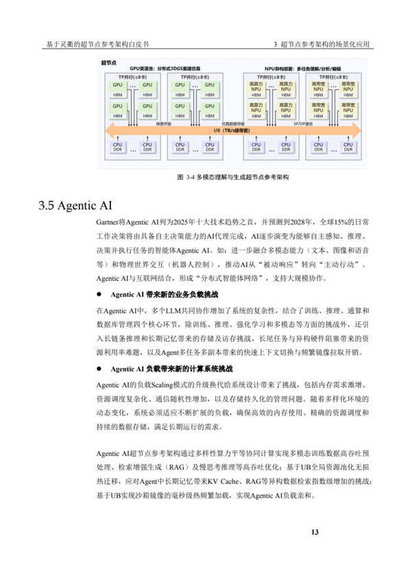

## 3.10 高性能计算

随着科研应用计算需求持续攀升，高性能计算集群算力规模持续扩大。同时，近十年 人工智能技术的快速发展，催生出 AI4S （ AI for Science ）这一新兴应用范式，带来高 性能计算与智算融合，对高性能计算架构和性能提出了更高挑战。

## ⚫ 通信性能挑战

随着处理器计算能力不断提升，高性能计算应用通信占比将进一步增加，部分应用可 达 30% ，为降低应用通信占比、提升应用性能和扩展性，面向大包通信场景需提升节点 间通信带宽，面向小包通信场景需降低传输时延。 AI4S 场景，训练和推理存在大量分 布式矩阵计算，产生有依赖的计算通信算子。为实现计算和通信隐藏，通常采用矩阵 和通信细粒度流水，但会引入 KB 级中小包通信，导致通信性能劣化，需降低通信时延。

## ⚫ 超大规模集群面临网络拥塞和组网可靠性挑战

业界领先的高性能计算集群算力规模已达到 E 级，正在向 10E 级演进，需要支持万级到 10 万级节点超大规模组网。超大规模集群会面临网络拥塞问题，需通过路由和拥塞控 制算法优化提升性能。同时，传统胖树网络拓扑面临光模块数量多和网络可靠性挑战， 需通过网络拓扑优化提升组网可靠性，减少光模块数量。

## ⚫ 存储 I/O 过程涉及多次内存拷贝，影响性能

传统高性能存储采用专有客户端架构，数据落盘存在多次内存拷贝：数据首先从计算 节点应用侧内存复制到客户端内存，再通过网络传输至存储节点内存，最后写入硬盘。 多次内存拷贝会导致 I/O 时延增加，需要减少 I/O 路径的内存拷贝次数，降低 I/O 时延。

高性能计算超节点参考架构，面向下一代超大规模组网、 AI4S 场景提供技术创新：

## ✓ 软硬协同通信性能优化

通过 UB 提供百 GB/s~TB/s 级互联带宽，结合拓扑感知的通信优化和作业调度，在分子 动力学、气象和流体等通信密集型应用场景实现大包通信加速，典型应用 E2E 性能可提 升 10% 。同时，通过在超节点内实现基于内存语义的通信优化，使小包通信时延从 us 级 降低至百 ns 级，典型应用 E2E 性能可提升 8% 。面向 AI4S 应用的分布式矩阵计算场景， 通过基于内存语义的融合算子，实现计算和通信细粒度流水线，支持直接访问对端

NPU 的 HBM 数据，减少访存次数，降低小包通信时延，提升训练推理性能。

## ✓

## 超大规模组网拓扑和网络拥塞控制优化

高性能计算场景存在大量邻居通信，超节点内可基于 UB ，通过 FullMesh/Torus+Clos 拓 扑提升进程间通信性能；超节点间可采用较高收敛比的网络架构，支持超大规模组网，

结合 UB 链路层虚通道避免直连路径绕路引入的死锁，通过时空均衡技术充分利用最短 和非最短路径、逐包 / 逐流动态路由技术，减少网络拥塞，提升网络带宽利用率，实现 高性能、大规模和高可靠的组网。

## ✓ 基于 UB 的数据直通机制和统一存储架构

通过 UB 实现计算节点数据直通存储硬盘，不经过存储节点内存，减少内存拷贝带来的 额外开销， I/O 性能提升 20% 。面向 AI4S 场景，智算超节点和高性能计算超节点可通过 UB 访问共享的高性能分布式存储，减少数据搬移开销。

图 3-10 高性能计算超节点参考架构

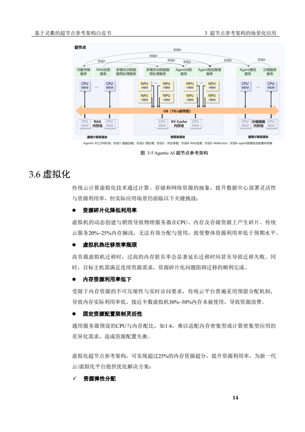

## 4.1 灵衢协议栈

灵衢提供分层的协议栈，从下到上由物理层、数据链路层、网络层、传输层、事务 层、功能层以及 UMMU 、 UBFM （ UB Fabric Manager ）组成，如下图所示。其中， Entity 为功能实体，是全局通信的基本单元； URMA （ Unified Remote Memory Access

） 为统一远程内存访问。

图 4-1 灵衢协议栈

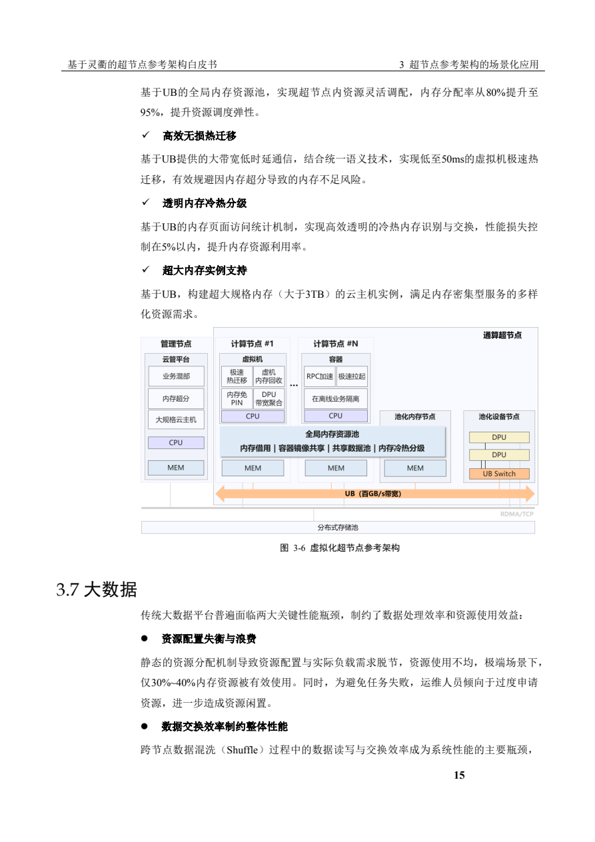

- ⚫ 物理层：支持低时延和高速率设计，最大化利用物理信道裕量，支持线性直驱光 技术。
- ⚫ 链路层：支持点对点流控和重传，提供高效传输格式并支持丰富拓扑结构。
- ⚫ 网络层：支持大规模组网、动态路由和多路径均衡，提供最优端到端时延和可用 带宽。
- ⚫ 传输层：支持带宽聚合、连接共享和端到端可靠传输，实现大规模可靠扩展。

## 4 灵衢协议栈和机制

- ⚫ 事务层：提供统一的事务操作，支撑稳定的编程接口。
- ⚫ 功能层：提供简化的编程接口（如 Load/Store 和 URMA 等）和高效的协同机制。
- ⚫ UBFM ：支持大规模计算、通信和互联资源管理以及高效资源调用。
- ⚫ UMMU ：负责全局地址翻译和内存访问权限检查，实现全局内存共享。

详细灵衢协议栈能力，请参考《灵衢基础规范》。

## 4.2 灵衢使能超节点机制

## 4.2.1 总线级互联

- ⚫ 百 ns 到 us 级内存语义时延：基于统一编址和访问权限控制的基础机制， UB 支持 UBPU 中的计算单元直接发起同步和异步访存指令，减少控制命令交互，实现百 ns~us 级低时延。 UB 内存语义支持 64B 至 4KB 大小以及变长的单事务操作，降低乱 序处理压力，提升传输效率，同时基于链路层的 Flit 传输机制，实现低时延传输和 转发。
- ⚫ TB/s 级大带宽： UB 面向 AI 时代大带宽需求进行了单 Lane 增强速率和多端口多路径 聚合带宽设计。通过物理层多种 FEC 模式和链路层重传技术，降低 BER 要求，实现 单 Lane 速率增强至 118Gbps ，优于同代际 IEEE Ethernet 定义的标准速率。

图 4-2 单端口高速率

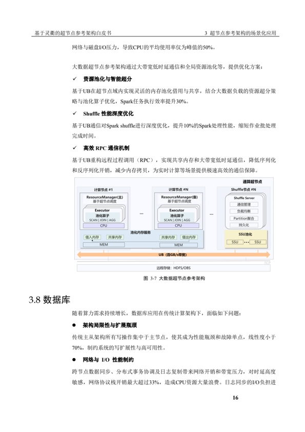

通过多端口聚合和高密光电互连技术，实现 UBPU 间 TB/s 级带宽互连。 UB 支持 Load/Store 语义和 URMA 语义共享多端口带宽，实现多个端口间的多路径传输。

图 4-3 多端口聚合以及高密光电互连

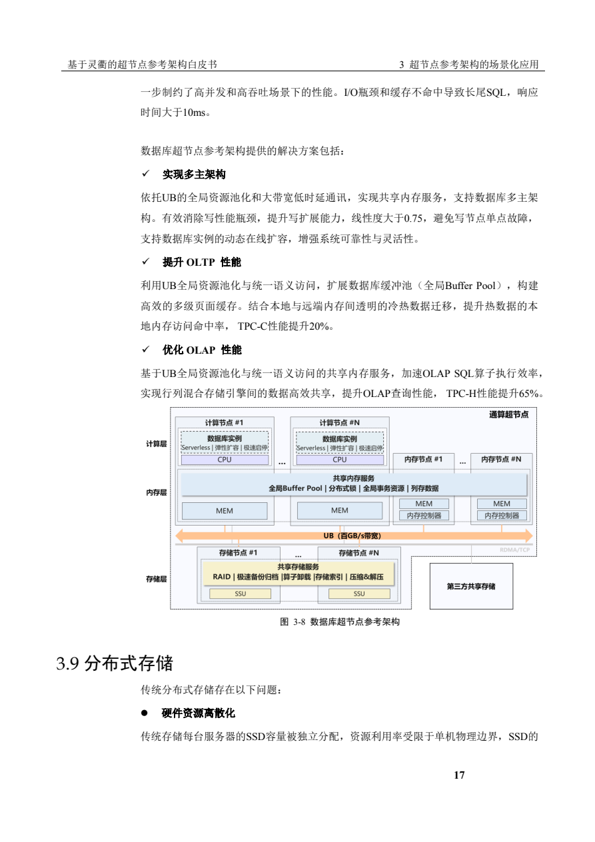

## 4.2.2 协议归一

UB 支持内存和寄存器等资源直接映射到全局地址，计算单元通过 UB 完成全局数据访问 和全局同步；支持计算单元指令调度 UB Controller ，原生匹配计算单元乱序和并发执行 的特征。 UB 从计算硬件系统角度，用户所有的操作归为内存访问、消息传递、过程调 用和资源管理。 UB 使用单一协议栈支持上述所有操作，避免协议转换开销，为软件开 发者提供利用硬件能力的高效编程方式。

图 4-4 统一编程模型

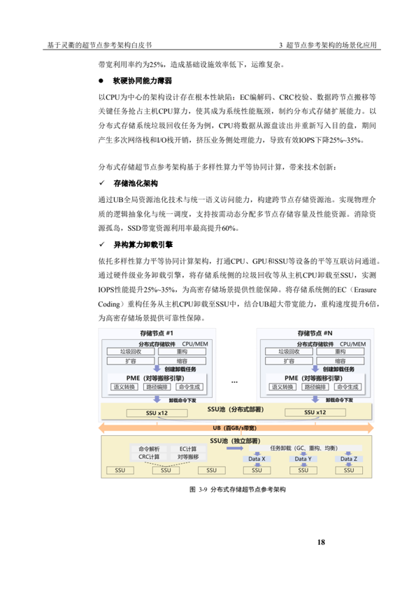

UB 事务层通过内存、消息、维护和管理四大类事务，为统一编程模型提供基础。内存 事务用于 UBPU 间的内存访问，支持同步和异步两种方式；消息事务用于 1 对 1 、 1 对多、 多对 1 和多对多的 UBPU 间消息传输；维护事务用于更新远端 UBPU 内部模块的状态， 如访问安全状态和缓存状态等；管理事务用于实现 UBPU 配置以及运行过程中的状态上 报，如地址配置和故障上报等。为了在不同场景和通信范围内获得最优性能， UB 从时 延、带宽和可靠性三个维度提供灵活的配置机制，如下图所示。

图 4-5 UB 协议配置模式

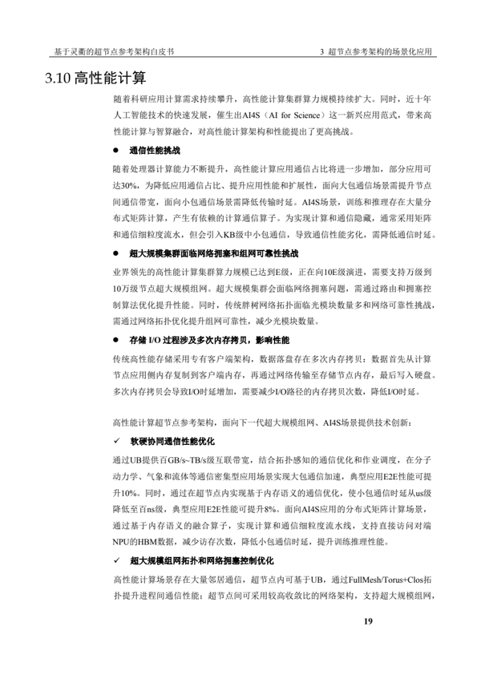

## 4.2.3 平等协同

UB 支持超节点内所有组件全量平等协同。通过 Entity 和 UMMU 实现统一编址和访问权 限控制，使能计算资源平等互联访问。每个 UB  Entity 有一个唯一的身份标识 EID （ Entity ID ），是全局通信的唯一标识。构建 UMMU ，支持内存访问鉴权和地址翻译，

设备间访问无需经过 CPU 。 UBFM 管理逻辑实体，负责 Fabric 域内设备 EID 、网络地址 和路由等互连配置管理及设备资源管理。

| 通信 范围   | H2H   | H2D   | H2N   | H2S   | D2D   | D2N   | D2S   |
|---------|-------|-------|-------|-------|-------|-------|-------|
| 节点内     | √     | √     | √     | √     | √     |       | √     |
| 柜内跨 节点  | √     |       | √     | √     | √     | √     | √     |
| 超节点 内   | √     | √     | √     | √     | √     | √     | √     |
| 集群内     | √     | √     | √     | √     | √     | √     | √     |

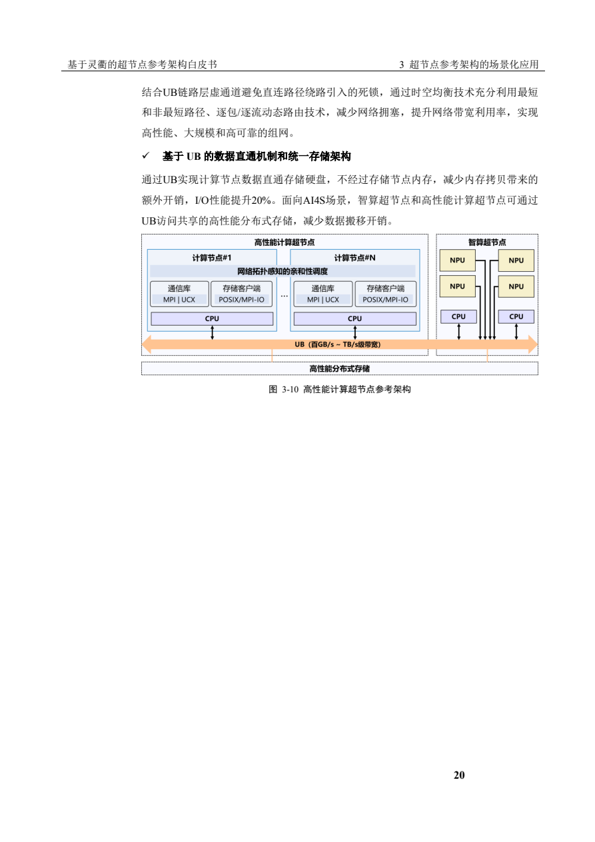

EID：EntityID；Token：访问凭证；UBA：UB地址；PA：物理地址

图 4-6 平等互联访问

H:CPU;D:NPU;N:DPU;S:SSU

## 4.2.4 全量池化

UB 定义新的原生系统管理权限和消息，在超节点中通过 UB 带内方式完成资源管理；采 用 UB Partition 的方式支持多用户，降低虚拟化开销，通过 UBFM 将一个 UBPU 的多个 UB Entity 注册给不同用户使用，以及将同一个用户的 UB Entity 加入同一个 UB Partition ， 实现不同用户基于 UPI （ UB Partition ID ）的隔离，如下图所示。

图 4-7 统一资源管理

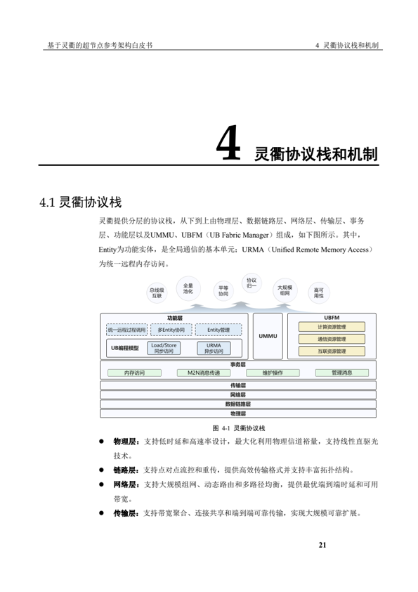

UB 支持将 Entity 的资源共享给多方，并通过 MMIO （ Memory-mapped I/O ）和消息的方 式直接访问和调用，例如 UBPU 将 Entity 0 的资源授权给 Entity 1 ， UBPU 和 Entity 1 均可直 接通过 MMIO 或者消息的方式调用 Entity 0 声明的功能或者服务。

图 4-8 资源高效调用

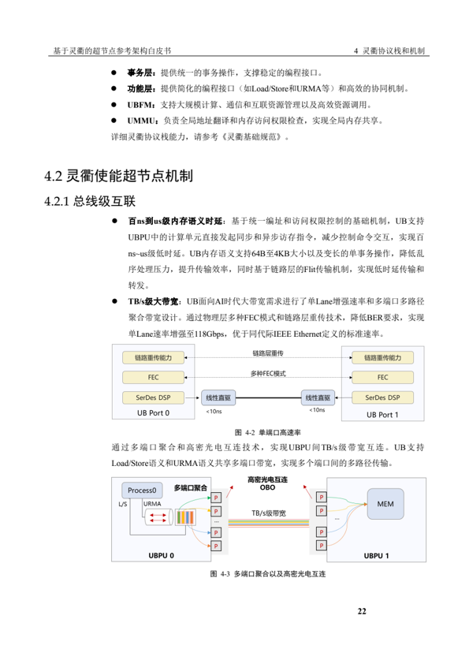

除了计算和内存等资源的池化之外， UB 通过多通道共享机制，实现 TB/s 级带宽的互联 资源池化共享，所有 Entity 均可使用所有可达路径和端口。

图 4-9 互联资源池化

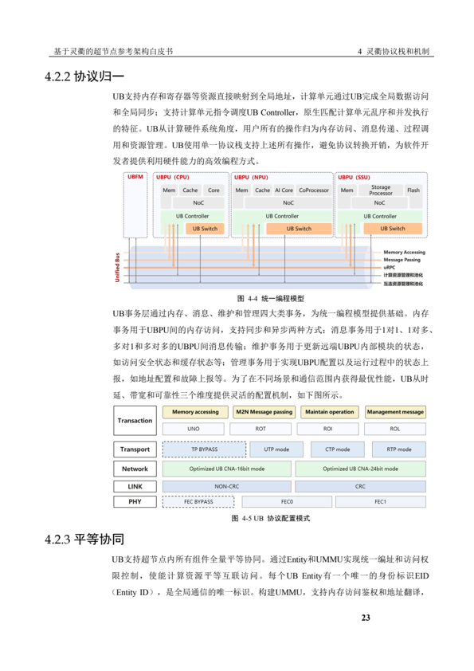

## 4.2.5 大规模组网

UBPU 内嵌 UB Switch ，支持 UB 报文通过 UBPU 直接转发至直连相邻的 UBPU ，无需软件 中转，同时 UB 通过链路层虚通道、网络层逐包 / 逐流多路径路由和传输层通道共享等机 制，解决 UB 报文通过直连路径绕路引入的死锁和带宽利用率下降等难题，为超节点提 供 UB-Mesh （ UB-Mesh:  a  Hierarchically  Localized  nD-FullMesh  Datacenter  Network Architecture ，链接： https://arxiv.org/abs/2503.20377 ）以及基于光交换的组网技术，实 现大规模低成本部署。

UB-Mesh 中的 nD-FullMesh 拓扑充分利用了业务数据局部性，优先考虑短程直接互连路 径，以最大限度减少数据移动距离并减少交换机使用为目标，是一种兼具高性能和低 成本的拓扑组网，如下图所示。

图 4-10 nD-FullMesh 拓扑示意

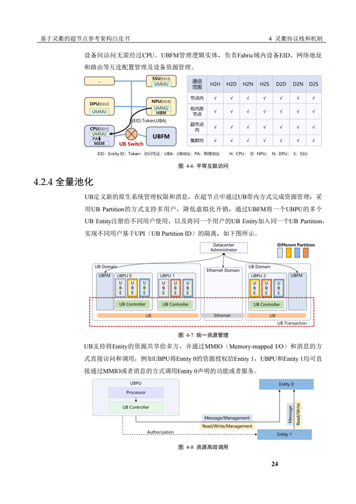

2D-FullMesh 是 nD-FullMesh 在极致低时延场景的应用，减少交换引入的时延开销，可用 于内存共享和内存借用等场景。

图 4-11 2D-FullMesh 直连拓扑示意

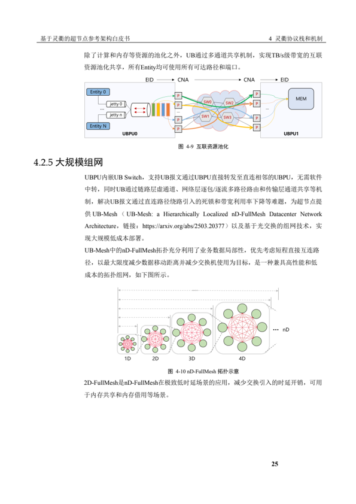

UB-Mesh 还支持混合拓扑，例如在 Rack 内部采用 1D/2D-FullMesh 拓扑，提供全电缆互 连的本地高带宽，在 Rack 间采用一层交换的 Clos 拓扑，提供适当收敛或者无收敛的带 宽。该拓扑可用于训练和推理等场景。如下图所示， Rack 内采用 2D-FullMesh 组网， Rack 间采用一层 UB Switch 互连，支持从 64 卡线性扩展到 8192 卡。

图 4-12 2D-FullMesh + Clos 混合拓扑示意

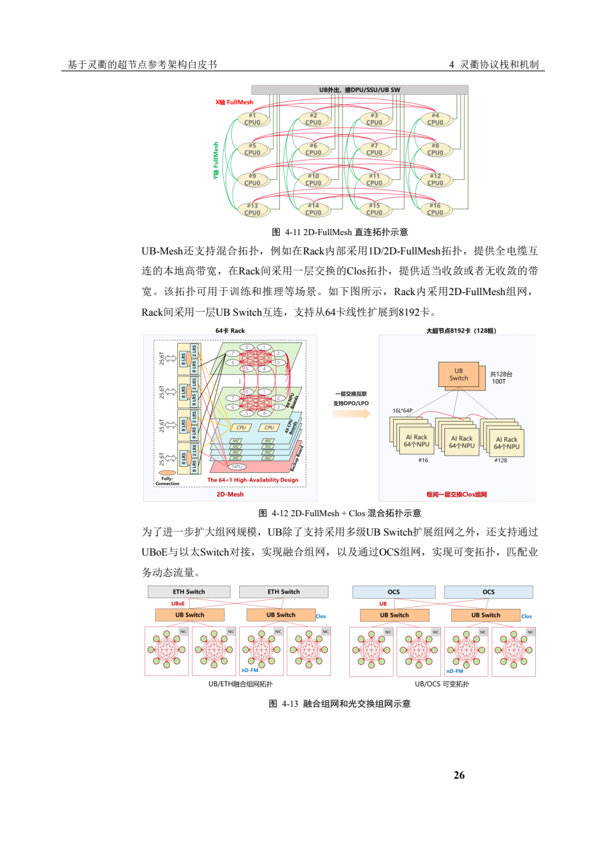

为了进一步扩大组网规模， UB 除了支持采用多级 UB Switch 扩展组网之外，还支持通过 UBoE 与以太 Switch 对接，实现融合组网，以及通过 OCS 组网，实现可变拓扑，匹配业 务动态流量。

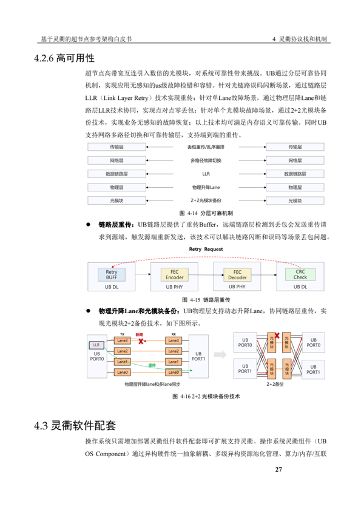

UB/ETH融合组网拓扑

图 4-13 融合组网和光交换组网示意

UB/OCS可变拓扑

## 4.2.6 高可用性

超节点高带宽互连引入数倍的光模块，对系统可靠性带来挑战。 UB 通过分层可靠协同 机制，实现应用无感知的 us 级故障检错和容错。针对光链路误码闪断场景，通过链路层 LLR （ Link Layer Retry ）技术实现重传；针对单 Lane 故障场景，通过物理层降 Lane 和链 路层 LLR 技术协同，实现点对点零丢包；针对单个光模块故障场景，通过 2+2 光模块备 份技术，实现业务无感知的故障恢复；以上技术均可满足内存语义可靠传输。同时 UB 支持网络多路径切换和可靠传输层，支持端到端的重传。

图 4-14 分层可靠机制

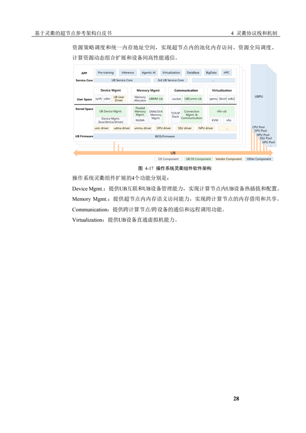

- ⚫ 链路层重传： UB 链路层提供了重传 Buffer ，远端链路层检测到丢包会发送重传请 求到源端，触发源端重新发送，该技术可以解决链路闪断和误码等场景丢包问题。

## RetryR Request

图 4-15 链路层重传

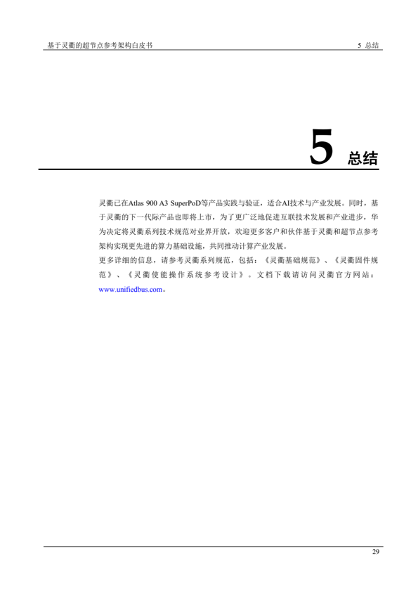

- ⚫ 物理升降 Lane 和光模块备份： UB 物理层支持动态升降 Lane ，协同链路层重传，实 现光模块 2+2 备份技术，如下图所示。

图 4-16 2+2 光模块备份技术

## 4.3 灵衢软件配套

操作系统只需增加部署灵衢组件软件配套即可扩展支持灵衢。操作系统灵衢组件（ UB OS Component ）通过异构硬件统一抽象解耦、多级异构资源池化管理、算力 / 内存 / 互联

资源策略调度和统一内存地址空间，实现超节点内的池化内存访问、资源全局调度、 计算资源动态组合扩展和设备间高性能通信。

图 4-17 操作系统灵衢组件软件架构

操作系统灵衢组件扩展的 4 个功能分别是：

Device Mgmt. ：提供 UB 互联和 UB 设备管理能力，实现计算节点内 UB 设备热插拔和配置。 Memory Mgmt. ：提供超节点内内存语义访问能力，实现跨计算节点的内存借用和共享。 Communication ：提供跨计算节点 / 跨设备的通信和远程调用功能。

Virtualization ：提供 UB 设备直通虚拟机能力。

## 5 总结

灵衢已在 Atlas 900 A3 SuperPoD 等产品实践与验证，适合 AI 技术与产业发展。同时，基 于灵衢的下一代际产品也即将上市，为了更广泛地促进互联技术发展和产业进步，华 为决定将灵衢系列技术规范对业界开放，欢迎更多客户和伙伴基于灵衢和超节点参考 架构实现更先进的算力基础设施，共同推动计算产业发展。

更多详细的信息，请参考灵衢系列规范，包括：《灵衢基础规范》、《灵衢固件规 范》、《灵衢使能操作系统参考设计》。文档下载请访问灵衢官方网站：

www.unifiedbus.com 。