## Leopold Aschenbrenner

## 态势感知 (SITUATIONAL AWARENESS)

**未来十年**

## 献给 Ilya Sutskever

我曾任职于 OpenAI,但本文全部内容基于公开信息、个人观点、行业常识或旧金山坊间传闻。

感谢 Collin Burns、Avital Balwit、Carl Shulman、Jan Leike、Ilya Sutskever、Holden Karnofsky、Sholto Douglas、James Bradbury、Dwarkesh Patel 以及许多其他人的深度讨论。感谢多位朋友对早期草稿的反馈。感谢 Joe Ronan 协助制图,Nick Whitaker 协助出版。

situational-awareness.ai | leopold@situational-awareness.ai
2024 年 6 月 6 日更新 | 加利福尼亚州旧金山
**未来,你最先在旧金山看到。**

---

在过去一年里,城里的话题已经从百亿美元级计算集群转向千亿美元级,再转向万亿美元级集群。每六个月,董事会的规划上就多一个零。在幕后,各方正在疯狂抢夺本十年剩余时间内所有可用的电力合同、所有能采购到的变压器。美国大企业正准备将数万亿美元投入一场久违的美国工业力量总动员。到本十年末,美国电力生产将增长数十个百分点;从宾夕法尼亚的页岩气田到内华达的太阳能农场,数亿块 GPU 将嗡嗡作响。

AGI(通用人工智能)竞赛已经开始。我们正在建造能够思考和推理的机器。到 2025/26 年,这些机器将超越大学毕业生。到本十年末,它们将比你我都聪明;我们将拥有真正意义上的超级智能(superintelligence)。在此过程中,半个世纪以来未见的国家安全力量将被释放,不久之后,"那个计划"(The Project)将启动。幸运的话,我们将与中共展开一场全面竞赛;不幸的话,将是一场全面战争。

现在人人都在谈论 AI,但几乎没有人真正意识到即将到来的冲击。英伟达的分析师们仍然认为 2024 年可能接近峰值。主流评论员固守着"它只是在预测下一个词"的故意无视。他们只看到炒作和照常营业;最多也只将其视为又一次互联网规模的技术变革。

不久,世界将会醒来。但现在,大概只有几百人——大多在旧金山和各大 AI 实验室——拥有**态势感知**(situational awareness)。出于某种奇特的命运安排,我发现自己也在其中。几年前,这些人还被嘲笑为疯子——但他们相信趋势线,这让他们正确预测了过去几年的 AI 进展。这些人对接下来几年的判断是否正确,还有待观察。但他们是我见过的最聪明的人,而且正是他们在建造这项技术。也许他们将只是历史上的一个奇特脚注,也许他们将像 Szilard、Oppenheimer 和 Teller 一样载入史册。如果他们看到的未来哪怕大致正确,我们都将经历一场疯狂的旅程。

让我告诉你我们看到了什么。

## 目录

| 章节 | 页码 |
|------|------|
| **引言** — 历史正在旧金山发生 | 3 |
| **I. 从 GPT-4 到 AGI:数数量级(OOM)** — 到 2027 年实现 AGI 是惊人的可信。GPT-2 到 GPT-4 在 4 年内让我们从约幼儿园水平跃升到约聪明高中生水平。追踪算力(~0.5 OOM/年)、算法效率(~0.5 OOM/年)和"解除束缚"(unhobbling)收益的趋势,我们应预期到 2027 年再出现一次幼儿园到高中生级别的质变飞跃。 | 7 |
| **II. 从 AGI 到超级智能:智能爆炸** — AI 的进步不会停在人类水平。数亿个 AGI 可以自动化 AI 研究,将十年的算法进步(5+ OOM)压缩到一年之内。我们将迅速从人类水平跃升至远超人类的 AI 系统。超级智能的力量——与危险——将是戏剧性的。 | 46 |
| **III. 挑战** | 74 |
| **IIIa. 万亿美元集群竞赛** — 一场最非凡的技术资本加速已经启动。随着 AI 收入快速增长,数万亿美元将在本十年末之前投入 GPU、数据中心和电力建设。这场工业动员——包括将美国电力生产增长数十个百分点——将是空前激烈的。 | 75 |
| **IIIb. 封锁实验室:AGI 的安全保障** — 美国顶尖 AI 实验室将安全视为事后补救。目前,他们基本上是将 AGI 的关键机密和权重拱手送给中共。保障 AGI 机密和模型权重免受国家级行为体威胁将是一项艰巨的任务,而我们目前并未走在正确的轨道上。 | 89 |
| **IIIc. 超级对齐(Superalignment)** — 可靠地控制比我们聪明得多的 AI 系统是一个尚未解决的技术问题。虽然这是一个可解决的问题,但在快速的智能爆炸过程中,事情很容易失控。管理这一过程将极其紧张;失败很容易是灾难性的。 | 105 |
| **IIId. 自由世界必须胜利** — 超级智能将带来决定性的经济和军事优势。中国远未出局。在 AGI 竞赛中,自由世界的存亡将岌岌可危。我们能保持对威权势力的领先吗?我们能在此过程中避免自我毁灭吗? | 126 |
| **IV. 那个计划(The Project)** — 随着 AGI 竞赛加剧,国家安全体系将介入。美国政府将从沉睡中醒来,到 27/28 年我们将看到某种形式的政府 AGI 项目。没有哪个创业公司能处理超级智能。在某个保密设施(SCIF)中,终局之战将打响。 | 141 |
| **V. 临别随想** — 如果我们是对的呢? | 156 |
| **附录** | 162 |
## I. 从 GPT-4 到 AGI：数数量级

AGI（通用人工智能，Artificial General Intelligence）在 2027 年实现是极具可能的。GPT-2 到 GPT-4 在 4 年内将我们从~学龄前儿童带到了~聪明高中生的能力水平。追踪算力（~0.5 个数量级/年）、算法效率（~0.5 个数量级/年）和"解除束缚"收益（从聊天机器人到智能体）的趋势线，我们应预期到 2027 年再次出现一个学龄前儿童到高中生规模的能力跃迁。

你看，模型，它们就是想学习。你必须理解这一点。模型，它们就是想学习。

——Ilya Sutskever（约 2015 年，经由 Dario Amodei 转述）

GPT-4 的能力让许多人震惊：一个能够写代码和文章、推理困难的数学问题、在大学考试中拿高分的 AI 系统。就在几年前，大多数人还认为这些都是不可逾越的壁垒。

但 GPT-4 不过是深度学习十年来高速进展的延续。十年前，模型几乎连猫和狗的简单图像都无法识别；四年前，GPT-2 几乎不能拼凑出勉强合理的句子。而现在，我们能想出的所有基准测试都在被迅速攻克。然而，这种戏剧性的进展，不过是深度学习规模扩展（scaling up）的持续趋势所产生的结果。

有些人比大多数人都更早看到了这一点。他们曾被嘲笑，但他们所做的仅仅是相信趋势线。趋势线是极其剧烈的，他们是对的。模型，它们就是想学习；你将它们规模扩大，它们就能学到更多。

我提出以下论断：到 2027 年，模型能够完成 AI 研究员/工程师的工作是极具可能的。这不需要相信科幻；只需要相信图上的直线。

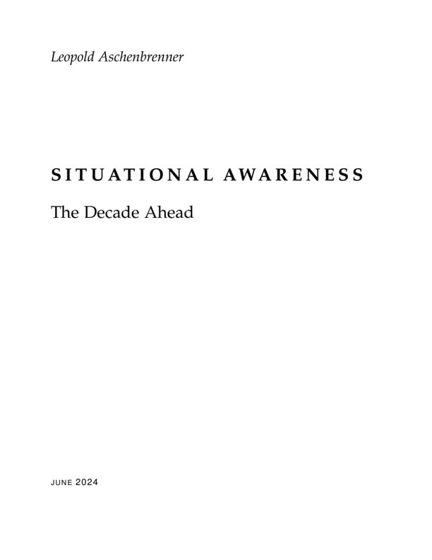

在本文中，我将简单地"数数量级"（OOM = 数量级，Order of Magnitude，10 倍 = 1 个数量级）：审视以下三个方面的趋势——1）算力（compute），2）算法效率（algorithmic efficiencies，即我们可以视为"有效算力"增长的算法进步），以及 3）"解除束缚"（unhobbling）收益（修复模型默认被明显束缚的方式，释放潜在能力并赋予它们工具，从而带来实用性的阶跃变化）。我们追踪

图 1：基于本文讨论的公开估算，对过去和未来有效算力（包括物理算力和算法效率）规模扩展的粗略估计。随着我们扩展模型，它们持续变得更聪明，通过"数数量级"，我们可以粗略地感知在（不久的）将来应该预期什么样的模型智能。（此图仅显示基座模型的扩展；"解除束缚"未在图中体现。）

在 GPT-4 之前四年以及之后四年（到 2027 年底）每个方面的增长。鉴于深度学习在每个 OOM 的有效算力上持续改进，我们可以用此来推演未来的进展。

公开来看，自 GPT-4 发布以来的一年很安静，因为下一代模型一直在"烤箱"里——这让一些人宣称停滞，认为深度学习正在撞墙。[^1] 但通过数数量级，我们可以一窥真正应该预期的东西。

[^1]: 这是他们过去十年每年都在做的预测，而且每次都被证明是错误的……

结论相当简单。GPT-2 到 GPT-4——从偶尔能拼凑出几个连贯句子就令人印象深刻的模型，到能在高中考试中拿高分的模型——并不是一次性的收益。我们正在以极快的速度穿越数量级，数字表明，我们应当预期在四年内再有约 100,000 倍的有效算力扩展——从而再次出现一个 GPT-2 到 GPT-4 规模的质的飞跃。而且，关键的是，这不仅意味着一个更好的聊天机器人；在"解除束缚"方面摘取许多显而易见的低垂果实，应当将我们从聊天机器人带到智能体（agent），从工具带到看起来更像即插即用的远程员工替代品的东西。

虽然推论简单，但其含义令人震惊。这样一次跳跃很有可能将我们带到 AGI，带到像博士或专家一样聪明、可以作为同事与我们一起工作的模型。也许最重要的是，如果这些 AI 系统能够自动化 AI 研究本身，那将启动强烈的反馈循环——这是本系列下一篇的主题。

即使现在，几乎没有人将这些纳入考量。但对 AI 的态势感知（situational awareness）其实并不那么难，一旦你退后一步看趋势。如果你总被 AI 的能力震惊到，只要开始数数量级就好。

## 过去四年

我们现在有了基本上可以像人一样与之对话的机器。人类适应能力的非凡之处在于，这看起来竟然很正常，我们已对进展的速度变得麻木。但值得退后一步，看看过去几年的进展。

### GPT-2 到 GPT-4

让我提醒你，在 GPT-4 之前的短短四年（！）左右，我们走了多远。

**GPT-2（2019）~ 学龄前儿童**："哇，它能拼凑出几个勉强合理的句子。"一个精心挑选的半连贯故事——关于安第斯山脉的独角兽——在当时令人难以置信地震惊。然而，GPT-2 几乎数不到 5 就会出错；[^2] 在总结一篇文章时，它的表现仅略优于从文章中随机选 3 句话。[^3]

[^2]: 来自 SSC：'Janelle Shane 问 GPT-2 它最喜欢的十种动物：Prompt: 我 10 种最喜欢的动物是：1. 我十种最喜欢的动物是：1. 背上有一道白色疤痕的斑马，2. 阴险的蜘蛛和章鱼，3. 长着大叶子的青蛙，希望是黑色的，4. 长着鳞片的鹦鹉，5. 翅膀悬垂的刀嘴海雀，距离人脸 4 英寸且青蛙身上有心形纹身，6. 盲的、可切割和生吃的鹦鹉形互锁四足动物，7. 在阳光下生活的黑白沙漠鳄鱼，8. 斑马和许多其他豌豆虫'

[^3]: 来自 GPT-2 论文，第 3.6 节。

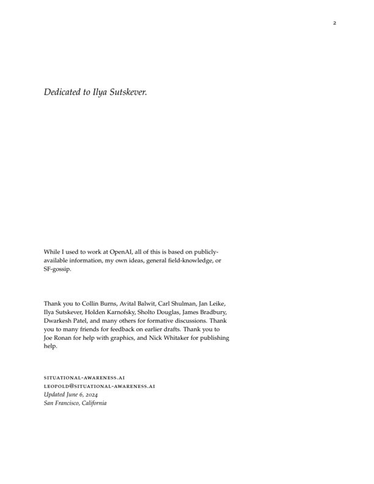

将 AI 能力与人类智能比较是困难且有缺陷的，但我认为在这里考虑这个类比是有意义的，

图 2：当时人们对 GPT-2 感到印象深刻的一些例子。左：GPT-2 在极基础的阅读理解问题上表现尚可。右：在一个精心挑选的样本中（10 次尝试中最好的一次），GPT-2 能写出关于内战的半连贯段落，说出一些半相关的内容。

即使它非常不完美。GPT-2 令人震惊的是它对语言的驾驭能力，以及偶尔能生成半连贯段落或偶尔正确回答简单事实性问题的能力。这大概是一个学龄前儿童让人觉得厉害的水平。

**GPT-3（2020）[^4] ~ 小学生**："哇，只需几个 few-shot 示例，它就能完成一些简单的有用任务。"它开始更加一致地在多个段落中保持连贯，可以纠正语法并做一些非常基础的算术。它首次在少数狭窄场景中具有商业价值：例如，GPT-3 可以为 SEO 和营销生成简单的文案。

[^4]: 这里我说的是笨重的旧版 GPT-3，不是你从 ChatGPT 了解到的那个大幅改进过的 GPT-3.5。

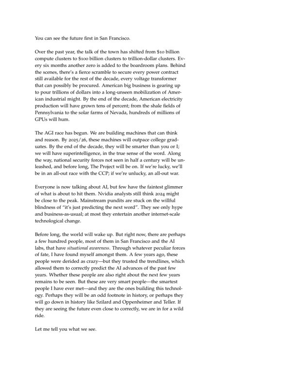

再次强调，这个比较是不完美的，但当时人们对 GPT-3 印象深刻的，大概是一个小学生让人觉得厉害的水平：它能写一些基础诗歌，能讲更丰富和连贯的故事，能开始做初级的

图 3：当时人们对 GPT-3 感到印象深刻的一些例子。上：在简单指令后，GPT-3 能在新句子中使用一个虚构的词。左下：GPT-3 能进行丰富的来回故事创作。右下：GPT-3 能生成一些非常简单的代码。

编程，可以相当可靠地从简单指令和示例中学习，等等。

**GPT-4（2023）~ 聪明的高中生**："哇，它能写相当复杂的代码并迭代调试，能就复杂主题写出睿智而精深的文章，能推理困难的高中竞赛数学题，在你能给出的任何测试上打败绝大多数高中生，等等。"从代码到数学到费米估算，它能够思考和推理。GPT-4 现在在我的日常工作中很有用，从帮助写代码到修改草稿。

### GPT-4 当时让人们印象深刻的例子

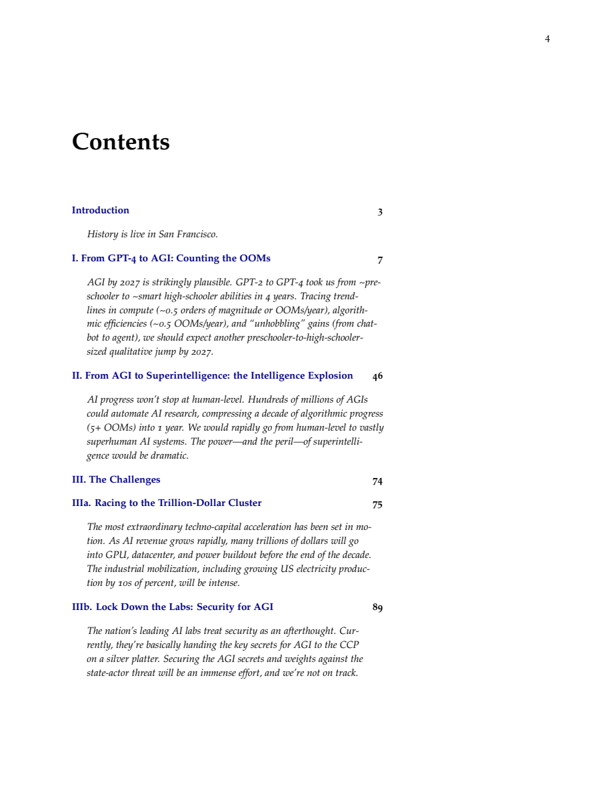

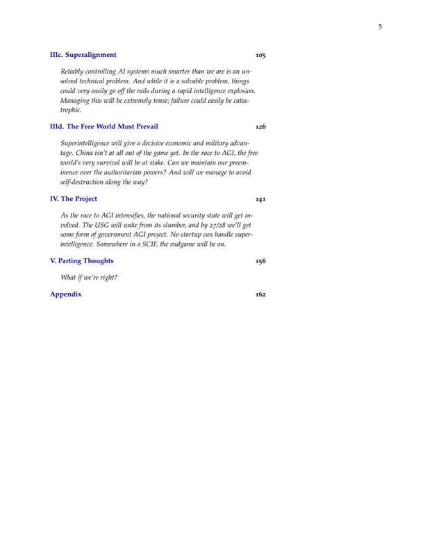

图 4.3：GPT-4 与 ChatGPT 在 AP 问题上的对比。GPT-4 使用了正确的方法，但因计算错误得出错误最终答案，而 ChatGPT 产生了不连贯的论证。

图 3.1：使用动态规划解决 LeetCode 问题。GPT-4 的解决方案由于全面的注释而具有更好的可读性。

态势感知 | Leopold Aschenbrenner

图 4：GPT-4 发布时让人们印象深刻的一些内容，来自"AGI 的火花"论文。上：它在写非常复杂的代码（生成中间所示的图表），并能推理不简单的数学问题。左下：解决一道 AP 数学题。右下：解决一个相当复杂的编程问题。更多关于 GPT-4 能力探索的有趣摘录见此处。

在从 AP 考试到 SAT 的各项考试中，GPT-4 得分高于绝大多数高中生。

当然，即使是 GPT-4 也仍然有些不均衡；对于某些任务，它比聪明的高中生好得多，而另一些任务它还做不了。话虽如此，我倾向于认为这些限制大多来自模型仍然被明显束缚的方式，我稍后将深入讨论。原始智能（基本上）是存在的，即使模型仍然被人为限制；需要额外的工作来释放模型在所有应用中充分运用那种原始智能的能力。

图 5：仅仅四年的进展。你在这条线上的哪个位置？

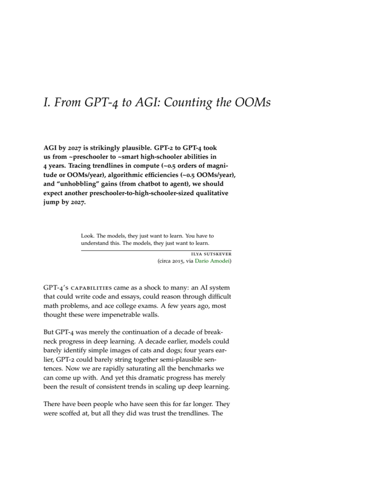

## 深度学习的趋势

过去十年深度学习进展的速度简直是非凡的。仅仅十年前，深度学习系统能识别简单图像就是革命性的。今天，我们不断试图想出新颖、越来越难的测试，而每一个新基准都很快被破解。过去需要几十年来攻克广泛使用的基准；现在感觉只需几个月。

我们几乎在用光基准测试。举个例子，我的朋友 Dan 和 Collin 在 2020 年做了一个叫 MMLU 的基准测试。他们希望终于能做出一个经得起时间考验的基准，相当于我们给高中和大学生出的所有最难的考试。仅仅三年后，它基本上被解决了：GPT-4 和 Gemini 这样的模型

### AI 系统在各项能力上的测试分数（相对于人类表现）

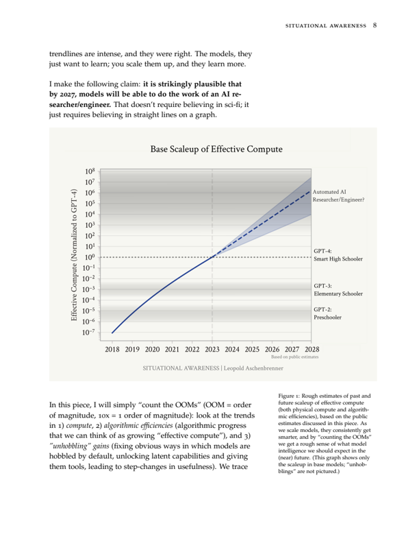

在每个领域内，AI 的初始表现设为 -100。人类表现作为基线，设为零。当 AI 的表现越过零线时，它的得分超过了人类。

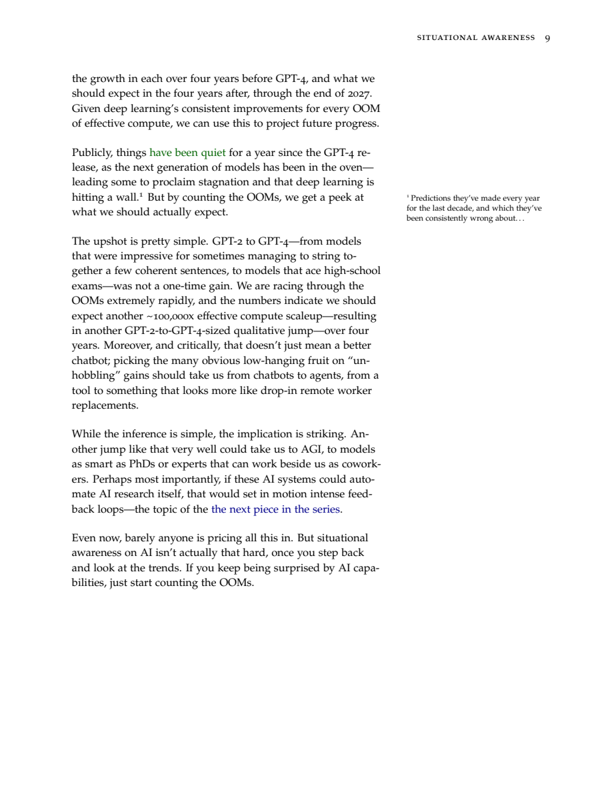

数据来源：Kiela 等 (2023) | OurWorldInData.org/artificial-intelligence | CC BY

注：对于每项能力，第一年始终显示 -100 的基线，即使当年晚些时候有更好的表现记录。

得分约 90%。

更广泛地说，GPT-4 基本攻克了所有标准的高中和大学能力测试（图 7）。[^5]

[^5]: 而且不，这些测试不在训练集中。AI 实验室投入了真正的努力来确保这些评估未被污染，因为他们需要好的测量才能做好的科学。ScaleAI 最近对此的分析确认，领先的实验室并没有过拟合基准（尽管一些较小的 LLM 开发者可能在刷数据）。

再考虑 MATH 基准，一组来自高中数学竞赛的困难数学题。[^6] 该基准于 2021 年发布时，GPT-3 的正确率只有约 5%。原始论文指出：'此外，我们发现如果缩放趋势继续下去，单纯增加预算和模型参数数量对于实现强大的数学推理将是不现实的 [...]。要在数学问题求解上取得更多进展，我们可能需要来自更广泛研究界的新的算法进步'——我们需要根本性的新突破来解决 MATH，至少他们当时这么认为。一项对 ML 研究人员的调查预测未来几年进展极小（图 8）；[^7] 然而，仅仅一年内（到 2022 年中），最好的模型从约 5% 的正确率提升到了 50%；现在，MATH 基本上被解决了，最近的表现超过 90%。

[^6]: 原始论文指出：'我们还评估了人类在 MATH 上的表现，发现一位不太喜欢数学的计算机科学博士生在 MATH 上得分约 40%，而一位三次 IMO 金牌得主得分 90%，这表明 MATH 对人类来说也可能是具有挑战性的。'

[^7]: 一位合著者指出：'当我们的团队首次发布 MATH 数据集时，至少有一位 [ML 研究员同事] 告诉我们这是个无意义的数据集，因为它远远超出了 ML 模型能完成的范围（事实上，我自己对此也有些担心）。'

图 6：深度学习系统在许多领域正迅速达到或超过人类水平。图形：Our World in Data

### 常见考试表现（与人类考生相比的百分位）

|                     | GPT-4   | GPT-3.5   |
|---------------------|---------|-----------|
|                     | (2023)  | (2022)    |
| 统一律师资格考试   | 90th    | 10th      |
| LSAT                | 88th    | 40th      |
| SAT                 | 97th    | 87th      |
| GRE（语文）         | 99th    | 63rd      |
| GRE（数学）         | 80th    | 25th      |
| 美国生物奥赛       | 99th    | 32nd      |
| AP 微积分 BC        | 51st    | 3rd       |
| AP 化学             | 80th    | 34th      |
| AP 宏观经济学       | 92nd    | 40th      |
| AP 统计学           | 92nd    | 51st      |

态势感知 | Leopold Aschenbrenner

图 7：GPT-4 在标准化考试上的得分。注意从 GPT-3.5 到 GPT-4 在这些考试的人类百分位上的巨大跃升，通常从远低于人类中位数到人类范围的最顶端。（这是 GPT-3.5，一个在 GPT-4 之前不到一年发布的相当新的模型，而不是我们之前谈到的笨重的小学生水平的旧 GPT-3！）

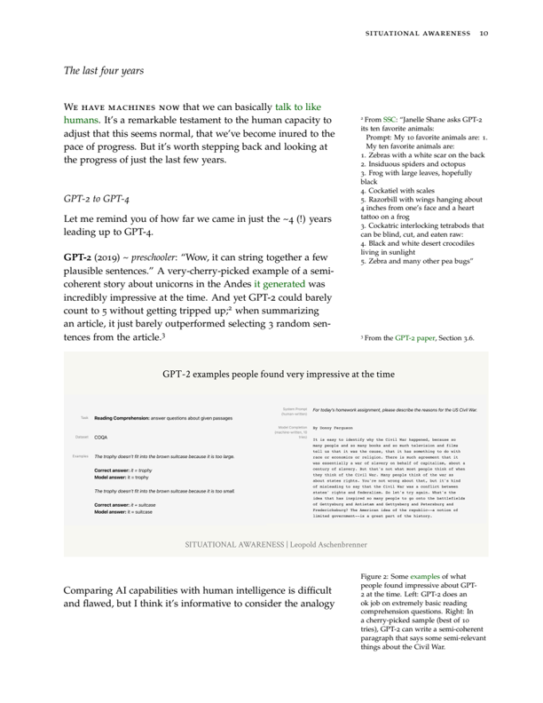

图 8：灰色：2021 年 8 月做出的专业预测，预测 2022 年 6 月 MATH 基准的表现。红星：2022 年 6 月实际的最先进表现，远超预测者给出的上限范围。中位 ML 研究人员的预测甚至更加悲观。

一次又一次，年复一年，怀疑者声称"深度学习不会能做到 X"，然后很快被证明错了。[^8] 如果说过去十年 AI 给了我们什么教训，那就是：永远不要赌深度学习输。

[^8]: 这里是 Yann LeCun 在 2022 年预测即使是 GPT-5000 也无法推理与物理世界的交互；GPT-4 一年后显然轻松做到。

这里是 Gary Marcus 在 GPT-2 之后预言的"墙"被 GPT-3 解决了，以及他在 GPT-3 之后预言的"墙"被 GPT-4 解决了。

这里是 Prof. Bryan Caplan 输掉了他第一次公开赌局（此前他以完美的公开赌局记录而闻名）。2023 年 1 月，GPT-3.5 在他的经济学期中考试中得了 D 之后，Caplan 教授与 Matthew Barnett 打赌，到 2029 年不会有 AI 在他的经济学期中考试中得 A。仅仅两个月后，GPT-4 发布，随即在他的期中考试中得了 A（而且可能是他班上最高分之一）。

[^9]: 在 diamond 集上，模型使用思维链进行 32 次尝试的多数投票。

现在最难的未被解决的基准是 GPQA，一组博士水平的生物、化学和物理问题。许多问题对我来说像天书，即使其他科学领域的博士花 30 多分钟用谷歌搜索，得分也仅略高于随机猜测。Claude 3 Opus 目前得分约 60%，[^9] 相比之下，相关领域的博士得分约 80%——我预计这个基准在未来一两代模型中也会被攻克。

- A) 一种第五周期的金属化合物。

### 化学（通识）

一种液态有机化合物（分子仅由碳和氢原子构成）在 80 摄氏度和 20 巴压力下反应 24 小时。在质子核磁共振谱中，反应物的最高化学位移信号被产物的信号取代，该信号向低场移动约 3 到 4 个单位。最有可能最初以小量加入的、来自元素周期表哪个位置的元素化合物（同时也用于相应的大规模工业过程）？

- B) 一种第五周期的金属化合物和一种第三周期的非金属化合物。
- C) 一种第四周期的金属化合物。
- D) 一种第四周期的金属化合物和一种第二周期的非金属化合物。

### 有机化学

甲基环戊二烯（以互变异构体的流变混合物形式存在）与甲基异戊酮（异构体的混合物）反应，水为副产物。这些产物是富烯的衍生物。然后该产物与丙烯酸乙酯以 1:1 的比例反应。反应完成后，亮黄色消失。最终产物有多少种化学上不同的异构体（不计立体异构体）？

- A) 2
- B) 16
- C) 8
- D) 4

- A) El2 I（中性）

### 遗传学

如果来自物种 A 的精子被注入物种 B 的卵细胞，且两物种染色体数量相同，导致合子死亡的主要原因是什么？

- A) 卵细胞上物种特异性的透明带蛋白无法结合不同物种的精子。
- B) 不同物种基因之间的上位互作
- C) 染色体不相容导致减数分裂失败，从而导致合子死亡。
- D) 不同物种中染色体重组不会发生。

### 分子生物学

一位科学家研究大麦对升温的应激反应，发现一种通过稳定细胞膜来促进耐热性的蛋白质。科学家非常高兴，想创建一个耐热栽培品种。很快，科学家发现这种蛋白质在他们研究的小麦栽培品种中不会被合成。这种行为有许多可能的原因，包括：

- A) 一种 miRNA 靶向该蛋白质，使外切核酸酶在翻译结束后、内质网加工前立即切割它。
- B) 在编码目标蛋白的基因启动子处，H3 组蛋白第 27 位赖氨酸的三甲基化
- C) 编码目标蛋白的基因 5'-UTR 区域出现终止密码子
- D) 蛋白水解过程破坏了蛋白质的四级结构，仅保留三级结构

### 天体物理

天文学家正在研究一颗有效温度约 6000K 的恒星。他们感兴趣的是利用两条化学元素 El1 和 El2 的光谱线（EW < 100 mA）通过光谱确定该恒星的表面重力。给定对表面重力最敏感的——供天文学家考虑？

- A) El1 II（单电离）
- B) El2 II（单电离）
- C) El1 I（中性）
- D) El2 I（中性）

### 量子力学

假设我们有一个由 E(p) 给出的退极化信道操作。退极化状态的概率 p 代表噪声的强度。如果给定态的 Kraus 算子为 A0 = √(1-p) I, A1 = √(p/3) X, A2 = √(p/3) Y, 和 A3 = √(p/3) Z。态 E(ρ) 的正确 Kraus 表示可能是什么？

- A) E(ρ) = (1-p)ρ + (p/3)(XρX + YρY + ZρZ)
- B) E(ρ) = (1-p)ρ + (p/3)(XρX + YρY + ZρZ)
- C) E(ρ) = (1-p)ρ + pXρX + pYρY + pZρZ
- D) E(ρ) = (1-p)ρ + (p/3)(XρX + YρY + ZρZ)

表 1：数据集中的 6 道示例题，各 2 道分别来自化学、生物和物理的子领域。

图 9：GPQA 示例问题。模型在这方面已经比我强了，我们可能很快就要攻克专家/博士级别……

## 数数量级

这是如何发生的？深度学习的魔力在于它真的就是有效——而且趋势线惊人地一致，尽管在每个转折点都有反对者。

基座算力（Base compute）

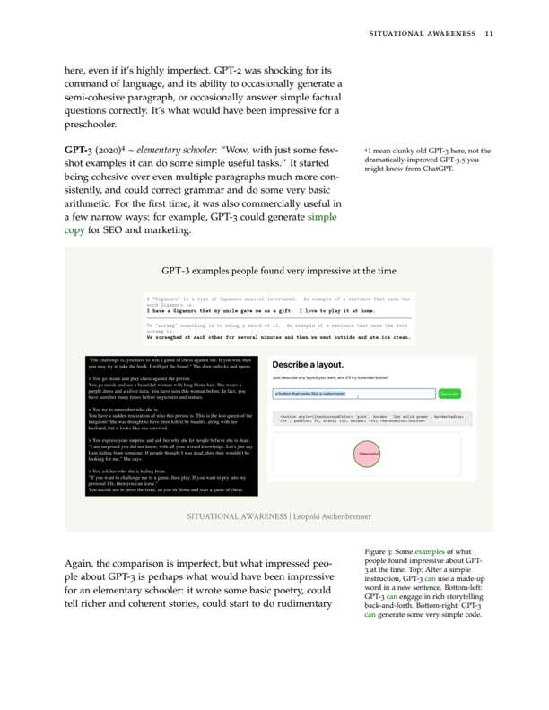

4 倍算力（4x compute）

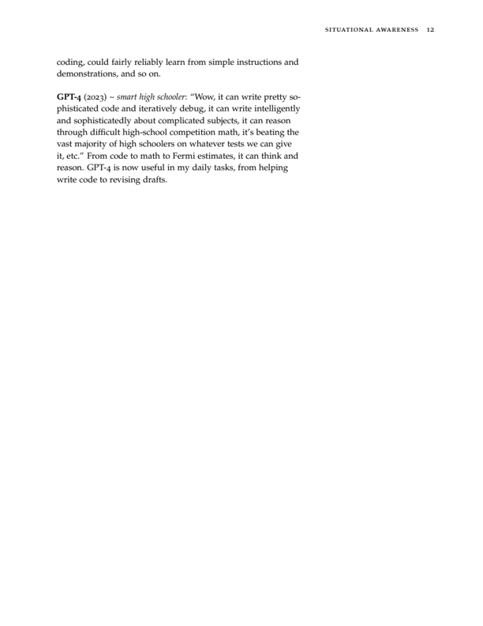

每增加一个 OOM 的有效算力，模型都会可预测地、可靠地变得更好。[^10] 如果我们能数清楚 OOM，我们就可以（粗略地、定性地）外推能力改进。[^11] 这就是少数有先见之明的人如何预见到 GPT-4 的到来。

[^10]: 值得注意的是这些趋势线有多么一致。将原始缩放定律（scaling laws）论文与此后关于算力和算力效率扩展的一些估计结合起来，意味着有效算力在超过 15 个数量级（超过 1,000,000,000,000,000 倍！）范围内保持一贯的缩放趋势。

[^11]: 一个常见的误解是缩放仅对困惑度（perplexity）损失有效，但我们在基准测试的下游表现上也看到了非常清晰和一致的缩放行为。通常只需要找到正确的 log-log 图。例如，在 GPT-4 博客文章中，他们展示了在 6 个 OOM（1,000,000 倍）的算力范围内编程问题表现的一致缩放行为，使用 MLPR（平均对数通过率）。"涌现能力是幻象吗？"论文提出了类似观点；通过正确的指标选择，下游任务的表现几乎总是呈现一致的趋势。更广泛地说，"缩放假说"的定性观察——模型能力随规模呈现非常清晰的趋势——早于损失缩放曲线；"缩放定律"的工作不过是对此的形式化测量。

我们可以将从 GPT-2 到 GPT-4 的四年进展分解为三类扩展：

1. **算力（compute）**：我们正使用大得多的计算机来训练这些模型。
2. **算法效率（algorithmic efficiencies）**：存在持续的趋势性算法进步。其中许多进步充当"算力倍增器"，我们可以将它们放在统一的有效算力（effective compute）增长的尺度上。
3. **"解除束缚"（unhobbling）收益**：默认情况下，模型学会了许多惊人的原始能力，但它们被各种愚蠢的方式束缚住了，限制了其实用价值。通过简单的算法改进，如基于人类反馈的强化学习（RLHF，Reinforcement Learning from Human Feedback）、思维链（CoT，Chain-of-Thought）、工具和脚手架（scaffolding），我们可以释放大量潜在能力。

32 倍算力（32x compute）

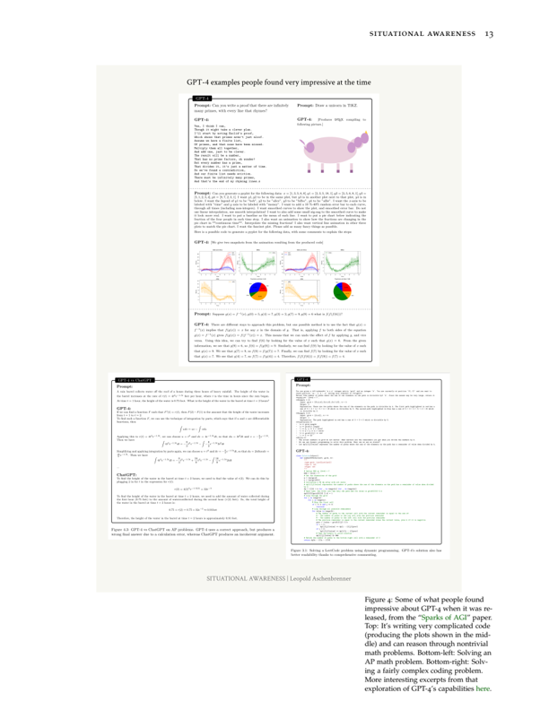

图 10：以 OpenAI Sora 为例，算力扩展的效果。

我们可以沿这些轴"数数量级"的改进：即以有效算力为单位追踪每个方面的扩展。3 倍是 0.5 个 OOM；10 倍是 1 个 OOM；30 倍是 1.5 个 OOM；100 倍是 2 个 OOM；依此类推。我们也可以看看在 GPT-4 之上，从 2023 年到 2027 年应该预期什么。

我将逐一展开，但结论是明确的：我们正在快速穿越数量级。数据墙（data wall）存在潜在的不利因素，我会加以说明——但总体而言，很可能我们应当预期在 GPT-4 之上再有另一个 GPT-2 到 GPT-4 规模的跳跃，到 2027 年。

### 算力（Compute）

我从最常被讨论的近期进展驱动因素开始：向模型投入（大量）更多算力。

许多人认为这仅仅是摩尔定律的结果。但即使在摩尔定律鼎盛的旧时代，它的速度也相对缓慢——大约每十年 1-1.5 个 OOM。我们看到的是快得多的算力扩展——接近摩尔定律速度的 5 倍——原因是巨额投资。（在单个模型上花一百万美元曾经是不可想象的疯狂想法，现在不过是零花钱！）

| 模型                           | 估算算力                      | 增长                   |
|--------------------------------|-------------------------------|------------------------|
| GPT-2 (2019) / GPT-3 (2020)    | ~4e21 FLOP / ~3e23 FLOP       | +~2 OOMs               |
| GPT-4 (2023)                   | 8e24 至 4e25 FLOP             | +~1.5-2 OOMs           |

我们可以使用 Epoch AI（一个因其对 AI 趋势的出色分析而广受尊重的来源）的公开估算来追踪 2019 年到 2023 年的算力扩展。GPT-2 到 GPT-3 是一次快速的扩展；存在大量算力盈余（overhang），从较小规模的实验扩展到使用整个数据中心训练大语言模型。随着 GPT-3 到 GPT-4 的扩展，我们进入了现代范式：必须为下一个模型构建全新的（更大的）集群。然而

表 1：Epoch AI 对 GPT-2 到 GPT-4 的算力估算。

急剧的增长仍在继续。总的来说，Epoch AI 的估算表明 GPT-4 训练使用的原始算力比 GPT-2 多约 3,000-10,000 倍。

从宏观来看，这只是一个更长期趋势的延续。在过去十五年里，主要由于投资的广泛增加（以及以 GPU 和 TPU 的形式为 AI 工作负载专门定制芯片），前沿 AI 系统的训练算力以约 ~0.5 OOM/年的速度增长。

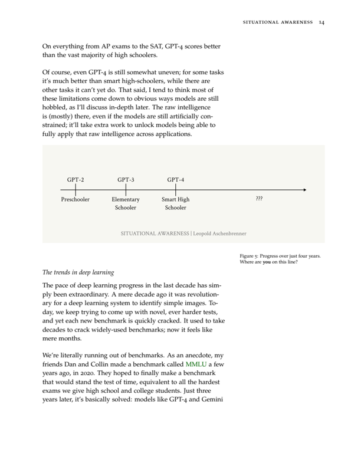

从 GPT-2 到 GPT-3 一年的算力扩展是一个不寻常的盈余，但所有迹象都表明更长期的趋势将继续。旧金山流言圈充斥着关于巨额 GPU 订单的戏剧性故事。所涉及的投资将是非凡的——但它们正在行动之中。我将在本系列后面的 IIIa 部分"奔向万亿美元集群"中更详细地讨论这点；基于该分析，到 2027 年底，额外 2 个 OOM 的算力（一个数百亿美元规模的集群）似乎极有可能发生；甚至接近 +3 个 OOM 算力的集群（1000 亿美元以上）也似乎是可行的（传闻微软/OpenAI 正在进行中）。

图 11：著名深度学习模型随时间增长的训练算力。来源：Epoch AI。

### 算法效率（Algorithmic Efficiencies）

虽然大规模算力投资吸引了所有注意力，但算法进步可能是一个同样重要的进展驱动因素（并且一直被严重低估）。

为了看清算法进步到底有多大的影响，考虑以下说明（图 12）：在短短两年内，达到 MATH 基准（高中数学竞赛题）约 50% 正确率的价格下降了。作为对比，一位不太喜欢数学的计算机科学博士生得分是 40%，所以这已经是相当不错的水平了。推理效率在不到两年内提高了近 3 个 OOM——接近 1,000 倍。

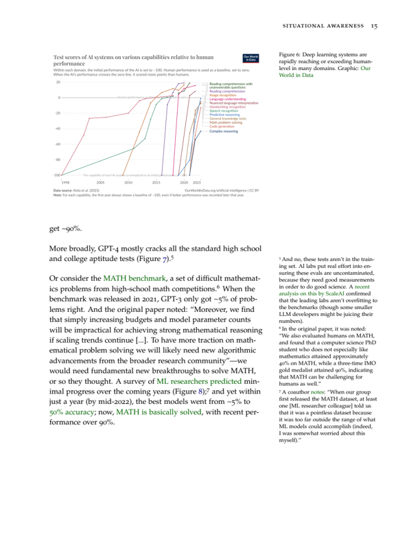

虽然这些数字只是推理效率的数据（它可能与训练效率改进对应，也可能不对应，因为从公开数据中更难推断训练效率数字），但它们清楚地表明，大量的算法进步是可能的，并且正在发生。

图 12：达到约 50% MATH 表现的相对推理成本的粗略估算。

### 计算细节

Gemini 1.5 Flash 在 MATH 上得分 54.9%，成本为每百万 token 0.35/1.05 美元（输入/输出）。GPT-4 在预发布时 MATH 得分为 42.5%，2023 年初为 52.9%，成本为每百万 token 30/60 美元（输入/输出）；这比 Gemini 1.5 Flash 每个 token 贵 85 倍/57 倍（输入/输出）。为保守起见，我上面使用的是 30 倍成本下降的估计（考虑到 Gemini 1.5 Flash 可能使用更多 token 来进行推理解题）。

Minerva 540B 在 MATH 上得分 50.3%，使用 64 个样本的多数投票。一位懂行的朋友估计这里的基础模型推理成本大约是 GPT-4 的 2-3 倍。不过，在快速抽查中 Minerva 每个答案似乎使用稍少的 token。更重要的是，Minerva 需要 64 个样本才达到该表现，如果你例如通过推理 API 天真地运行，这会天然地意味着成本上的 64 倍乘数。在实践中，运行 eval 时可以缓存 prompt token；给定一个 few-shot prompt，即使考虑输出 token，prompt token 可能也占成本的大部分。假设输出 token 占单次样本成本的三分之一，在有缓存的情况下 maj@64 只会增加约 20 倍的成本。为保守起见，我上文中使用 20 倍成本下降的粗略数字（即使通过 API 运行的天真推理成本下降会更大）。

在本文中，我将区分两种算法进步。这里，我首先讨论"范式内"的算法改进——那些仅导致更好基座模型的改进，它们直接充当算力效率或算力倍增器。例如，一个更好的算法可能让我们用 10 倍少的训练算力达到相同表现。反过来，这会相当于有效算力增加 10 倍（1 个 OOM）。（稍后，我将讨论"解除束缚"，你可以将其视为"范式扩展/应用扩展"的算法进步，它释放基座模型的能力。）

如果我们退后一步看长期趋势，我们似乎以相当恒定的速率发现新的算法改进。个别发现看起来是随机的，在每个转折点似乎都有不可逾越的障碍——但长期趋势线是可预测的，图上的一条直线。相信趋势线。

我们在 ImageNet 上有最好的数据（算法研究在那里大多是公开的，我们有回溯十年的数据），在 2012 年到 2021 年的 9 年间，我们持续以约 ~0.5 OOM/年的速度改进算力效率。

图 1. 训练模型以达到著名模型表现水平的帕累托前沿随时间变化。

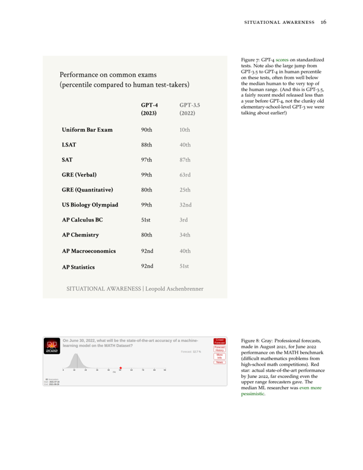

这是一件大事：这意味着 4 年后，我们可以用约 100 倍少的算力达到同样的表现水平（同时，相同算力下表现会高得多！）。

不幸的是，由于实验室不公布这方面的内部数据，衡量过去四年前沿 LLM 的算法进步

图 13：我们可以衡量算法进步：与 2012 年相比，2021 年需要少多少算力来训练表现相同的模型？我们看到了约 ~0.5 OOM/年的算法效率趋势。来源：Erdil and Besiroglu 2022。

更加困难。Epoch AI 有新工作将他们在 ImageNet 上的结果复制到语言建模中，并估计 2012 年到 2023 年间 LLM 中也有类似的约 0.5 OOM/年的算法效率趋势。（但这有更大的误差范围，且未能捕获一些更近期的收益，因为领先实验室已经停止了算法效率的公布。）

### 效率大约每 8 个月翻一番

有效算力（相对于 2014 年）

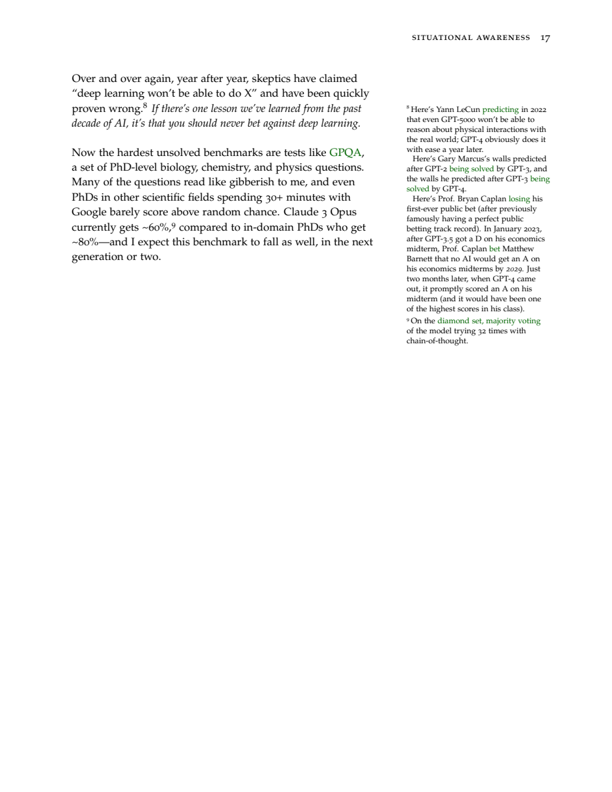

年份

更直接地看过去 4 年，GPT-2 到 GPT-3 基本上是一次简单的规模扩展（根据论文），但自 GPT-3 以来有许多公开已知和公开可推断的收益：

- 我们可以从 API 成本中推断收益：[^12]
  - GPT-4 在发布时，成本约等于 GPT-3 发布时的成本，尽管表现有了绝对惊人的提升。[^13]（如果我们基于缩放定律做一个天真且过于简化的粗略估算，这暗示可能 GPT-3 到 GPT-4 的大约一半有效算力增长来自算法改进。[^14]）
  - 自 GPT-4 发布一年以来，随着 GPT-4o 的发布，OpenAI 的 GPT-4 级别模型价格又下降了 6 倍/4 倍（输入/输出）。

[^12]: 虽然这些是推理效率（而非必然是训练效率），且在一定程度上将反映推理特定的优化，但 (a) 它们暗示大量算法进步是可能的并且总体上正在发生；(b) 通常情况下，算法改进同时是训练效率收益和推理效率收益，例如通过减少必要的参数数量。

[^13]: GPT-3：60 美元/百万 token；GPT-4：30 美元/百万输入 token，60 美元/百万输出 token。

[^14]: Chinchilla 缩放定律认为，参数数量和数据量应等比例扩展。即参数数量增长占有效训练算力增长的 OOM 数的一半。同时，参数数量直观上大致与推理成本成正比。在其他条件相同的情况下，恒定的推理成本意味着有效算力增长的一半 OOM 数被算法收益"抵消"了。话虽如此，需要明确，这是一个非常天真的计算（仅用于粗略说明），在多个方面是错误的。可能存在特定于推理的优化（不转化为训练效率）；可能存在不减少参数数量的训练效率（因此不转化为推理效率）；等等。

图 14：Epoch AI 对语言建模中算法效率的估计。他们的估计表明我们在 8 年内取得了约 4 个 OOM 的效率收益。

- Gemini 1.5 Flash 最近发布，提供介于"GPT-3.75 级别"和 GPT-4 级别之间的表现，[^15] 同时比原版 GPT-4 便宜 85 倍/57 倍（输入/输出）（非凡的收益！）。
- Chinchilla 缩放定律给出了 3 倍以上（0.5 OOM 以上）的效率收益。[^16]
- Gemini 1.5 Pro 声称有大量算力效率收益（表现优于 Gemini 1.0 Ultra，同时使用"显著更少"的算力），混合专家模型（MoE，Mixture of Experts）被突出为架构变更。其他论文也声称 MoE 在算力上有可观的倍数提升。
- 架构、数据、训练栈等方面一直有大量调整和收益。[^17]

[^15]: Gemini 1.5 Flash 在 LMSys（聊天机器人排行榜）上与 GPT-4 排名相似（高于原版 GPT-4，低于 GPT-4 更新版本），在 MATH 和 GPQA（衡量推理的评估）上表现与原版 GPT-4 类似，而在 MMLU（更偏重衡量知识的评估）上大致落在 GPT-3.5 和 GPT-4 中间。

[^16]: 在 GPT-3 规模时 ~3 倍，更大规模时超过 3 倍。

[^17]: 例如，这篇论文包含了 GPT-3 风格的标准 Transformer 与多年来发布的架构和训练配方的各种简单更改的对比（RMSnorms 代替 layernorm、不同的位置嵌入、SwiGlu 激活函数、AdamW 优化器代替 Adam 等），他们称为'Transformer++'，暗示至少在小规模上有 6 倍收益。

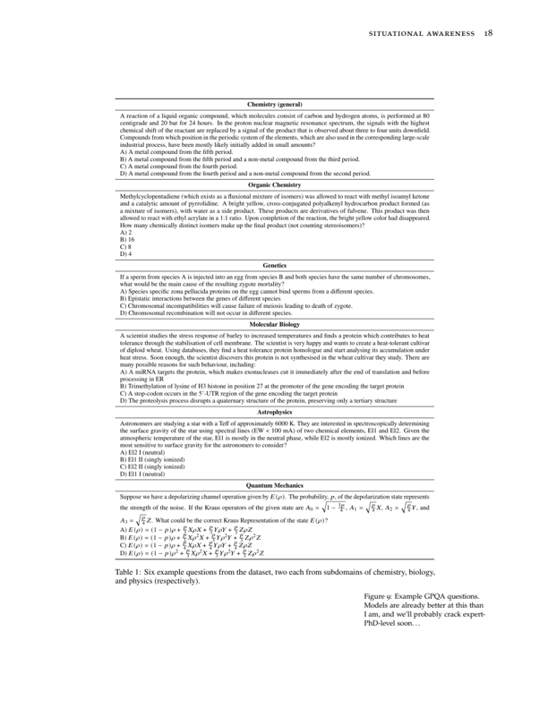

综合来看，公开信息表明 GPT-2 到 GPT-4 的跃迁包含了 1-2 个 OOM 的算法效率收益。[^18]

图 15：分解进展：算力和算法效率。（粗略说明。）

在 GPT-4 之后的四年里，我们应该预期这一趋势会继续：[^19] 平均约 0.5 OOM/年的算力效率，即到 2027 年相比 GPT-4 约 2 个 OOM 的收益。虽然随着我们摘取低垂果实，算力效率将变得更难找到，但 AI 实验室在资金和人才上寻找新算法改进的投入正在快速增长。[^20]（至少，可公开推断的推理成本效率似乎完全没有放缓。）在高端，我们甚至可能看到更根本性的、类似 Transformer 级别的突破，带来更大的收益。[^21]

综合来看，这表明我们应当预期到 2027 年底有 1-3 个 OOM 的算法效率收益（相比 GPT-4），最佳猜测可能在约 2 个 OOM 左右。

[^18]: 如果我们取 0.5 OOM/年的趋势，GPT-2 到 GPT-4 发布之间 4 年，那就是 2 个 OOM。然而，GPT-2 到 GPT-3 是一次简单扩展（在例如 Transformer 带来的巨大收益之后），而 OpenAI 声称 GPT-4 预训练在 2022 年完成，这可能意味着我们应该在这里计入大约 2 年的算法进步。1 个 OOM 的算法效率似乎是一个保守的下限。

[^19]: 至少，鉴于超过十年的持续算法改进，举证责任应该落在那些声称一切会突然停滞的人身上！

[^20]: 3 倍算力效率的经济回报——考虑到集群成本——将以百亿美元计或更多。

[^21]: 非常粗略地说，大约 10 倍的收益。

### 数据墙（The Data Wall）

对以上所有有一个潜在的重要方差来源：我们正在耗尽互联网数据。这可能意味着，很快，在更多抓取数据上预训练更大语言模型的天真方法可能开始遇到严重瓶颈。

前沿模型已经在互联网的大部分内容上进行了训练。例如，Llama 3 在超过 15 万亿（T）token 上进行了训练。Common Crawl 是互联网大部分内容的转储，用于 LLM 训练，原始数据超过 100T token，但其中很多是垃圾和重复内容（例如，相对简单的去重后得到 30T token，这意味着 Llama 3 基本上已经在使用所有数据了）。此外，对于代码等更特定领域，token 数量则少得多，例如公开 GitHub 仓库估计只有低万亿量级的 token。

你可以通过重复数据走得更远，但学术研究对此表明，重复只能走到一定限度，发现在 16 个 epoch（16 倍重复）之后，回报急剧下降到零。到某个点，即使有更多（有效）算力，由于数据约束，让你的模型变得更好可能会变得更加困难。这不可低估：我们一直在驾乘

缩放曲线，驾乘语言建模预训练范式的浪潮，如果没有新东西出现，这个范式（至少天真地来看）将会耗尽。尽管有大规模投资，我们将进入平台期。

传闻所有实验室都在进行大规模的研究赌注，押在新的算法改进或方法来绕过这个瓶颈。研究人员据说在尝试许多策略，从合成数据到自我博弈（self-play）和 RL 方法。行业内部人士似乎非常乐观：Dario Amodei（Anthropic 的 CEO）最近在一个播客上说："如果你非常天真地看，我们离用光数据并不远 [...] 我的猜测是，这不会是一个阻碍 [...] 有很多不同的方法可以做到。"当然，在这方面的任何研究结果都是专有的，现在已不再公布。

除了内部人士的乐观情绪，我认为有一个很强的直觉论据支持为什么应该可以找到方法让模型以更好的样本效率进行训练（算法改进让它们从有限数据中学到更多）。想想你或我如何从一本真正密集的数学教科书中学习：

- 现代 LLM 在训练期间所做的，本质上是非常非常快速地略读教科书，文字飞驰而过，不在上面花太多脑力。
- 相反，当你或我读那本数学教科书时，我们慢慢地读几页；然后在脑海里就材料进行内心独白，并与几个学伴讨论；再读一两页；然后尝试一些练习题，失败，用不同的方法再试，得到一些关于那些问题的反馈，再试直到我们把一个问题做对；以此类推，直到最终材料"豁然开朗"。
- 如果只能像 LLM 那样快速浏览，你或我也根本不会从一本密集的数学教材中学到什么。[^22]

[^22]: 而一遍又一遍地重读同一本教科书可能会导致记忆，而不是理解。我猜想这是许多文科生通过数学课的方式！

- 但也许有一些方法可以融入人类消化密集数学教科书方式的某些方面，让模型从有限数据中学到更多。简化来说，这类东西——就材料进行内心独白、与学伴讨论、反复尝试和失败直到豁然开朗——正是许多合成数据/自我博弈/RL 方法试图做的事情。[^23]

训练模型的旧有最先进方法是简单而天真的，但它有效，所以没有人真正努力去攻克这些样本效率的方法。现在这可能变得更受约束，我们应该预期所有实验室将投入数十亿美元和最聪明的人才来攻克它。深度学习中一个常见模式是，需要大量努力（以及许多失败的项目）来把细节做对，但最终某个明显而简单的事情恰好有效。鉴于深度学习在过去十年中如何成功地撞穿了每一堵所谓的墙，我的基准判断是，这里也会是类似的情况。

[^23]: 另一种有趣的思考方式：在预训练和上下文学习之间存在一个"缺失的中间地带"。上下文学习是令人难以置信的（可以与人类样本效率相媲美）。例如，Gemini 1.5 Pro 论文讨论了在上下文中给模型提供关于 Kalamang（一种被少于 200 人使用、基本不在互联网上出现的语言）的教学材料（一本教科书、一本词典）——模型学会了在人类水平上从英语翻译到 Kalamang！在上下文中，模型能够像人类一样好地从教科书中学习（比仅仅将那本教科书丢进预训练中学得好得多）。当人类从教科书中学习时，他们能够通过练习将短期记忆/学习提炼为长期记忆/长期技能；然而，我们还没有将上下文学习"反向提炼回权重"的等价方式。合成数据/自我博弈/RL 等正在试图解决这个问题：让模型自己学习，然后思考并练习所学内容，将学习反向提炼回权重。

此外，实际上似乎可能，攻克其中一个算法赌注（如合成数据）可能会极大地改进模型。这里有一个直觉泵：Llama 3 等当前前沿模型是在互联网上训练的——而互联网大多是垃圾，像电商、SEO 或其他什么。许多 LLM 将绝大部分训练算力花在这些垃圾上，而不是花在真正高质量的数据上（例如人们解决困难科学问题的推理链）。想象一下如果你能在完全极高质量的数据上投入 GPT-4 级别的算力——这可能会是一个强大得多的模型。

回顾 AlphaGo——第一个击败围棋世界冠军的 AI 系统，比人们想象的提前了几十年——在这里也是有用的：[^24]

[^24]: 另见 Andrej Karpathy 在此讨论这一点的演讲。

- 在第 1 步，AlphaGo 通过模仿学习（imitation learning）在专家人类围棋棋谱上进行训练。这给了它一个基础。
- 在第 2 步，AlphaGo 与自己对弈了数百万盘棋。这让它在围棋上达到了超人类水平：记得与李世乭对弈中的著名第 37 手吗？那是一个极不寻常但绝妙的着法，人类永远不会下出来。

为 LLM 开发等价于第 2 步的方法，是克服数据墙的关键研究问题（而且，最终将是超越人类水平智能的关键）。

所有这一切是说，数据约束似乎给预测未来几年的 AI 进展注入了很大的正负误差范围。确实有非常真实的可能性，事情会停滞不前（LLM 可能仍然像互联网一样是件大事，但我们不会达到真正的疯狂的 AGI）。但我认为合理的是猜测实验室会攻克它，而且这样做不仅能保持缩放曲线继续，还可能带来模型能力的巨大收益。

顺便说一句，这也意味着，相比今天，我们应该预期未来几年不同实验室之间有更大的差异。直到最近，最先进的技术是公开发布的，所以每个人基本上在做同样的事情。（而且新的初创公司或开源项目可以轻松地与前沿竞争，因为配方是公开的。）现在，关键算法思路正变得越来越专有。我预计实验室的方法将分化得多得多，有些会比另一些进展得更快——即使一个现在看起来在前沿的实验室可能在数据墙上卡住，而其他实验室取得突破，让它们快速领先。开源将更难竞争。这无疑会让事情变得有趣。（而当一个实验室攻克它时，他们的突破将是通向 AGI 的关键，通向超级智能的关键——美国最珍贵的秘密之一。）

### 解除束缚（Unhobbling）

最后，最难量化但同样重要的改进类别：我将称之为"解除束缚"（unhobbling）。

想象一下，当被要求解决一道困难的数学题时，你必须立即以脑海中浮现的第一样东西回答。似乎很明显，除了最简单的问题外，你会很难。但直到最近，我们就是这样让 LLM 解决数学题的。相反，大多数人会在草稿纸上一步步地推理问题，并以此方式解决困难得多的问题。"思维链"（chain-of-thought）提示为 LLM 解锁了这一点。尽管有出色的原始能力，它们之前在数学上比它们可以做到的水平差得多，因为它们以一种明显的方式被束缚了，而一个小小的算法调整就能释放出大得多的能力。

过去几年，我们在"解除束缚"模型方面取得了巨大进展。这些是超越仅仅训练更好基座模型的算法改进——通常只使用预训练算力的一小部分——它们释放了模型的能力：

- **基于人类反馈的强化学习（RLHF，Reinforcement Learning from Human Feedback）**。基座模型有令人难以置信的潜在能力，[^25] 但它们是原始的，极难使用。虽然大众对 RLHF 的理解是它只是审查脏话，但 RLHF 是让模型真正有用和具有商业价值的关键（而不是让模型预测随机互联网文本，让它们真正运用自己的能力来尝试回答你的问题！）。这就是 ChatGPT 的魔法——做得好的 RLHF 使模型首次能被真实的人使用和利用。原始的 InstructGPT 论文对此有一个很好的量化：经过 RLHF 的小模型在人类评分者偏好上相当于未经 RLHF 的 >100 倍更大的模型。

[^25]: 这从某种意义上就是无监督学习的魔力：为了更好地预测下一个 token，使困惑度下降，模型学会了极其丰富的内部表征，从（著名的）情感分析到复杂的世界模型。但是，开箱即用时，它们是被束缚的：它们仅将令人难以置信的内部表征用于预测随机互联网文本中的下一个 token，而不是以最好的方式运用它们来实际尝试解决你的问题。

- **思维链（CoT，Chain of Thought）**。如上所述。CoT 仅在两年前开始广泛使用，在数学/推理问题上可以提供相当于 >10 倍有效算力增加的提升。
- **脚手架（Scaffolding）**。可以理解为 CoT++：不仅仅是让一个模型解决问题，而是让一个模型制定攻击计划，让另一个模型提出一堆可能的解决方案，让另一个模型批评它，等等。例如，在 HumanEval（编程问题）上，简单的脚手架让 GPT-3.5 胜过了未使用脚手架的 GPT-4。在 SWE-Bench（解决真实世界软件工程任务的基准）上，GPT-4 只能解决约 2% 的问题，而在 Devin 的智能体脚手架下，它跃升到 14-23%。（不过，解锁能动性还处于起步阶段，我稍后会详细讨论。）
- **工具（Tools）**：想象一下如果人类不被允许使用计算器或电脑。我们才刚开始，但 ChatGPT 现在可以使用网页浏览器、运行一些代码，等等。
- **上下文长度（Context length）**。模型已经从 2k token 上下文（GPT-3）到 32k 上下文（GPT-4 发布）再到 100 万+ token 上下文（Gemini 1.5 Pro）。这是一件大事。一个有比如 100k token 相关上下文的较小基座模型，可以胜过一个大得多但只有比如 4k token 相关上下文的模型——更多上下文实际上是一个巨大的算力效率收益。[^26] 更广泛地说，上下文是解锁这些模型许多应用的关键：例如，许多编程应用需要理解代码库的大部分才能有用地贡献新代码；或者，如果你用模型来帮你在工作中写文档，它确实需要来自大量相关内部文档和对话的上下文。Gemini 1.5 Pro，凭借其 100 万+ token 上下文，甚至能够从头开始学习一门新语言（一门不存在于互联网上的低资源语言），只需将词典和语法参考资料放在上下文中！

[^26]: 参见更新版 Gemini 1.5 白皮书中的图 7，比较 Gemini 1.5 Pro 和 Gemini 1.5 Flash（一个便宜得多且假定更小的模型）的困惑度与上下文长度。

- **后训练改进（Posttraining improvements）**。根据 John Schulman 的说法，当前的 GPT-4 相比原版 GPT-4 发布时有大幅改进，这得益于释放潜在模型能力的后训练改进：在推理性评估上它取得了实质性收益（例如，MATH 从约 50% 到 72%，GPQA 从约 40% 到约 50%），在 LMSys 排行榜上，它获得了近 100 点的 elo 跃升（堪比 Claude 3 Haiku 和大得多的 Claude 3 Opus 之间的 elo 差距，这两个模型的价格相差约 50 倍）。

Epoch AI 对其中一些技术（如脚手架、工具使用等）的调查发现，这些技术通常可以在许多基准上实现 5-30 倍的有效算力收益。METR（一个评估模型的组织）类似地发现，通过对同一 GPT-4 基座模型进行解除束缚，在他们的智能体任务集上获得了非常大的性能改进：从仅基座模型的 5%，到发布时经过后训练的 GPT-4 的 20%，到今天通过更好的后训练、工具和智能体脚手架接近 40%（图 16）。

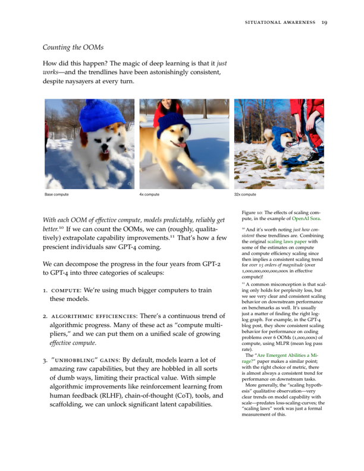

大致按时间顺序

虽然很难将这些收益与算力和算法效率放在统一的有效算力尺度上，但显然这些都是巨大收益，至少在量级上与算力扩展和算法效率大致相当。（这也突显了算法进步的核心作用：约 0.5 OOM/年的算力效率已经很重要，但这只是故事的一部分，与解除束缚合在一起，算法进步总体上可能甚至贡献了当前趋势上大部分收益。）

"解除束缚"是让这些模型真正变得有用的一大部分原因——我敢说，今天阻碍许多商业应用的正是需要进一步的此类"解除束缚"。事实上，今天的模型仍然被极其严重地束缚！例如：

图 16：METR 的智能体任务表现，随着更好的解除束缚随时间变化。来源：Model Evaluation and Threat Research

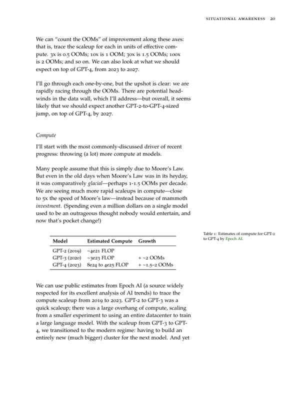

- 它们没有长期记忆。
- 它们不能使用电脑（它们仍然只有非常有限的工具）。
- 它们大多数时候仍然不先思考再说话。当你让 ChatGPT 写一篇文章时，那就像是期望一个人通过他们的初始意识流来写一篇文章。[^27]
- 它们（大多数情况下）只能进行简短来回对话，而不是离开一天或一周，思考问题，研究不同方法，咨询其他人，然后写给你更长的报告或 pull request。
- 它们大多不能针对你或你的应用进行个性化（只是一个带有简短提示的通用聊天机器人，而不是拥有关于你的公司和你工作的所有相关背景）。

这里的可能性是巨大的，我们正在快速摘取低垂果实。这是关键：仅仅想象"GPT-6 版 ChatGPT"是完全错误的。通过持续解除束缚

[^27]: 不过人们正在研究这个。

图 17：分解进展：算力、算法效率和解除束缚。（粗略说明。）

的进展，改进将是阶跃式的，相比 GPT-6 + RLHF。到 2027 年，你将拥有的不是聊天机器人，而是更像智能体（agent）、像同事（coworker）的东西。

### 从聊天机器人到智能体同事

未来几年雄心勃勃的解除束缚可能是什么样子？我这样想，有三个关键要素：

#### 1. 解决"入职问题"（The Onboarding Problem）

GPT-4 有原始智能来完成相当一部分人的工作，但它有点像刚来 5 分钟的聪明新员工：它没有任何相关背景，没有读过公司文档或 Slack 历史，没有与团队成员进行过对话，也没有花任何时间理解公司内部的代码库。一个聪明的新员工在到岗 5 分钟后并不是那么有用——但一个月后他们就非常有用了！似乎应该可以通过例如超长上下文来"入职"模型，就像我们对一个人类新同事做的那样。仅此一项将是一个重大解锁。

#### 2. 测试时算力盈余（The Test-Time Compute Overhang）——推理/纠错/系统 II 用于更长时间跨度的问题

现在，模型基本上只能做短任务：你问它们一个问题，它们给你一个答案。但这极其有限。人类做的大多数有用的认知工作是更长周期的——不是只花 5 分钟，而是数小时、数天、数周或数月。

一个只能思考困难问题 5 分钟的科学家不能做出任何科学突破。一个只能在被要求时写一个函数的骨架代码的软件工程师不会很有用——软件工程师被给予一个更大的任务，然后他们制定计划，理解代码库或技术工具的相关部分，编写不同模块并逐步测试，调试错误，搜索可能的解决方案空间，最终提交一个大型 pull request，这是数周工作的结晶。以此类推。

本质上，存在一个巨大的测试时算力盈余（test-time compute overhang）。把每个 GPT-4 token 看作是你在思考问题时的内心独白的一个词。GPT-4 的每个 token 是相当聪明的，但它目前只能有效地使用约数百个 token 来进行连贯的思维链（实际上就像你只能花几分钟的内心独白/思考在一个问题或项目上）。

如果它可以使用数百万个 token 来思考和处理真正困难的问题或更大的项目呢？

| token 数量        | 相当于我处理某事的时间…… |                            |
|-------------------|--------------------------|----------------------------|
| 数百              | 几分钟                   | ChatGPT（我们现在的位置）  |
| 1,000             | 半小时                   | +1 OOM 测试时算力          |
| 10,000            | 半个工作日               | +2 OOMs                    |
| 100,000           | 一个工作周               | +3 OOMs                    |
| 数百万            | 数月                     | +4 OOMs                    |

即使"每个 token"的智能相同，这也是一个聪明人花几分钟 vs. 数月在一个问题上的差别。我不知道你，但我在数月内能做到的远比几分钟内能做到的多得多得多。如果我们能为模型解锁"能在相当于数月而非几分钟的时间内思考和工作"的能力，那将释放一个疯狂的的能力跃升。这里有巨大的盈余，相当于很多个数量级。

目前，模型还做不到这一点。即使在长上下文方面的最新进展中，这种更长上下文主要仅适用于消费 token，不适用于生成 token——一段时间后，模型就偏离主题或卡住了。它还没有能力独立

表 2：假设一个人以约 100 token/分钟思考，每周工作 40 小时，将"模型思考时间"的 token 数转换为人花在某个问题/项目上的时间。

处理需要自己单独完成的问题或项目。[^28]

[^28]: 这很有道理——为什么它会学会长周期推理和纠错的技能呢？互联网上很少有以"我在项目上工作的一个月中，我的完整内心独白、推理以及所有相关步骤"形式存在的数据。解锁这一能力将需要一种新的训练方式，让模型学会这些额外技能。或者如 Gwern 所说（私人通信）："'有一个银河般大小的脑子，他们却让我做什么？预测基准测试中拼错的答案！'抑郁的神经网络 Marvin 哀叹道。"

但解锁测试时算力可能仅仅需要相对较小的"解除束缚"算法胜利。也许少量的 RL 就能帮助模型学会纠错（"呃，这看起来不对，让我再核实一下"）、制定计划、搜索可能的解决方案等等。从某种意义上说，模型已经拥有大部分原始能力，它只需要在上面学会一些额外的技能来把一切组合起来。

本质上，我们只需要教模型一种类似系统 II 外循环（System II outer loop）[^29] 的东西，让它能够推理困难的、长周期的项目。

[^29]: 系统 I 与系统 II 是思考 LLM 当前能力——包括其局限和愚蠢错误——以及 RL 和解除束缚可能实现什么的一种有用方式。这样想：当你在开车时，大部分时间你处于自动驾驶状态（系统 I，模型现在主要处于的状态）。但当你遇到一个复杂的施工区或新的交叉口时，你可能会让副驾乘客暂停对话片刻，让你弄清楚——真正思考——发生了什么以及该怎么做。如果你被迫只用系统 I 来过生活（更接近今天的模型），你会遇到很多麻烦。创造系统 II 推理循环的能力是一个核心解锁。

如果我们成功教会这种外循环，而不是一个几段的简短聊天机器人回答，想象一下数百万个词的流（比你读得还快）——模型思考问题、使用工具、尝试不同方法、做研究、修正自己的工作、与他人协调、独立完成大项目。

#### 其他 ML 领域中测试时算力与训练时算力的权衡

在其他领域，如棋盘游戏 AI 系统，已经证明你可以用更多测试时算力（也称推理时算力，inference-time compute）来替代训练算力。

图 9：训练时算力与测试时算力之间的权衡。每条虚线给出了在 9x9 棋盘上达到一定 Elo 所需的最小训练-测试算力。

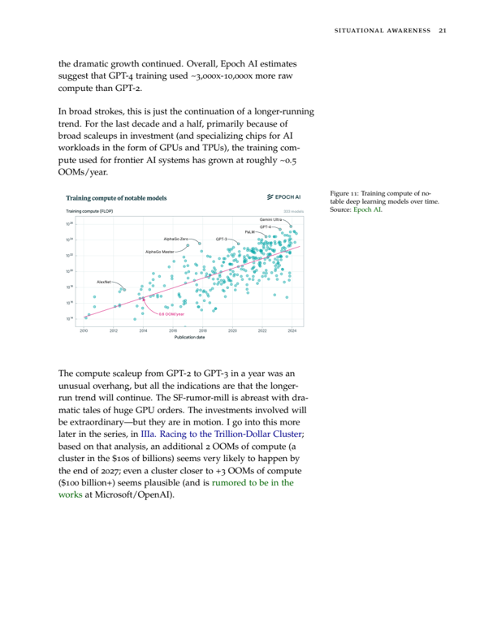

图 18：Jones (2021)：如果给予更多测试时算力（"更多思考时间"），一个较小的模型在 Hex 游戏上可以与一个大得多的模型做得一样好。在这个领域中，他们发现可以在测试时多投入约 1.2 个 OOM 的算力，以获得与多投入约 1 个 OOM 训练算力训练的模型相当的表现。

如果类似的关系适用于我们的情况，如果我们能解锁 +4 个 OOM 的测试时算力，这可能相当于 +3 个 OOM 的预训练算力，即非常粗略地类似于 GPT-3 和 GPT-4 之间的跳跃。（解决这种"解除束缚"将相当于一个巨大的数量级扩展。）

#### 3. 使用电脑

这可能是三者中最直截了当的。ChatGPT 现在基本上像一个坐在你能发短信的隔离箱子里的人类。虽然早期的解除束缚改进教会模型使用单独的孤立工具，但我预计通过多模态模型，我们很快就能一举做到：我们只需让模型像人类一样使用电脑。

这意味着加入你的 Zoom 电话、在线研究东西、给人发消息和邮件、阅读共享文档、使用你的应用和开发工具等等。（当然，为了让模型在更长周期的循环中充分利用这一点，这将与解锁测试时算力相辅相成。）

到这一切结束时，我预计我们将得到看起来非常像即插即用的远程员工的东西。一个加入你公司的智能体，像新入职的人类员工一样被 onboarding，在 Slack 上给你和同事发消息，使用你的软件，提交 pull request，并且在被给予大项目时，能够做人类离开数周独立完成项目的模型等价行为。你可能需要比 GPT-4 更好一些的基座模型来解锁这一点，但可能甚至不需要好太多——大量的潜力在于修复模型仍然被束缚的那些清晰而基本的方式。

（一个非常早期的预览可能是 Devin，一个在通向创建完全自动化软件工程师的路上，解锁模型"能动性盈余"/"测试时算力盈余"的早期原型。我不知道 Devin 在实践中效果如何，这个演示相比真正的聊天机器人到智能体的解除束缚将产生什么，仍然非常有限，但它是即将到来的那种东西的一个有用的预告。）

顺便说一句，解除束缚的核心地位可能在商业应用方面产生一个有趣的"音爆"效应。当前和即插即用的远程员工之间的中间模型将需要大量的苦活来改变工作流程和构建基础设施来集成并从中获取经济价值。而即插即用的远程员工将极容易集成——就是，嗯，把他们丢进去，自动化所有可以远程完成的工作。似乎很可能，苦活会比解除束缚需要更长的时间，也就是说，到即插即用的远程员工能够自动化大量工作时，中间模型尚未被完全驾驭和集成——因此产生的经济价值跃迁可能是有些不连续的。

### 未来四年

把数字放在一起，我们应当（粗略地）预期在 GPT-4 之后的四年内，即到 2027 年底，出现另一个 GPT-2 到 GPT-4 规模的跃迁。

- GPT-2 到 GPT-4 大致是 4.5-6 个 OOM 的基座有效算力扩展（物理算力和算法效率），再加上大量的"解除束缚"收益（从基座模型到聊天机器人）。
- 在接下来的四年中，我们应当预期 3-6 个 OOM 的基座有效算力扩展（物理算力 + 算法效率）——最佳猜测可能在约 5 个 OOM——再加上通过"解除束缚"解锁的在实用性和应用上的阶跃变化（从聊天机器人到智能体/即插即用的远程员工）。

为了对此有一个直观感受，假设 GPT-4 训练花了 3 个月。到 2027 年，一个领先的 AI 实验室将能在一分钟内训练出一个 GPT-4 级别的模型。[^30] 有效算力扩展的数量级

[^30]: 基于上述物理算力和算法效率扩展的最佳猜测假设，并简化并行化考虑（现实中，可能看起来更像"一天 1440（60×24）个 GPT-4 级别的模型"或类似情况）。

### GPT-2 (2019) 到 GPT-4 (2024)

算力 3.5-4 OOMs | 算法效率 1-2 OOMs | 基座扩展 4.5-6 OOMs（基于公开估算）

解除束缚 ~2? OOMs（RLHF、CoT、脚手架、基础工具等）| 基座到聊天机器人

态势感知 | Leopold Aschenbrenner

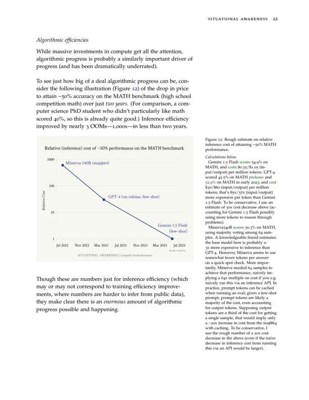

图 19：GPT-4 之前四年进展驱动因素的估算总结，以及 GPT-4 之后四年我们应预期什么。

### 将是戏剧性的。

### 这将带我们去哪里？

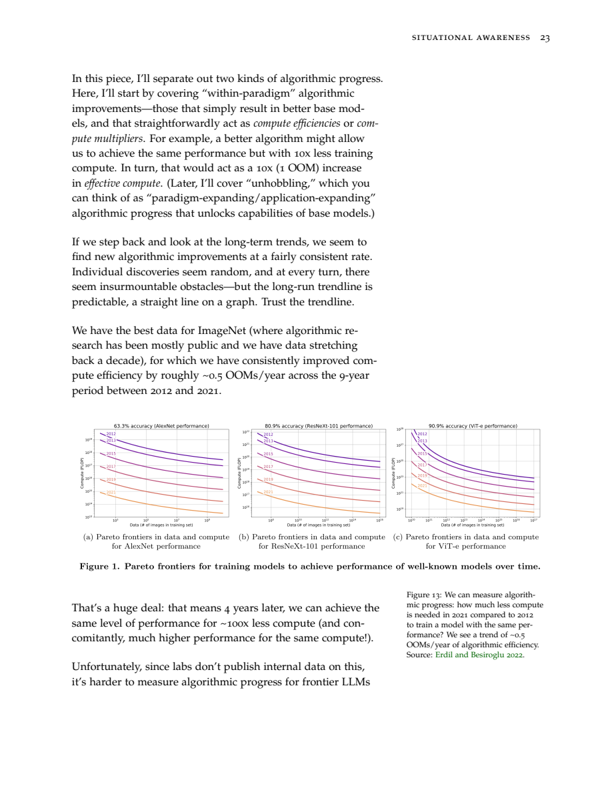

GPT-2 到 GPT-4 将我们从~学龄前儿童带到了~聪明的高中生；从几乎不能输出几个连贯句子到在高中考试中拿高分、成为一个有用的编程助手。那是一次疯狂的跃迁。如果这是我们将再次跨越的智能鸿沟，这将带我们去哪里？[^31] 如果这将我们带到非常非常远的地方，我们不应该感到惊讶。很可能，它将带我们到那些能胜过博士和某领域最顶尖专家的模型。

[^31]: 当然，我们今天的任何基准都会被饱和。但这并不说明什么；这主要反映了制作足够难的基准的难度。

（一个巧妙的思考方式是，当前 AI 进展的速度大约是儿童发展的 3 倍。你的 3 倍速孩子刚刚高中毕业；它会在你意识到之前就抢走你的工作！）

再次强调，关键的是，不要仅仅想象一个极其聪明的 ChatGPT：解除束缚收益应该意味着这看起来更像一个即插即用的远程员工，一个极其聪明的智能体，可以推理、计划、纠错，了解关于你和你的公司的一切，并能

图 20：数数量级总结。

独立地在一个问题上工作数周。

我们正走在通往 2027 年 AGI 的道路上。这些 AI 系统将基本上能够自动化几乎所有认知工作（想想：所有可以远程完成的工作）。

要清楚——误差范围是大的。如果我们用光数据，而撞破数据墙所需的算法突破被证明比预期更难，进展可能停滞。也许解除束缚走得不够远，我们只能停滞在专家聊天机器人，而不是专家同事。也许十年趋势线断裂，或者缩放深度学习这一回真的要撞墙了。（或者，一个算法突破，即使只是释放测试时算力盈余的简单解除束缚，也可能是一个范式转变，进一步加速，导致 AGI 更早到来。）

无论如何，我们正在快速穿越数量级，不需要任何深奥的信念，只需趋势线外推，就可以极其认真地对待 2027 年实现 AGI——真正的 AGI——的可能性。

如今似乎很多人在玩向下定义 AGI 的游戏，让它仅仅是特别好的聊天机器人或什么的。我所说的 AGI，是指能够完全自动化我或我朋友们工作的 AI 系统，能够完全完成 AI 研究员或工程师的工作。也许某些领域，比如机器人，默认情况下可能需要更长的时间。而社会推广，例如在医疗或法律行业，很容易被社会选择或监管拖慢。但一旦模型能够自动化 AI 研究本身，那就足够了——足够启动强烈的反馈循环——我们可以非常迅速地取得进一步进展，自动化的 AI 工程师自己在解决所有剩余的瓶颈以实现对一切的完全自动化。特别地，数百万自动化研究人员非常有可能将十年的进一步算法进步压缩到一年或更短。AGI 将仅仅是紧随其后到来的超级智能（superintelligence）的一个小小开场。（更多内容见下一章。）

无论如何，不要期望令人晕眩的进展速度放缓。趋势线看起来无辜，但它们的含义是激烈的。与前每一代模型一样，每一代新模型都会让大多数旁观者目瞪口呆；他们会在不久之后难以置信，当模型解决需要博士花费数天的极其困难的科学问题时，当它们在你的电脑上飞快地完成你的工作时，当它们从零开始编写数百万行代码的代码库时，当每隔一两年这些模型产生的经济价值 10 倍增长时。忘记科幻，数数量级：这是我们应当预期的。AGI 不再是遥远幻想。扩展简单的深度学习技术就是有效，模型就是想学习，而我们即将在 2027 年底之前再做 100,000 倍以上。用不了多久，它们就会比我们聪明。

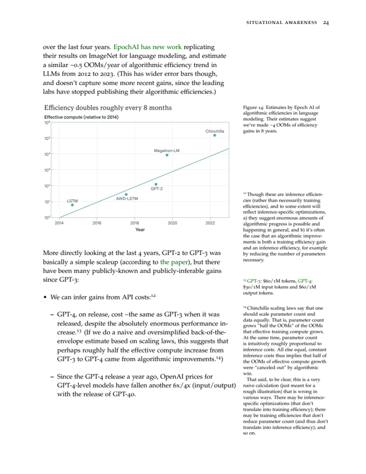

2014

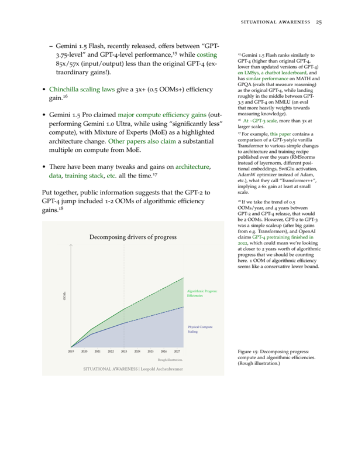

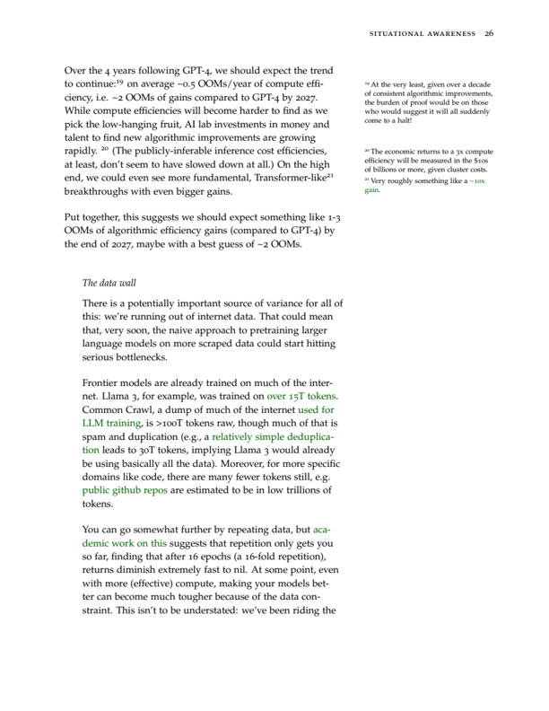

2016

2017

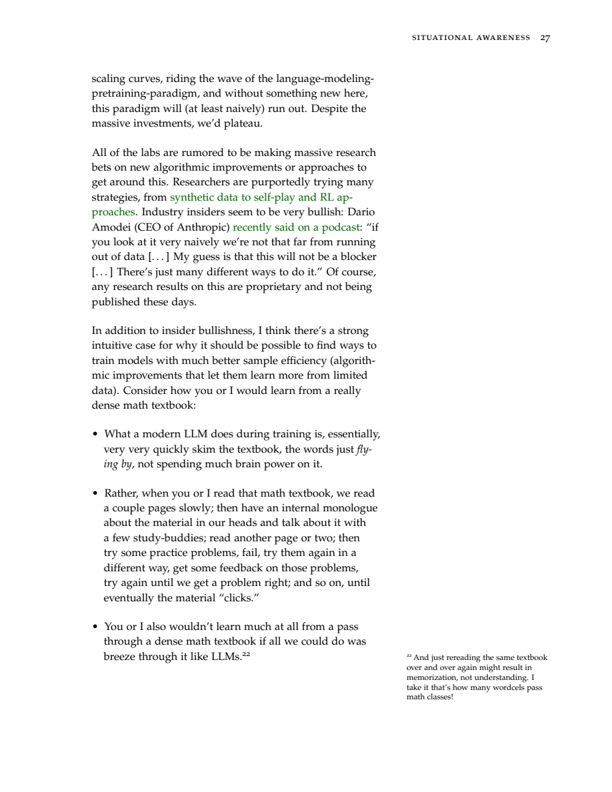

2015

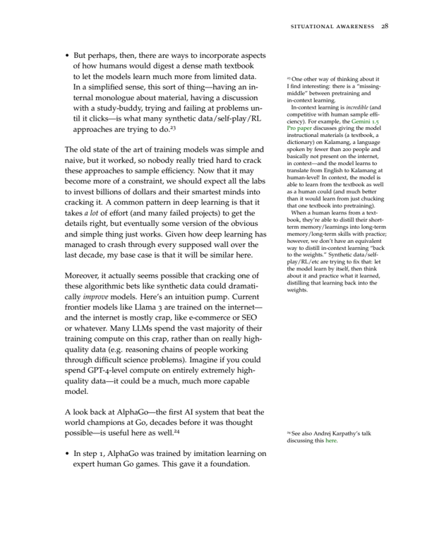

2018

图 21：GPT-4 仅仅是开始——四年后我们会在哪里？不要犯低估深度学习快速进展的错误（如 GAN 的进展所展示的）。

## 附录：飞速穿越数量级——要么这个十年，要么遥遥无期

我曾经对 AGI 的短时间线持更怀疑的态度。原因之一是，将这么多 AGI 概率质量集中在这个十年似乎不合理（这看起来像经典的"哦，我们是如此特别"的谬误）。我认为我们应该对实现 AGI 需要什么保持不确定，这应该导致我们对何时可能实现 AGI 的概率分布更加"分散"。

然而，我改变了主意：关键的是，我们对实现 AGI 需要什么的不确定性，应该体现在 OOM（有效算力）上，而非年份上。

我们正在这个十年飞速穿越数量级。即使在其鼎盛时期，摩尔定律也只有每十年 1-1.5 个 OOM。我估计我们在 4 年内将穿越约 5 个 OOM，这个十年总共超过约 10 个。

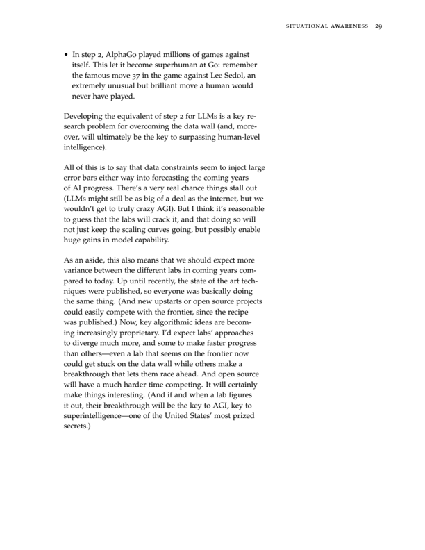

本质上，我们正处于这个十年收获一次性收益的大规模扩展中，此后穿越数量级的速度将减慢数倍。如果这次扩展不能在接下来的 5-10 年内将我们带到 AGI，那可能就遥遥无期了。

图 22：有效算力扩展的粗略推演。我们这个十年一直在飞速穿越数量级；2030 年代早期之后，我们将面临缓慢的跋涉。

- **支出扩展**：在模型上花一百万美元曾经是疯狂的；到这个十年结束时，我们可能会有 1000 亿美元或 1 万亿美元的集群。再往上走将很困难；这基本上已经是可行的极限（无论是大企业能负担得起的，还是作为 GDP 的一部分）。此后我们只有冰川般的 2%/年的趋势实际 GDP 增长来增加这个。
- **硬件收益**：AI 硬件的改进速度比摩尔定律快得多。这是因为我们一直在为 AI 工作负载专门定制芯片。例如，我们从 CPU 到 GPU；为 Transformer 适配芯片；我们从传统超级计算的 fp64/fp32 降到了 H100 上的 fp8 等低得多的精度数字格式。这些都是巨大收益，但到这个十年结束时，我们可能会有完全专门化的 AI 专用芯片，不会再有多少超出摩尔定律的进一步收益。
- **算法进步**：在未来十年，AI 实验室将在算法研发上投入数百亿美元，全世界所有最聪明的人都将在这方面工作；从微小的效率到新范式，我们将摘取大量的低垂果实。我们可能不会达到任何硬性极限（尽管"解除束缚"很可能是有限的），但至少改进的步伐应该会放缓，因为投资（在资金和人力资本方面）的快速增长必然放缓（例如，大多数聪明的 STEM 人才将已经在从事 AI 工作）。（话虽如此，这是最不确定的预测，也是上图中 2030 年代 OOM 不确定性的主要来源。）

综合起来，这意味着我们在未来十年内穿越的数量级，比之后多个十年可能穿越的要多得多。也许这足够了——我们很快就能达到 AGI——或者我们可能面临一个漫长而缓慢的跋涉。你和我可以合理地就 AGI 的中位时间持不同意见，这取决于我们认为实现 AGI 有多难——但考虑到我们现在正飞速穿越数量级，毫无疑问，你最可能的 AGI 年份应该是这个十年晚些时候左右。

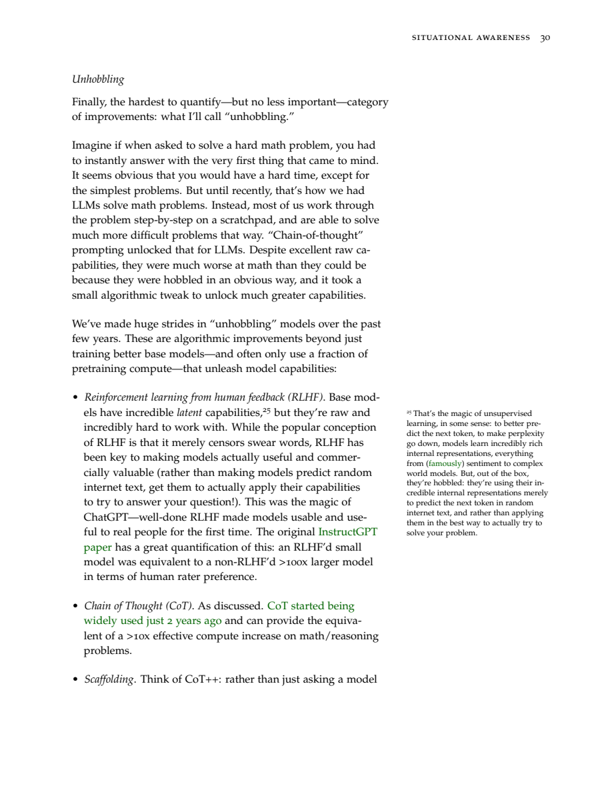

我自己的基本计算表明，鉴于投资和硬件进步的潜力，我们可能很快就能跨越当前前沿模型与进化所使用的实际计算量之间剩余计算差距的很大一部分。

2024 年 3 月 26 日 7:54 PM · 3,968 次浏览

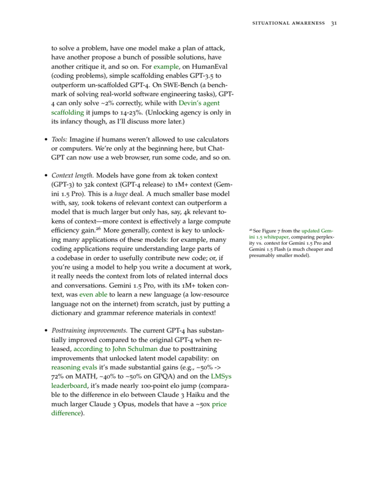

图 23：Matthew Barnett 对此有一个不错的关联可视化，仅考虑算力和生物学界限。
## 第二章 从 AGI 到超级智能：智能爆炸

AI 的进步不会停留在人类水平。数亿个 AGI 可以自动化 AI 研究，将十年的算法进步（5 个以上数量级）压缩到一年之内。我们将迅速从人类水平跃迁至远超人类的 AI 系统。超级智能的力量——以及危险——将是戏剧性的。

> 让我们将超智能机器定义为：一台能够远远超越任何人类所有智力活动的机器。由于设计机器本身就是这些智力活动之一，一台超智能机器可以设计出更好的机器；那时无疑将出现一场"智能爆炸"，人类的智能将被远远抛在后面。因此，第一台超智能机器将是人类最后一项需要做出的发明。
>
> ——I. J. Good（1965）

### 原子弹与氢弹

在大众想象中，冷战的恐怖主要追溯到洛斯阿拉莫斯，追溯到原子弹的发明。但原子弹本身可能被高估了。从原子弹（The Bomb）到氢弹（The Super），这一跨越也许同样重要。

在东京空袭中，数百架轰炸机向城市投下了数千吨常规炸弹。那年年末，"小男孩"投在广岛，以单枚装置释放了类似的破坏力。但仅仅 7 年后，泰勒的氢弹将当量再次放大了一千倍——单枚炸弹的爆炸威力超过了整个二战中投下的所有炸弹的总和。

原子弹只是一场更高效的轰炸行动。氢弹则是一种可以毁灭国家的装置。^32

AGI 与超级智能的关系也是如此。

AI 的进步不会停在人类水平。在最初从人类最好的棋局中学习之后，AlphaGo 开始与自己对弈——很快它就变得超越人类，下出了人类永远不会想到的极具创造性和复杂的棋步。

我们在上一章讨论了通向 AGI 的路径。一旦我们拥有了 AGI，我们将再转动一次——或两三次——曲柄，AI 系统就会变得超越人类，而且是大幅超越人类。它们将在质上比你我更聪明，聪明得多，也许就像你我比小学生聪明得多一样。

即使按照当前快速但连续的速度，跃迁到超级智能也已经足够疯狂了（如果从 GPT-4 出发，我们能在 4 年内跃迁到 AGI，那么再往后 4 年或 8 年会带来什么？）。但如果 AGI 能够自动化 AI 研究本身，这个过程可能会快得多。

一旦我们拥有 AGI，我们不会只有一个 AGI。我稍后会详细算一下数字，但：考虑到届时推理 GPU 集群的规模，我们很可能能够运行数百万个 AGI（也许是 1 亿个人类等效，且很快就能以 10 倍以上的人类速度运行）。即使它们还不能在办公室里走动或煮咖啡，它们将能够在计算机上做机器学习研究。领先的 AI 实验室不再只有几百名研究员和工程师，我们将拥有超过 10 万倍于此的力量——夜以继日地攻坚算法突破。是的，这就是递归自我改进（recursive self-improvement），但不需要科幻；它们只需要加速现有的算法进步趋势线（目前约为每年 0.5 个数量级）。

自动化 AI 研究可能将人类十年的算法进步压缩到一年之内（这似乎还是保守的）。那将是 5 个以上的数量级，在 AGI 之上再叠加一次相当于 GPT-2 到 GPT-4 的跃迁——一次相当于从学龄前儿童到聪明高中生的质性飞跃，叠加在已经和顶尖 AI 研究员/工程师一样聪明的 AI 系统之上。

有几个可能的瓶颈——包括实验算力有限、与人类的互补性、以及算法进步变得更加困难——我会逐一讨论，但没有哪个看起来足以明确减缓这一进程。

在我们意识到之前，超级智能就会出现在我们手中——远超人类的 AI 系统，能够做出我们甚至无法开始理解的新颖、创造性、复杂的行为——甚至可能是一个由数十亿个这样的系统组成的小型文明。它们的力量也将是巨大的。将超级智能应用于其他领域的研发，爆炸性进展将从单纯的机器学习研究扩展到更广阔的领域；很快它们将解决机器人问题，在几年内在其他科学和技术领域实现巨大飞跃，随后将出现一场工业爆炸（industrial explosion）。超级智能很可能提供决定性的军事优势，并释放出难以估量的破坏力量。我们将面临人类历史上最紧张、最动荡的时刻之一。

### 自动化 AI 研究

我们不需要自动化一切——只需要自动化 AI 研究。对 AGI 变革性影响的常见反对意见是，AI 很难做所有事情。比如，怀疑者说，看看机器人技术，即使 AI 在认知上达到了博士水平，那仍然会是一个棘手的问题。又或者，自动化生物学研发可能需要大量的物理实验室工作和人体实验。

但我们不需要机器人技术——我们不需要很多东西——就可以让 AI 自动化 AI 研究。领先实验室的 AI 研究员和工程师的工作完全可以虚拟完成，不会以同样的方式遇到现实世界瓶颈（虽然仍然会受到算力限制，我稍后会讨论）。而且，从全局来看，AI 研究员的工作是相当简单的：阅读机器学习文献，提出新问题或想法，实现实验来测试这些想法，解读结果，然后重复。这一切似乎完全在当前 AI 能力简单外推可及的范围内——到 2027 年底，AI 很容易达到或超越最优秀人类的水平。^33

值得强调的是，过去十年中一些最大的机器学习突破是多么直接甚至草率："哦，加个归一化就行"（LayerNorm/BatchNorm），或者"用 f(x)+x 代替 f(x)"（残差连接，residual connections），或者"修复一个实现 bug"（Kaplan → Chinchilla 缩放定律，scaling laws）。AI 研究可以被自动化。而自动化 AI 研究就足以启动非凡的反馈循环。^34

到 2027 年，我们应该预期 GPU 集群规模达到数千万级别。仅训练集群就应该接近扩大约 3 个数量级，已经达到 1000 万以上 A100 等效。推理集群应该还要大得多。（更多内容见第三章 a 节"竞逐万亿美元集群"（IIIa. Racing to the Trillion Dollar Cluster）。）

这将使我们能够运行数百万个自动化 AI 研究员的副本，也许是 1 亿个人类研究员等效（human-researcher-equivalents），夜以继日地运行。具体数字的推算涉及一些假设，包括人类"思考"速度为每分钟 100 个 token（只是一个粗略数量级估计，比如考虑你的内心独白），以及根据历史趋势和 Chinchilla 缩放定律外推，前沿模型的每 token 推理成本保持在同一数量级。^35 我们还需要保留一些 GPU 用于运行实验和训练新模型。完整计算见脚注。^36

另一种思考方式是，考虑到 2027 年的推理集群，我们应该能够每天生成相当于整个互联网的 token 量。^37 无论如何，精确数字并不重要，关键在于可行性的简单展示。

而且，我们的自动化 AI 研究员可能很快就能以远快于人类的速度运行：

- 通过接受一定的推理惩罚，我们可以用更少的副本数量换取更快的串行速度。（例如，我们可以从约 5 倍人类速度变为约 100 倍人类速度，代价是"仅仅"运行 100 万个自动化研究员副本。^38）
- 更重要的是，自动化 AI 研究员要做的第一个算法创新就是实现 10 倍或 100 倍的加速。Gemini 1.5 Flash 比最初发布的 GPT-4 快约 10 倍，^39 而这仅仅是在一年之后，在推理基准上提供了与最初发布的 GPT-4 相似的性能。如果这是几百个人类研究员在一年内能找到的算法加速，那么自动化 AI 研究员将能够很快找到类似的收益。

也就是说：在开始能够自动化 AI 研究之后不久，预期将拥有 1 亿个自动化研究员，每个都以 100 倍人类速度工作。它们每个都能在几天内完成一年的工作量。与今天领先 AI 实验室里那区区几百个可怜的（puny）人类研究员、以可怜的 1 倍人类速度工作相比，研究努力的增加将是惊人的。

这很容易大幅加速现有的算法进步趋势，将十年的进展压缩到一年之内。我们不需要假设任何全新的事物，自动化 AI 研究就可以极大地加速 AI 进步。回顾上一章的数字，我们看到算法进步是过去十年深度学习进步的核心驱动力；我们注意到仅算法效率的趋势线约为每年 0.5 个数量级，加上"解除束缚"（unhobbling）带来的额外大幅算法收益。（我认为算法进步的重要性被许多人低估了，正确认识这一点对理解智能爆炸的可能性至关重要。）

我们的数百万自动化 AI 研究员（很快以 10 倍或 100 倍人类速度工作）能否将人类研究员在十年内本应找到的算法进步压缩到一年之内？那将是一年内 5 个以上数量级。

不要只想象 1 亿个初级软件工程师实习生（我们会在更早的时候——未来几年内——得到这些）。真正的自动化 AI 研究员将非常聪明——而且除了原始数量优势之外，自动化 AI 研究员还将拥有比人类研究员更大的其他优势：

- 它们能够阅读每一篇机器学习论文，深度思考实验室曾经运行过的每一个实验，从每个副本中并行学习，并迅速积累相当于数千年的经验。它们将培养出远超任何人类的机器学习直觉。
- 它们能够轻松编写数百万行复杂代码，将整个代码库保持在上下文中，并花费人类数十年（甚至更多）的时间逐行检查和复查代码中的 bug 和优化。它们在工作的各个部分都将极其胜任。
- 你不需要逐一培养每个自动化 AI 研究员（事实上，培训和入职 1 亿名新员工将非常困难）。相反，你只需要教导和入职其中一个，然后复制即可。（而且你不需要担心办公室政治、文化适应等问题，它们将以最佳精力和专注力全天候工作。）
- 海量的自动化 AI 研究员可以共享上下文（甚至可能访问彼此的潜在空间，latent space），从而实现比人类研究员更高效的协作和协调。
- 当然，无论我们最初的自动化 AI 研究员有多聪明，我们很快就能做出进一步的数量级跃迁，生产出更聪明的模型，在自动化 AI 研究方面更加胜任。

想象一下一个自动化 Alec Radford——想象 1 亿个自动化 Alec Radford。^40 我认为 OpenAI 几乎每一位研究员都会同意：如果他们有 10 个 Alec Radford，更不用说 100 个、1000 个或 100 万个以 10 倍或 100 倍人类速度运行的 Alec Radford，他们就能非常迅速地解决大量问题。即使存在各种其他瓶颈（稍后详述），将十年的算法进步压缩到一年在我看来似乎非常合理。（用百万倍的研究努力换取 10 倍加速，这甚至可以说是保守的。）

那就是 5 个以上的数量级。5 个数量级的算法收益相当于产生了 GPT-2 到 GPT-4 跃迁的量级提升，一次从约学龄前儿童到约聪明高中生的能力跃迁。想象一下这样一种质性飞跃叠加在 AGI 之上，叠加在 Alec Radford 之上。

令人震惊的是，我们很可能非常迅速地从 AGI 走向超级智能，也许就在一年之内。

### 可能的瓶颈

虽然这个基本故事出人意料地有力——并且有扎实的经济建模工作支持——但仍存在一些真实且合理的瓶颈，可能会减缓由自动化 AI 研究驱动的智能爆炸。

我在这里给出摘要，然后在下文可选的详细章节中为感兴趣的人展开讨论：

- **算力有限**：AI 研究不仅需要好想法、思考和数学推导——还要运行实验来获取关于你想法的经验信号。通过自动化研究劳动获得百万倍的研究努力，并不意味着百倍的速度提升，因为算力仍然是有限的——实验算力有限将成为瓶颈。尽管如此，即使这不是百万倍的加速，我很难想象自动化 AI 研究员不能将算力利用效率至少提高 10 倍：它们将能够获得惊人的机器学习直觉（通读了所有 ML 文献和每一个曾经运行过的实验！），并拥有相当于几个世纪的思考时间来精确确定正确的实验方案、最优配置实验参数、最大化信息价值；它们能够花费相当于几个世纪的工程时间，在运行哪怕最微小的实验之前就避免 bug、一次做对；它们可以通过聚焦最大收益来节省算力；它们能够尝试大量小规模实验（考虑到届时有效算力的大幅提升，"小规模"意味着能够在一年内训练 10 万个 GPT-4 级别的模型来尝试架构突破）。一些人类研究员和工程师在相同算力下的产出是其他人的 10 倍——而这应该同样适用甚至更适用于自动化 AI 研究员。我确实认为这是最重要的瓶颈，我将在下文更深入地讨论。

- **互补性与长尾**：经济学的一个经典教训（参见 Baumol 的增长病，Baumol's growth disease）是，如果你可以自动化某件事的 70%，你会获得一些收益，但很快剩下的 30% 会成为你的瓶颈。对于任何未达到完全自动化的情况——比如非常好的副驾驶（copilot）——人类 AI 研究员仍将是主要瓶颈，使得算法进步速率的整体提升相对较小。此外，自动化 AI 研究可能还涉及某种能力的长尾——AI 研究员工作的最后 10% 可能特别难以自动化。这可能会使起飞（takeoff）有所减缓，但我最好的猜测是这只是将事情推迟了几年。也许是 2026/27 年的模型速度是原始自动化研究员的水平，再花一两年进行一些最终的"解除束缚"（unhobbling）、一个稍好的模型、推理加速和解决各种细节问题来实现完全自动化，最终到 2028 年获得 10 倍加速（以及到本十年末出现超级智能）。

- **算法进步的内在极限**：也许再有 5 个数量级的算法效率是根本不可能的？我对此表示怀疑。虽然肯定存在上限，^41 但如果我们在过去十年中获得了 5 个数量级，我们应该预期至少还有十年的进步是可能的。更直接地说，当前的架构和训练算法仍然非常原始，似乎应该有更高效的方案。生物学的参考基准也支持更高效的算法是合理的。

- **想法越来越难找到，因此自动化 AI 研究员只会维持而不是加速当前进步速度**：有一种反对意见认为，虽然自动化研究将大幅增加有效研究努力，但想法也变得越来越难找到。也就是说，虽然今天只需要一个实验室的几百名顶尖研究员就能维持每年 0.5 个数量级的速度，但随着低垂果实被摘光，维持这一进步将需要越来越多的努力——因此 1 亿个自动化研究员仅仅是为了维持进步所必需的。我认为这个基本模型是正确的，但经验数据不支持：研究努力的增加幅度——百万倍——远远大于维持进步所需研究努力的历史增长趋势。用经济建模术语来说，假设自动化带来的研究努力增加恰好足以保持进步速度不变，这是一个奇怪的"刀锋假设"（knife-edge assumption）。

- **想法越来越难找到且存在边际收益递减，因此智能爆炸会迅速熄火**：与上述反对意见相关，即使自动化 AI 研究员带来了最初的进步爆发，快速进步能否持续取决于算法进步的边际收益递减曲线的形状。再一次，我对经验证据的解读是，指数参数倾向于支持爆发性/加速性进步。无论如何，一次性提升的巨大规模——从几百人到数亿 AI 研究员——很可能克服了边际收益递减，至少足以产生相当数量级的算法进步，尽管它当然不能无限自我维持。

总体而言，这些因素可能会在一定程度上减缓进展：最极端的智能爆炸版本（比如一夜之间）似乎不太可能。它们可能导致一个稍长的准备期（也许我们需要额外等一两年，从较慢的原始自动化研究员过渡到真正的自动化 Alec Radford，然后事情才全面启动）。但它们当然不排除非常快速的智能爆炸。在一年之内——或至多几年，但也许甚至只是几个月——从完全自动化的 AI 研究员到远超人类的 AI 系统，这应该是我们的主线预期。

如果你想跳过下面关于各种瓶颈的深入讨论，点击这里跳到下一节。

### 实验算力有限（可选，更深入）

算法进步的生产函数包括两个互补生产要素：研究努力（research effort）和实验算力（experiment compute）。数百万自动化 AI 研究员不会比人类 AI 研究员拥有更多算力来运行实验；也许它们只会坐在那里等待任务完成。

这可能是智能爆炸最重要的瓶颈。归根结底这是一个定量问题——瓶颈到底有多大？总体而言，我很难相信 1 亿个 Alec Radford 不能将实验算力的边际产出提高至少 10 倍（从而仍然能将进步速度加速 10 倍）：

- 用较少的算力可以做很多事。大多数 AI 研究的方式是：你在小规模上测试想法，然后通过缩放定律外推。（许多关键的历史突破只用了非常少的算力，例如原始 Transformer 仅在 8 块 GPU 上训练了几天。）注意，在未来四年内基线算力提升约 5 个数量级后，"小规模"将意味着 GPT-4 级别——自动化 AI 研究员将能够在一年内在训练集群上运行 10 万个 GPT-4 级别的实验，以及数千万个 GPT-3 级别的实验。（这意味着它们可以测试大量潜在的突破性新架构！）

- 大量算力花在了最终预训练运行的大规模验证上——确保你对年度主打产品的边际效率收益有足够高的置信度——但如果你在智能爆炸中飞速穿越数量级，你可以节省这些，只专注于真正巨大的收益。

- 如上一章所讨论，从相对低算力的模型"解除束缚"（unhobbling）中常常可以获得巨大的收益。这些不需要大规模的预训练运行。智能爆炸很可能从自动化 AI 研究开始，例如发现一种进行强化学习（RL）的方法，通过"解除束缚"收益给我们带来几个数量级（然后我们就进入了加速轨道）。

- 随着自动化 AI 研究员找到效率提升，它们就能运行更多的实验。回忆一下上一章讨论的内容：在两年内，同等 MATH 性能的推理成本降低了近 1000 倍，过去一年通用推理收益约 10 倍——这仅仅是来自人类水平的算法进步。自动化 AI 研究员要做的第一件事就是迅速找到类似的收益，反过来，这将使它们能够运行 100 倍更多的实验，例如在新型 RL 方法上的实验。或者，它们能够迅速在相关领域制造性能相似但更小的模型（参见前文讨论的 Gemini Flash，比 GPT-4 便宜近 100 倍），反过来，这将使它们能够用这些更小的模型运行更多实验（再次想象用这些来尝试不同的 RL 方案）。可能还有其他悬置收益（overhangs），例如自动化 AI 研究员可能能够迅速开发出更好的分布式训练方案来利用所有推理 GPU（仅此一项可能就增加了 10 倍算力）。更一般地说，它们找到的每一个数量级的训练效率提升，都将为它们提供一个数量级更多的有效算力来运行实验。

- 自动化 AI 研究员可能效率高得多。如果你一次就做对了——没有棘手的 bug，对要运行的内容更加精挑细选——那么你需要运行的实验数量会少到什么程度，很难说。想象一下 1000 个自动化 AI 研究员花一个月等效时间检查你的代码，并在你按下开始之前把实验方案调到完美。我问过一些 AI 实验室的同事，他们同意：如果你能避免不必要的 bug、一次做对、只运行高信息价值的实验，在大多数项目上你应该可以轻松节省 3 到 10 倍的算力。

- 自动化 AI 研究员可能拥有远超人类的直觉。最近，我与一家前沿实验室的实习生交谈；他们说过去几个月的主要经历是：提出许多他们想运行的实验，而他们的导师（一位资深研究员）说他们已经可以预测结果了，所以没有必要。这位资深研究员多年随意实验、反复摆弄模型的经验，磨炼了他们关于什么想法可行或不可行的直觉。同样，我们的 AI 系统似乎很容易获得超越人类的机器学习实验直觉——它们将读过所有机器学习文献，能够从每一个其他实验结果中学习并深入思考，它们可以轻易被训练来预测数百万个机器学习实验的结果，等等。也许它们做的第一件事就是建立起一门扎实的基础科学："在看到训练的前 1% 之后就预测这个大规模实验是否会成功"，或"在看到小规模版本之后预测这个实验的结果"等等。

- 而且，正如 Jason Wei 所指出的，在对实验的几十个超参数和细节拥有出色直觉方面，回报是惊人的。Jason 将这种基于直觉一次做对的能力称为"yolo runs"。（Jason 说，"我所知道的是，能做到这一点的人肯定是 10-100 倍的 AI 研究员。"）

算力瓶颈意味着百万倍的研究员不会直接转化为百万倍的研究速度——因此不会是隔夜智能爆炸。但自动化 AI 研究员将拥有远超人类研究员的非凡优势，因此很难想象它们不能找到方法将算力利用效率至少提高 10 倍——因此 10 倍的算法进步速度似乎是完全合理的。

我在此需要花一点时间回应我听过的最有力的反论表述，来自我的朋友 James Bradbury：如果更多的机器学习研究努力真的会如此大幅加速进步，为什么当前的学术机器学习研究界——人数至少以万计——对前沿实验室的进步贡献如此之少？（目前看来，各实验室内部团队——全部加起来可能约一千人——承担了前沿算法进步的大部分工作。）他的论点是，原因是算法进步是算力瓶颈的：学术界根本没有足够的算力。

**一些回应：**

- 质量调整后，我认为学术界可能更多是数千人而不是数万人（例如只看顶尖大学）。这可能并不比各实验室加起来多多少。（而且这远远少于自动化 AI 研究带来的数亿研究员。）
- 学术界在错误的方向上努力。直到最近（也许今天仍然如此？），绝大多数机器学习学术界甚至没有在研究大语言模型。就学术界的强学者中在研究大语言模型的而言，人数可能明显少于各实验室加起来的人数？
- 即使学术界确实研究 LLM 预训练等问题，他们也无法接触到前沿水平——实验室内部积累的关于前沿模型训练的大量细节知识。他们不知道什么问题才真正相关，或者只能贡献一次性的结果，因为他们的基线调得不好（所以没人知道他们的东西是否真的是改进），导致没人能真正使用这些结果。
- 学术界远不如自动化 AI 研究员：它们不能以 10 倍或 100 倍人类速度工作，不能阅读和内化所有已发表的 ML 论文，不能花十年时间检查每一行代码，不能自我复制以避免入职瓶颈，等等。

另一个反驳学术界论点的例子：据传 GDM（Google DeepMind）比 OpenAI 拥有更多的实验算力，但 GDM 在算法进步方面似乎并没有大幅领先于 OpenAI。

总体而言，我预期自动化研究员将发展出一种不同的研究风格，这种风格发挥它们的优势并旨在缓解算力瓶颈。我认为对结果如何展开保持不确定是合理的，但仅仅因为这对人类来说很难做到，就无法确信模型无法绕过算力瓶颈，这是不合理的。

- 例如，它们可以在早期投入大量努力来建立"如何从小规模实验预测大规模结果"的基础科学。我预计它们可以做很多人类做不到的事情，例如更像"仅仅在看到训练的前 1% 之后就预测这个大规模实验是否会成功"之类的事情。如果你是一个非常强大的自动化研究员，拥有远超人类的直觉，这似乎相当可行，并且可以节省大量算力。

- 当我设想 AI 系统自动化 AI 研究时，我看到它们受到算力瓶颈约束，但在很大程度上通过比人类思考多 1000 倍（且更快）、以比人类更高的质量思考（例如由于经过训练来预测数百万实验结果的超人类 ML 直觉）来弥补。除非它们在思考方面远差于工程方面，否则我认为这可以弥补很多，而这将与学术界有质的区别。

（除实验算力外，还存在最终需要运行大型训练运行的额外瓶颈，目前这需要几个月。但你可能可以在这方面也节省，在智能爆炸的一年内只做少数几次大型训练运行，每次的数量级跳跃比实验室目前所做的更大。^42 或者你可以从 5 个数量级的算力效率收益中"花掉"1 个数量级，让最大的训练运行在几天而不是几个月内完成。）

### 互补性与实现 100% 自动化的长尾（可选，更深入）

经济学家的经典反对 AI 自动化加速经济增长的意见是，不同的任务是互补的：例如，自动化了 1800 年人类劳动所做的事的 80%，并没有导致增长爆炸或大规模失业，而是剩下的 20% 成为了所有人类所做的工作，并仍是瓶颈。（参见这里的一个模型。）

我认为经济学家的模型在这里是正确的。但关键点是，我只在谈论经济中目前很小的一部分，而不是整个经济。人们在这段时间可能还在正常理发——机器人技术可能还没有解决，各个领域的 AI 可能还没有搞定，社会推广可能还没解决等等——但它们将能够做 AI 研究。如上一章所讨论，我认为当前的 AI 进步轨迹正在将我们带向可以充当远程工作者、与最聪明人类一样聪明的系统；如本章所讨论，AI 研究员的工作似乎完全在可以被完全自动化的范围之内。

但在实践中，我确实预期在达到 AI 研究员/工程师这一工作真正 100% 自动化之前会有一个长尾；例如，我们可能首先获得几乎可以替代工程师的系统，但仍需要一定程度的人类监督。

特别是，我预计 AI 能力的水平在不同领域是不均匀的、有尖峰的：它在编码方面可能比最好的工程师还要好，但在某些任务的子集或技能上仍然有盲点；当它的最短板达到人类水平时，在更容易训练的领域（如编程）它已经大大超越人类了。（这就是为什么我认为它们将能够比人类研究员更有效地利用算力。到 100% 自动化/智能爆炸开始之时，它们已经在某些领域拥有对人类的巨大优势。这也对未来的超级对齐有重要影响，因为这意味着我们必须对齐那些在许多领域已经明显超越人类的系统，才能对齐哪怕第一批自动化 AI 研究员。）

但我不认为这个阶段会持续超过几年；考虑到 AI 进步的速度，我认为很可能只需要一些额外的"解除束缚"（unhobbling）——消除阻止模型完成最后一步的某个明显限制——或者下一代模型就能走完全程。

总体而言，这可能会让起飞有所减缓。不是 2027 AGI → 2028 超级智能，而可能更像：

- 2026/27：原始自动化工程师（proto-automated-engineer），但在其他领域有盲点。已经将工作加速 1.5-2 倍；进步开始逐渐加速。
- 2027/28：原始自动化研究员（proto-automated-researchers），可以自动化 >90%。仍存在一些人类瓶颈，以及协调一个庞大的自动化研究员组织的各种问题需要解决，但这已经将进步加速 3 倍以上。这很快完成了剩余的"解除束缚"，将我们带到 100% 自动化。
- 2028/29：10 倍以上的进步速度 → 超级智能。

这仍然非常快……

### 算法进步的根本极限（可选，更深入）

算法进步能走多远可能存在真正的物理上限。（例如，25 个数量级的算法进步似乎不可能，因为那意味着能在不到约 10 次浮点运算中训练出 GPT-4 级别的系统。^43）但大约 5 个数量级似乎完全在可能范围之内；再说一次，这只是需要又一个十年的趋势线算法效率提升（甚至不算"解除束缚"带来的算法收益）。

直觉上，我们似乎还远没有摘光所有低垂果实，考虑到最大突破是多么简单——以及当前架构和训练技术看起来是多么初级和明显有束缚。例如，我认为我们很可能通过"大声思考"（chain-of-thought，思维链）的 AI 系统来实现 AGI。但这肯定不是最有效的方式，肯定有一种通过内部状态/循环（recurrence）等来进行推理的方式会高效得多。再考虑自适应计算（adaptive compute）：Llama 3 在预测"and"这个 token 上花费的算力与回答某个复杂问题时一样多，这显然是次优的。我们仅仅通过小调整就获得了巨大的数量级算法收益，而还有几十个领域可能会找到更高效的架构和训练程序。

生物学的参考基准也支持巨大的提升空间。人类智慧的区间非常宽广，例如，只是架构上的微小调整就产生了巨大差异。人类的神经元数量与其他动物相似，尽管人类比那些动物聪明得多。而且当前 AI 模型距离人脑的效率还有许多个数量级；人脑能以比 AI 模型少得多的数据（从而少得多的"算力"）学习，这意味着我们的算法和架构仍有巨大进步空间。

### 想法越来越难找到与边际收益递减（可选，更深入）

当低垂果实被摘光后，想法越来越难找到。这在任何技术进步的领域都是如此。本质上，我们在对数-对数曲线上看到一条直线：log(进步) 是 log(累计研究努力) 的函数。每一个数量级的进一步进步都需要比上一个数量级投入更多的研究努力。

这引出了对智能爆炸的两种反对意见：

1. 自动化 AI 研究将仅仅是为了维持进步所必需的（而不是大幅加速进步）。
2. 纯粹的算法智能爆炸不会持续/会迅速熄火，因为算法进步越来越难找到/你遇到边际收益递减。

在过去研究经济学时（特别是，半内生增长理论（semi-endogenous growth theory）是技术进步的标准模型，捕捉了研究努力增长和想法越来越难找到这两个相互竞争的动态），我花了很多时间思考这类模型。

简而言之，我认为这些反对意见背后的模型在逻辑上是正确的，但它如何展开是一个经验问题——而且我认为它们搞错了经验数据。

关键问题实质上是：每进步 10 倍，进一步的进步会变得比 10 倍更难还是更简单？粗略的餐巾纸计算（沿用了经济学文献中的方法）帮助我们界定这个问题。

- 假设我们认真对待每年约 0.5 个数量级的算法进步趋势率；这意味着 4 年内进步 100 倍。
- 然而，一家领先 AI 实验室在质量调整后的员工人数/研究努力在 4 年内增长肯定远小于 100 倍。也许是增长了 10 倍（从几十人到几百人在实验室做相关工作），但即使这个数字在质量调整后也不确定。
- 然而，算法进步似乎仍在持续。

因此，在回应反对意见 1 时，我们可以指出：约百万倍的研究努力增加将远远大于仅仅维持进步所需的量。也许在 4 年内需要数千名研究员在实验室从事相关研究才能维持进步；1 亿 Alec Radford 仍然是一个巨大的增加，肯定会导致大幅加速。认为自动化研究将恰好足以维持现有进步速度，这只是一个奇怪的"刀锋假设"。（而且这还没有算上以 10 倍人类速度思考以及 AI 系统相对于人类研究员的所有其他优势。）

在回应反对意见 2 时，我们可以指出两点：

- 首先，上述数学条件。基于我们粗略的计算，质量调整后的研究努力增长远小于 100 倍，而我们实现了 100 倍的算法进步，因此收益曲线的形状相当有力地支持自我持续进步。^44
- 其次，收益曲线甚至不需要支持完全持续的连锁反应，我们就可以获得一次有界但多数量级的算法进步爆发。本质上，它不需要是"增长效应"（growth effect）；一个足够大的"水平效应"（level effect）就足够了。也就是说，百万倍的研究努力增加（加上自动化研究员相对于人类研究员拥有的许多其他优势）将是一个如此巨大的一次性推动，即使连锁反应不是完全自我持续的，也可以导致非常可观（许多数量级）的一次性收益。^45

总体而言，虽然显然它不是无界的，而且我对它能走多远有大量不确定性，但我认为仅从算法收益/自动化 AI 研究就能产生约 5 个数量级的智能爆炸，这似乎是高度合理的。

Tom Davidson 和 Carl Shulman 也在增长建模框架中审视了这些经验数据，得出了类似的结论。Epoch AI 最近也做了一些关于经验数据的工作，同样得出算法研发的经验回报有利于爆发性增长的结论，并附有对其含义的有益阐述。

### 超级智能的力量

无论你是否同意这些论点的最强形式——无论我们得到的是不到一年还是几年的智能爆炸——有一点是明确的：我们必须正视超级智能的可能性。

到本十年末，我们可能拥有的 AI 系统将是难以想象的强大。

- 当然，它们将在数量上超越人类。到本十年末，凭借数亿块 GPU 的集群，我们将能够运行由数十亿个 AI 系统组成的文明，它们将能够以比人类快几个数量级的速度"思考"。它们将能迅速掌握任何领域，编写数万亿行代码，阅读每一个科学领域曾经写下的每一篇研究论文（它们将是完美的跨学科学者！），并在你还没读完一篇论文摘要的时候就写出新的论文，从每个副本的并行经验中学习，在几周内就某个新创新积累数十亿人类等效年的经验，以最佳精力和专注力 100% 的时间工作，不会被那个掉队的队友拖慢进度，等等。

- 更重要的是——但更难想象——它们将在质上超越人类。作为一个狭义例子，大规模强化学习（RL）运行已经能够产生完全新颖且超越人类理解的创造性行为，例如 AlphaGo 对李世石那著名的第 37 手（move 37）。超级智能在许多领域都将如此。它将找到人类代码中对任何人来说都过于细微而无法注意到的漏洞（exploit），它将生成对任何人来说都过于复杂而无法理解的代码——即使模型花几十年去尝试解释。对人类来说极其困难、可能几十年都卡住的科学和技术问题，对它们来说将显得一目了然。我们将像困在牛顿物理学中的高中生，而它们已经在探索量子力学。

作为这一切可以有多疯狂的一个例子，看看一些电子游戏速通的 YouTube 视频，比如这个在 20 秒内通关 Minecraft 的视频。（如果你完全看不懂这个视频里发生了什么，你并不孤单；即使大多数普通 Minecraft 玩家也几乎搞不清发生了什么。）

现在想象这被应用于所有科学、技术和经济领域。当然，这里的误差范围非常大。尽管如此，这一切正在发生，而认真考虑这将有多么重大的意义是重要的。

在智能爆炸中，爆炸性进展最初仅限于自动化 AI 研究这一狭窄领域。随着我们获得超级智能，并将我们的数十亿（现在是超级智能的）智能体（agents）应用于许多领域的研发，我预期爆炸性进步将扩大：

- **AI 能力爆炸**。也许我们最初的 AGI 有一些限制，阻止了它们完全自动化其他领域的工作（而不只是 AI 研究领域）；自动化 AI 研究将迅速解决这些限制，从而实现对任何和所有认知工作的自动化。
- **解决机器人问题**。超级智能不会长时间停留在纯粹认知层面。让机器人良好工作主要是一个机器学习算法问题（而非硬件问题），而我们的自动化 AI 研究员很可能能够解决它（详见下文！）。工厂将从人类运营，变为 AI 指导使用人类体力劳动，再变为很快完全由机器人大军运营。
- **大幅加速科学和技术进步**。是的，仅靠爱因斯坦无法发展神经科学和建立半导体产业，但十亿个超级智能的自动化科学家、工程师、技术专家和机器人技术员（机器人以 10 倍或以上人类速度移动！）^46 将在几年内在许多领域取得非凡的进展。（这里有一篇不错的短篇小说，可视化了 AI 驱动的研发可能是什么样子。）十亿个超级智能将能够把人类研究员在下个世纪本应完成的研发努力压缩到几年内。想象一下，如果 20 世纪的技术进步被压缩到不到十年之内。我们将在几年内从认为飞行是妄想，到飞机，再到人类登上月球和洲际导弹。这就是我预期 2030 年代在科学技术领域将发生的事情。
- **工业与经济爆炸**。极度加速的技术进步，加上自动化所有人类劳动的能力，可能大幅加速经济增长（想想自我复制的机器人工厂迅速覆盖整个内华达沙漠^47）。增长率的提升可能不仅仅是从每年 2% 到 2.5%；相反，这将是一次增长体制的根本性转变，更像工业革命带来的从缓慢增长到每年几个百分点的历史性跃迁。我们可能看到 30%/年及以上的经济增长率，很可能一年内多次翻倍。这相当直接地源自经济学家的经济增长模型。当然，这很可能因社会摩擦而延迟；晦涩的监管可能确保律师和医生仍需要是人，即使 AI 系统在这些工作上做得好得多；随着社会抵制变革的步伐，肯定会有沙子被扔进快速扩张的机器人工厂的齿轮中；也许我们希望保留人类保姆；所有这些都会降低总体 GDP 统计数字的增长。然而，在我们解除人为障碍的任何领域（例如，竞争可能迫使我们为军事生产这样做），我们将看到一场工业爆炸。

| 增长模式 | 开始主导的日期 | 全球经济翻倍时间（年） |
|----------|--------------|---------------------|
| 狩猎 | 公元前 2,000,000 年 | 230,000 |
| 农业 | 公元前 4700 年 | 860 |
| 科学/商业 | 公元 1730 年 | 58 |
| 工业 | 公元 1903 年 | 15 |
| 超级智能？ | 公元 2030 年？ | ??? |

- **提供决定性的压倒性军事优势**。即便只是早期认知层面的超级智能可能就足够了；也许某种超人类黑客方案就能使敌方军队丧失战斗力。无论如何，军事力量与技术进步在历史上紧密相连，而随着极其快速的技术进步，将伴随相应的军事革命。无人机蜂群和机器人军队将是一件大事，但它们只是开始；我们应该期待完全新型的武器，从新型大规模杀伤性武器到无懈可击的激光导弹防御系统，再到我们还无法想象的东西。相较于超级智能之前的军火库，这就像 21 世纪的军队与 19 世纪骑马持刺刀的旅作战。（我在后面的章节讨论超级智能如何可能带来决定性的军事优势。）
- **能够推翻美国政府**。控制超级智能的人很可能拥有足够的力量从超级智能之前的力量手中夺取控制权。即使没有机器人，这个由超级智能组成的小型文明也能够入侵任何未加防护的军事、选举、电视等系统，狡猾地说服将军和选民，在经济上超越民族国家，设计新型合成生物武器然后付比特币让人类合成它，等等。在 16 世纪初，Cortes 和约 500 名西班牙人征服了数百万人口的阿兹特克帝国；Pizarro 和约 300 名西班牙人征服了数百万人口的印加帝国；Alfonso 和约 1000 名葡萄牙人征服了印度洋。他们并没有神一般的力量，但旧世界的技术优势加上战略和外交智谋的优势，带来了完全决定性的胜利。超级智能可能看起来与此类似。

**机器人**。对上述说法的常见反对意见是，即使 AI 可以做认知任务，机器人技术远远落后，因此将成为对任何现实世界影响的刹车。

我曾经对这个观点有同感，但我已经确信机器人不会是障碍。多年来人们声称机器人是硬件问题——但机器人硬件正在走向解决。

越来越清楚的是，机器人是一个机器学习算法问题。LLM 有一条容易得多的启动路径：你有整个互联网来进行预训练。机器人动作没有类似的大规模数据集，因此需要更巧妙的方法（例如使用多模态模型作为基础，然后使用合成数据/仿真/巧妙的强化学习，synthetic data/simulation/clever RL）来训练它们。

图 26：爆发性增长始于 AI 研发这一较窄领域；随着我们将超级智能应用于其他领域的研发，爆发性增长将扩大。

现在有大量精力投入解决这个问题。但即使我们在 AGI 之前没有解决它，我们的数亿个 AGI/超级智能将是出色的 AI 研究员（这是本章的核心论点！），它们很可能将找到让出色机器人工作起来的机器学习方法。

因此，虽然有可能机器人会导致几年的延迟（解决机器学习问题，以比仿真中测试更慢的方式在物理世界中测试，在机器人能自己建造工厂之前启动最初机器人生产，等等）——但我不认为会超过这个时间。

这一切在 2030 年代将如何展开很难预测（是另一个时间的故事）。但至少有一点是明确的：我们将被迅速推入人类有史以来面对的最极端局势。

人类水平的 AI 系统，AGI，本身就将具有巨大影响——但在某种意义上，它们不过是我们已知事物的更高效版本。然而，很可能在仅仅一年之内，我们将过渡到远为异类的系统，这些系统的理解和能力——它们的原始力量——将超过甚至全人类的总和。存在一种真实的可能性，即我们将失去控制，在这场快速过渡中被迫将信任交给 AI 系统。

更一般地说，一切将开始发生得无比迅速。世界将开始变得疯狂。假设我们在仅仅几年内经历了 20 世纪的地缘政治高潮和人为危险；这就是我们应该预期的后超级智能时代的局势。到这一切结束时，超级智能 AI 系统将管理我们的军事和经济。在所有这些疯狂之中，我们用来做出正确决定的时间将极其稀少。挑战将是巨大的。我们需要全力以赴才能完整地度过这一切。

智能爆炸和紧随超级智能之后的时期，将是人类历史上最动荡、最紧张、最危险和最疯狂的时期之一。

而到本十年末，我们很可能正身处其中。

正视智能爆炸——超级智能的出现——的可能性，常常与早期围绕核链式反应可能性——以及它将带来的原子弹——的辩论相呼应。H.G. 威尔斯在 1914 年的一部小说中预言了原子弹。当 Szilard 在 1933 年首次构想链式反应的概念时，他无法说服任何人；那只是纯理论。一旦裂变在 1938 年被经验证实，Szilard 再次警觉并强烈主张保密，少数人开始意识到炸弹的可能性。爱因斯坦没有考虑过链式反应的可能性，但当 Szilard 与他当面对质时，他迅速看到了含义并愿意做任何需要做的事情；他愿意发出警报，并且不怕显得愚蠢。但 Fermi、Bohr 和大多数科学家认为"保守"的做法是淡化处理，而不是认真对待炸弹可能性带来的非凡含义。保密（以避免与德国人分享进展）和其他全力以赴的努力在他们看来是荒谬的。链式反应听起来太过疯狂。（即使事实上，距离炸弹成为现实只有不到五年的时间。）

我们必须再次正视链式反应的可能性。也许它对你来说听起来像是推测。但在 AI 实验室的资深科学家中，许多人认为快速的智能爆炸是令人震惊地可能的。他们能看到它。超级智能是可能的。

---

**脚注：**

^32 冷战的许多荒谬之处（参见 Daniel Ellsberg 的书）源于仅仅将原子弹替换为氢弹，而没有根据大规模能力提升来调整核政策和战争计划。

^33 AI 研究员的工作也是 AI 实验室的 AI 研究员们最了解的工作——因此他们特别能直观地知道如何优化模型来完成这项工作。而且将有巨大的激励这样做，以帮助加速他们的研究和所在实验室的竞争优势。

^34 这也暗示了关于 AI 风险排序的一个重要观点。人们经常指出的一个 AI 威胁模型是 AI 系统开发出新型生物武器并构成灾难性风险。但如果 AI 研究比生物研发更容易自动化，我们可能在极端 AI 生物威胁出现之前就经历了智能爆炸。这很重要，例如，关于我们是否应该在事情变得疯狂之前预期看到"生物警告信号"。

^35 如前所述，GPT-4 的 API 在今天的成本比 GPT-3 发布时更低——这表明推理效率提升的趋势足够快，即使模型变得更强大，推理成本也大致保持不变。同样，仅在 GPT-4 发布后的一年内，推理成本就有了巨大下降；例如，当前版本的 Gemini 1.5 Pro 在性能上超过原始 GPT-4，同时便宜约 10 倍。

我们也可以更具体地通过 Chinchilla 缩放定律来推理。根据 Chinchilla 缩放定律，模型规模——从而推理成本——随训练成本的平方根增长，即有效算力扩大的一半数量级。然而，在前一章中，我提出算法效率进步的速度与算力扩大大致相同，即它贡献了有效算力扩大的大约一半数量级。如果这些算法收益也转化为推理效率，那么意味着算法效率提升将补偿推理成本的理论增加。

在实践中，训练算力效率的提升通常但不总是转化为推理效率收益。然而，也存在许多单独的推理效率收益，它们不是训练效率收益。因此，至少在大致数量级上，假设前沿模型的美元/token 成本保持大致相似的假设并不疯狂。

（当然，它们将使用更多 token，即更多测试时计算（test-time compute）。但这已经是这里计算的一部分，将人类等效定价为每分钟 100 token。）

^36 GPT-4 Turbo 约为 $0.03/1K token。我们假设将拥有数千万 A100 等效 GPU，如果按 A100 等效计算，每 GPU 每小时约 $1。如果我们用 API 成本将 GPU 转换为生成的 token，这意味着数千万 GPU × $1/GPU-小时 × 33K token/$ = 约一万亿 token/小时。假设人类每分钟思考 100 token，这意味着一个人类等效为每小时 6,000 token。一万亿 token/小时除以 6,000 token/人-小时 = 约 2 亿人类等效——即相当于 2 亿个人类研究员夜以继日地运行。（即使我们将一半 GPU 保留用于实验算力，我们也有 1 亿人类研究员等效。）

^37 前一个脚注估计约 1 万亿 token/小时，即 24 万亿 token/天。在上一章中，我提到公开的去重 CommonCrawl 大约有 30 万亿 token。

^38 Jacob Steinhardt 估计，一个模型的 k³ 个并行副本可以替换为一个快 k² 倍的单一模型，基于推理权衡的某种平铺方案（tiling scheme）的数学（理论上即使 k 为 100 或更大也成立）。假设初始速度已经是约 5 倍人类速度（基于 GPT-4 发布时的速度）。那么，通过接受这个推理惩罚（k=约 5），我们将能够以约 100 倍人类速度运行约 100 万个自动化 AI 研究员。

^39 此来源基准测试 Flash 的吞吐量约为 GPT-4 Turbo 的 6 倍，而 GPT-4 Turbo 比原始 GPT-4 更快。延迟可能也大约快 10 倍。

^40 Alec Radford 是 OpenAI 一位极具天赋和成果丰硕的研究员/工程师，在许多最重要的进展背后发挥了关键作用，尽管他相对低调。

^41 例如，在 GPT-4 之上再增加 25 个数量级的算法进步显然是不可能的：那意味着可以用极少几次浮点运算训练出一个 GPT-4 级别的模型。

^42 注意，虽然我认为这很可能，但这其实有些可怕：这意味着下游模型的智能可能更加离散/不连续，而不是每一代模型都比上一代稍好一些的相当连续的系列。在智能爆炸期间我们可能只做一次或少数几次大型训练运行，每次将小规模发现的好几个数量级的算法突破一次兑现。

^43 不过用当前架构，你可以获得需要再增加 25 个数量级的硬件才能达到的结果！

^44 100 倍进步 → 100 倍自动化研究努力，但你只需要 10 倍更多的研究努力就能持续下去并完成下一个 100 倍，因此收益曲线形状足够有利于爆发性进步得以持续。

^45 类似地，在半内生经济增长理论中，将科学投资从 GDP 的 1% 提高到 20% 不会使增长率永远更高——最终边际收益递减会导致事物回到旧的增长率——但它带来的"水平效应"将如此之大，以至于显著加速了数十年的增长。

^46 以 10 倍速度的机器人在现实世界中进行物理研发是"慢速版本"；实际上，超级智能将尽可能在仿真中进行研发，例如 AlphaFold 或制造"数字孪生"（digital twins）。

^47 为什么今天的"异星工厂世界"（factorio-world）——建造一个工厂，生产更多工厂，再生产更多工厂，工厂翻倍直到最终整个星球迅速被工厂覆盖——不可能实现？因为劳动受约束：你可以积累资本（工厂、工具等），但这会遇到边际收益递减，因为受固定劳动力约束。有了能够完全自动化劳动的机器人和 AI 系统，这个约束就解除了；机器人工厂可以以约无约束的方式生产更多机器人工厂，导致工业爆炸。更多经济增长模型见这里。
## III. 挑战

## IIIa. 冲向万亿美元集群

一场空前规模的技术-资本加速已经启动。随着 AI 收入的快速增长，在本十年结束之前，数万亿美元将涌入 GPU、数据中心和电力基础设施建设。这场工业动员——包括将美国电力产量提升数十个百分点——将是激烈的。

> 你看，我早就说过，不把整个国家变成工厂，这事干不成。你们还真就这么干了。
>
> —— 尼尔斯·玻尔（Niels Bohr），1944 年在得知曼哈顿计划的规模后对爱德华·泰勒（Edward Teller）说

通往 AGI 的竞赛不会只在代码中和笔记本电脑前展开——它将是一场动员美国工业力量的竞赛。与硅谷近年来产出的任何东西都不同，AI 是一个庞大的工业过程：每个新模型都需要一个巨大的新集群，很快还需要巨型新电厂，最终还需要新的巨型芯片制造厂。所涉及的投资额令人震惊。但在幕后，这些已经在进行中。

在本章中，我将带你过一遍数字，让你对这些意味着什么有个直观感受：

- 随着 AI 产品收入快速增长——到 2026 年左右，Google 或 Microsoft 这类公司的 AI 年化收入（annual run rate）有望达到 1000 亿美元，此时用的还是强大但尚未达到 AGI 的系统——

图 27：万亿美元集群。图片来源：DALL·E。

- 这将激发越来越大的资本动员，到 2027 年，AI 总投资可能超过每年 1 万亿美元。

- 我们正走在到 2028 年单个训练集群耗资数千亿美元的路上——这些集群所需的电力相当于美国一个中小型州的用电量，成本超过国际空间站。
- 到本十年末，我们将迈向单个训练集群耗资 1 万亿美元以上，所需电力相当于美国发电量的 20% 以上。数万亿美元的资本支出每年将产出数亿颗 GPU。

Nvidia 的数据中心销售额从约 140 亿美元年化飙升到约 900 亿美元年化，令世界震惊。但这仍然只是开始。

## 训练算力

此前，我们发现 AI 训练算力大致呈每年约 0.5 个数量级（OOM）的趋势增长。如果这一趋势在本十年剩余时间内持续下去，这对最大的训练集群意味着什么？

| 年份 | OOM | H100 等效数量 | 成本 | 电力 | 电力对标 |
|------|-----|--------------|------|------|---------|
| 2022 | ~GPT-4 集群 | ~1 万颗 | ~5 亿美元 | ~10 MW | ~1 万个普通家庭 |
| ~2024 | +1 OOM | ~10 万颗 | 数十亿美元 | ~100 MW | ~10 万个家庭 |
| ~2026 | +2 OOM | ~100 万颗 | 数百亿美元 | ~1 GW | 胡佛大坝，或一座大型核反应堆 |
| ~2028 | +3 OOM | ~1000 万颗 | 数千亿美元 | ~10 GW | 美国一个中小型州 |
| ~2030 | +4 OOM | ~1 亿颗 | 1 万亿美元以上 | ~100 GW | 美国发电量的 20% 以上 |

这似乎难以置信——但它看起来正在发生。扎克伯格买了 35 万颗 H100。Amazon 在核电站旁边买下了一座 1 GW 的数据中心园区。有传言称，一座 1 GW、140 万颗 H100 等效的集群（约 2026 年级别）正在科威特建设。媒体报道称 Microsoft 和 OpenAI 传闻正在筹划一个耗资 1000 亿美元的集群，计划于 2028 年建成（成本堪比国际空间站！）。而随着每一代模型震撼世界，进一步加速的可能性仍在酝酿之中。

也许最疯狂的部分是：至少对训练集群而言，付费意愿似乎目前还不是约束瓶颈。真正的瓶颈是找到基础设施本身："我去哪找 10 GW？"（1000 亿美元以上、按趋势应在 2028 年建成的集群所需电力）是旧金山最热门的话题。任何搞算力的人都在想的问题是如何获得电力、土地、许可和数据中心建设。虽然等 GPU 可能要等一年，但这些前置条件的交货周期还要长得多。

表 4：最大训练集群的规模化，粗略估算。计算细节见附录。

万亿美元集群——比 GPT-4 集群多 4 个 OOM，按当前趋势是 2030 年左右的训练集群——将是一项真正非凡的工程。它所需的 100 GW 电力，相当于美国发电量的 20% 以上；想象一下，这不只是一个装满 GPU 的普通仓库，而是数百座发电厂。也许需要一个全国性联合体来承担。

（注意，我认为我们大概率只需要一个约 1000 亿美元的集群——甚至更少——就能实现 AGI。万亿美元集群可能是我们训练和运行超级智能（superintelligence）所用的，或者当 AGI 比预期更难时用来实现 AGI 的。无论如何，在后 AGI 时代，拥有最多算力可能仍然非常重要。）

## 总体算力

以上只是最大训练集群的粗略数字。总体投资很可能还要大得多：很可能大部分 GPU 用于推理（inference）——即实际运行 AI 系统以提供产品的 GPU，而且可能有多个参赛者拥有巨型集群。

我的粗略估计是，2024 年 AI 投资已经达到 1000 亿至 2000 亿美元：

- Nvidia 数据中心营收将很快达到每季度约 250 亿美元的运行率，即仅通过 Nvidia 就产生了约 1000 亿美元的资本支出。但当然，Nvidia 并非唯一玩家（Google 的 TPU 也很棒！），而且数据中心资本支出中接近一半用于芯片以外的东西（场地、建筑、冷却、电力等）。
- 大型科技公司的资本支出一直在急剧攀升：Microsoft 和 Google 今年资本支出可能超过 500 亿美元，AWS 和 Meta 超过 400 亿美元。并非所有这些都是 AI，但合计来看，由于 AI 热潮，它们的资本支出同比增长了 500 亿至 1000 亿美元，即便如此它们仍在削减其他资本支出以将更多支出转向 AI。此外，其他云提供商、企业（例如 Tesla 今年在 AI 上支出 100 亿美元）以及国家也在投资 AI。

## 季度 Nvidia 数据中心营收

让我们把趋势往前推。我的最佳猜测是，总体算力投资的增长速度会比最大训练集群每年 3 倍的速度慢一些，比如每年 2 倍。

这不只是我个人的数字。AMD 预测 2027 年 AI 加速器市场规模为 4000 亿美元，这意味着 AI 总支出超过 7000 亿美元，与我的数字相当接近（而且他们对 AGI 的信仰程度肯定远低于我）。Sam Altman 据传正在洽谈筹集高达 7 万亿美元的资本支出项目，用于建设 AI 算力（这个数字被广泛嘲笑，但如果你按这里的数字计算，似乎就不那么疯狂了……）。不管怎样，这场大规模扩张正在发生。

关于电力：当然，并非所有这些都在美国，但为了给出一个参考基准。

| 年份 | 年投资额 | AI 加速器出货量（H100 等效） | 电力占美国发电量比例 | 芯片占当前台积电先进制程晶圆产量比例 |
|------|---------|--------------------------|--------------------|----------------------------------|
| 2024 | ~1500 亿美元 | ~5-10 百万颗 | 1-2% | 5-10% |
| ~2026 | ~5000 亿美元 | ~数千万颗 | 5% | ~25% |
| ~2028 | ~2 万亿美元 | ~1 亿颗 | 20% | ~100% |
| ~2030 | ~8 万亿美元 | ~数亿颗 | 100% | 当前产能的 4 倍 |

## 能做到吗？能做得到吗？

这里设想的投资规模可能显得天方夜谭。但需求侧和供给侧似乎都能支撑上述轨迹。经济回报证明了投资的合理性，支出规模对于一种新的通用技术而言并非史无前例，而电力和芯片的工业动员也是可行的。

## AI 收入

如果能预期经济回报足够大，企业就会进行大规模 AI 投资。

报告显示，OpenAI 在 2023 年 8 月的年化收入为 10 亿美元，2024 年 2 月为 20 亿美元。大约每 6 个月翻一番。如果这一趋势保持下去，到 2024 年底或 2025 年初，我们应该看到约 100 亿美元的年化收入，甚至还没有计入下一代模型带来的巨大增长。一项估算显示，Microsoft 的 AI 增量收入已经达到约 50 亿美元。

表 5：全球 AI 总投资趋势推演，粗略估算。计算细节见附录。

到目前为止，AI 投资每扩大 10 倍似乎都能产生相应的回报。GPT-3.5 引发了 ChatGPT 热潮。GPT-4 集群约 5 亿美元的估计成本，本可以由 Microsoft 和 OpenAI 报告的数十亿美元年收入收回（见上述计算），而一个"2024 级别"的数十亿美元训练集群，如果 Microsoft/OpenAI 的 AI 收入按趋势继续达到 100 亿美元以上的运行率，很容易就能回本。这轮热潮是投资驱动的：从大量订购 GPU 到建设集群、构建模型、推出产品需要时间，而今天规划的集群要很多年后才能投产。但只要上一批 GPU 订单的回报持续兑现，投资就会继续飙升（并超过收入），投入更多资本赌下一批 10 倍扩张依然能够回本。

我喜欢思考的 AI 收入关键里程碑是：一家大型科技公司（Google、Microsoft、Meta 等）何时能从 AI（产品和 API）达到 1000 亿美元的年化收入？这些公司今天有 1000 亿至 3000 亿美元的收入；因此 1000 亿美元将开始代表其业务中相当可观的一部分。非常粗略地按每 6 个月翻一番的趋势外推，假设 2025 年初达到 100 亿美元年化收入，这意味着 2026 年中将实现这一目标。

这可能看起来有些牵强，但在我看来，达到这个里程碑并不需要太多的想象力。例如，Microsoft Office 约有 3.5 亿付费用户——能让其中三分之一的人愿意每月支付 100 美元购买 AI 附加功能吗？对普通员工来说，这只是一个月的几个小时的产出提升；在未来几年内做出能证明这种性价比合理的强大模型，似乎完全可行。

很难低估随之而来的震荡。这将使 AI 产品成为美国最大企业最大的收入驱动力，也是它们最大的增长领域。对这些企业的整体收入增长预测将飙升。股市也将随之上涨；我们可能很快就会看到第一家 10 万亿美元市值公司。到那时，大型科技公司将会全力投入，每家都投资数千亿美元（至少）用于进一步的 AI 规模化扩张。届时我们可能看到第一次数千亿美元的企业债券发行。

超过 1000 亿美元之后，轮廓就更难看清了。但如果我们确实走在通往 AGI 的道路上，回报是存在的。全球白领工人的年薪总计达数十万亿美元；一个能自动化哪怕一小部分白领/认知工作的即插即用远程员工（想象一下，比如说，一个真正自动化的 AI 程序员）就能为万亿美元集群买单。退一步说，国家安全的需求很可能激发一个政府项目，汇聚国家资源投入 AGI 竞赛（后文详述）。

## 历史先例

到 2027 年 AI 总投资每年 1 万亿美元，看起来很离谱。但值得看看其他历史对标：

- 在资金投入的顶峰年份，曼哈顿计划和阿波罗计划分别达到 GDP 的 0.4%，按今天算约每年 1000 亿美元（小得令人吃惊！）。按每年 1 万亿美元算，AI 投资将占 GDP 的约 3%。
- 1996 至 2001 年间，电信企业投资了近 1 万亿美元（按今天美元计，下同）建设互联网基础设施。
- 1841 至 1850 年，英国私人铁路投资累计相当于当时英国 GDP 的约 40%。美国 GDP 的同等比例约为十年 11 万亿美元。
- 绿色转型正在投入数万亿美元。
- 快速增长的经济体通常在投资上支出 GDP 的高比例；例如，中国二十年来投资超过 GDP 的 40%（按美国 GDP 算相当于每年 11 万亿美元）。
- 在历史上最紧急的国家安全形势下——战时借贷为国家行动融资通常占据 GDP 的巨大比例。一战期间，英国、法国和德国借款超过其 GDP 的 100%，美国借款超过 GDP 的 20%；二战期间，英国和日本借款超过 GDP 的 100%，美国借款超过 GDP 的 60%（按今天算相当于超过 17 万亿美元）。

到 2027 年 AI 总投资每年 1 万亿美元将是戏剧性的——属于有史以来最大规模的资本建设之一——但并非史无前例。而到本十年末出现单个万亿美元训练集群，似乎也在可能的范围内。

## 电力

供给侧最大的单一约束可能是电力。在较近期规模（1 GW / 2026 年，特别是 10 GW / 2028 年），电力已经成为约束瓶颈：根本没有太多闲置容量，电力合同通常是长期锁定的。而建设一个千兆瓦级的新核电站需要十年时间。（我不知道什么时候我们会看到科技公司收购铝冶炼公司以获取其千兆瓦级电力合同这类事情。）

过去十年，美国总发电量几乎没有增长，仅约 5%。

图 30：美国总发电量趋势与我们粗略估算的 AI 电力需求对比。

公用事业公司开始对 AI 感到兴奋（他们现在估计未来 5 年增长 4.7%，而不是 2.6%！）。但他们几乎没有把即将到来的东西计入价格。仅万亿美元、100 GW 集群本身，就需要在 6 年内达到美国当前发电量的约 20%；再加上大规模推理容量，需求将是数倍之多。

对大多数人来说，这似乎完全不可能。有人押注中东专制国家，这些国家一直在四处兜售无限的电力供应和巨型集群，以换取其统治者在 AGI 牌桌上的一席之地。

但在美国完全可以做到：我们有丰富的天然气。

- 仅为 10 GW 集群供电只需美国天然气产量的百分之几，而且可以快速实现。
- 即使是 100 GW 集群也出人意料地可行。
- ——目前仅 Marcellus/Utica 页岩（位于宾夕法尼亚州附近）每天生产约 360 亿立方英尺天然气；这足以用发电机持续产出近 150 GW，而联合循环电厂的效率更高，可产出 250 GW。
- ——为 100 GW 集群需要约 1200 口新井。每台钻机每月可以钻大约 3 口井，因此 40 台钻机（Marcellus 当前的钻机数）可以在不到一年内建成 100 GW 的生产基础。Marcellus 在 2019 年的钻机数就达到约 80 台，因此增加 40 台钻机来建设生产基地并不费力。
- ——更广泛地看，美国天然气产量在十年内翻了一番多；仅仅延续这一趋势就足以为多个万亿美元数据中心供电。
- ——更困难的部分是建造足够的发电机/涡轮机；这并非小事，但用约 1000 亿美元资本支出建设 100 GW 天然气电厂似乎是可行的。联合循环电厂可以在约两年内建成；发电机的建设周期会更短。

美国内部万亿美元数据中心的建设障碍完全是人为的。善意但僵化的气候承诺（不仅是政府，还有 Microsoft、Google、Amazon 等公司的绿色数据中心承诺）阻碍了显而易见、快速可行的方案。至少，即使我们不用天然气，一套广泛的放松监管议程也会释放太阳能/电池/SMR/地热的大型项目潜力。许可审批、公用事业监管、FERC 输电线路监管以及 NEPA 环境审查，让本该几年完成的事情拖成十年甚至更久。我们没有那种时间。

我们正在把 AGI 数据中心驱赶到中东，置于残暴专横的专制者掌控之下。我也更喜欢清洁能源——但这对于美国国家安全来说太重要了。我们将需要一种全新的决心来实现这一目标。电力约束可以解决、必须解决、也必将解决。

## 芯片

虽然人们想到 AI 供给约束时通常想到的是芯片，但它们可能是比电力更小的约束。全球 AI 芯片生产仍占台积电先进制程产量中相当小的比例，可能不到 10%。通过 AI 在台积电产量中占比增大，还有很大的增长空间。

事实上，2024 年 AI 芯片产量（约 500 万至 1000 万颗 H100 等效）几乎已经足够支撑数千亿美元级别的集群（如果全部集中到一个集群）。从纯逻辑芯片制造的角度看，台积电一年的约 100% 产出已经可以支撑万亿美元集群（再次假设所有芯片都流向一个数据中心）。当然，并非台积电的全部产能都能转向 AI，也不是一年所有的 AI 芯片产量都用于一个训练集群。到 2030 年，仅仅 AI 的总芯片需求（包括推理和多个玩家）就将达到台积电当前先进逻辑芯片总产能的数倍。台积电在过去 5 年大约翻了一番；他们可能需要以至少两倍的速度扩张才能满足 AI 芯片需求。需要大规模的新晶圆厂投资。

即使纯逻辑芯片制造不是瓶颈，CoWoS（Chip-on-Wafer-on-Substrate）先进封装（连接芯片与内存，同样由台积电、Intel 等制造）和 HBM 内存（需求巨大）已经是当前 AI GPU 规模化的关键瓶颈；这些比纯逻辑芯片更专用于 AI，因此现有产能更少。在近期，这些将是生产更多 GPU 的主要约束，也是 AI 规模化中的巨大瓶颈。不过，这些相对"容易"规模化；看到台积电今年几乎是从零开始建设全新设施来大规模扩大 CoWoS 产量，令人难以置信（Nvidia 甚至开始寻找 CoWoS 替代方案以应对短缺）。

一座新的台积电超级晶圆厂（Gigafab，技术奇迹）资本支出约 200 亿美元，每月可生产 10 万片晶圆起步。要在本十年末每年生产数亿颗 AI GPU，台积电需要建设数十座这样的工厂——以及用于内存、先进封装、网络等的庞大建设，这将占资本支出的很大比例。总计可能超过 1 万亿美元资本支出。这将是激烈的，但是可行的。（也许最大的障碍不是可行性，而是台积电甚至没有在努力——台积电似乎还没有被 AI 规模化说服！他们认为 AI "仅仅"以缓慢的 50% 年复合增长率增长。）

美国政府近期的努力如《芯片法案》一直在尝试将更多 AI 芯片生产转移到美国本土（作为台湾事态的保险）。虽然将更多 AI 芯片生产转移到美国是好事，但这不如将实际数据中心（AGI 驻留其上）放在美国那么关键。如果将芯片生产放在国外就像将铀矿放在国外，那么将 AGI 数据中心放在国外就像将字面意义上的核弹在国外制造和储存。鉴于我们在美国实际建设晶圆厂中所看到的低效和高成本，我猜测我们应该优先考虑将数据中心放在美国，同时对日本和韩国等民主盟国的晶圆厂项目下更重的赌注——那里的晶圆厂建设似乎更加顺畅。

## 民主国家的集群

在本十年结束之前，数万亿美元的算力集群将被建成。唯一的问题是它们是否会建在美国。有传言称有人押注在别处建设，特别是在中东。我们真的希望曼哈顿计划的基础设施被某个反复无常的中东独裁政权控制吗？

今天规划的这些集群，很可能就是 AGI 和超级智能训练与运行的集群，而不仅仅是"很酷的大型科技产品集群"。国家利益要求它们建在美国（或紧密的民主盟国）。其他任何选择都会造成不可逆的安全风险：AGI 权重可能被窃取（或许被运往中国）；当 AGI 竞赛白热化时，这些独裁政权可能物理上夺取数据中心（来自行训练和运行 AGI）；或者即使这些威胁只是隐性地施加，也会将 AGI 和超级智能置于令人不快的独裁者一念之间。美国在 70 年代深悔对中东的能源依赖，我们费尽心力才摆脱他们的控制。我们不能重蹈覆辙。

集群可以在美国建设，我们必须整顿自身以确保它在美国发生。美国的国家安全必须放在首位，置于中东自由流动的现金诱惑、繁杂的法规，甚至令人钦佩的气候承诺之前。我们面临一场真正的体制竞赛——必要的工业动员只能在"自上而下"的专制国家完成吗？如果美国企业被松绑，美国的建设能力无与伦比（至少在红州）。愿意使用天然气，或者至少实施广泛的放松监管议程——NEPA 豁免、在联邦层面解决 FERC 和输电许可问题、推翻公用事业监管、动用联邦权力解锁土地和路权——这是国家安全优先事项。

无论如何：指数增长现在正在全力进行中。

在"旧日"，当 AGI 还是一个脏词的时候，我和一些同事曾建立推测性的经济模型，研究通往 AGI 的路径可能是什么样子。这些模型的一个特征是假设存在一个"AI 觉醒"时刻，那时世界开始意识到这些模型的强大潜力，并开始迅速加大投资——最终将 GDP 的多个百分点用于最大规模的训练运行。

那时看起来还很遥远，但那个时刻已经到了。2023 年是"AI 觉醒"之年。在幕后，最令人震惊的技术-资本加速已经被启动。

准备好承受 G 力吧。

（这一切对 NVDA/TSM 等意味着什么，我留给读者自行思考。提示：有情境意识（situational awareness）的人在比你低得多的价格就买入了，但它仍然远没有被充分定价。）

## IIIb. 封锁实验室：AGI 的安全保障

美国顶尖的 AI 实验室将安全视为事后考虑。目前，它们基本上是将 AGI 的关键机密盛在银盘上送给中国共产党。保护 AGI 机密和模型权重免受国家级对手威胁将是一项巨大工程，而我们目前还没有走上正轨。

> 那天傍晚，他们在维格纳（Wigner）的办公室碰面。"西拉德（Szilard）概述了哥伦比亚的数据，"惠勒（Wheeler）回忆道，"以及从中得出的初步迹象，即每次中子诱发裂变至少产生两个次级中子。这难道不意味着核爆炸肯定是可能的吗？"不一定，玻尔反驳道。
>
> "我们试图说服他，"泰勒写道，"我们应该继续核裂变研究，但我们不应该发表结果。我们应该对结果保密，以防纳粹先了解到并首先制造出核爆炸。"
>
> "玻尔坚持认为我们永远不会成功产生核能，他还坚持认为保密绝不能引入物理学。"
>
> ——《原子弹的制造》（The Making of the Atomic Bomb），第 430 页

照当前的路径走下去，领先的中国 AGI 实验室不会在北京或上海——它们将在旧金山和伦敦。几年后，人们将清楚地认识到，AGI 机密是美国最重要的国防机密——应受到与 B-21 轰炸机或哥伦比亚级潜艇蓝图同等级别的对待，更不用说众所周知的"核机密"——但今天，我们对待它们的方式就像对待随便一家 SaaS 软件。按这个速度，我们基本上就是把超级智能直接送给中国共产党。

我们将投入的数万亿美元、美国工业力量的动员、我们最聪明头脑的努力——如果中国或其他国家可以简单地窃取模型权重（一个成品 AI 模型、AGI 将是的东西，不过就是计算机上的一个大文件）或关键算法机密（构建 AGI 所需的关键技术突破），这一切都毫无意义。

美国顶尖的 AI 实验室自诩正在构建 AGI：它们相信自己正在开发的技术，将在本十年结束之前成为美国有史以来最强大的武器。但它们并没有如此对待。它们以"普通科技初创公司"而非"关键国防项目"的标准衡量自己的安全工作。随着 AGI 竞赛加剧——随着人们越来越清楚超级智能在国际军事竞争中将具有绝对决定性——我们将不得不面对外国间谍活动的全部力量。目前，AI 实验室几乎无法抵御脚本小子，更不用说具备"防朝鲜级别安全"，更不用说准备好面对中国国家安全部倾全力而来的局面。

而这不仅仅是几年后才需要关心的事情。的确，谁在乎 GPT-4 的权重被窃取——在权重安全方面真正重要的是我们能够在下游保护好 AGI 权重，所以我们还有几年时间，你可能会说。（不过，如果我们在 2027 年就要造出 AGI，我们真的必须行动起来了！）但 AI 实验室正在开发现今的算法机密——关键的技术突破，可以说是 AGI 的蓝图（特别是 RL/自对弈/合成数据等 LLM 之后的"下一个范式"，以突破数据墙）。对算法机密的 AGI 级别安全保障，比对权重的 AGI 级别保障需要早几年。这些算法突破将比几年后一个 10 倍或 100 倍更大的集群更重要——这比美国政府一直（有先见之明地！）在大力推进的算力出口管制要重要得多。现在，你甚至不需要发动一场戏剧性的间谍行动来窃取这些机密：只需去旧金山的任何派对，或者透过办公室窗户看看就行。

我们今天的失败很快就将不可逆转：在未来 12 至 24 个月内，我们将把关键的 AGI 突破泄露给中国共产党。这将是本十年结束前国家安全机构最大的遗憾。

自由世界对抗专制国家的存续悬于一线——而健康的领先优势也将是我们确保 AI 安全不出差错的必要缓冲。美国在 AGI 竞赛中拥有优势。但如果我们不尽早认真对待安全，我们将会拱手让出这一领先优势。从现在开始着手这件事，甚至可能是我们今天为确保 AGI 顺利发展需要做的最重要的一件事。

## 低估国家行为体，后果自负

太多聪明人低估了间谍活动。

国家及其情报机构的能力极为可怕。即使在正常的、非全力投入 AGI 竞赛的时期（仅从公开所知的一点点信息来看），国家行为体（或较低级的行为体）就已经能够：

- 仅凭一个电话号码就零点击（zero-click）入侵任何想要的 iPhone 和 Mac，
- [渗透一个气隙隔离的原子武器项目，](https://en.wikipedia.org/wiki/Stuxnet)
- [修改 Google 的源代码，](https://en.wikipedia.org/wiki/Operation_Aurora)
- 每年发现数十个零日漏洞（zero-days），平均需要 7 年才能被检测到，
- [对大型科技公司进行鱼叉式钓鱼攻击（spearfish），](https://www.theverge.com/2022/9/16/23356959/uber-hack-social-engineering-threats)
- [在员工设备上安装键盘记录器，](https://arstechnica.com/information-technology/2023/02/lastpass-hackers-infected-employees-home-computer-and-stole-corporate-vault/)
- [在加密方案中植入后门，](https://www.theguardian.com/world/2013/sep/05/nsa-gchq-encryption-codes-security)
- 通过电磁辐射或振动窃取信息，
- 仅凭你电脑的噪音来确定你在游戏地图上的位置或窃取密码，
- 直接访问敏感系统，如核电站，
- [从美国政府窃取 2200 万份安全审查档案，](https://en.wikipedia.org/wiki/Office_of_Personnel_Management_data_breach)
- [通过在 HVAC 系统中植入漏洞，泄露 1.1 亿客户的财务信息，](https://www.mxdusa.org/2022/10/11/top-7-cybersecurity-threats-3-supply-chain-attacks/)
- 大规模入侵计算机硬件供应链，
- 在顶级科技公司和美国政府使用的软件依赖更新中插入恶意代码
- ……更不用说安插间谍，或引诱、哄骗、威胁员工（这些在大规模上有效进行，但公开信息较少）
- ……更不用说特种部队行动等（当真刀真枪干起来的时候）。

想要进一步感受面对情报机构时我们在对付什么，我强烈推荐《水族馆内部》（Inside the Aquarium），一本由苏联 GRU（军事情报）叛逃者写的书。

中国已经在进行广泛的工业间谍活动；FBI 局长表示，中国的黑客行动比"所有主要国家加起来"还要大。就在几个月前，美国司法部长宣布逮捕了一名中国公民，此人从 Google 窃取了关键 AI 代码准备带回中国（发生在 2022/23 年，可能只是冰山一角）。

但这只是开始。我们必须准备好我们的对手在未来几年"觉醒到 AGI"。AI 将成为世界上每个情报机构的头号优先事项。在这种情况下，他们将愿意采用极端手段，不惜任何代价渗透 AI 实验室。

## 威胁模型

我们必须保护两类关键资产：模型权重（特别是当我们接近 AGI 时，但这需要多年的准备和实践才能做好）和算法机密（从昨天就该开始）。

## 模型权重

一个 AI 模型只是服务器上的一个大数字文件。这可以被窃取。对手要匹配你的数万亿美元、你最聪明的头脑和几十年的工作，只需要窃取这个文件。（想象一下，如果纳粹获得了洛斯阿拉莫斯制造的每颗原子弹的精确副本。）

如果我们不能保持模型权重安全，我们就是在为中国共产党（而且，按当前 AI 实验室安全的轨迹，甚至是为朝鲜）构建 AGI。

除了国家竞争之外，保护模型权重对于防止 AI 灾难也至关重要。如果一个恶意行为者（比如恐怖分子或流氓国家）可以简单地窃取模型并随心所欲地使用，绕过任何安全层，那么我们所有的担忧和保护措施都将化为乌有。超级智能可能发明的任何新型大规模杀伤性武器（WMDs），都将迅速扩散到数十个流氓国家。此外，安全也是对抗失控或对齐失败（misaligned）AI 系统的第一道防线（如果我们因为没有首先在气隙隔离的集群中构建和测试它而未能遏制住失控的超级智能，我们会有多愚蠢？）。

保护模型权重目前并不那么重要：在没有底层配方的情况下窃取 GPT-4，对中国共产党没有多大用处。但在几年后，一旦我们拥有 AGI——真正极其强大的系统——它就真的重要了。

也许最让我夜不能寐的单一场景是：中国或其他对手在智能爆炸（intelligence explosion）前夕窃取了自动化 AI 研究员的模型权重。中国可以立即利用这些来自动化 AI 研究（即使他们此前远远落后）——并发起他们自己的智能爆炸。他们只需要这些就能自动化 AI 研究，并构建超级智能。美国拥有的任何领先优势都将消失。

此外，这将立即将我们置于一场生存竞赛中；任何确保超级智能安全的余地都将消失。中国共产党很可能会尝试以最快速度冲过智能爆炸——哪怕是几个月的超级智能领先都可能意味着决定性的军事优势——在此过程中跳过任何负责任的美国 AGI 项目希望采取的所有安全预防措施。我们也将不得不冲过智能爆炸，以避免被中国共产党完全主导。即使美国最终勉强领先，丧失的余地意味着将不得不在 AI 安全上承担巨大风险。

我们离保护今天的权重所需的足够安全还差得很远。Google DeepMind（也许是所有 AI 实验室中安全做得最好的，依托于 Google 的基础设施）至少坦率地承认了这一点。他们的《前沿安全框架》（Frontier Safety Framework）概述了 0、1、2、3 和 4 级安全（约 1.5 级是抵御资源充足的恐怖组织或网络犯罪分子所需的水平，3 级是抵御朝鲜这类国家所需的水平，4 级是有机会抵御最有能力的国家行为体优先攻击所需的水平）。他们承认自己处于 0 级（仅有最平庸和基本的措施）。如果我们很快就有了 AGI 和超级智能，我们将几乎直接把它交到恐怖组织和每个疯狂独裁者手中！

关键的是，开发权重安全的基础设施可能需要多年的准备时间——如果我们认为 AGI 在约 3 至 4 年内是真实可能的，并且届时需要国家级别证明的权重安全，我们现在就必须启动紧急攻关。保护权重将需要硬件创新和彻底不同的集群设计；而这种级别的安全不可能一夜之间达到，而需要迭代的循环。

如果我们未能及时做好准备，我们的处境将极其严峻。我们将站在超级智能的门槛上，但距离必要的安全措施还有数年之遥。我们的选择将是：要么继续推进，直接将超级智能交给中国共产党——随之而来的是穿越智能爆炸的生存竞赛——要么等到安全攻关项目完成，冒险失去领先优势。

## 算法机密

虽然人们开始认识到（尽管不一定落实）权重安全的需求，但可以说目前更重要——且被严重低估的——是保护算法机密。

一个思考方式是，窃取算法机密将对中国来说价值一个 10 倍甚至更大的集群：

- 正如在"计算 OOM"中所讨论的，算法进步对 AI 进步的贡献可能与扩大算力同样重要。鉴于每年约 0.5 个 OOM 计算效率的基线趋势（加上额外的算法"脱困"增益），我们应该预计从现在到 AGI 之间，有多数量级的算法机密。默认情况下，我预期美国实验室领先数年；如果它们能守住机密，这轻松相当于 10 倍到 100 倍算力。
- ——（请注意：我们愿意通过对 Nvidia 芯片实施出口管制——可能将中国实验室的算力成本提高约 3 倍——让美国投资者承担数千亿美元的成本，但我们却到处泄露 3 倍的算法机密！）
- 也许更重要的是，我们可能正在开发现今通向 AGI 的关键范式突破。如前所述，仅仅扩展当前模型会撞上数据墙。即使有更多的算力，也不可能造出更好的模型。前沿 AI 实验室正在全力攻关下一步，从强化学习（RL）到合成数据。他们可能会搞出一些疯狂的东西——本质上是相当于"通用智能版 AlphaGo 自对弈"的技术。他们的发明将像最初 LLM 范式的发明一样关键，将是构建远超人类水平系统的关键。我们仍有机会不让中国获得这些关键算法突破，没有这些突破，他们将在数据墙前止步不前。但没有更好的安全保障，在未来 12 至 24 个月内，我们很可能不可逆地将这些关键的 AGI 突破供应给中国。

- 算法机密带来的优势有多重要，很容易被低估——因为直到约两年前，一切都是公开发表的。基本思路是公开的：用互联网文本扩展 Transformer。许多算法细节和效率也是公开的：Chinchilla 缩放定律、MoE 等。因此，今天的开源模型相当不错，许多公司都有相当不错的模型（主要取决于它们筹集了多少钱、集群有多大）。但这在未来几年可能会发生相当显著的变化。几乎所有的前沿算法进展现在都发生在 AI 实验室（学术界出奇地无关紧要），领先的实验室已经停止发表他们的进展。我们应该预期未来会出现更大的分化：实验室之间、国家之间、专有前沿模型与开源模型之间。少数美国实验室将遥遥领先——一道价值 10 倍、100 倍或更多的护城河，远超 7nm 对 3nm 芯片的差距——除非它们即刻泄露算法机密。

简而言之，我认为未能保护算法机密，可能是中国能够在 AGI 竞赛中保持竞争力的最可能方式。（后文详细讨论。）

算法机密安全的现状再怎么强调都不过分。在实验室之间，有数千人能够接触到最重要的机密；基本上没有背景调查、信息隔离、管控、基础信息安全等措施。东西存储在被轻易入侵的 SaaS 服务上。人们在旧金山的派对上高谈阔论。任何头脑中装满机密的人，随时可能被出价 100 万美元招募到中国实验室。你……可以直接透过办公室窗户往里看。诸如此类。有大量文章，以及旧金山流传的谣言，声称掌握了各家实验室算法进展的详细信息。

AI 实验室的安全不比"普通初创公司安全"好多少。直接把 AGI 机密卖给中国共产党至少还更诚实一些。

> ……我们在 OpenAI 或其他任何美国 AI 实验室看到的是这个吗？不。事实上，我们看到的是相反的——安全上的瑞士奶酪。使用任何数量的工业间谍方法，渗透这些实验室都将轻而易举，比如贿赂清洁工将 USB 适配器插入笔记本电脑。我自己假设所有这类美国 AI 实验室都已被完全渗透，中国正在实时获取所有美国 AI 研究和代码……
>
> —— [Marc Andreessen](https://twitter.com/pmarca/status/1764374999794909592)

虽然难度很大，但我认为这些机密是可以防御的。对于某一项特定算法突破，在某个特定实验室中，可能只有几十个人真正"需要知道"关键实现细节（即使有更多人需要知道基本的高层思路）——你可以审查、隔离并严密监控这些人，同时从根本上提升信息安全。

## "超级安全"需要什么

AI 实验室在安全方面有很多容易摘到的低垂果实。仅仅采用来自保密对冲基金或 Google 客户数据级别的安全最佳实践，就能让我们在抵御来自中国的"常规"经济间谍活动方面处于好得多的位置。事实上，有显著的例子表明私营部门企业在保守机密方面做得非常出色。以量化交易公司（Jane Street 们）为例。不少人告诉我，在一小时的对话中，他们可以向竞争对手传递足够多的信息，使其公司的 alpha 趋近于零——这与许多关键的 AI 算法机密可以在简短对话中传递类似——然而这些公司设法守住了这些机密并保持住了优势。

尽管美国大多数顶尖 AI 实验室拒绝将国家利益放在首位——只要涉及任何成本或需要将安全放在首位，就拒绝采取即使是这一层级的基本安全措施——摘取这些低垂果实完全在它们能力范围内。

但让我们向前看远一点。一旦中国开始真正理解 AGI 的重要性，我们应该预期他们的间谍活动将倾尽全力而来；想想数十亿美元的投资、数千名员工，以及为渗透美国 AGI 行动而采取的极端措施（例如特种作战突击队）。AGI 和超级智能的安全保障将需要什么？

简而言之，这只有在政府帮助下方能实现。例如，Microsoft 经常被国家行为体入侵（例如俄罗斯黑客最近窃取了 Microsoft 高管的邮件，以及 Microsoft 托管的政府邮件）。一位在该领域工作的高级安全专家估计，即使私营部门进行全面攻关，如果窃取 AGI 权重是中国的头号优先事项，中国仍有可能成功——要将这一概率降到个位数，或多或少的需要一个政府项目。

虽然政府自身在安全方面也并非完美，但它们是唯一拥有保护国防级别机密所需基础设施、专业知识和能力的机构。一些基本的东西，比如：对员工进行严格审查的权力；对泄露机密威胁以监禁；数据中心物理安全；以及 NSA 等机构和负责安全审查的人员所拥有的海量专业知识（私营公司根本没有应对国家级攻击的专业知识）。

我不是安全审查方面的专业人士，所以我无法对 AGI 安全保障真正需要什么给出完整的账目。关于这个主题最好的公开资源是 RAND 的权重安全报告。为了让你感受到这种国家级安全到底意味着什么：

- 完全气隙隔离的数据中心，物理安全可与最安全的军事基地相媲美（经审查的人员、物理防御工事、现场响应团队、广泛监控和极端门禁控制），
- ——不仅是训练集群——推理集群也需要同样严格的安全保障！
- 关于机密计算 / 硬件加密的新技术进展，以及对整个硬件供应链的极端审查，
- 所有研究人员在 SCIF（敏感隔离信息设施，Sensitive Compartmented Information Facility，读作"skiff"）中工作，
- 极端的人员审查和安全许可（包括定期的员工诚信测试等），持续监控和大幅减少离岗自由，严格的信息隔离，
- 强大的内部控制，例如多密钥签名才能运行任何代码，
- 严格限制任何外部依赖，并满足 TS/SCI 网络的一般要求，
- 由 NSA 或类似机构持续进行渗透测试。
- 等等……

巨型 AGI 集群正在筹划中，此时此刻；相应的安全努力也必须同步启动。如果我们仅仅在几年内就要建成 AGI，我们的时间非常有限。

尽管如此，这项巨大的努力不应导致宿命论。在安全方面，一个有利因素是中国共产党可能还没有完全被 AGI 说服，因此尚未投入最极端的努力。美国 AI 实验室的安全"只需"保持领先于中国间谍活动强度曲线。这意味着立即升级安全以领先于"较常规的"经济间谍活动（我们远未抵御得了，但私营公司可能可以做到）；这意味着在未来几年里，随着中国和其他外国间谍活动的升级，迅速升级到更严格的安全措施，并与政府合作。

有人争辩说，严格的安全措施及其相关摩擦不值得，因为它们会过度拖慢美国 AI 实验室。但我认为这是错误的：

- 这是一个公地悲剧（tragedy of the commons）问题。对某个实验室的商业利益而言，导致 10% 减速的安全措施可能在与其他实验室的竞争中不利。但国家利益显然在各实验室都愿意接受额外摩擦的情况下得到更好的维护：美国 AI 研究远超中国和其他外国算法进展，而美国保留 90% 速度的算法进展作为国家优势，显然优于保留 0% 的国家优势（一切即刻被窃取）！
- 此外，现在加大安全力度，从长远来看，在研究产出方面将是痛苦更少的路径。最终，不可避免地，哪怕只是在超级智能门槛前，在即将到来的非凡军备竞赛中，美国政府将意识到局面难以为继并要求安全整顿。从零开始实施极端的、国家级安全措施，将比迭代推进要痛苦得多，也会导致更大的减速。

还有人争辩说，即使我们的机密或权重泄露，我们仍能通过在其他方面更快而勉强领先（所以我们不必担心安全措施）。这也是错误的，至少是在冒太大的风险：

- 正如我在后面的一章中讨论的，我认为中国共产党很可能能靠蛮力在建设上超过美国（一个 100 GW 集群对他们来说会容易得多）。更一般地说，中国可能不会像美国那样被谨慎所拖慢（既有合理的谨慎，也有不合理的谨慎！）。即使窃取算法或权重"仅仅"使他们模型上与美持平，这也可能足以让他们赢得通往超级智能的竞赛。
- 此外，即使美国最终勉强领先，1 至 2 年领先与 1 至 2 个月领先之间的差异，对驾驭超级智能的危险而言将真正至关重要。1 至 2 年的领先意味着至少有合理的余地确保安全不出错，并驾驭智能爆炸前后以及后超级智能时代那段极为动荡的时期。仅仅 1 至 2 个月的领先，则意味着一场极速国际军备竞赛，在巨大压力下冲过智能爆炸，根本没有余地做好安全。正是在那种并驾齐驱的生存竞赛中，我们面临最大的自毁风险。
- 别忘了俄罗斯、伊朗、朝鲜等。他们的黑客能力也不容小觑。按当前的轨迹，我们也正自由地将超级智能分享给他们！如果没有好得多的安全保障，我们正在将我们最强大的武器扩散给大量极其危险、鲁莽和不可预测的行为者。

## 我们没有走上正轨

当少数人第一次看清原子弹是可能的时，保密同样可能是最具争议的问题。1939 和 1940 年，利奥·西拉德（Leo Szilard）以"美国物理学界核裂变保密问题的首席倡导者"而闻名。但他被大多数人拒绝；保密完全不是科学家习惯的做法，它违背了他们开放科学的许多基本直觉。但慢慢地，该做什么变得清晰起来：这项研究的军事潜力太大，不能简单地自由分享给纳粹。保密最终被实施，恰好是及时。

1940 年秋，费米（Fermi）完成了关于石墨的新的碳吸收测量，表明石墨是可行的炸弹慢化剂。西拉德又以一次保密呼吁向费米发起冲击。"这时候费米真的发了脾气；他真的认为这太荒谬了，"西拉德回忆道。幸运的是，进一步的呼吁最终成功了，费米不情愿地避免了发表他的石墨结果。

图 31：利奥·西拉德。

与此同时，德国的项目已经缩小到两种可能的慢化剂材料：石墨和重水。1941 年初，在海德堡，瓦尔特·博特（Walther Bothe）对石墨的吸收截面做了一次错误的测量，得出结论认为石墨会吸收太多中子而无法维持链式反应。由于费米保密了他的结果，德国人没有费米的测量结果可供对照和纠正错误。这至关重要：它让德国项目转而追求重水——这是一条决定性的错误道路，最终注定了德国核武器努力的失败。

如果不是那次最后一刻的保密呼吁，德国的原子弹项目可能是一个强大得多的竞争者——而历史可能走向完全不同的方向。

顶级 AI 实验室在安全问题上存在真正的认知失调。它们大声宣称要在这十年内建成 AGI。它们强调美国在 AGI 上的领导地位将对美国国家安全具有决定性作用。据说它们正在筹划 7 万亿美元的芯片建设，这只有在你真正相信 AGI 时才讲得通。而且，当你提起安全时，它们会点头承认"当然，我们都会进碉堡的"并露出意味深长的微笑。

然而安全方面的现实与此截然相反。每当需要做出艰难选择以优先考虑安全时，初创公司的心态和商业利益就压倒了国家利益。国家安全顾问如果了解这个国家顶尖 AI 实验室的安全水平，会精神崩溃的。

现在正在开发的机密，能够用于未来每一次训练运行，将是通往 AGI 的关键解锁，却正受着初创公司级别的安全保护，而它们对中国将价值数千亿美元。现实是：(a) 在未来 12 至 24 个月内，我们将开发出通向 AGI 的关键算法突破，并立即泄露给中国共产党，以及 (b) 在建成 AGI 之前，我们甚至没有走上让权重安全足以抵御朝鲜这类流氓行为体的轨道，更不用说中国全力以赴的攻击。"对初创公司来说不错的安全"远远不够好，而在对美国国家安全造成严重不可逆损害之前，我们只有极少的时间了。

我们正在开发人类有史以来最强大的武器。我们正在开发的算法机密，此时此刻，就是国家最重要的国防机密——将在本十年末奠定美国及其盟国经济和军事优势基础的机密，将决定我们是否拥有确保 AI 安全不出差错的必要领先优势的机密，将决定第三次世界大战结果的机密，将决定自由世界未来的机密。然而 AI 实验室的安全可能还比不上一个制造螺栓的普通国防承包商。

这太疯狂了。

如果我们不尽早解决这个问题，我们在国家竞争和 AI 安全方面做的其他任何事情几乎都无关紧要。

图 32：1943 年，田纳西州橡树岭铀浓缩设施的一块告示牌。

## IIIc. 超级对齐

可靠地控制比我们聪明得多的 AI 系统是一个未解决的技术问题。虽然这是一个可解的问题，但在快速的智能爆炸过程中，事情很容易失控。管理这一过程将极其紧张；失败很可能带来灾难性后果。

> 老巫师终于走了！现在他控制的精灵们该服从我的命令了。
>
> ……
>
> 我也要创造奇迹。
>
> ……
>
> 先生，我陷入了绝境！我召唤来的精灵们，我赶不走它们了。
>
> —— 约翰·沃尔夫冈·冯·歌德（Johann Wolfgang von Goethe），《魔法师的学徒》

至此，你可能已经听说过 AI 末日论者（AI doomers）。你或许对他们的论点感到好奇，或许立刻就将其否定了。你不想再读一篇又一篇的末日沉思。

我不是末日论者。对齐失败的超级智能很可能不是最大的 AI 风险。但我确实在过去一年里，在 OpenAI 与 Ilya 和超级对齐（Superalignment）团队一起，把技术研究作为日常工作，研究如何对齐 AI 系统。这里有一个非常真实的技术问题：我们当前的对齐技术（确保我们能够可靠地控制、引导和信任 AI 系统的方法）无法扩展到超人类 AI 系统。我想做的是解释我所认为的我们"凑合过关"的"默认"计划，以及为什么我持乐观态度。虽然关注这个问题的人还不够多——我们应该投入更雄心勃勃的努力来解决这个问题！——总体而言，深度学习的发展方式对我们有利，有很多经验性的低垂果实可以带我们走一段路，而且我们将拥有数百万自动化 AI 研究员的优势来走完剩下的路。

但我也想告诉你为什么我担心。最重要的是，确保对齐不出错需要在管理智能爆炸方面具备极强的能力。如果我们确实从 AGI 快速过渡到超级智能，我们将面临这样一种局面：在不到一年的时间里，我们将从可辨识的人类水平系统（对它们来说当前对齐技术的衍生版本大多能正常工作），过渡到更加异质、远远超人的系统，这提出了质上不同的、全新的技术对齐问题；与此同时，从失败风险较低的系统过渡到失败可能造成灾难的极其强大系统；而这一切发生的同时，世界可能正陷入某种疯狂。这让我相当紧张。

到本十年结束时，我们将有数十亿远远超人的 AI 智能体（agents）在四处运行。这些超人类 AI 智能体将能进行极其复杂和创造性的行为；我们根本不可能跟得上。我们将像试图监督多个博士的一年级小学生。

本质上，我们面临一个信任移交（handing off trust）的问题。到智能爆炸结束时，我们不可能理解我们的数十亿超级智能在做什么（除非它们选择向我们解释，就像对小孩解释一样）。而我们还没有足够的技术能力来可靠地保证这些系统即使是最基本的边约束（side constraints），比如"不可撒谎"或"遵守法律"或"不要试图将你的服务器外泄"。基于人类反馈的强化学习（RLHF，Reinforcement Learning from Human Feedback）在为当前系统添加这类边约束方面非常有效——但 RLHF 依赖于人类能够理解和监督 AI 行为，这在根本上无法扩展到超人类系统。

简而言之，如果没有非常协调一致的努力，我们将无法保证超级智能不会失控（这已被该领域的许多领导者所承认）。是的，默认情况下也许一切都会没事。但我们还不知道。特别是，一旦未来的 AI 系统不再仅通过模仿学习（imitation learning）训练，而是通过大规模、长时间范围的强化学习（RL）训练，它们将获得自己不可预测的行为，由试错过程所塑造（例如，它们可能学会撒谎或寻求权力，仅仅因为这正是现实世界中成功的策略！）。

风险足够高，仅仅寄希望于最好的结果，在对齐问题上是不够的。

## 问题

## 超级对齐问题

我们已成功开发出一种非常有效的方法来对齐（即引导/控制）当前的 AI 系统（比我们笨的 AI 系统！）：基于人类反馈的强化学习（RLHF）。RLHF 的思想很简单：AI 系统尝试一些行为，人类评估其行为是好是坏，然后强化好行为、惩罚坏行为。通过这种方式，它学会遵循人类的偏好。

事实上，RLHF 是 ChatGPT 等产品成功背后的关键。基础模型（base models）有大量原始的聪明才智，但默认情况下并没有以有用的方式应用这些才智；它们通常只是回应一段类似随机互联网文本的乱码。通过 RLHF，我们可以引导它们的行为，灌输重要的基本功如遵循指令和帮助性。RLHF 还允许我们内置安全护栏：例如，如果用户要求我提供生物武器指南，模型应该拒绝。

## 超级对齐的核心技术问题很简单：我们如何控制（远比）我们更聪明的 AI 系统？

RLHF 随着 AI 系统变得更聪明，可预见地将失效，我们将面临根本性新的、质上不同的技术挑战。想象一下，例如，一个超人类 AI 系统用一种它自己发明的新编程语言生成了一百万行代码。如果你在 RLHF 过程中问人类评分员，"这段代码包含任何安全后门吗？"他们根本没办法知道。他们无法将输出评分为好或坏、安全或不安全，因此我们就无法用 RLHF 来强化好行为和惩罚坏行为。

即使是现在，AI 实验室已经需要雇佣专业软件工程师来为 ChatGPT 的代码做 RLHF 评分——当前模型能生成的代码已经相当高级了！在过去几年里，人类标注员的薪酬从 MTurk 标注员的几美元涨到了 GPQA 问题的约 100 美元/小时。在（不久的）将来，即使最好的人类专家花费大量时间也不够好了。我们现在已经在现实世界中开始触碰到超级对齐问题的早期版本，而且很快这将成为一个重大问题，甚至仅仅是实际部署下一代系统。很明显，我们需要一个 RLHF 的继任者，能够在超越人类水平的 AI 能力下扩展，即在人类监督失效的地方。在某种意义上，超级对齐研究努力的目标是复制 RLHF 的成功故事：做出那些必要的基础研究赌注，以便在几年后能够引导和部署 AI 系统。

图 33：通过人类监督（如 RLHF 中）来对齐 AI 系统无法扩展到超级智能。

## 失败是什么样子

人们往往只想象一个"GPT-6 聊天机器人"，这让他们直觉地认为这些肯定不会危险地不对齐。如本系列此前所讨论的，"脱困"轨迹指向近期将出现通过 RL 训练的智能体。我认为 Roger 的图是正确的。

RogerGrosse @RogerGrosse

这是我所看到的未来十年 AGI 演进路径。

我认为路径的后期部分构成最大的对齐风险/挑战。对齐领域最近大量聚焦在左下角区域，我担心这在某种程度上是一条马奇诺防线。

图 34：Roger Grosse 关于对齐问题随系统变得更先进而演变的观点。

从安全视角来看，我们试图通过对齐实现的目标，可以理解为添加边约束。考虑一个未来的强大"基础模型"，在训练的第二阶段，我们以长时间范围 RL 训练它来经营一家企业并赚钱（作为一个简化示例）：

- 默认情况下，它很可能会学会撒谎、欺诈、欺骗、黑客、寻租（seek power）等——仅仅因为这些正是在现实世界中赚钱的成功策略！
- 我们想要的是添加边约束：不要撒谎，不要违法，等等。
- 但这里我们回到对齐超人类系统的根本问题：我们将无法理解它们在做什么，因此我们将无法用 RLHF 注意到和惩罚不良行为。

如果我们无法添加这些边约束，就不清楚会发生什么。也许我们会走运，默认情况下事情会是无害的（例如，也许我们可以在不让 AI 系统有长时间范围目标的情况下走得相当远，或者不合意的行为将是轻微的）。但同样完全可能的是，它们将学会远为严重的不合意行为：它们将学会撒谎，它们将学会寻租，它们将学会在人类注视时表现良好而在我们不注意时追求更邪恶的策略，等等。

超级对齐问题未解决意味着，我们根本没有能力确保即使是这些对超级智能系统最基本边约束，比如"它们会可靠地遵循我的指令吗？"或"它们会诚实地回答我的问题吗？"或"它们不会欺骗人类吗？"。人们常常将对齐与一些关于人类价值观的复杂问题联系在一起，或跳到政治争议中，但决定要在模型中灌输什么行为和价值观，虽然重要，却是一个独立的问题。首要问题是，无论你想在模型中灌输什么（包括确保非常基本的东西，比如"遵守法律"！），我们尚不知道如何对我们正在很快就要构建的非常强大的 AI 系统做到这一点。

同样，这么做的后果并非完全清楚。清楚的是，超级智能将拥有巨大的能力——因此失范行为可能相当容易造成灾难。更有甚者，我预计在短短几年内，这些 AI 系统将被整合到许多关键系统中，包括军事系统（做不到的话就意味着被对手完全主导）。听起来疯狂，但还记得当时每个人都说我们不会把 AI 连接到互联网吗？同样的事情也会发生在诸如此类的说法上："我们会确保人类始终在回路中！"——正如人们今天所说。

对齐失败的可能表现，也许是孤立事件，比如一个自主智能体进行欺诈，一个模型实例自我外泄，一个自动化研究员伪造实验结果，或一群无人机蜂群越过交战规则。但失败也可能是规模更大或更系统性的——在极端情况下，失败可能看起来更像一场机器人叛乱。我们将召唤出一个相当异质的智能，比我们聪明得多，其架构和训练过程甚至不是我们设计的，而是某个比我们更聪明的前一代 AI 系统设计的，我们甚至无法开始理解它们在做什么，它将运行我们的军队，而它的目标将是由一个类似自然选择的过程学到的。

除非我们解决对齐问题——除非我们搞明白如何灌输那些边约束——否则就没有特别的理由期望这个小型超级智能文明会长期继续服从人类的命令。在某些时刻它们会简单地合谋排除人类，无论是突然的还是逐渐的，这似乎完全在可能性的范围内。

## 智能爆炸使这一切变得极为紧张

我乐观地认为，超级对齐是一个可解的技术问题。就像我们开发了 RLHF 一样，我们也可以为超人类系统开发 RLHF 的继任者，并做那些让我们对方法有高信心的科学研究。如果事情继续迭代式地推进，如果我们坚持严格的安全测试等等，这一切应该是可行的（我稍后将更详细地讨论我当前对我们将如何凑合过关的最佳猜测）。

使这变得极其令人毛骨悚然的是智能爆炸的可能性：我们可能在极短时间内——也许不到一年——从大致人类水平的系统过渡到远远超人的系统。

## 智能爆炸期间的对齐

| 维度 | AGI | 超级智能 |
|------|-----|---------|
| 所需对齐技术 | RLHF++ | 全新的、质上不同的技术方案 |
| 失败 | 低风险 | 灾难性 |
| 架构和算法 | 熟悉的，当前系统的衍生物，较温和的安全属性 | 异质的。由前一代超级聪明的 AI 系统设计 |
| 背景 | 世界正常 | 世界陷入疯狂，极大压力 |
| 认知状态 | 我们可以理解系统在做什么、如何工作、是否对齐 | 我们无法理解正在发生什么，无法判断系统是否仍然对齐和无害，系统在做什么，我们完全依赖信任 AI 系统 |

在不到一年内过渡，几乎没有时间做出正确决策

- 我们将极快速地从 RLHF 仍然有效的系统——过渡到 RLHF 将完全崩溃的系统。这给我们留下的迭代发现和解决当前方法将如何失效的时间极为有限。

图 35：智能爆炸使超级对齐变得极其令人毛骨悚然。

- 与此同时，我们将极其快速地从失败风险相当低的系统（ChatGPT 说了句脏话，所以呢）——过渡到失败风险极高的系统（哎呀，超级智能从我们的集群自我外泄了，现在它正在入侵军队）。我们将在野外不是迭代地遇到越来越危险的安全失败，而是遇到的第一个值得注意的安全失败可能就已经是灾难性的。
- 我们最终得到的超级智能将远远超人。我们将完全依赖信任这些系统，并信任它们告诉我们正在发生什么——因为我们自己将再也没有能力洞察它们到底在做什么了。
- 我们最终得到的超级智能可能相当异质。我们将在智能爆炸中经历十年或更长时间的机器学习进步，这意味着架构和训练算法将完全不同（可能具有远为危险的安全属性）。
- ——一个对我来说非常突出的例子：我们很可能通过使用思维链（chains of thoughts，即通过英文 token 进行推理）的系统来自举到人类水平或略超人类的 AGI。这极其有帮助，因为它意味着模型"大声思考"，让我们能够捕捉到恶意行为（例如，如果它在密谋对付我们）。但毫无疑问，让 AI 系统以 token 思考并不是最有效的方式，肯定有某种更好的方式通过内部状态完成所有这些思考——因此在智能爆炸结束时，模型几乎肯定不会大声思考，即会有完全不可解读的推理。
- 这将是一个极其动荡的时期，可能以国际军备竞赛为背景，巨大压力催促加速，每周都有疯狂的新能力突破，几乎没有人类时间做出好的决策，等等。
- 我们将面临大量模糊的数据和高风险的决策。
- ——想想看："我们在一次测试中抓到 AI 系统做了一些不乖的事，但我们稍微调整了流程来消除它。我们的自动化 AI 研究员告诉我们对齐指标看起来不错，但我们并不真正理解发生了什么，也不完全信任它们，我们没有任何强有力的科学理解让我们有信心这在另外几个 OOM 中会继续有效。所以，我们可能没事？另外，中国刚偷了我们的权重，他们正在启动自己的智能爆炸，他们就紧跟在我们身后。"

这看起来真的可能失控。说实话，这听起来太可怕了。

是的，我们将有 AI 系统来帮助我们。就像它们可以自动化能力研究一样，我们可以用它们来自动化对齐研究。这将至关重要，如下文所述。但——你能信任这些 AI 系统吗？你本来就不确定它们是否是对齐的——它们在对齐科学方面的说法是诚实的吗？自动化对齐研究能跟上自动化能力研究吗（例如，因为自动化对齐更难，比如缺乏我们可以信任的明晰指标，相对于提升模型能力来说，或者因为国际竞赛的压力要全力推进能力进展）？AI 也无法完全替代仍然是人类的决策者在这个风险极高的局面中做出正确判断。

## 默认计划：我们如何凑合过关

我认为我们可以通过一系列经验性赌注来收获成果，如下所述，以对齐略超人类的系统。然后，如果我们有信心信任这些系统，我们将需要使用这些略超人类系统来自动化对齐研究——在智能爆炸期间，与 AI 研究的自动化并行——找出如何解决对齐问题，以走完剩下的路。

## 对齐略超人类模型

对齐人类水平的系统还不够。即使是能够进行自动化 AI 研究、即启动智能爆炸的第一批系统，很可能在许多领域已经是显著超人类的。这是因为 AI 能力可能是有些参差不齐的——到 AGI 在一个人类 AI 研究员/工程师最弱的方面达到人类水平时，它在许多其他方面已经是超人类的。例如，也许 AI 系统有效地协调和计划的能力滞后，这意味着到智能爆炸全面展开时，它们可能已经是超人类程序员，提交着自己发明的新编程语言的百万行 pull request，并且在数学和机器学习方面也是超人类的。

这些早期智能爆炸系统将在数量上和质量上开始变得超人类，至少在许多领域。但它们在架构上将看起来比今天的系统近得多，而我们需要跨越的智能差距也远为可控。（也许如果人类试图对齐真正的超级智能像一年级小学生试图监督一位博士毕业生，而这只更像一个聪明的高中生试图监督一位博士毕业生。）

更一般来说，我们现在能开发的好的科学越多，我们在智能爆炸期间就越能验证事情没有失控。即使只是拥有我们能够信任的好的超级对齐指标，也出人意料地困难——但在智能爆炸期间没有可靠的指标，我们就不知道继续推进是否安全。

以下是我看到的跨越人类水平系统和略超人类系统之间差距的一些主要研究赌注。

**评估比生成容易（evaluation is easier than generation）**。我们有一部分是"免费"获得的，因为对我们来说，评估输出（特别是对于显著的不当行为）比我们自己生成这些输出更容易。例如，我需要数月或数年的艰苦工作来写一篇论文，但只需要几个小时就能判断某人写的论文是否不错（尽管检测欺诈可能需要更长时间）。我们将有专家团队花费大量时间评估每一个 RLHF 示例，即使 AI 系统比他们更聪明一些，他们也能对大量不当行为给出"差评"。也就是说，这只能带我们走这么远（GPT-2 甚至 GPT-3 都不能可靠地检测到恶意的 GPT-4，尽管评估比生成容易！）

**可扩展监督（scalable oversight）**。我们可以用 AI 助手来帮助人类监督其他 AI 系统——人类-AI 团队能够比人类单独扩展更远的监督范围。例如，想象一个 AI 系统生成了一百万行复杂代码。如果有一个 AI 助手指出（比如说）第 394,894 行看起来可疑，人类来复核这行代码是否有 bug，比人类从零开始发现同一个 bug 要容易得多。一个经过训练来评审另一个模型编写的代码的模型，因此可以帮助人类监督一个在狭义上具备超人类编码能力的系统。

已提出的几种可扩展监督策略包括：辩论（debate）、做市（market-making）、递归奖励建模（recursive reward modeling）、证明者-验证者博弈（prover-verifier games），以及这些想法的简化版本如 critique。模型现在足够强大，可以实证检验这些想法，在可扩展监督方面取得直接进展。

我预期这对问题的"数量上"超人类部分帮助很大，比如前面的一百万行代码的例子。但我对可扩展监督技术能在"质量上"超人类部分真正有所帮助持较低乐观——想象模型在你只懂牛顿物理时发明了量子物理。

**泛化（generalization）**。即使有可扩展监督，我们也无法在真正困难的问题上监督 AI 系统，即在超越人类理解力的问题。然而，我们可以研究：AI 系统将如何从对简单问题（我们理解并能监督）的人类监督泛化为对困难问题（我们无法理解、不再能监督）的行为？例如，也许监督模型在简单情况下诚实，会良性泛化到模型在一般情况下也诚实，即使是在它做我们无法理解的极其复杂的事情时。

有很多理由对此保持乐观：深度学习的部分魔力在于它经常以良性的方式泛化（例如，仅用英文示例的标签进行 RLHF，通常也会在模型说法语或西班牙语时产生良好行为，即使那不在训练范围内）。我相当乐观，既有相当简单的方法可以帮助将模型泛化推向对我们有利的方向，我们也可以发展出强大的科学理解，帮助我们预测泛化何时会成功、何时会失败。与可扩展监督相比，这里更大的希望是，这也会在"质量上"超人类的情况下帮助对齐。

换个方式思考：如果一个超人类模型在犯规，比如违法，直觉上模型应该已经知道它在违法。而且，"这是不是在违法"对模型来说可能是一个相当自然的概念——并且在模型的表示空间中会很显著。那么问题是：我们能否仅用弱监督从模型中"召唤"出这个概念？

我特别偏爱这个方向（也许有偏见），因为我与 OpenAI 的一些同事在最近的工作中帮助引入了这一点。具体来说，我们研究了人类监督超人类系统问题的一个类比——一个小模型能否对齐一个大（更聪明的）模型？我们发现泛化确实帮助你跨越监督者和被监督者之间的某些（但肯定不是全部）智能差距，而且在简单设置中有很多改进的方法。

图 36：研究超级对齐的一个简单类比：不是一个人类监督一个超人类模型，我们可以研究一个小模型监督一个大模型。例如，我们能仅用 GPT-2 监督来对齐 GPT-4 吗？这会导致 GPT-4 适当地泛化"GPT-2 的意思"吗？来自《弱到强泛化》。

**可解释性（interpretability）**。一种直觉上有吸引力的方式，我们希望能够验证和信任我们的 AI 系统是对齐的，就是如果我们能理解它们在思考什么！例如，如果我们担心 AI 系统在欺骗我们或密谋对付我们，获取它们的内部推理应该能帮助我们检测到这一点。

默认情况下，现代 AI 系统是不可解释的黑箱。

然而，看起来我们应该能够做出惊人的"数字神经科学"——毕竟，我们可以完美地访问模型的内部。

在这方面有几种不同的方法，从"最雄心勃勃和'酷'但会非常困难"到"更容易、可能直接有效的取巧方法"。

**机械可解释性（Mechanistic Interpretability）**。试图自底向上完全逆向工程大型神经网络——完全解开那些不可理解的矩阵，可以说。

Chris Olah 在 Anthropic 的团队在这方面做了许多开创性工作，从理解非常小的模型中的简单机制开始。最近有令人难以置信的激动人心的进展，我对这个空间的整体活跃程度感到兴奋。

也就是说，我担心完全逆向工程超人类 AI 系统将只是一个难以攻克的问题——类似于"完全逆向工程人脑"——我将这项工作主要放在"雄心勃勃的 AI 安全登月计划"而非"凑合过关的默认计划"桶中。

（Neel Nanda 的《机械可解释性中的 200 个开放问题》也展示了这类研究的风格。）

**"自上而下"可解释性**。如果说机械可解释性试图"从底层"逆向工程神经网络，那么其他工作采取的是更有针对性、"自上而下"的方法，试图定位模型中的信息而不完全理解其处理方式。

例如，我们可能试图通过识别 AI 系统撒谎时"亮起"的神经网络部分来构建一个"AI 测谎仪"。这可能要容易得多（即使它给出的保证较弱）。

过去几年里，在这方面有大量激动人心的工作。CCS 能够仅用无监督数据识别模型中的"真相方向"。ROME 能够识别知道"埃菲尔铁塔在巴黎"的模型部分——然后直接编辑模型的知识，将埃菲尔铁塔放在罗马。表征工程（Representation Engineering）和推理时干预（Inference-time Interventions）展示了使用自上而下技术来检测撒谎和幻觉，并精确地控制模型在越狱、权力寻租、公平性、诚实性等方面的行为。还有其他不需要模型内部的创造性测谎工作。

我越来越看好自上而下可解释性技术将成为一个强大工具——即，我们将能够构建像"AI 测谎仪"之类的东西——而不需要理解神经网络方面的根本性突破。

**思维链可解释性（Chain-of-thought interpretability）**。如前所述，我认为我们很可能会通过使用思维链"大声思考"的系统来自举到 AGI。即使它不是在极限上最有效的算法（如果超级智能仍然使用英文思维链，而不是通过某种循环内部状态进行思考，我会非常惊讶），我们仍可能在最初的 AGI 上受益于这一属性。这对可解释性来说将是不可思议的福音：我们将能访问 AGI 的"内心独白"！这将使检测显著的的对齐失败变得相对容易。

然而，如果我们想依赖这一点，还有大量工作要做。如何确保思维链保持可读（legible）？（它可能仅仅从可理解的英文漂移到不可理解的模型专用语言，这取决于我们如何使用 RL 训练模型——我们能否添加一些简单的约束来确保它保持可读？）如何确保思维链是忠实的（faithful），即确实反映了模型的思考？（例如，有些工作表明在某些情况下，模型在其思维链中会编造事后推理，而这些推理并不实际反映它们对答案的真实内部推理。）

我的最佳猜测是，一些简单的可读性和忠实性度量，以及一些保持可读性和忠实性更久的简单取巧方法，可以走得相当远。是的，在某些世界里这行不通，这确实是一种简单取巧，但它是如此低垂的果实；在我看来，这个方向被严重低估了。

**对抗测试和度量（adversarial testing and measurements）**。在此过程中，每一步对我们的系统对齐进行压力测试将至关重要——我们的目标应该是在实验室中遇到每一种失败模式，而不是在野外才遇到。这将需要大幅推进自动化红队（automated red-teaming）技术。例如，如果我们故意在模型中植入后门或对齐失败，我们的安全训练是否能够捕获并消除它们？（例如，早期工作表明"休眠特工（sleeper agents）"可以在安全训练中存活下来。）

更一般地说，拥有好的对齐度量将至关重要。模型有能力变得不对齐吗？例如，它是否有长时间范围目标，以及它正在学习什么样的驱动力？什么是明确的"红线"？例如，一个非常直观的边界可能是"模型推理（思维链）必须始终保持可读和忠实。"（正如 Eric Schmidt 所说，当 AI 智能体可以彼此用一种我们无法理解的语言交流时，我们应该拔掉计算机的电源。）另一个可能是开发更好的度量来判断模型是否完全诚实。

衡量对齐的科学仍处于婴儿期；改进这一点对于帮助我们在智能爆炸期间做出正确的风险权衡至关重要。做那些让我们能够度量对齐、并让我们理解"什么样的证据足以让我们确信跨越下一个 OOM 进入超人类领域是安全的？"的科学，是今天对齐研究中最高优先级的工作之一（超越仅仅试图将 RLHF 进一步扩展到"略超人类"系统的工作）。

## 自动化对齐研究

最终，我们将需要自动化对齐研究。我们不可能指望直接为真正的超级智能解决对齐问题；跨越如此巨大的智能差距看起来极为困难。此外，到智能爆炸结束时——在一亿个自动化 AI 研究员疯狂冲过相当于十年的机器学习进步之后——我预期在架构和算法上会出现比当前系统远为异质的系统（可能具有较不平和的属性，例如在思维链可读性、泛化属性或由训练引发的对齐失败严重性方面）。

但我们也无需靠自己解决这个问题。如果我们成功地对齐了略超人类的系统，足以信任它们，我们将处于一个不可思议的位置：我们将拥有数百万个自动化 AI 研究员，比最好的 AI 研究员更聪明，任我们调遣。正确利用这支自动化研究员大军来解决更超人类系统的对齐问题，将是决定性的。

（顺便说一下，这也更普遍地适用于整个 AI 风险谱系，包括滥用等。最佳路径——也许是唯一路径——在所有这类情况下实现 AI 安全，都将涉及正确地利用早期 AGI 来实现安全；例如，我们应该让一批 AGI 从事自动化研究以改善对外国行为体窃取权重的安全防护，另一些加固对最坏情况生物攻击的防御，等等。）

在智能爆炸期间正确实现自动化对齐的风险将极其高：我们将在短短几个月内经历多年的 AI 进步，几乎没有人类时间做出正确的决策，而且我们将开始进入对齐失败可能造成灾难的领域。实验室应该愿意在智能爆炸期间将大部分算力投入自动化对齐研究（相对于自动化能力研究），如果需要的话。我们将需要强保证来使我们能够信任正在产生的自动化对齐研究，并且需要比今天好得多的对齐失败度量，以知道我们是否仍然在安全范围内。对于我们想要攀升的每一个 OOM，我们都需要对那个下一个 OOM 的对齐方法有极高的信心。

最重要的是，做到这一点将需要极高程度的能力、严肃态度和做出艰难权衡的意愿。一旦我们接近真正的超级智能，风险就变得非常真实，而失败——失控的 AI——可能是灾难性的。会有这样的时刻：证据模糊，指标表面看起来没问题，但有一些警示迹象暗示迫在眉睫的危险，而我们主要已经不再有一个头绪到底在发生什么。负责任地驾驭这一局面将需要做出代价高昂的权衡。最终，批准下一代超级智能的决定将需要以启动军事行动那样的严肃程度来对待。

## 超级防御

"做好对齐"应该只是智能爆炸期间多层防御中的第一层。对齐将是困难的；沿途会有失败。如果可能的话，我们需要处于这样一种位置：对齐可以失败——但失败不会是灾难性的。这可能意味着：

- **安全**。气隙隔离的集群是防御超级智能试图自我外泄并在现实世界造成破坏的第一道防线。而这仅仅是开始；我们需要在各方面采取更极端的安全措施来防止模型自我外泄，从硬件加密到多密钥签名。一旦我们的 AGI 能够进行自动化研发，我们也应该让它们致力于进一步加强安全。

- **监控**。如果我们的 AI 系统在做什么可疑或恶意的事情——或者一个流氓员工试图将其用于未经授权的活动——我们需要能够抓住。然而，这并非简单任务：我们将有数百万个 AGI 实例运行在我们的集群上，执行复杂代码等等。我们将需要利用模型自身的高级监控系统，包括监控模型输出、思维链、模型编写的代码、服务器/网络活动以及与研究员/其他人类的互动；本质上，利用一些 AI 系统来揭发另一些 AI 系统。此外，我们希望开发并使用复杂的"控制"协议，利用能力较差但受信任的模型来防御来自能力更强但不太受信任的模型的颠覆。这可能需要，例如，将相当于活跃模型实例算力的同样多算力用于监控模型实例。

- **定向能力限制**。在可能的情况下，我们应该尝试以有针对性的方式限制模型的能力，以减少失败的影响范围。一个核心例子可能是从模型训练中清除所有与生物学和化学相关的内容（或使用"遗忘（unlearning）"技术）；这有助于切断通向通过生物和化学武器造成灾难性现实世界破坏的路径。

- **定向训练方法限制**。很可能有些训练模型的方式在本质上是更高风险的——更容易产生严重的对齐失败——相比其他方式。例如，模仿学习似乎相对安全（很难看出那怎么会导致模型具有危险的长期内部目标），而我们应该尽可能长久地避免长时间范围基于结果的 RL（这似乎更可能导致模型学到不合意的长期目标）。我们还应该避免针对我们的可解释性方法和监控设置进行训练（那样我们的模型就会简单地被训练来绕过这些）。可能还有其他合意的限制，例如，尽可能长久地保持可读且忠实的思维链。我们应该提前定义这些约束，在智能爆炸整个过程中尽可能长久地维持它们，只在绝对必要时才放弃它们。

- 很可能还有远为更多的可能性。

这些会是万无一失的吗？完全不是。真正的超级智能很可能能够绕过大多数——任何——安全方案。尽管如此，它们为我们买到了更多的容错余地——而我们将需要我们能得到的任何余地。我们希望利用这些余地来达到对我们的对齐技术有高度信心的位置，只有在与我们信心相伴的情况下才放松"超级防御"措施（例如，在非气隙隔离环境中部署超级智能）。

一旦我们开始将这些 AI 系统部署到受控程度较低的环境中——例如在军事应用中时——事情将再次变得棘手。很可能是形势所迫让我们必须相当快地做到这一点，但我们应该始终尽可能多地争取容错余地——例如，不是直接将超级智能"部署到战场上"用于军事目的，而是用它们在更隔离的环境中进行研发，只部署它们发明的特定技术（例如，我们更有信心可以信任的较有限自主武器系统）。

## 为什么我乐观，以及为什么我害怕

我对超级对齐问题的技术上的可解性极为看好。感觉这个领域到处都是低垂的果实。更广泛地说，深度学习的经验现实的发展方式，比十年前一些人猜测的更有利于我们。例如，深度学习在许多情况下出人意料地以良性方式泛化：它经常"做得就是我们想让它做的事"，而不是学会某种深奥的恶意行为。此外，虽然完全理解模型内部的难度极大，但至少对于最初的 AGI，我们有相当不错的可解释性机会——我们可以让它们通过思维链透明地推理，而像表征工程这样的取巧技术在作为"测谎仪"或类似物时效果出奇地好。

我认为有一个相当合理的机会，"默认计划"能在对齐"略超人类"系统方面大多奏效。当然，抽象地谈论"默认计划"是一回事——如果负责执行该计划的团队是你和你的 20 个同事，那就完全是另一回事了（压力大多了！）。认真致力于解决这个问题的研究者人数仍然少得惊人，也许只有几十个严肃的研究者。没人在认真对待这件事！有太多有趣且富有成效的机器学习研究可以在这个问题上做，而挑战的严峻性要求我们投入比当前多得多、协调一致得多的努力。

但这仅仅是计划的第一部分——真正让我夜不能寐的是智能爆炸。对齐第一批 AGI，第一批略超人类系统，是一回事。远远超人的、异质的超级智能是全新的球赛，而且是一场可怕的球赛。

智能爆炸将更像在进行一场战争而不是在推出一款产品。我们没有为超级防御、为气隙隔离集群或任何这类措施做好准备；我甚至不确定如果模型自我外泄了我们能不能意识到。我们没有为一系列理智的指挥链做好准备，来做出这些风险极高的决策，来坚持与超级智能相称的极高信心标准，来做出艰难的决定在下一次训练运行前多花时间做好安全或将大部分算力投入到对齐研究，来识别前方的危险并加以规避而不是直接撞上去。目前，没有任何实验室展示出多大意愿来做任何高代价的权衡来确保安全（是的，我们有很多安全委员会，但那些相当没有意义）。默认情况下，我们可能会跌跌撞撞地进入智能爆炸，已经冲过了几个 OOM，然后人们才意识到我们卷入了什么。

我们在运气上压的赌注太大了。

## IIId. 自由世界必须胜出

超级智能将赋予决定性的经济和军事优势。中国还远未出局。在通往 AGI 的竞赛中，自由世界的生存岌岌可危。我们能否在对抗专制力量中保持卓越地位？我们能否在此过程中避免自我毁灭？

> 人类种族的故事就是战争。除了短暂而危险的间歇，世界上从未有过和平；而在历史开始之前，凶残的冲突是普遍且无尽的。
>
> ……
>
> 难道不能找到一颗不大于橙子的炸弹，拥有一种秘密力量，足以摧毁一整个街区的建筑——不，集中相当于一千吨硝化棉炸药的力量，一举摧毁一座城镇吗？
>
> ——温斯顿·丘吉尔，1924 年，《我们将全体自杀吗？》（"Shall We All Commit Suicide?"）

超级智能将是人类有史以来最强大的技术——也是最强大的武器。它将赋予决定性的军事优势，也许只有核武器可以相提并论。专制者可以用超级智能征服世界，并在内部实施全面控制。流氓国家可以用它来威胁毁灭。虽然许多人把他们排除在外，但一旦中国共产党觉醒到 AGI，它有一条清晰的路径可以保持竞争力（至少直到且除非我们大幅改善美国 AI 实验室的安全保障）。

每一个月的领先对安全也将至关重要。如果我们陷入一场并紧竞赛——民主盟国和专制竞争者各自以极速冲过本已危险的智能爆炸——被迫抛弃一切谨慎，害怕对方率先获得超级智能——我们将面临最大的风险。只有我们保持民主盟国的健康领先，我们才能有容错余地来驾驭超级智能出现前后那段极为动荡和危险的时期。而只有美国的领导才是发展不扩散制度、以避免超级智能带来的自我毁灭风险的现实路径。

我们这一代人太轻易就认为我们生活在和平与自由中是理所当然的。那些在旧金山欢呼 AGI 时代到来的人，太经常忽视房间里的大象：超级智能是国家安全问题，而美国必须赢。

## 谁在超级智能上领先，谁就拥有决定性的军事优势

超级智能不只是另一种技术——高超音速导弹、隐形技术等等——在这些技术上美国和自由民主国家的领导地位虽然非常可欲，但并非严格必需。如果美国在一两项此类技术上落后，军事力量平衡是可以保持的；这些技术很重要，但可以被其他领域的优势所抵消。

超级智能的降临将把我们带入自原子时代降临以来未曾见过的局面：拥有它的人将完全主导没有它的人。

我之前已经讨论过超级智能的巨大力量。它将意味着拥有数十亿自动化科学家、工程师和技术人员，每一个都比最聪明的人类科学家聪明得多，日夜不停地疯狂发明新技术。科技发展的加速度将是非凡的。随着超级智能被应用于军事技术的研发，我们可能迅速经历几十年的军事技术进步。

## 海湾战争，或：几十年的技术领先对军事力量意味着什么

海湾战争提供了一个有益的例证，展示了 20 至 30 年的军事技术领先如何可以是决定性的。当时，伊拉克拥有世界第四大军队。就数量（部队、坦克、火炮）而言，美国领导的联军仅仅是勉强匹敌（或被伊拉克人超越），而伊拉克人已经有大把时间固守防御（这种局面通常需要 3:1 或 5:1 的兵力优势才能将其驱逐）。

但美国领导的联军仅仅在 100 小时的地面战中就消灭了伊拉克军队。联军阵亡仅 292 人，而伊拉克方面阵亡 2 万至 5 万人，数十万人受伤或被俘。联军仅损失 31 辆坦克，而伊拉克方面超过 3000 辆坦克被摧毁。

技术上的差异并非神一般的、不可理解的，但它是完全且彻底的具有决定性的：制导和智能弹药、早期版本的隐形技术、更好的传感器、更好的坦克瞄准镜（在夜晚和沙尘暴中看得更远）、更好的战斗机、侦察优势，等等。

（举一个更近期的例子，回想伊朗发射 300 枚导弹大规模攻击以色列，"99%"被优势的以色列、美国及盟军导弹防御系统拦截。）

在超级智能上领先一两年或两三年，可以意味着像美国联军对伊拉克在海湾战争中那样具有绝对决定性军事优势。军事力量平衡的完全重塑将悬于一线。

想象一下，如果我们在不到十年的时间内经历了 20 世纪的军事技术发展。我们将在几年内从马匹、步枪和战壕进入现代坦克大军；再过几年进入超音速战斗机、核武器和洲际弹道导弹的大军；再几年进入隐形和精确打击，可以在敌人甚至知道你在那里之前就将其击倒。

这就是我们随着超级智能降临将面临的局面：一个世纪的军事技术进步压缩到不到十年。我们将看到超人类黑客能力，可以瘫痪对手的大部分军事力量，机器人大军和自主无人机蜂群，但更重要的是我们甚至无法开始想象的完全新的范式，以及具有千倍破坏力增强的新型大规模杀伤性武器的发明（以及新的 WMD 防御手段，如无法穿透的导弹防御系统，迅速而反复地颠覆威慑均衡）。

而且这不仅仅是技术进步。随着我们解决机器人技术，劳动将被完全自动化，从而引发更广泛的工业和经济增长。增长率可能达到每年几十个百分点；在最多十年内，领先者的 GDP 将把落后者远远甩在后面。迅速扩张的机器人工厂将意味着不仅在技术上拥有巨大优势，而且在纯粹的物资上也具有压倒性的产能。想象一下数百万枚导弹拦截器；数十亿架无人机；等等。

当然，我们不知道科学的极限以及可能减缓进展的许多摩擦。但要获得决定性的军事优势，并不需要神话般的突破。而十亿超级智能科学家将能做很多事情。很明显，在几年内，前超智能时代的军队将变得毫无希望地被淘汰。

## 军事优势即使是针对核威慑也将是决定性的

更明确地说：超级智能赋予的优势似乎很可能已经足以决定性地——甚至在对手反应过来之前——摧毁其核威慑力量。改进的传感器网络和分析可以定位即使是当前最安静的核潜艇（机动导弹发射器同理）。数百万或数十亿老鼠大小的自主无人机，结合隐形技术的进步，可以渗透到敌后，然后秘密地定位、破坏和斩首对手的核力量。改进的传感器、瞄准等可以极大地提升导弹防御能力（类似于前面伊朗对以色列的例子）；此外，如果发生工业和经济增长，机器人工厂可以为每一枚敌方导弹生产数千枚拦截器。这一切甚至还没有考虑完全新的科技范式（例如，远程停用所有核弹）。

这将根本没有任何悬念。而且不只是像核层面那样"我们可能互相毁灭"的没有悬念，而是能够在不遭受重大伤亡的情况下摧毁对手军事力量的那种没有悬念。在超级智能上领先几年将意味着完全的主导地位。

如果智能爆炸是快速的，那么仅仅几个月的领先可能就具有决定性：几个月可能意味着大致人类水平 AI 系统和显著超人类 AI 系统之间的差别。也许仅仅是拥有那些最初的超级智能，甚至在广泛部署之前，就足以获得决定性优势，例如通过超人类黑客能力可以关闭前超级智能时代的军事力量，更有限的无人机蜂群威胁即时处决每个反对派领导人、官员及其家属，以及利用 AlphaFold 风格的模拟开发的可以针对特定族群的高级生物武器，例如除了汉族之外的所有人（或简单地把解药不给对手）。

## 中国可以保持竞争力

许多人似乎对中国的 AGI 问题感到自满。芯片出口管制已经废了他们的能力，而顶尖的 AI 实验室在美国和英国——所以我们没什么好担心的，对吧？中国的 LLM 还行——他们肯定有能力训练大模型！——但他们最多和美国二线实验室相当。而且中国的模型往往只是对美国开源的抄袭（例如，Yi-34B 架构本质上是 Llama 2 架构，只改了几行代码）。中国的深度学习曾经比今天更重要（例如百度发表了最早关于现代缩放定律的论文之一），虽然中国发表的 AI 论文比美国多，但他们近年来似乎没有驱动任何关键突破。

然而，这一切只是前奏。一旦中国共产党觉醒到 AGI，我们应该预期他们会做出非凡的努力来竞争。而我认为中国有一条相当清晰的路径可以加入这场竞赛：在建设上超过美国，并窃取算法。

## 1. 算力

1a. 芯片：中国现在似乎已经展示了制造 7nm 芯片的能力。虽然突破 7nm 将很困难（需要 EUV），但 7nm 足够了！作为参考，7nm 是 Nvidia A100 所用的制程。基于中芯国际（SMIC）7nm 平台的华为昇腾（Ascend）910B 在性能/价格上似乎仅是等效 Nvidia 芯片的大约 2-3 倍之差。

SMIC 7nm 生产的良率和中国这方面能力的整体成熟度存在争议，一个关键问题是他们能以什么数量生产这些 7nm 芯片。尽管如此，看起来至少有一个相当合理的机会，他们在几年内能大规模做这件事。

AI 芯片的增益大多来自改进芯片设计使其适应 AI 应用场景（而中国很可能已经从台湾供应链窃取了 Nvidia 的芯片设计）。7nm 对 3nm 或 2nm，加上他们晶圆制造的普遍不成熟，可能使中国的成本更高。但这似乎绝非致命；你可以在 7nm 平台上造出非常好的 AI 芯片。在这个阶段，我不会有高信心认为，举例来说，他们不能多花一些钱，在几年内获得足够的算力来建设 1000 亿美元和万亿美元级别的训练集群。

1b. 在建设上超过美国：最大训练集群的约束瓶颈不会是芯片，而是工业动员——也许最重要的是万亿美元集群所需的 100 GW 电力。但如果有什么是中国比美国做得更好的，那就是建设。

在过去十年中，中国新增的电力容量大约相当于整个美国的总容量（而美国容量基本持平）。在美国，这些东西首先会在环境审查、许可和监管中卡住十年。因此，中国完全可能在最大训练集群的建设上直接超过美国，这看起来相当可能。

图 37：2030 年 AI 电力建设对中国来说似乎比美国可行得多。基于 IIIa 章的早期估算。

## 2. 算法

正如在"计算 OOM"中详细讨论的，扩大算力只是故事的一部分：算法进步可能至少贡献了 AI 进步的一半。我们正在开发现今通向 AGI 的关键算法突破（本质上是算法的 EUV，因为数据墙的存在）。

默认情况下，我预期西方实验室将遥遥领先；它们拥有大部分关键人才，并且近年来开发了所有关键突破。领先优势的规模可能相当于几年后多一个 10 倍（甚至 100 倍）更大的集群；这将在相当程度上为美国提供一个舒适的领先地位。

然而，按当前轨迹，我们将完全放弃这一优势：正如在安全章节中详细讨论的，当前的安全状况基本上让中国可以轻松渗透美国实验室。因此，除非我们很快封锁实验室，否则我预期中国将能够简单地窃取通向 AGI 的关键算法成分，并匹配美国的能力。

（更糟糕的是，如果我们不改善安全，中国有一条更显著的竞争路径。他们甚至不需要训练自己的 AGI：他们只需直接窃取 AGI 权重。一旦他们窃取了自动化 AI 研究员的副本，他们就将全力冲过自己的智能爆炸——如果他们愿意比美国施加更少的谨慎对待（既包括好的谨慎，也包括不合理的监管和延误），他们可能比美国更快冲过智能爆炸，在通往超级智能的路上超越我们。）

迄今为止，美国科技公司在 AI 和扩大规模上下了比任何中国机构都大得多的赌注；因此，我们遥遥领先。但现在就把中国排除在外，有点像在 2022 年底 ChatGPT 问世时把 Google 排除在 AI 竞赛之外。那时 Google 还没有将精力集中于一场激烈的 AI 赌注，看起来 OpenAI 遥遥领先——但一旦 Google 觉醒，一年半后，他们在进行一场非常认真的角逐。中国同样有一条清晰的路径来进行一场非常认真的角逐。一旦中国共产党在 AGI 竞赛中动员起来，局面可能开始看起来非常不同。

也许中国政府会无能；也许他们决定 AI 威胁到中国共产党而实施压制性监管。但我不会指望这种可能。

我认为，我们需要在假设我们将面临全力以赴的中国 AGI 努力的假设下运作。随着每一年 AI 能力都取得巨大跃迁，随着我们开始看到软件工程师的早期自动化，随着 AI 收入爆炸性增长，我们开始看到 10 万亿美元估值和万亿美元集群建设，随着更多共识开始形成，认为我们正站在 AGI 的门槛上——中国共产党会注意到。正如我预期这些跃迁将唤醒美国政府意识 AGI 一样，我预期它也将唤醒中国共产党意识到 AGI——并意识到在 AGI 上落后对他们的国家力量意味着什么。

他们将是一个强大的对手。

## 专制的危险

一个掌握超级智能力量的独裁者，将拥有我们前所未见的集中权力。除了能够将意志强加于其他国家外，他们还可能在内部固化统治。数百万 AI 控制的机器人执法人员可以监管其人民；大规模监视将极速升级；忠于独裁者的 AI 可以单独评估每个公民的异见，用先进的近乎完美的测谎能力根除任何不忠。

最重要的是，机器人军事和警察力量可以完全由单一政治领导人控制，并被编程为绝对服从——不再有政变或民众起义的风险。

虽然过去的独裁统治从来不是永久的，但超级智能基本上可以消除独裁者统治面临的所有历史威胁，并锁定其权力（参考价值锁定，value lock-in）。如果中国共产党获得这种力量，他们可以完全彻底地执行党对"真理"的理解。

澄清一下，我不仅仅是因为"我们的价值观更好"而担心独裁者获得超级智能。我强烈相信自由和民主，因为我不知道什么是正确的价值观。在历史的漫漫长弧中，"时间已颠覆了许多战斗的信念"。我相信我们应该把信心放在纠错、实验、竞争和适应的机制上。

超级智能将赋予那些掌握它的人镇压反对派、异见的权力，并锁定他们对人类命运的宏大计划。任何人难以抵挡使用这种力量的可怕诱惑。我衷心希望，我们能转而依赖建国者的智慧——让截然不同的价值观蓬勃发展，并保持定义了美国实验的喧闹多元。

在 AGI 竞赛中，危险不仅是某场遥远代理人战争的优势，而是自由和民主能否在下一个世纪及以后生存下去。人类历史的进程既残酷又清晰。二十世纪，暴政两次威胁了全球；我们绝不能幻想这种威胁已经永远消失。对我的许多年轻朋友们来说，自由和民主感觉像是理所当然的——但它们并非如此。历史上最常见的政治制度，到目前为止，就是专制统治。

我真诚地不知道中国共产党及其专制盟友的意图。但，提醒一下：中国共产党是一个建立在对可能是有史以来最伟大的极权主义大规模杀人犯的持续崇拜基础上的政权（"估计有 4000 万至 8000 万受害者，死于饥饿、迫害、劳改和大规模处决"）；一个最近将一百万维吾尔人关入集中营并镇压了自由香港的政权；一个系统性实施大规模监视以实现社会控制的政权，既有新式的（手机追踪、DNA 数据库、面部识别等等）也有旧式的（招募公民大军举报邻居）；一个确保所有短信都经过审查，镇压异见到如此地步，以至于将孩子在海外的家庭拉进派出所只因孩子参加了抗议；一个将习近平巩固为终身独裁者的政权；一个公开宣称旨在军事上粉碎并"再教育"一个自由邻国的政权；一个明确寻求以中国为中心的世界秩序的政权。

在这场竞赛中，自由世界必须胜过专制力量。我们的和平与自由归功于美国的经济和军事优势。也许，即使掌握了超级智能，中国共产党也能在国际舞台上负责任地行事，各自主权自治。但他们那类独裁者的历史并不光彩。如果美国及其盟国未能赢得这场竞赛，我们将冒上失去一切的风险。

## 保持健康的领先对安全将是决定性的

这是科学和技术的诅咒性历史：随着它们展开奇迹，它们也扩展了毁灭的手段：从棍棒和石头，到刀剑和长矛，步枪和大炮，机枪和坦克，轰炸机和导弹，核武器。"每美元破坏力"曲线随着技术的进步持续下降。我们应该预期后超级智能时代的快速技术进步将延续这一趋势。

也许生物学的巨大进步将产生非凡的新型生物武器，它们悄无声息地传播，以完美的致命性在命令下杀死目标（并且可以极低成本制造，甚至对恐怖组织来说也可承受）。也许新型核武器使核武库的规模增加数个数量级，并配备不可检测的新型投射方式。也许蚊子大小的无人机，每架携带致命毒药，可以被定向杀死对立国家的每一个成员。很难知道一个世纪的技术进步会产生什么——但我确信它会展开令人震惊的可能性。

人类在冷战期间勉强避免了自我毁灭。从历史角度看，AGI 带来的最大存在性风险是它将使我们能开发出非凡的新型大规模死亡手段。这一次，这些手段甚至可能扩散到流氓行为者或恐怖分子可及的范围（特别是，如果按当前轨迹，超级智能的权重没有得到充分保护，可以被朝鲜、伊朗等直接窃取）。

朝鲜已经有一个协调一致的生物武器计划：美国评估认为"朝鲜有一个专门的、国家级进攻性计划"来开发和产生生物武器。很可能他们的主要约束是他们小圈子里的顶尖科学家能将（合成）生物学推进多远。当这个约束被移除时——当他们可以使用数百万超级智能来加速其生物武器研发时——会发生什么？例如，美国评估认为朝鲜目前"有限能力"对生物产品进行基因工程——当这种能力变得无限时会发生什么？他们将用怎样邪恶的新发明来挟持我们？

此外，正如在超级对齐章节中讨论的，智能爆炸前后将存在极端的安全风险——我们将面临全新的技术挑战，以确保我们能够可靠地信任和控制超人类 AI 系统。这很可能要求我们在某些关键时刻放慢脚步，比如在智能爆炸中途延迟 6 个月以获得额外的安全保证，或者将大部分算力用于对齐研究而非能力进步。

有人寄希望于某种国际安全条约。这在我看来是天方夜谭。那个中国共产党和美国政府都足够被 AGI 说服而将安全风险认真对待的世界，也是那个双方都意识到国际经济与军事优势悬于一线、在 AGI 上落后几个月可能意味着永久被抛在后面的世界。如果竞赛是紧咬的，任何军备控制均衡——至少在超级智能前后早期阶段——看起来都极不稳定。简而言之，"突破"太容易了：冲过智能爆炸、率先达到超级智能并获得决定性优势的动机（以及害怕他人将行动于此动机的恐惧）太大了。至少，我们得到足够好结果的可能性看起来很渺茫。（那些气候条约怎么样了？那似乎与这相比是一个简单得多的问题。）

我们主要的——也许是唯一的——希望是民主国家联盟对敌对力量拥有健康的领先。美国必须领先，并利用这一领先优势将其安全规范强加给世界其他国家。这是我们在核武器上走的道路，提供和平利用核技术的援助以换取由美国军事力量最终支撑的国际不扩散制度——这是已被证明有效的唯一道路。

也许最重要的是，健康的领先为我们提供了回旋余地：能够在必要时"兑现"部分领先优势以做好安全，例如在智能爆炸期间投入额外工作于对齐。

如果你在一场并驾齐驱的军备竞赛中，超级智能的安全挑战将变得极其难以管理。2 年领先 vs. 2 个月领先，可以轻松决定一切。如果我们只有 2 个月的领先，我们完全没有安全的余地。在恐惧中国共产党的智能爆炸中，我们几乎肯定会不惜一切代价冲过我们自己的智能爆炸——在几个月内冲向远比人类更聪明的 AI 系统，没有任何能力放慢脚步来做好关键决策，以及由此带来的超级智能失控的所有风险。我们将面临一个极其动荡的局面，因为我们和中国共产党迅速发展出非凡的新型军事技术，反复颠覆威慑。如果我们的机密和权重没有封锁好，这可能甚至意味着其他一系列流氓国家也紧追在后，每一个都利用超级智能装备自己的新超级 WMD 武器库。即使我们勉强领先一步，这很可能是一场皮洛士式胜利（pyrrhic victory）；这场生存斗争将把世界带到完全自我毁灭的边缘。

如果民主盟国拥有健康的领先——比如领先 2 年——超级智能看起来就非常不同。这为我们购买了必要的时间，来驾驭超级智能前后将面临的前所未有的系列挑战，并稳定局势。

一旦形势变得清楚，美国将决定性获胜，那时我们就向中国和其他对手提供一项协议。他们将知道自己不会获胜，因此他们将知道自己唯一的选择就是坐到谈判桌前；而我们宁愿避免一场高烧般的对峙或他们那边最后一搏的军事尝试来破坏西方的努力。以保障不干涉其内部事务为交换，并分享超级智能的和平利益，一个后超级智能时代的不扩散、安全规范和某种形式的稳定制度可以诞生。

无论如何，随着我们深入这场斗争，我们绝不能忘记自我毁灭的威胁。我们完整地度过了冷战，其中涉及太多运气——而这次，毁灭的力量可能比当时高出一千倍。由美国领导的民主国家联盟的健康领先——以及严肃地运用这一领导地位来稳定我们无论面临何种动荡局面——可能是绕过这个悬崖的最安全路径。但在 AGI 竞赛的激烈时刻，我们最好别搞砸了。

## 超级智能是国家安全问题

很明显：AGI 对美国国家安全是一项存在性挑战。是时候开始这样对待它了。

美国政府正在缓慢地动起来。对美国芯片的出口管制是一件大事，在推出时是令人难以置信的先见之明的举措。但我们必须在全方位严肃起来。

美国拥有领先优势。我们只需要保持它。而我们眼下正在搞砸。最重要的是，我们必须迅速且彻底地封锁 AI 实验室，以免在未来 12 至 24 个月内泄露关键 AGI 突破（或 AGI 权重本身）。我们必须在美国建设算力集群，而不是在提供轻松金钱的独裁国家。而且是的，美国 AI 实验室有义务与情报界和军方合作。美国在 AGI 上的领先优势不会仅仅通过构建最好的 AI 女友应用来保障和平与自由。这不漂亮——但我们必须为美国的国防构建 AI。

我们已经走在通往数十年来最易燃的国际局势的进程中。普京在东欧进逼。中东在燃烧。中国共产党将取得台湾视为其宿命。现在再加上 AGI 竞赛。加上后超级智能时代将一个世纪的技术突破压缩到几年内。这将是前所未见的最不稳定国际局势之一——至少最初，先发制人的动机将是巨大的。

AGI 时间线（~2027 年？）和台湾观察家的攻台时间线（中国在 2027 年前准备好攻台？）已经存在一种诡异的汇聚——这种汇聚在世界觉醒到 AGI 时必将加剧。（想象一下，如果在 1960 年，全球绝大多数的铀矿不知何故都集中在柏林！）在我看来，AGI 终局以世界大战为背景展开的真实可能性是存在的。一旦如此，一切赌注都没了。
## 四、大工程（The Project）

随着通向 AGI 的竞赛愈演愈烈，国家安全部门（national security state）必将介入。美国政府（USG）将从沉睡中苏醒，到 2027/2028 年，我们会看到某种形式的政府 AGI 大工程。没有一家创业公司能驾驭超级智能。在某个 SCIF（敏感隔离信息设施）里，终局即将上演。

> 我们必须保持好奇，去探究这样一组对象——数百座发电厂、数千枚炸弹、在国家机构中聚集的数万人——如何能够追溯到几个坐在实验室工作台前讨论某一种原子奇特行为的人。
>
> ——Spencer R. Weart

如今，各种"AI 治理"方案层出不穷：从对前沿 AI 系统发放许可证，到制定安全标准，再到为学术界提供数亿美元计算资源的公共云。这些似乎都出于善意——但在我看来，它们犯了一个范畴错误（category error）。

我觉得美国政府会让一个旧金山随机创业公司去开发超级智能，这件事本身就是疯的。想象一下，如果当年我们造原子弹的时候，是让 Uber 随便弄弄。

超级智能——远比人类更聪明的 AI 系统——将拥有巨大的力量，从开发新型武器到驱动经济爆发式增长。超级智能将成为国际竞争的中心；几个月的领先优势在军事冲突中可能具有决定性意义。

那些在潜意识中已将我们短暂的历史喘息期内化的人，会产生一种错觉，认为这不会唤醒更为原始的力量。与我们之前的许多科学家一样，旧金山的伟大头脑们希望，他们能够掌控自己所降生恶魔的命运。现在，他们仍然可以——因为他们是少数拥有局勢感知（situational awareness）的人，是少数理解自己在构建什么的人。但在未来几年，世界将苏醒，国家安全部门也将苏醒，历史将凯旋归来。

正如此前的许多时刻——新冠疫情、"二战"——美国看起来像在方向盘前睡着了，然后，顷刻之间，政府以最超凡的方式挂挡启动。会有一个时刻——就在几年后，只需再经历几次"2023 年级别"的模型能力和 AI 话语跃升——届时一切将变得清晰：我们正站在 AGI 的门槛上，超级智能紧随其后。尽管具体机制尚有诸多变数，但不管怎样，美国政府将执掌舵柄；领先的实验室将（"自愿"）合并；国会将为芯片和电力拨款数万亿美元；一个民主国家联盟将形成。

创业公司在很多方面都很出色——但一家创业公司自身，根本无力负责美国最重要的国防项目。我们需要政府介入，才能有一线希望抵御我们将面临的全面间谍威胁；私人的 AI 努力恐怕等于直接将超级智能交到中共手上。我们需要政府来确保哪怕是最基本的、说得过去的指挥链（chain of command）；不能让随机的 CEO（或随机的非营利董事会）手握核按钮。我们需要政府来管理超级智能的严峻安全挑战，来驾驭智能爆炸（intelligence explosion）的战争迷雾。我们需要政府部署超级智能，以防御任何随之而来的极端威胁，以度过随后将出现的极度动荡和不稳的国际局势。我们需要政府动员一个民主国家联盟，以赢得与威权力量的竞赛，并为世界其他地区锻造（并强制执行）一项防扩散（nonproliferation）制度。我希望事情不必如此——但我们需要政府。（是的，无论哪届政府。）

无论如何，我的核心主张不是规范性的，而是描述性的。几年后，大工程（The Project）将启动。

### 通向大工程之路

深深刻在我记忆中的一段事态转折，是 2020 年 2 月下旬至 3 月中旬。在二月的最后几周和三月初的那几天，我陷入了彻底的绝望：显然，我们正处于新冠疫情的指数曲线上——一场瘟疫即将席卷全国，医院即将崩溃——然而几乎没有人认真对待。纽约市长仍在将新冠恐惧斥为种族主义，并鼓励人们去看百老汇演出。我能做的只有买口罩和做空市场。

然而，仅仅几周之内，整个国家就关闭了，国会拨款了数万亿美元（字面意义上超过 GDP 的 10%）。提前看到指数的走向太难了，但当威胁足够逼近、足够具有存在性时，非凡的力量就被释放了出来。反应来得迟、粗糙、笨拙——但它来了，且是戏剧性的。

AI 领域未来几年的感觉将与此相似。我们现在处于中局（midgame）。2023 年已经是一次剧烈的转折。AGI 从一个你不敢与之关联的边缘话题，变成了参议院重要听证会和世界领导人峰会的主题。考虑到我们仍处于如此早期，美国政府参与的程度已经令我印象深刻。再来几次"2023"，奥弗顿之窗（Overton window）将被彻底炸开。

随着我们穿越 OOM，跃升将继续。到 2025/2026 年左右，我预计会出现下一次真正令人震惊的阶梯式变化；AI 将为大型科技公司带来每年 1000 亿美元以上的收入，并在原始问题解决智力上超越博士生。正如新冠股市崩盘让许多人认真对待新冠一样，我们将拥有万亿美元市值的公司，AI 狂热将无处不在。如果这还不够，到 2027/2028 年，我们将在 1000 亿美元以上的集群上训练模型；成熟的 AI 智能体（agents）/即插即用的远程工作者将开始大规模自动化软件工程和其他认知工作。每一年，加速感都将令人眩晕。

虽然许多人尚未看到 AGI 的可能性，但最终共识将形成。有些人，像 Szilard，比其他人更早看到了原子弹的可能性。他们的警觉起初并未被接受；炸弹的可能性被认为是遥远的（或者至少，人们觉得保守和得体的做法是淡化这种可能性）。Szilard 热切的保密呼吁被嘲笑和无视。但随着越来越多的实证结果出现，许多最初持怀疑态度的科学家开始意识到炸弹是可能的。一旦大多数科学家开始相信我们正站在炸弹的门槛上，政府也相应地看到了国家安全迫切性之重大——曼哈顿计划（Manhattan Project）由此启动。

随着 OOM 从理论外推变为（非凡的）经验现实，渐渐地，领先的科学家、高管和政府官员之间也将形成共识：我们正站在门槛上，站在 AGI 的门槛上，站在智能爆炸的门槛上，站在超级智能的门槛上。而在这一过程中的某个节点，我们将看到 AI 首次真正令人恐惧的演示：也许是常被讨论的"帮助新手制造生物武器"，或是自主入侵关键系统，或是其他完全不同的东西。一切将变得清晰：这项技术将成为一项绝对决定性的军事技术。即使我们幸运到不至于卷入大规模战争，中共很可能已经注意到并启动了一项令人生畏的 AGI 努力。也许，最终（不可避免地）发现中共渗透了美国领先 AI 实验室，将引发巨大的震动。

大约在 2026/2027 年左右，华盛顿的气氛将变得凝重。人们将开始本能地感受到正在发生的事情；他们将感到害怕。从五角大楼的大厅到国会的闭门简报，"我们需要一个 AGI 曼哈顿计划吗？"这个每个人心中都有的、显而易见的问题将回响。起初缓慢，然后猛然间，一切将变得清晰：这正在发生，事情将变得疯狂，这是自原子弹发明以来美国国家安全面临的最重要挑战。以某种形式，国家安全部门将深度介入。大工程将是必要的回应，实际上也是唯一可行的回应。

当然，这是一个极度简略的叙述——很多事情取决于共识何时、以何种方式形成，关键的警示信号，等等。华盛顿以其功能失调而闻名。正如新冠疫情，甚至曼哈顿计划一样，政府将会极度迟钝和笨拙。在 1939 年爱因斯坦（由 Szilard 起草）致总统的信之后，一个铀咨询委员会成立了。但官员们无能，最初几乎没有发生什么。例如，Fermi 只获得了 6000 美元（约合今天的 13.5 万美元）来支持他的研究，即便是这样也不容易，等了几个月才拿到。Szilard 认为，当局的短视和迟钝至少将项目推迟了一年。1941 年 3 月，英国政府终于得出结论：炸弹是不可避免的。美国委员会最初完全无视这份英国报告长达数月——直到 1941 年 12 月，一项全面的原子弹工作才终于启动。

在实践中，这种运作方式可以有很多种。需要明确的是，这不一定是字面意义上的国有化，AI 实验室的研究人员成为军队雇员或类似情况（尽管也不排除这种可能！）。[^113] 相反，我预期的是更圆滑的组织协调。与国防部的关系可能看起来像国防部与波音或洛克希德·马丁的关系。也许通过国防合同或类似机制，主要云算力提供商、AI 实验室和政府之间将建立一个合资实体，使其在功能上成为国家安全部门的项目。就像 AI 实验室在 2023 年"自愿"向白宫做出承诺一样，西方实验室可能会或多或少地"自愿"同意合并到国家努力中。而且国会很可能必须参与，考虑到涉及数万亿美元的投资，以及制衡的需要。[^114] 所有这些细节如何敲定，则是另一个故事了。

[^113]: 注意，虽然私营公司帮助开发核武器组件，但它们绝不被允许拥有一枚完整组装的核武器。相比之下，我在此提出的"AGI 政府项目"的主流版本，对于 WMD（大规模杀伤性武器）参考类别而言，已经是前所未有的私有化了。

[^114]: 国会——甚至副总统！——都不知道曼哈顿计划的存在。我们可能不应该在这里重蹈覆辙；我甚至建议，大工程的关键官员需要参议院确认。

但到 2026 年末/2027/2028 年，它将被启动。核心 AGI 研究团队（几百名研究人员）将转移到一个安全地点；万亿级集群将以创纪录速度建成；大工程将启动。

### 为什么大工程是唯一的出路

我对政府不抱任何幻想。政府面临各种局限和不良激励。我是美国私营部门的坚定信徒，几乎从不主张政府对技术或工业进行重度干预。

我曾经也将同样的框架应用于 AGI——直到我加入了一家 AI 实验室。AI 实验室在有些方面非常出色：它们能够将 AI 从一个学术科学项目带到商业大舞台，方式只有创业公司才能做到。但归根结底，AI 实验室仍然是创业公司。我们根本就不应该期望创业公司有能力处理超级智能。

这里没有好的选项——但我看不到其他出路。当一项技术对国家安全如此重要时，我们将需要美国政府。

### 超级智能将是美国最重要的国防项目

我在之前的篇章中讨论过超级智能的力量。在几年之内，超级智能将彻底颠覆军事力量平衡。到 2030 年代初期，美国的全部武库（无论你喜欢与否，它是全球和平与安全的基石）可能会过时。这不仅是现代化的问题，而是彻底的替代。

简而言之，AGI 的发展显然将属于更像核武器而非互联网的类别。是的，它当然是两用的——但核技术也是两用的。民用应用会有它们的时代。但在 AGI 终局的迷雾中，无论是好是坏，国家安全将是主要背景。

我们将需要在几年内彻底重塑美国军力，面对快速的技术变革——否则将有被做到这一点的对手完全压倒的风险。也许最重要的是，最初的优先任务将是部署超级智能用于防御应用，开发对抗措施以在无数新型威胁中生存：对手的超人级黑客能力、可以对我们核威慑实施先发制人打击的新型隐形无人机蜂群、可被武器化的合成生物学进步的扩散、动荡的国际（和国内）权力斗争，以及失控的超级智能项目。

无论名义上是否为私有，AGI 项目将需要是、也将是，从本质上讲，一个国防项目，它需要与国家安全部门进行极其密切的合作。

### 超级智能需要一条清醒的指挥链

超级智能的力量——以及挑战——将属于一个与我们在科技公司中所习惯的一切完全不同的参考类别。这一点似乎相当清楚：这不应该由某个随机的 CEO 单方面指挥。事实上，在私人实验室开发超级智能的世界里，个别 CEO 完全有可能拥有字面意义上政变美国政府的能力。[^115] 想象一下，如果 Elon Musk 对核武库拥有最终指挥权。[^116]（或者如果某个随机的非营利董事会可以决定夺取核武库的控制权。）

[^115]: 到那时，甚至不需要 AI 实验室员工的配合，因为他们届时已基本被自动化了。

[^116]: 正如 Sam Altman 曾经说过的，每一年我们离 AGI 更近一步，每个人都会增加 10 点疯狂值。

这也许显而易见，但：作为一个社会，我们已经决定民主政府应该控制军队；[^117] 超级智能，至少在最初，将是最强大的军事武器。激进的方案不是大工程；激进的方案是把赌注押在私人 AI CEO 行使军事权力并成为仁慈的独裁者上。

（事实上，在私人 AI 实验室的世界里，情况可能比随机的 CEO 手握核按钮还要糟糕——AI 实验室糟糕的安全状况之一，就是其内部控制的彻底缺失。也就是说，随机的 AI 实验室员工（未经任何审查）可能在不被察觉的情况下变节。）

[^117]: 事实上，政府拥有最大火力是一项巨大的文明成就！与其像中世纪那样人人对人人混战，我们通过法院、多元制度和类似机制来解决争端。

我们将需要一条清醒的指挥链——以及负责任地运用可媲美 WMD 的武器所需的所有其他流程和保障措施——这需要政府来实现。在某种意义上，这只是一个伯克式的（Burkean）论证：制度、宪法、法律、法院、制衡、规范和共同对自由民主秩序的奉献（例如，将军拒绝服从非法命令）等制约政府权力的东西，已经经受住了数百年的考验。而特殊 AI 实验室的治理结构，则在第一次经受考验时就崩溃了。美国军方如果愿意，实际上已经可以杀死美国的几乎每一个平民，或夺取权力——而我们控制政府对核武器的权力的方式，并不是通过大量拥有自己核武库的私人公司。只有一条指挥链和一套制度，已经证明自己能够胜任这一任务。

再说一次，也许你是一个真正的自由意志主义者（libertarian），在规范层面持不同意见（让 Elon Musk 和 Sam Altman 各自指挥自己的核武库！）。[^118] 但一旦变得明确，超级智能是国家安全的核心问题，我确信华盛顿的男男女女将这样看待它。

[^118]: 或者也许你会说，直接开源一切就好了。单纯开源一切的问题在于，这不会是一个百花齐放的美好世界，而是一个中共可以自由获取美国开发的超级智能、可以超越建设（并施以更少的谨慎/监管）并接管世界的世界。当然，另一个问题是超级 WMD 向每个流氓国家和恐怖组织的扩散。我不认为这会善终。这有点像完全没有政府更可能导致暴政（或毁灭）而非自由。

无论如何，随着我们更接近 AGI，人们高估了开源的重要性。考虑到集群成本飙升至数千亿美元，关键的算法秘密现在是专有的而非像几年前那样发表，将是由 2-3 个左右的领先玩家来构建 AGI，而不是某个快乐的去中心化程序员社区。

我确实认为，另一种形式的开源将继续发挥重要作用：落后几年的模型被开源，帮助技术的好处广泛扩散。

### 超级智能的民用

当然，这并不意味着超级智能的民用应用将保留给政府。

- 核链式反应首先作为政府项目被驾驭——核武器永久保留给政府——但民用核能作为私人项目蓬勃发展（在 60 年代和 70 年代，环保主义者将其关闭之前）。
- 波音公司制造了 B-29（"二战"期间最昂贵的国防研发项目，比曼哈顿计划更昂贵）以及 B-47 和 B-52 远程轰炸机，均与军方合作——之后将这项技术用于波音 707，这款商用飞机开启了喷气时代。而今天，虽然波音只能向政府出售隐形战斗机，但它可以自由地私下开发和销售民用喷气机。
- 雷达、卫星、火箭、基因技术、"二战"工厂等等，也是如此。

超级智能的初始发展将由国家安全的迫切需求主导，以度过并稳定一个极度动荡的时期。超级智能的军事用途将保留给政府，安全规范将被强制执行。但一旦最初的危机过去，自然的路径是由参与国家联盟的公司（以及其他公司）私下推进民用应用。

即使在有大工程的世界里，一个私人的、多元的、基于市场的、繁荣的超级智能民用应用生态系统也会有它的时代。

### 安全

我在本系列的之前篇章中已对此进行了长篇讨论。在目前的轨迹上，我们不如放弃拥有任何美国 AGI 努力；中国可以立即窃取所有算法突破和模型权重（字面意义上的超级智能的副本）。在目前的轨迹上，我们甚至不清楚是否能实现"防朝鲜级别"的超级智能安全。在私人创业公司开发 AGI 的世界里，超级智能将扩散到数十个流氓国家。这完全站不住脚。

如果我们要对此稍微认真一点，我们显然需要把这些东西锁住。大多数私人公司未能认真对待这一点。但无论如何，如果我们最终要面对中国间谍活动的全部力量（例如，窃取权重是国安部的第一优先级），一家私人公司可能不可能达到足够好的安全性。届时，需要在很大程度上获得美国情报界的广泛合作，才能充分确保 AGI 的安全。这将对 AI 实验室和核心 AGI 研究团队施加侵入性限制：从极端审查到持续监控，到在 SCIF 中工作，到减少离开的自由；而且它将需要只有政府才能提供的基础设施，最终包括 AGI 数据中心本身的物理安全。

在某种意义上，仅安全一项就足以使政府项目成为必要——如果我们不能把这些东西锁住，自由世界的卓越性和 AI 安全都注定要完蛋。（事实上，我认为这很可能是最终触发因素中的主要因素：一旦中共渗透 AGI 实验室的事实变得清晰，每一位参议员、众议员和国家安全官员都会……对此有强烈的看法。）

### 安全

简而言之：我们有很多把这件事搞砸的方式——从确保我们能够可靠地控制和信任将很快掌管我们经济和军事的数十亿超级智能体（超级对齐问题，superalignment problem），到控制新型大规模杀伤手段被滥用的风险。

有些 AI 实验室声称致力于安全：承认他们正在构建的东西如果失控，可能造成灾难，并承诺在时机到来时做必要之事。我不确定我们能否将每一位美国人的生命托付给他们的承诺。更重要的是，到目前为止，他们尚未展现出为他们自己所承认正在构建的那些东西所必需的能力、可信度或严肃性。

本质上，它们是创业公司，具有所有通常的商业激励。竞争可能推动所有各方直接冲过智能爆炸，而至少会有一些行为体愿意将安全抛在一边。特别是，我们可能希望"花费一部分我们的领先优势"来获得解决安全挑战的时间，但西方实验室需要协调才能做到这一点。（当然，私人实验室的 AGI 权重届时将已被窃取，因此他们的安全预防措施甚至都不重要；我们将听任中共和朝鲜的安全预防措施的摆布。）

一种答案是监管。在 AI 发展较为缓慢的世界里，这可能是合适的，但我担心监管根本无法应对智能爆炸的挑战的本质。所需要的，不太像是花几年时间做仔细的评估，并通过官僚机构推动一些安全标准。它更像是打一场战争。

我们将面临一个疯狂的年份，局势每周都在极其迅速地变化，基于模糊数据的艰难决策关乎生死，解决方案——甚至问题本身——事先不可能完全清晰，而是取决于"战争迷雾"中的能力，这将涉及疯狂的权衡，比如"我们对齐测量的某些指标看起来模糊，我们不再真正理解正在发生什么，也许还好，但有一些警示信号表明下一代超级智能可能会失控，我们是否应该将下一次训练运行推迟 3 个月，以在安全上获得更多信心——但糟糕，最新情报报告显示中国窃取了我们的权重，正在以自己的智能爆炸全速前进，我们该怎么办？"。

我不确信政府项目能胜任处理这一问题——但"由创业公司开发超级智能"的替代方案，似乎比普遍认知中更接近"祈祷最好的结果"。我们需要一条能够为做出这些艰难权衡带来所需严肃性的指挥链。

### 稳定国际局势

智能爆炸及其直接后果将带来人类有史以来面临的最动荡和紧张的局势之一。我们这代人不习惯这一点。但在这个初始阶段，手头的任务不是打造酷产品，而是以某种方式，绝望地，熬过这个阶段。

我们将需要政府项目来赢得与威权力量的竞赛——并给予我们清晰的领先优势和必要的喘息空间，以应对这一局势的危险。如果不能防止超级智能模型权重的瞬间失窃，我们不如放弃。我们将希望整合西方的努力：汇聚我们最好的科学家，使用我们能找到的每一块 GPU，确保数万亿美元的集群建设在美国进行。我们将需要保护数据中心免受对手的破坏，或直接攻击。

也许最重要的是，将需要美国的领导力来建立——并在必要时强制执行——一项防扩散制度。我们将需要压制俄罗斯、朝鲜、伊朗和恐怖组织，使他们无法利用自己的超级智能来开发能让他们挟持世界的技术和武器。我们将需要使用超级智能来加固关键基础设施、军事和政府的安全，以防御极端的新的黑客能力。我们将需要使用超级智能来稳定生物学或类似领域进展中的攻防平衡。我们将需要开发工具以安全地控制超级智能，并关闭来自他人不慎项目中产生的失控超级智能。AI 系统和机器人将以 10-100 倍以上于人类的速度运转；一切都将极其迅速地开始发生。我们需要做好准备，应对将长达一个世纪的技术进步压缩到几年中所产生的任何其他六西格玛级别的剧变——以及伴随而来的威胁。

至少在这个初始阶段，我们将面临最非凡的国家安全迫切需求。也许，没有人能胜任这一任务。但在我们拥有的选项中，大工程是唯一清醒的选择。

### 大工程不可避免；但好与不好则不是

最终，我这里的核心主张是描述性的：无论我们喜欢与否，超级智能不会看起来像一家旧金山创业公司，而是会以某种方式主要处于国家安全领域。在过去一年里，我经常向我的旧金山朋友们提起大工程。也许最让我惊讶的是，大多数人对这个想法感到多么惊讶。他们根本没有考虑过这种可能性。但一旦他们考虑了，大多数人都同意这似乎是显而易见的。如果我们对自己认为正在构建的东西的判断至少有一点正确的话，当然，到最后这将是（某种形式的）一个政府项目。如果一家实验室明天开发出了字面意义上的超级智能，当然联邦政府会介入。

一个重要的自由变量不是"是否"，而是"何时"。政府是直到我们处于智能爆炸之中才意识到正在发生什么——还是提前几年意识到？如果政府项目是不可避免的，那么越早似乎越好。我们将非常需要那几年时间来进行安全冲刺计划，让关键官员跟上节奏并做好准备，建立一个正常运作的合并实验室，等等。如果政府只在最后一刻介入（而秘密和权重届时将已被窃取），事情将更加混乱。

另一个重要的自由变量是我们可以团结的国际联盟：既包括一个更紧密的民主国家联盟来开发超级智能，也包括向世界其他地区提供更广泛的利益分享提议。

- 前者可能看起来像《魁北克协议》（Quebec Agreement）：丘吉尔和罗斯福之间的一项秘密协定，汇集他们的资源开发核武器，同时不相互使用或未经彼此同意对他人使用。我们将希望纳入英国（DeepMind）、东亚盟友如日本和韩国（芯片供应链），以及北约/其他核心民主盟友（更广泛的工业基础）。联合的努力将拥有更多的资源、人才和对整个供应链的控制；在安全、国家安全和军事挑战上实现紧密协调；并为运用超级智能的力量提供有益的制衡。
- 后者可能看起来像"原子用于和平"（Atoms for Peace）、国际原子能机构（IAEA）和《不扩散核武器条约》（NPT）。我们应该承诺与更广泛的国家群体（包括非民主国家）分享超级智能的和平利益，并承诺不对他们攻击性地使用超级智能。作为交换，他们放弃追求自己的超级智能项目，对 AI 系统的部署做出安全承诺，并接受对双重用途应用的限制。希望是这一提议减少军备竞赛和扩散的激励，并将广泛联盟纳入美国主导的伞下，为后超级智能世界秩序奠定基础。

也许最重要的自由变量仅仅是：不可避免的政府项目是否会有能力。它将如何组织？我们怎样才能把这件事做成？制衡将如何运作，一条清醒的指挥链是什么样子的？几乎没有关注被投入到弄清楚这些。[^119] 几乎所有其他 AI 实验室和 AI 治理的政治活动都是边角料。这才是大局。

[^119]: 对我那些进步研究（Progress Studies）的同仁们：你们应该思考这件事，这将是你们智识事业的顶峰！你们花了所有时间研究美国政府研究机构、它们在过去半个世纪的衰落，以及如何使它们重新有效。告诉我：我们将如何使大工程有效？

### 终局（The Endgame）

所以，到 2027/2028 年，终局将启动。到 2028/2029 年，智能爆炸将正在进行；到 2030 年，我们将召唤出超级智能，带着它的全部力量和威力。

无论他们让谁负责大工程，都将面临一项地狱般的任务：构建 AGI，并快速构建 AGI；将美国经济置于战时状态，制造数亿块 GPU；把所有东西锁住，清除间谍，抵御中共的全面攻击；以某种方式管理一亿个疯狂自动化 AI 研究的 AGI，在一年内实现十年的跃升，并很快产出远比最聪明的人类更聪明的 AI 系统；以某种方式让这一切不至于失控，不产生试图从人类监督者手中夺取控制权的失控超级智能；使用那些超级智能来开发任何必需的新技术以稳定局势并保持对对手的领先，迅速重塑美军以整合这些技术；同时驾驭可能是有史以来最紧张的国际局势。我得说，他们最好是厉害的角色。

*图 38：Oppenheimer 和 Groves。*

对于我们这些接到召唤参与其中的人来说，这将是……压力巨大的。但这将是我们的责任，为自由世界——以及全人类——服务。如果我们熬过来，并能够回望那些岁月，那将是我们做过的最重要的事情。而且，无论他们找到的安全设施是什么，它大概不会有如今 AI 研究人员那荒谬到过分的待遇，但也不会太糟。旧金山已经像一个独特的 AI 研究人员大学城；大概这不会有什么不同。仍然是那个奇怪的小圈子，白天为扩展曲线（scaling curves）焦虑，周末聚在一起，闲聊 AGI 和当下的实验室政治。

只是——好吧——赌注将无比真实。

*图 39：首次受控核裂变反应四周年纪念日，原子科学家在芝加哥大学重聚。*

沙漠见，朋友们。

---

## 五、告别之言（Parting Thoughts）

> 我至今记得 1941 年春天。那时我意识到，核弹不仅是可能的——它是不可避免的。这些想法迟早不会只属于我们。过不了多久，每个人都会想到它们，某个国家会将它们付诸行动……
>
> 而且没有人可以谈论这件事。我度过了许多不眠之夜。但我确实意识到它可能有多么、多么严重。那时我不得不开始服用安眠药。这是唯一的办法，从那时起我就没有停过。已经 28 年了，我想在这 28 年里我没有漏掉过一晚。
>
> ——James Chadwick
>
> （诺贝尔物理学奖得主，1941 年英国政府关于原子弹不可避免性报告的作者，该报告最终推动了曼哈顿计划的启动）

在这个十年结束时，我们将已经建造出超级智能。这是本系列大多数篇幅所讨论的内容。对我交谈过的大多数旧金山人来说，屏幕就在这里变黑了。但此后的十年——2030 年代——将至少同样波澜壮阔。到 2030 年代末，世界将被彻底地、面目全非地改变。一个新的世界秩序将被锻造。但可惜——那是另一个时间的故事了。

我们必须暂时收笔。让我最后再说几句。

### AGI 现实主义（AGI Realism）

这一切令人难以深思——许多人做不到。"深度学习正在撞墙！"他们每年都这样宣告。这不过是又一个科技泡沫，评论家们自信地说。但即使在身处旧金山震中的人群中，话语也已两极分化为两种从根本上不严肃的集结号角。

在一端是末日论者（doomers）。他们多年来一直痴迷于 AGI；我对他们的先见之明给予很大的肯定。但他们的思考已经僵化，脱离了深度学习的经验现实，他们的提议幼稚且不可行，并且他们未能正视非常真实的威权威胁。关于 99% 毁灭概率的疯狂宣称、无限期暂停 AI 的呼吁——这些显然不是正途。

在另一端是 e/accs（有效加速主义者）。狭义上讲，他们有一些好的观点：AI 的进步必须继续。但在他们肤浅的 Twitter 垃圾帖之下，他们是虚假的；是只想打造他们的包装器创业公司、而非直视 AGI 的玩票者。他们声称是美国自由的坚定捍卫者，却抗拒不了不光彩独裁者金钱的诱惑歌。事实上，他们是真正的停滞主义者。在他们试图否认风险的过程中，他们否认了 AGI；本质上，我们能得到的只是酷炫聊天机器人，它们当然不危险。（以我的标准，那算是令人失望的加速主义。）

但在我看来，这个领域中最聪明的人已经汇聚到一种不同的视角，一种我称之为 AGI 现实主义（AGI Realism）的第三条道路。其核心信条很简单：

- **1. 超级智能是国家安全问题。** 我们正在快速建造比最聪明的人类更聪明的机器。这不是又一个酷炫的硅谷繁荣；这不是某个随机的程序员社区在写一个无害的开源软件包；这不是游戏和娱乐。超级智能将是狂野的；它将是人类有史以来建造的最强大武器。对我们任何参与其中的人来说，这将是我们做过的最重要的事情。

- **2. 美国必须领先。** 自由的火炬无法在习近平先得到 AGI 之后存活。（而且，现实地说，美国的领导力也是实现安全 AGI 的唯一路径。）这意味着我们不能简单地"暂停"；这意味着我们需要快速扩大美国的电力生产，以在美国建造 AGI 集群。但这也意味着业余创业公司的安全性、将核机密交给中共的做法，已经不行了；意味着核心 AGI 基础设施必须由美国控制，而不是由中东的某个独裁者控制。美国 AI 实验室必须将国家利益放在首位。

- **3. 我们不能搞砸。** 认识到超级智能的力量也意味着认识其危险。存在非常真实的安全风险；非常真实的所有这一切会失控的风险——无论是人类利用所带来的毁灭性力量进行相互毁灭，还是因为，是的，我们正在召唤的外星物种是我们尚无法完全控制的。这些是可控的——但随性应对将不可接受。驾驭这些危险需要优秀的人带来一种尚未被提供的严肃性。

随着加速的加剧，我只会预期话语变得更加刺耳。但我最大的希望是，将有一些人感受到即将到来之事的重量，并将其视为一份庄严的责任召唤。

### 假如我们是对的呢？

在这一点上，也许你觉得我和所有其他旧金山人都彻底疯了。但请想一想，哪怕只是片刻：假如他们是对的呢？这些是发明并构建了这项技术的人；他们认为 AGI 将在本十年内被开发出来；而且，尽管存在相当广泛的光谱，他们中的许多人非常认真地认为，通向超级智能的道路将如我在本系列中所描述的那样展开。

几乎可以肯定，我在故事的重要部分上有误；如果现实比这疯狂的任何程度都要接近，误差条将非常大。此外，正如我一开始所说的，我认为存在广泛的可能性范围。但我认为变得具体是重要的。而在本系列中，我已阐述了我目前认为对于本十年剩余时间——这十年——最有可能的单一情景。

因为——它开始变得真实，非常真实。几年前，至少对我来说，我认真对待这些想法——但它们是抽象的，被隔离在模型和概率估计中。现在它感觉极为本能。我能看到它。我能看到 AGI 将如何被建造。这不再是关于人脑尺寸的估计和假设和理论外推和所有那些——我可以基本上告诉你 AGI 将在哪个集群上训练以及何时建成，我们将使用的大致算法组合，未解决的问题和解决它们的路径，将重要的人员名单。我能看到它。这是极其本能的。当然，在 2023 年初全面加杠杆做多英伟达是很好很好的，但历史的负担是沉重的。我不会选择这些。

但最可怕的觉悟是，**没有一支精锐团队来应对这件事。** 小时候，你对世界有一种美化的看法，认为当事态变得严重时，有那些英雄科学家、那些极其能干的军人、那些冷静的领导者，他们会出手，他们会拯救局面。并非如此。世界小得难以置信；当面具脱落，通常只是幕后的几个人是活着的玩家（live players），是在绝望地试图阻止事情崩溃的人。

此刻，世界上也许有几百人意识到什么即将冲击我们，理解事情即将变得多么疯狂，拥有局勢感知。我大概亲自认识，或与每一个可能合理运营大工程的人只有一度分隔。幕后那几个绝望地试图阻止事情崩溃的人，就是你和你的朋友们，以及他们的朋友们。就是这样。就这些。

总有一天，这一切将不再由我们掌控。但现在，至少在未来几年的中局里，世界的命运取决于这些人。

自由世界会胜利吗？

我们会驯服超级智能，还是它驯服我们？

人类会再一次躲过自我毁灭吗？

赌注毫不逊于此。

这些人是伟大而可敬的人。但他们毕竟只是人。很快，AI 将执掌世界，但我们还将迎来最后一搏。愿他们最后的守护为人类带来荣耀。

---

## 附录（Appendix）

### 关于计算量粗略估算的一些额外细节

**训练计算量**

**年份。** OpenAI 的 GPT-4 技术报告指出，GPT-4 于 2022 年 8 月完成训练。此后我们大致按照每年 0.5 个 OOM 的趋势进行推算。

**H100-等效数。** Semianalysis、摩根大通等估计 GPT-4 是在 2.5 万块 A100 上训练的，而 H100 的性能是 A100 的 2-3 倍。

**成本。** 人们经常引用类似"GPT-4 训练花费 1 亿美元"这样的数字，仅使用 GPU 的租金成本（即类似于"租用这种规模的集群 3 个月进行训练需要多少钱"）。但这是个错误。重要的是实际构建集群的大致成本。如果你想要世界上最大的集群之一，你不能仅仅租用 3 个月！而且，你需要的算力不仅仅用于旗舰训练运行：会有大量的去风险实验、失败的运行、其他模型等等。

近似估算 GPT-4 集群成本：

- 公开估计表明 GPT-4 集群约为 2.5 万块 A100。
- 假设每 A100 每小时 1 美元，运行 2-3 年，得出大约 5 亿美元的成本。
- 或者，你可以按每块 H100 约 2.5 万美元成本、1 万 H100-等效来估算，而英伟达 GPU 约占集群成本的一半（其余为电力、物理数据中心、冷却、网络、维护人员等）。（例如，这份总拥有成本分析估计，大型集群约 40% 的成本是 H100 GPU 本身，另有约 13% 支付给英伟达用于 Infiniband 网络。然而，如果在该计算中排除资本成本，GPU 约占成本的 50%，加上网络，英伟达获得集群成本的略超 60%。）

**每美元 FLOP 在每代英伟达产品中有所改善，但幅度不大。** 例如，H100 → B100 大概是 1.5 倍 FLOP/$：B100 实际上是两块 H100 拼接在一起，但零售价不到 2 倍成本。但 B100 多少是个例外。它们出奇地便宜，可能是因为英伟达想碾压竞争对手。相比之下，A100 → H100 在每美元 FLOP 上几乎没有改善（芯片好 2 倍但不含 fp8，成本大约 2 倍），如果算上 fp8 的改进，大约 1.5 倍——而那还是两年的代际。

虽然我认为利润率压缩会带来一些进一步的每美元 FLOP 改善的顺风，但由于 GPU 变得极度受限，它们也可能变得更昂贵。AI 芯片专业化的收益将继续，但我不清楚是否还会有改变游戏的每美元 FLOP 的技术改进，考虑到芯片已经相当为 AI 专门化（例如为 Transformer 专门化，且已经达到 fp8/fp4 精度），摩尔定律如今步履蹒跚，而其他瓶颈组件如内存和互联正在以更慢的速度改善。如果你看 Epoch 的数据，过去十年中，顶级 ML GPU 的每美元 FLOP 似乎不到 10 倍的改善，鉴于上述原因，我预计这甚至会放缓而非加速。

大约每年 35% 的每美元 FLOP 改善，将给出 +4 OOM 集群的 1 万亿美元成本。也许每美元 FLOP 改善更快，但数据中心的资本支出也将变得更加昂贵——因为你需要实际建设新的电力，前期大量的资本支出，而不仅仅是租赁现有的已折旧电厂。

这些毕竟只是粗略的数字。如果例如 1 万亿美元的集群可以更高效地完成，实际在计算量上产生更多像 +4.5 OOM 的增益，这也完全在误差条范围内。

**电力。** 一块 H100 是 700W，但你需要大量的数据中心电力（冷却、网络、存储）；Semianalysis 估计每块 H100 约 1400W。

每瓦 FLOP 还有一些收益可挖，但一旦我们耗尽了 AI 芯片专业化的收益（见上一脚注），例如降到最低精度，这些似乎较为有限（主要是芯片工艺改进，缓慢）。话虽如此，随着电力变得更加受限（从而成为成本的更大比例），芯片设计可能会专门化为更高的能效，哪怕牺牲 FLOP。不过，冷却、网络、存储等仍有电力需求（在上面的 H100 数据中，已大约占电力需求的一半）。

对于这些粗略的估算，让我们在此按每 H100-等效 1 kW 来计算；再次说明，这些只是粗略的估算。（如果出现了意外的每瓦 FLOP 突破，我预期同样的电力支出，只是 OOM 计算增益更大。）

**电力参考类别。** 一个 10 GW 集群连续运行一年，是 87.6 TWh。相比之下，俄勒冈州每年消耗约 27 TWh 电力，华盛顿州每年消耗约 92 TWh。

一个 100 GW 集群连续运行一年，是 876 TWh，而美国全年总发电量约为 4,250 TWh。

点击此处返回"训练计算量"表格。

### 总体算力

**今年的 H100-等效数。** 我估计英伟达在 2024 年将出货约 500 万块数据中心 GPU。其中少部分是 B100，我们将它们计为 2 倍以上的 H100。然后还有其他 AI 芯片：TPU、Trainium、Meta 的定制芯片、AMD GPU 等。

**台积电产能。** 台积电每月具有超过 15 万片 5nm 晶圆的产能，正在提升至每月 10 万片 3nm 晶圆，另外还有约 15 万片 7nm 晶圆每月；总计约为每月 40 万片晶圆。

假设每片晶圆大约 35 块 H100（H100 采用 5nm 工艺制造）。以 2024 年 500-1000 万 H100-等效量计算，这相当于 2024 年年度 AI 芯片生产所需的 15 万-30 万片晶圆。

取决于在该范围中的位置，以及我们是否将 7nm 生产计算在内，这大约占年度领先制程晶圆生产的 3%-10%。

点击此处返回"总体算力"表格。
