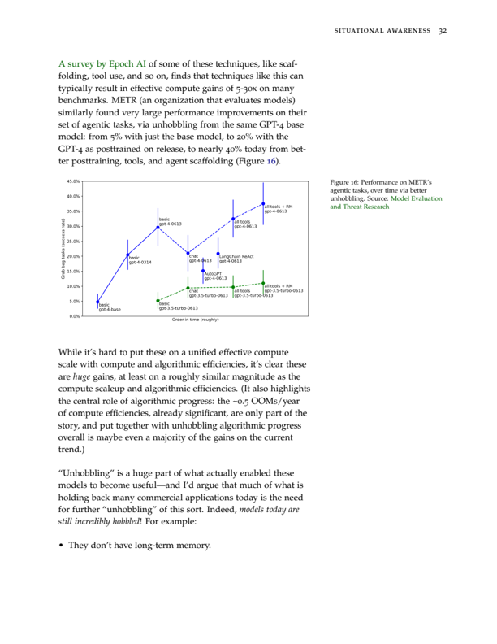
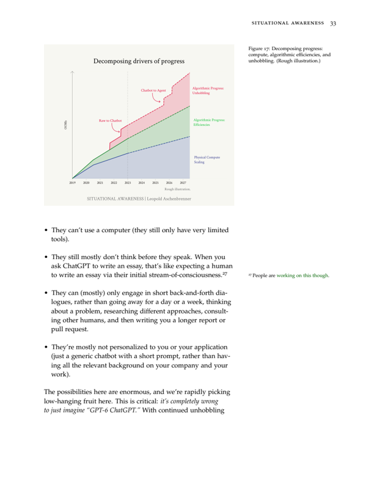
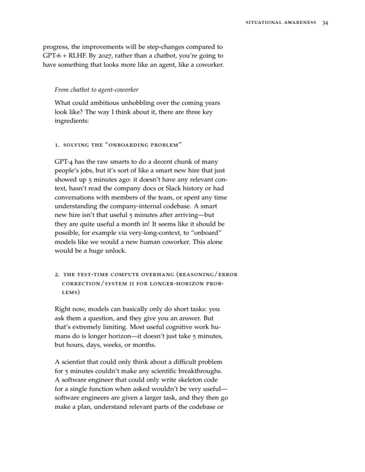

## 第二章 从 AGI 到超级智能：智能爆炸

AI 的进步不会停留在人类水平。数亿个 AGI 可以自动化 AI 研究，将十年的算法进步（5 个以上数量级）压缩到一年之内。我们将迅速从人类水平跃迁至远超人类的 AI 系统。超级智能的力量——以及危险——将是戏剧性的。

> 让我们将超智能机器定义为：一台能够远远超越任何人类所有智力活动的机器。由于设计机器本身就是这些智力活动之一，一台超智能机器可以设计出更好的机器；那时无疑将出现一场"智能爆炸"，人类的智能将被远远抛在后面。因此，第一台超智能机器将是人类最后一项需要做出的发明。
>
> ——I. J. Good（1965）

### 原子弹与氢弹

在大众想象中，冷战的恐怖主要追溯到洛斯阿拉莫斯，追溯到原子弹的发明。但原子弹本身可能被高估了。从原子弹（The Bomb）到氢弹（The Super），这一跨越也许同样重要。

在东京空袭中，数百架轰炸机向城市投下了数千吨常规炸弹。那年年末，"小男孩"投在广岛，以单枚装置释放了类似的破坏力。但仅仅 7 年后，泰勒的氢弹将当量再次放大了一千倍——单枚炸弹的爆炸威力超过了整个二战中投下的所有炸弹的总和。

原子弹只是一场更高效的轰炸行动。氢弹则是一种可以毁灭国家的装置。^32

AGI 与超级智能的关系也是如此。

AI 的进步不会停在人类水平。在最初从人类最好的棋局中学习之后，AlphaGo 开始与自己对弈——很快它就变得超越人类，下出了人类永远不会想到的极具创造性和复杂的棋步。

我们在上一章讨论了通向 AGI 的路径。一旦我们拥有了 AGI，我们将再转动一次——或两三次——曲柄，AI 系统就会变得超越人类，而且是大幅超越人类。它们将在质上比你我更聪明，聪明得多，也许就像你我比小学生聪明得多一样。

即使按照当前快速但连续的速度，跃迁到超级智能也已经足够疯狂了（如果从 GPT-4 出发，我们能在 4 年内跃迁到 AGI，那么再往后 4 年或 8 年会带来什么？）。但如果 AGI 能够自动化 AI 研究本身，这个过程可能会快得多。

一旦我们拥有 AGI，我们不会只有一个 AGI。我稍后会详细算一下数字，但：考虑到届时推理 GPU 集群的规模，我们很可能能够运行数百万个 AGI（也许是 1 亿个人类等效，且很快就能以 10 倍以上的人类速度运行）。即使它们还不能在办公室里走动或煮咖啡，它们将能够在计算机上做机器学习研究。领先的 AI 实验室不再只有几百名研究员和工程师，我们将拥有超过 10 万倍于此的力量——夜以继日地攻坚算法突破。是的，这就是递归自我改进（recursive self-improvement），但不需要科幻；它们只需要加速现有的算法进步趋势线（目前约为每年 0.5 个数量级）。

自动化 AI 研究可能将人类十年的算法进步压缩到一年之内（这似乎还是保守的）。那将是 5 个以上的数量级，在 AGI 之上再叠加一次相当于 GPT-2 到 GPT-4 的跃迁——一次相当于从学龄前儿童到聪明高中生的质性飞跃，叠加在已经和顶尖 AI 研究员/工程师一样聪明的 AI 系统之上。

有几个可能的瓶颈——包括实验算力有限、与人类的互补性、以及算法进步变得更加困难——我会逐一讨论，但没有哪个看起来足以明确减缓这一进程。

在我们意识到之前，超级智能就会出现在我们手中——远超人类的 AI 系统，能够做出我们甚至无法开始理解的新颖、创造性、复杂的行为——甚至可能是一个由数十亿个这样的系统组成的小型文明。它们的力量也将是巨大的。将超级智能应用于其他领域的研发，爆炸性进展将从单纯的机器学习研究扩展到更广阔的领域；很快它们将解决机器人问题，在几年内在其他科学和技术领域实现巨大飞跃，随后将出现一场工业爆炸（industrial explosion）。超级智能很可能提供决定性的军事优势，并释放出难以估量的破坏力量。我们将面临人类历史上最紧张、最动荡的时刻之一。

### 自动化 AI 研究

我们不需要自动化一切——只需要自动化 AI 研究。对 AGI 变革性影响的常见反对意见是，AI 很难做所有事情。比如，怀疑者说，看看机器人技术，即使 AI 在认知上达到了博士水平，那仍然会是一个棘手的问题。又或者，自动化生物学研发可能需要大量的物理实验室工作和人体实验。

但我们不需要机器人技术——我们不需要很多东西——就可以让 AI 自动化 AI 研究。领先实验室的 AI 研究员和工程师的工作完全可以虚拟完成，不会以同样的方式遇到现实世界瓶颈（虽然仍然会受到算力限制，我稍后会讨论）。而且，从全局来看，AI 研究员的工作是相当简单的：阅读机器学习文献，提出新问题或想法，实现实验来测试这些想法，解读结果，然后重复。这一切似乎完全在当前 AI 能力简单外推可及的范围内——到 2027 年底，AI 很容易达到或超越最优秀人类的水平。^33

值得强调的是，过去十年中一些最大的机器学习突破是多么直接甚至草率："哦，加个归一化就行"（LayerNorm/BatchNorm），或者"用 f(x)+x 代替 f(x)"（残差连接，residual connections），或者"修复一个实现 bug"（Kaplan → Chinchilla 缩放定律，scaling laws）。AI 研究可以被自动化。而自动化 AI 研究就足以启动非凡的反馈循环。^34

到 2027 年，我们应该预期 GPU 集群规模达到数千万级别。仅训练集群就应该接近扩大约 3 个数量级，已经达到 1000 万以上 A100 等效。推理集群应该还要大得多。（更多内容见第三章 a 节"竞逐万亿美元集群"（IIIa. Racing to the Trillion Dollar Cluster）。）

这将使我们能够运行数百万个自动化 AI 研究员的副本，也许是 1 亿个人类研究员等效（human-researcher-equivalents），夜以继日地运行。具体数字的推算涉及一些假设，包括人类"思考"速度为每分钟 100 个 token（只是一个粗略数量级估计，比如考虑你的内心独白），以及根据历史趋势和 Chinchilla 缩放定律外推，前沿模型的每 token 推理成本保持在同一数量级。^35 我们还需要保留一些 GPU 用于运行实验和训练新模型。完整计算见脚注。^36

另一种思考方式是，考虑到 2027 年的推理集群，我们应该能够每天生成相当于整个互联网的 token 量。^37 无论如何，精确数字并不重要，关键在于可行性的简单展示。

而且，我们的自动化 AI 研究员可能很快就能以远快于人类的速度运行：

- 通过接受一定的推理惩罚，我们可以用更少的副本数量换取更快的串行速度。（例如，我们可以从约 5 倍人类速度变为约 100 倍人类速度，代价是"仅仅"运行 100 万个自动化研究员副本。^38）
- 更重要的是，自动化 AI 研究员要做的第一个算法创新就是实现 10 倍或 100 倍的加速。Gemini 1.5 Flash 比最初发布的 GPT-4 快约 10 倍，^39 而这仅仅是在一年之后，在推理基准上提供了与最初发布的 GPT-4 相似的性能。如果这是几百个人类研究员在一年内能找到的算法加速，那么自动化 AI 研究员将能够很快找到类似的收益。

也就是说：在开始能够自动化 AI 研究之后不久，预期将拥有 1 亿个自动化研究员，每个都以 100 倍人类速度工作。它们每个都能在几天内完成一年的工作量。与今天领先 AI 实验室里那区区几百个可怜的（puny）人类研究员、以可怜的 1 倍人类速度工作相比，研究努力的增加将是惊人的。

这很容易大幅加速现有的算法进步趋势，将十年的进展压缩到一年之内。我们不需要假设任何全新的事物，自动化 AI 研究就可以极大地加速 AI 进步。回顾上一章的数字，我们看到算法进步是过去十年深度学习进步的核心驱动力；我们注意到仅算法效率的趋势线约为每年 0.5 个数量级，加上"解除束缚"（unhobbling）带来的额外大幅算法收益。（我认为算法进步的重要性被许多人低估了，正确认识这一点对理解智能爆炸的可能性至关重要。）

我们的数百万自动化 AI 研究员（很快以 10 倍或 100 倍人类速度工作）能否将人类研究员在十年内本应找到的算法进步压缩到一年之内？那将是一年内 5 个以上数量级。

不要只想象 1 亿个初级软件工程师实习生（我们会在更早的时候——未来几年内——得到这些）。真正的自动化 AI 研究员将非常聪明——而且除了原始数量优势之外，自动化 AI 研究员还将拥有比人类研究员更大的其他优势：

- 它们能够阅读每一篇机器学习论文，深度思考实验室曾经运行过的每一个实验，从每个副本中并行学习，并迅速积累相当于数千年的经验。它们将培养出远超任何人类的机器学习直觉。
- 它们能够轻松编写数百万行复杂代码，将整个代码库保持在上下文中，并花费人类数十年（甚至更多）的时间逐行检查和复查代码中的 bug 和优化。它们在工作的各个部分都将极其胜任。
- 你不需要逐一培养每个自动化 AI 研究员（事实上，培训和入职 1 亿名新员工将非常困难）。相反，你只需要教导和入职其中一个，然后复制即可。（而且你不需要担心办公室政治、文化适应等问题，它们将以最佳精力和专注力全天候工作。）
- 海量的自动化 AI 研究员可以共享上下文（甚至可能访问彼此的潜在空间，latent space），从而实现比人类研究员更高效的协作和协调。
- 当然，无论我们最初的自动化 AI 研究员有多聪明，我们很快就能做出进一步的数量级跃迁，生产出更聪明的模型，在自动化 AI 研究方面更加胜任。

想象一下一个自动化 Alec Radford——想象 1 亿个自动化 Alec Radford。^40 我认为 OpenAI 几乎每一位研究员都会同意：如果他们有 10 个 Alec Radford，更不用说 100 个、1000 个或 100 万个以 10 倍或 100 倍人类速度运行的 Alec Radford，他们就能非常迅速地解决大量问题。即使存在各种其他瓶颈（稍后详述），将十年的算法进步压缩到一年在我看来似乎非常合理。（用百万倍的研究努力换取 10 倍加速，这甚至可以说是保守的。）

那就是 5 个以上的数量级。5 个数量级的算法收益相当于产生了 GPT-2 到 GPT-4 跃迁的量级提升，一次从约学龄前儿童到约聪明高中生的能力跃迁。想象一下这样一种质性飞跃叠加在 AGI 之上，叠加在 Alec Radford 之上。

令人震惊的是，我们很可能非常迅速地从 AGI 走向超级智能，也许就在一年之内。

### 可能的瓶颈

虽然这个基本故事出人意料地有力——并且有扎实的经济建模工作支持——但仍存在一些真实且合理的瓶颈，可能会减缓由自动化 AI 研究驱动的智能爆炸。

我在这里给出摘要，然后在下文可选的详细章节中为感兴趣的人展开讨论：

- **算力有限**：AI 研究不仅需要好想法、思考和数学推导——还要运行实验来获取关于你想法的经验信号。通过自动化研究劳动获得百万倍的研究努力，并不意味着百倍的速度提升，因为算力仍然是有限的——实验算力有限将成为瓶颈。尽管如此，即使这不是百万倍的加速，我很难想象自动化 AI 研究员不能将算力利用效率至少提高 10 倍：它们将能够获得惊人的机器学习直觉（通读了所有 ML 文献和每一个曾经运行过的实验！），并拥有相当于几个世纪的思考时间来精确确定正确的实验方案、最优配置实验参数、最大化信息价值；它们能够花费相当于几个世纪的工程时间，在运行哪怕最微小的实验之前就避免 bug、一次做对；它们可以通过聚焦最大收益来节省算力；它们能够尝试大量小规模实验（考虑到届时有效算力的大幅提升，"小规模"意味着能够在一年内训练 10 万个 GPT-4 级别的模型来尝试架构突破）。一些人类研究员和工程师在相同算力下的产出是其他人的 10 倍——而这应该同样适用甚至更适用于自动化 AI 研究员。我确实认为这是最重要的瓶颈，我将在下文更深入地讨论。

- **互补性与长尾**：经济学的一个经典教训（参见 Baumol 的增长病，Baumol's growth disease）是，如果你可以自动化某件事的 70%，你会获得一些收益，但很快剩下的 30% 会成为你的瓶颈。对于任何未达到完全自动化的情况——比如非常好的副驾驶（copilot）——人类 AI 研究员仍将是主要瓶颈，使得算法进步速率的整体提升相对较小。此外，自动化 AI 研究可能还涉及某种能力的长尾——AI 研究员工作的最后 10% 可能特别难以自动化。这可能会使起飞（takeoff）有所减缓，但我最好的猜测是这只是将事情推迟了几年。也许是 2026/27 年的模型速度是原始自动化研究员的水平，再花一两年进行一些最终的"解除束缚"（unhobbling）、一个稍好的模型、推理加速和解决各种细节问题来实现完全自动化，最终到 2028 年获得 10 倍加速（以及到本十年末出现超级智能）。

- **算法进步的内在极限**：也许再有 5 个数量级的算法效率是根本不可能的？我对此表示怀疑。虽然肯定存在上限，^41 但如果我们在过去十年中获得了 5 个数量级，我们应该预期至少还有十年的进步是可能的。更直接地说，当前的架构和训练算法仍然非常原始，似乎应该有更高效的方案。生物学的参考基准也支持更高效的算法是合理的。

- **想法越来越难找到，因此自动化 AI 研究员只会维持而不是加速当前进步速度**：有一种反对意见认为，虽然自动化研究将大幅增加有效研究努力，但想法也变得越来越难找到。也就是说，虽然今天只需要一个实验室的几百名顶尖研究员就能维持每年 0.5 个数量级的速度，但随着低垂果实被摘光，维持这一进步将需要越来越多的努力——因此 1 亿个自动化研究员仅仅是为了维持进步所必需的。我认为这个基本模型是正确的，但经验数据不支持：研究努力的增加幅度——百万倍——远远大于维持进步所需研究努力的历史增长趋势。用经济建模术语来说，假设自动化带来的研究努力增加恰好足以保持进步速度不变，这是一个奇怪的"刀锋假设"（knife-edge assumption）。

- **想法越来越难找到且存在边际收益递减，因此智能爆炸会迅速熄火**：与上述反对意见相关，即使自动化 AI 研究员带来了最初的进步爆发，快速进步能否持续取决于算法进步的边际收益递减曲线的形状。再一次，我对经验证据的解读是，指数参数倾向于支持爆发性/加速性进步。无论如何，一次性提升的巨大规模——从几百人到数亿 AI 研究员——很可能克服了边际收益递减，至少足以产生相当数量级的算法进步，尽管它当然不能无限自我维持。

总体而言，这些因素可能会在一定程度上减缓进展：最极端的智能爆炸版本（比如一夜之间）似乎不太可能。它们可能导致一个稍长的准备期（也许我们需要额外等一两年，从较慢的原始自动化研究员过渡到真正的自动化 Alec Radford，然后事情才全面启动）。但它们当然不排除非常快速的智能爆炸。在一年之内——或至多几年，但也许甚至只是几个月——从完全自动化的 AI 研究员到远超人类的 AI 系统，这应该是我们的主线预期。

如果你想跳过下面关于各种瓶颈的深入讨论，点击这里跳到下一节。

### 实验算力有限（可选，更深入）

算法进步的生产函数包括两个互补生产要素：研究努力（research effort）和实验算力（experiment compute）。数百万自动化 AI 研究员不会比人类 AI 研究员拥有更多算力来运行实验；也许它们只会坐在那里等待任务完成。

这可能是智能爆炸最重要的瓶颈。归根结底这是一个定量问题——瓶颈到底有多大？总体而言，我很难相信 1 亿个 Alec Radford 不能将实验算力的边际产出提高至少 10 倍（从而仍然能将进步速度加速 10 倍）：

- 用较少的算力可以做很多事。大多数 AI 研究的方式是：你在小规模上测试想法，然后通过缩放定律外推。（许多关键的历史突破只用了非常少的算力，例如原始 Transformer 仅在 8 块 GPU 上训练了几天。）注意，在未来四年内基线算力提升约 5 个数量级后，"小规模"将意味着 GPT-4 级别——自动化 AI 研究员将能够在一年内在训练集群上运行 10 万个 GPT-4 级别的实验，以及数千万个 GPT-3 级别的实验。（这意味着它们可以测试大量潜在的突破性新架构！）

- 大量算力花在了最终预训练运行的大规模验证上——确保你对年度主打产品的边际效率收益有足够高的置信度——但如果你在智能爆炸中飞速穿越数量级，你可以节省这些，只专注于真正巨大的收益。

- 如上一章所讨论，从相对低算力的模型"解除束缚"（unhobbling）中常常可以获得巨大的收益。这些不需要大规模的预训练运行。智能爆炸很可能从自动化 AI 研究开始，例如发现一种进行强化学习（RL）的方法，通过"解除束缚"收益给我们带来几个数量级（然后我们就进入了加速轨道）。

- 随着自动化 AI 研究员找到效率提升，它们就能运行更多的实验。回忆一下上一章讨论的内容：在两年内，同等 MATH 性能的推理成本降低了近 1000 倍，过去一年通用推理收益约 10 倍——这仅仅是来自人类水平的算法进步。自动化 AI 研究员要做的第一件事就是迅速找到类似的收益，反过来，这将使它们能够运行 100 倍更多的实验，例如在新型 RL 方法上的实验。或者，它们能够迅速在相关领域制造性能相似但更小的模型（参见前文讨论的 Gemini Flash，比 GPT-4 便宜近 100 倍），反过来，这将使它们能够用这些更小的模型运行更多实验（再次想象用这些来尝试不同的 RL 方案）。可能还有其他悬置收益（overhangs），例如自动化 AI 研究员可能能够迅速开发出更好的分布式训练方案来利用所有推理 GPU（仅此一项可能就增加了 10 倍算力）。更一般地说，它们找到的每一个数量级的训练效率提升，都将为它们提供一个数量级更多的有效算力来运行实验。

- 自动化 AI 研究员可能效率高得多。如果你一次就做对了——没有棘手的 bug，对要运行的内容更加精挑细选——那么你需要运行的实验数量会少到什么程度，很难说。想象一下 1000 个自动化 AI 研究员花一个月等效时间检查你的代码，并在你按下开始之前把实验方案调到完美。我问过一些 AI 实验室的同事，他们同意：如果你能避免不必要的 bug、一次做对、只运行高信息价值的实验，在大多数项目上你应该可以轻松节省 3 到 10 倍的算力。

- 自动化 AI 研究员可能拥有远超人类的直觉。最近，我与一家前沿实验室的实习生交谈；他们说过去几个月的主要经历是：提出许多他们想运行的实验，而他们的导师（一位资深研究员）说他们已经可以预测结果了，所以没有必要。这位资深研究员多年随意实验、反复摆弄模型的经验，磨炼了他们关于什么想法可行或不可行的直觉。同样，我们的 AI 系统似乎很容易获得超越人类的机器学习实验直觉——它们将读过所有机器学习文献，能够从每一个其他实验结果中学习并深入思考，它们可以轻易被训练来预测数百万个机器学习实验的结果，等等。也许它们做的第一件事就是建立起一门扎实的基础科学："在看到训练的前 1% 之后就预测这个大规模实验是否会成功"，或"在看到小规模版本之后预测这个实验的结果"等等。

- 而且，正如 Jason Wei 所指出的，在对实验的几十个超参数和细节拥有出色直觉方面，回报是惊人的。Jason 将这种基于直觉一次做对的能力称为"yolo runs"。（Jason 说，"我所知道的是，能做到这一点的人肯定是 10-100 倍的 AI 研究员。"）

算力瓶颈意味着百万倍的研究员不会直接转化为百万倍的研究速度——因此不会是隔夜智能爆炸。但自动化 AI 研究员将拥有远超人类研究员的非凡优势，因此很难想象它们不能找到方法将算力利用效率至少提高 10 倍——因此 10 倍的算法进步速度似乎是完全合理的。

我在此需要花一点时间回应我听过的最有力的反论表述，来自我的朋友 James Bradbury：如果更多的机器学习研究努力真的会如此大幅加速进步，为什么当前的学术机器学习研究界——人数至少以万计——对前沿实验室的进步贡献如此之少？（目前看来，各实验室内部团队——全部加起来可能约一千人——承担了前沿算法进步的大部分工作。）他的论点是，原因是算法进步是算力瓶颈的：学术界根本没有足够的算力。

**一些回应：**

- 质量调整后，我认为学术界可能更多是数千人而不是数万人（例如只看顶尖大学）。这可能并不比各实验室加起来多多少。（而且这远远少于自动化 AI 研究带来的数亿研究员。）
- 学术界在错误的方向上努力。直到最近（也许今天仍然如此？），绝大多数机器学习学术界甚至没有在研究大语言模型。就学术界的强学者中在研究大语言模型的而言，人数可能明显少于各实验室加起来的人数？
- 即使学术界确实研究 LLM 预训练等问题，他们也无法接触到前沿水平——实验室内部积累的关于前沿模型训练的大量细节知识。他们不知道什么问题才真正相关，或者只能贡献一次性的结果，因为他们的基线调得不好（所以没人知道他们的东西是否真的是改进），导致没人能真正使用这些结果。
- 学术界远不如自动化 AI 研究员：它们不能以 10 倍或 100 倍人类速度工作，不能阅读和内化所有已发表的 ML 论文，不能花十年时间检查每一行代码，不能自我复制以避免入职瓶颈，等等。

另一个反驳学术界论点的例子：据传 GDM（Google DeepMind）比 OpenAI 拥有更多的实验算力，但 GDM 在算法进步方面似乎并没有大幅领先于 OpenAI。

总体而言，我预期自动化研究员将发展出一种不同的研究风格，这种风格发挥它们的优势并旨在缓解算力瓶颈。我认为对结果如何展开保持不确定是合理的，但仅仅因为这对人类来说很难做到，就无法确信模型无法绕过算力瓶颈，这是不合理的。

- 例如，它们可以在早期投入大量努力来建立"如何从小规模实验预测大规模结果"的基础科学。我预计它们可以做很多人类做不到的事情，例如更像"仅仅在看到训练的前 1% 之后就预测这个大规模实验是否会成功"之类的事情。如果你是一个非常强大的自动化研究员，拥有远超人类的直觉，这似乎相当可行，并且可以节省大量算力。

- 当我设想 AI 系统自动化 AI 研究时，我看到它们受到算力瓶颈约束，但在很大程度上通过比人类思考多 1000 倍（且更快）、以比人类更高的质量思考（例如由于经过训练来预测数百万实验结果的超人类 ML 直觉）来弥补。除非它们在思考方面远差于工程方面，否则我认为这可以弥补很多，而这将与学术界有质的区别。

（除实验算力外，还存在最终需要运行大型训练运行的额外瓶颈，目前这需要几个月。但你可能可以在这方面也节省，在智能爆炸的一年内只做少数几次大型训练运行，每次的数量级跳跃比实验室目前所做的更大。^42 或者你可以从 5 个数量级的算力效率收益中"花掉"1 个数量级，让最大的训练运行在几天而不是几个月内完成。）

### 互补性与实现 100% 自动化的长尾（可选，更深入）

经济学家的经典反对 AI 自动化加速经济增长的意见是，不同的任务是互补的：例如，自动化了 1800 年人类劳动所做的事的 80%，并没有导致增长爆炸或大规模失业，而是剩下的 20% 成为了所有人类所做的工作，并仍是瓶颈。（参见这里的一个模型。）

我认为经济学家的模型在这里是正确的。但关键点是，我只在谈论经济中目前很小的一部分，而不是整个经济。人们在这段时间可能还在正常理发——机器人技术可能还没有解决，各个领域的 AI 可能还没有搞定，社会推广可能还没解决等等——但它们将能够做 AI 研究。如上一章所讨论，我认为当前的 AI 进步轨迹正在将我们带向可以充当远程工作者、与最聪明人类一样聪明的系统；如本章所讨论，AI 研究员的工作似乎完全在可以被完全自动化的范围之内。

但在实践中，我确实预期在达到 AI 研究员/工程师这一工作真正 100% 自动化之前会有一个长尾；例如，我们可能首先获得几乎可以替代工程师的系统，但仍需要一定程度的人类监督。

特别是，我预计 AI 能力的水平在不同领域是不均匀的、有尖峰的：它在编码方面可能比最好的工程师还要好，但在某些任务的子集或技能上仍然有盲点；当它的最短板达到人类水平时，在更容易训练的领域（如编程）它已经大大超越人类了。（这就是为什么我认为它们将能够比人类研究员更有效地利用算力。到 100% 自动化/智能爆炸开始之时，它们已经在某些领域拥有对人类的巨大优势。这也对未来的超级对齐有重要影响，因为这意味着我们必须对齐那些在许多领域已经明显超越人类的系统，才能对齐哪怕第一批自动化 AI 研究员。）

但我不认为这个阶段会持续超过几年；考虑到 AI 进步的速度，我认为很可能只需要一些额外的"解除束缚"（unhobbling）——消除阻止模型完成最后一步的某个明显限制——或者下一代模型就能走完全程。

总体而言，这可能会让起飞有所减缓。不是 2027 AGI → 2028 超级智能，而可能更像：

- 2026/27：原始自动化工程师（proto-automated-engineer），但在其他领域有盲点。已经将工作加速 1.5-2 倍；进步开始逐渐加速。
- 2027/28：原始自动化研究员（proto-automated-researchers），可以自动化 >90%。仍存在一些人类瓶颈，以及协调一个庞大的自动化研究员组织的各种问题需要解决，但这已经将进步加速 3 倍以上。这很快完成了剩余的"解除束缚"，将我们带到 100% 自动化。
- 2028/29：10 倍以上的进步速度 → 超级智能。

这仍然非常快……

### 算法进步的根本极限（可选，更深入）

算法进步能走多远可能存在真正的物理上限。（例如，25 个数量级的算法进步似乎不可能，因为那意味着能在不到约 10 次浮点运算中训练出 GPT-4 级别的系统。^43）但大约 5 个数量级似乎完全在可能范围之内；再说一次，这只是需要又一个十年的趋势线算法效率提升（甚至不算"解除束缚"带来的算法收益）。

直觉上，我们似乎还远没有摘光所有低垂果实，考虑到最大突破是多么简单——以及当前架构和训练技术看起来是多么初级和明显有束缚。例如，我认为我们很可能通过"大声思考"（chain-of-thought，思维链）的 AI 系统来实现 AGI。但这肯定不是最有效的方式，肯定有一种通过内部状态/循环（recurrence）等来进行推理的方式会高效得多。再考虑自适应计算（adaptive compute）：Llama 3 在预测"and"这个 token 上花费的算力与回答某个复杂问题时一样多，这显然是次优的。我们仅仅通过小调整就获得了巨大的数量级算法收益，而还有几十个领域可能会找到更高效的架构和训练程序。

生物学的参考基准也支持巨大的提升空间。人类智慧的区间非常宽广，例如，只是架构上的微小调整就产生了巨大差异。人类的神经元数量与其他动物相似，尽管人类比那些动物聪明得多。而且当前 AI 模型距离人脑的效率还有许多个数量级；人脑能以比 AI 模型少得多的数据（从而少得多的"算力"）学习，这意味着我们的算法和架构仍有巨大进步空间。

### 想法越来越难找到与边际收益递减（可选，更深入）

当低垂果实被摘光后，想法越来越难找到。这在任何技术进步的领域都是如此。本质上，我们在对数-对数曲线上看到一条直线：log(进步) 是 log(累计研究努力) 的函数。每一个数量级的进一步进步都需要比上一个数量级投入更多的研究努力。

这引出了对智能爆炸的两种反对意见：

1. 自动化 AI 研究将仅仅是为了维持进步所必需的（而不是大幅加速进步）。
2. 纯粹的算法智能爆炸不会持续/会迅速熄火，因为算法进步越来越难找到/你遇到边际收益递减。

在过去研究经济学时（特别是，半内生增长理论（semi-endogenous growth theory）是技术进步的标准模型，捕捉了研究努力增长和想法越来越难找到这两个相互竞争的动态），我花了很多时间思考这类模型。

简而言之，我认为这些反对意见背后的模型在逻辑上是正确的，但它如何展开是一个经验问题——而且我认为它们搞错了经验数据。

关键问题实质上是：每进步 10 倍，进一步的进步会变得比 10 倍更难还是更简单？粗略的餐巾纸计算（沿用了经济学文献中的方法）帮助我们界定这个问题。

- 假设我们认真对待每年约 0.5 个数量级的算法进步趋势率；这意味着 4 年内进步 100 倍。
- 然而，一家领先 AI 实验室在质量调整后的员工人数/研究努力在 4 年内增长肯定远小于 100 倍。也许是增长了 10 倍（从几十人到几百人在实验室做相关工作），但即使这个数字在质量调整后也不确定。
- 然而，算法进步似乎仍在持续。

因此，在回应反对意见 1 时，我们可以指出：约百万倍的研究努力增加将远远大于仅仅维持进步所需的量。也许在 4 年内需要数千名研究员在实验室从事相关研究才能维持进步；1 亿 Alec Radford 仍然是一个巨大的增加，肯定会导致大幅加速。认为自动化研究将恰好足以维持现有进步速度，这只是一个奇怪的"刀锋假设"。（而且这还没有算上以 10 倍人类速度思考以及 AI 系统相对于人类研究员的所有其他优势。）

在回应反对意见 2 时，我们可以指出两点：

- 首先，上述数学条件。基于我们粗略的计算，质量调整后的研究努力增长远小于 100 倍，而我们实现了 100 倍的算法进步，因此收益曲线的形状相当有力地支持自我持续进步。^44
- 其次，收益曲线甚至不需要支持完全持续的连锁反应，我们就可以获得一次有界但多数量级的算法进步爆发。本质上，它不需要是"增长效应"（growth effect）；一个足够大的"水平效应"（level effect）就足够了。也就是说，百万倍的研究努力增加（加上自动化研究员相对于人类研究员拥有的许多其他优势）将是一个如此巨大的一次性推动，即使连锁反应不是完全自我持续的，也可以导致非常可观（许多数量级）的一次性收益。^45

总体而言，虽然显然它不是无界的，而且我对它能走多远有大量不确定性，但我认为仅从算法收益/自动化 AI 研究就能产生约 5 个数量级的智能爆炸，这似乎是高度合理的。

Tom Davidson 和 Carl Shulman 也在增长建模框架中审视了这些经验数据，得出了类似的结论。Epoch AI 最近也做了一些关于经验数据的工作，同样得出算法研发的经验回报有利于爆发性增长的结论，并附有对其含义的有益阐述。

### 超级智能的力量

无论你是否同意这些论点的最强形式——无论我们得到的是不到一年还是几年的智能爆炸——有一点是明确的：我们必须正视超级智能的可能性。

到本十年末，我们可能拥有的 AI 系统将是难以想象的强大。

- 当然，它们将在数量上超越人类。到本十年末，凭借数亿块 GPU 的集群，我们将能够运行由数十亿个 AI 系统组成的文明，它们将能够以比人类快几个数量级的速度"思考"。它们将能迅速掌握任何领域，编写数万亿行代码，阅读每一个科学领域曾经写下的每一篇研究论文（它们将是完美的跨学科学者！），并在你还没读完一篇论文摘要的时候就写出新的论文，从每个副本的并行经验中学习，在几周内就某个新创新积累数十亿人类等效年的经验，以最佳精力和专注力 100% 的时间工作，不会被那个掉队的队友拖慢进度，等等。

- 更重要的是——但更难想象——它们将在质上超越人类。作为一个狭义例子，大规模强化学习（RL）运行已经能够产生完全新颖且超越人类理解的创造性行为，例如 AlphaGo 对李世石那著名的第 37 手（move 37）。超级智能在许多领域都将如此。它将找到人类代码中对任何人来说都过于细微而无法注意到的漏洞（exploit），它将生成对任何人来说都过于复杂而无法理解的代码——即使模型花几十年去尝试解释。对人类来说极其困难、可能几十年都卡住的科学和技术问题，对它们来说将显得一目了然。我们将像困在牛顿物理学中的高中生，而它们已经在探索量子力学。

作为这一切可以有多疯狂的一个例子，看看一些电子游戏速通的 YouTube 视频，比如这个在 20 秒内通关 Minecraft 的视频。（如果你完全看不懂这个视频里发生了什么，你并不孤单；即使大多数普通 Minecraft 玩家也几乎搞不清发生了什么。）

现在想象这被应用于所有科学、技术和经济领域。当然，这里的误差范围非常大。尽管如此，这一切正在发生，而认真考虑这将有多么重大的意义是重要的。

在智能爆炸中，爆炸性进展最初仅限于自动化 AI 研究这一狭窄领域。随着我们获得超级智能，并将我们的数十亿（现在是超级智能的）智能体（agents）应用于许多领域的研发，我预期爆炸性进步将扩大：

- **AI 能力爆炸**。也许我们最初的 AGI 有一些限制，阻止了它们完全自动化其他领域的工作（而不只是 AI 研究领域）；自动化 AI 研究将迅速解决这些限制，从而实现对任何和所有认知工作的自动化。
- **解决机器人问题**。超级智能不会长时间停留在纯粹认知层面。让机器人良好工作主要是一个机器学习算法问题（而非硬件问题），而我们的自动化 AI 研究员很可能能够解决它（详见下文！）。工厂将从人类运营，变为 AI 指导使用人类体力劳动，再变为很快完全由机器人大军运营。
- **大幅加速科学和技术进步**。是的，仅靠爱因斯坦无法发展神经科学和建立半导体产业，但十亿个超级智能的自动化科学家、工程师、技术专家和机器人技术员（机器人以 10 倍或以上人类速度移动！）^46 将在几年内在许多领域取得非凡的进展。（这里有一篇不错的短篇小说，可视化了 AI 驱动的研发可能是什么样子。）十亿个超级智能将能够把人类研究员在下个世纪本应完成的研发努力压缩到几年内。想象一下，如果 20 世纪的技术进步被压缩到不到十年之内。我们将在几年内从认为飞行是妄想，到飞机，再到人类登上月球和洲际导弹。这就是我预期 2030 年代在科学技术领域将发生的事情。
- **工业与经济爆炸**。极度加速的技术进步，加上自动化所有人类劳动的能力，可能大幅加速经济增长（想想自我复制的机器人工厂迅速覆盖整个内华达沙漠^47）。增长率的提升可能不仅仅是从每年 2% 到 2.5%；相反，这将是一次增长体制的根本性转变，更像工业革命带来的从缓慢增长到每年几个百分点的历史性跃迁。我们可能看到 30%/年及以上的经济增长率，很可能一年内多次翻倍。这相当直接地源自经济学家的经济增长模型。当然，这很可能因社会摩擦而延迟；晦涩的监管可能确保律师和医生仍需要是人，即使 AI 系统在这些工作上做得好得多；随着社会抵制变革的步伐，肯定会有沙子被扔进快速扩张的机器人工厂的齿轮中；也许我们希望保留人类保姆；所有这些都会降低总体 GDP 统计数字的增长。然而，在我们解除人为障碍的任何领域（例如，竞争可能迫使我们为军事生产这样做），我们将看到一场工业爆炸。

| 增长模式 | 开始主导的日期 | 全球经济翻倍时间（年） |
|----------|--------------|---------------------|
| 狩猎 | 公元前 2,000,000 年 | 230,000 |
| 农业 | 公元前 4700 年 | 860 |
| 科学/商业 | 公元 1730 年 | 58 |
| 工业 | 公元 1903 年 | 15 |
| 超级智能？ | 公元 2030 年？ | ??? |

- **提供决定性的压倒性军事优势**。即便只是早期认知层面的超级智能可能就足够了；也许某种超人类黑客方案就能使敌方军队丧失战斗力。无论如何，军事力量与技术进步在历史上紧密相连，而随着极其快速的技术进步，将伴随相应的军事革命。无人机蜂群和机器人军队将是一件大事，但它们只是开始；我们应该期待完全新型的武器，从新型大规模杀伤性武器到无懈可击的激光导弹防御系统，再到我们还无法想象的东西。相较于超级智能之前的军火库，这就像 21 世纪的军队与 19 世纪骑马持刺刀的旅作战。（我在后面的章节讨论超级智能如何可能带来决定性的军事优势。）
- **能够推翻美国政府**。控制超级智能的人很可能拥有足够的力量从超级智能之前的力量手中夺取控制权。即使没有机器人，这个由超级智能组成的小型文明也能够入侵任何未加防护的军事、选举、电视等系统，狡猾地说服将军和选民，在经济上超越民族国家，设计新型合成生物武器然后付比特币让人类合成它，等等。在 16 世纪初，Cortes 和约 500 名西班牙人征服了数百万人口的阿兹特克帝国；Pizarro 和约 300 名西班牙人征服了数百万人口的印加帝国；Alfonso 和约 1000 名葡萄牙人征服了印度洋。他们并没有神一般的力量，但旧世界的技术优势加上战略和外交智谋的优势，带来了完全决定性的胜利。超级智能可能看起来与此类似。

**机器人**。对上述说法的常见反对意见是，即使 AI 可以做认知任务，机器人技术远远落后，因此将成为对任何现实世界影响的刹车。

我曾经对这个观点有同感，但我已经确信机器人不会是障碍。多年来人们声称机器人是硬件问题——但机器人硬件正在走向解决。

越来越清楚的是，机器人是一个机器学习算法问题。LLM 有一条容易得多的启动路径：你有整个互联网来进行预训练。机器人动作没有类似的大规模数据集，因此需要更巧妙的方法（例如使用多模态模型作为基础，然后使用合成数据/仿真/巧妙的强化学习，synthetic data/simulation/clever RL）来训练它们。

图 26：爆发性增长始于 AI 研发这一较窄领域；随着我们将超级智能应用于其他领域的研发，爆发性增长将扩大。

现在有大量精力投入解决这个问题。但即使我们在 AGI 之前没有解决它，我们的数亿个 AGI/超级智能将是出色的 AI 研究员（这是本章的核心论点！），它们很可能将找到让出色机器人工作起来的机器学习方法。

因此，虽然有可能机器人会导致几年的延迟（解决机器学习问题，以比仿真中测试更慢的方式在物理世界中测试，在机器人能自己建造工厂之前启动最初机器人生产，等等）——但我不认为会超过这个时间。

这一切在 2030 年代将如何展开很难预测（是另一个时间的故事）。但至少有一点是明确的：我们将被迅速推入人类有史以来面对的最极端局势。

人类水平的 AI 系统，AGI，本身就将具有巨大影响——但在某种意义上，它们不过是我们已知事物的更高效版本。然而，很可能在仅仅一年之内，我们将过渡到远为异类的系统，这些系统的理解和能力——它们的原始力量——将超过甚至全人类的总和。存在一种真实的可能性，即我们将失去控制，在这场快速过渡中被迫将信任交给 AI 系统。

更一般地说，一切将开始发生得无比迅速。世界将开始变得疯狂。假设我们在仅仅几年内经历了 20 世纪的地缘政治高潮和人为危险；这就是我们应该预期的后超级智能时代的局势。到这一切结束时，超级智能 AI 系统将管理我们的军事和经济。在所有这些疯狂之中，我们用来做出正确决定的时间将极其稀少。挑战将是巨大的。我们需要全力以赴才能完整地度过这一切。

智能爆炸和紧随超级智能之后的时期，将是人类历史上最动荡、最紧张、最危险和最疯狂的时期之一。

而到本十年末，我们很可能正身处其中。

正视智能爆炸——超级智能的出现——的可能性，常常与早期围绕核链式反应可能性——以及它将带来的原子弹——的辩论相呼应。H.G. 威尔斯在 1914 年的一部小说中预言了原子弹。当 Szilard 在 1933 年首次构想链式反应的概念时，他无法说服任何人；那只是纯理论。一旦裂变在 1938 年被经验证实，Szilard 再次警觉并强烈主张保密，少数人开始意识到炸弹的可能性。爱因斯坦没有考虑过链式反应的可能性，但当 Szilard 与他当面对质时，他迅速看到了含义并愿意做任何需要做的事情；他愿意发出警报，并且不怕显得愚蠢。但 Fermi、Bohr 和大多数科学家认为"保守"的做法是淡化处理，而不是认真对待炸弹可能性带来的非凡含义。保密（以避免与德国人分享进展）和其他全力以赴的努力在他们看来是荒谬的。链式反应听起来太过疯狂。（即使事实上，距离炸弹成为现实只有不到五年的时间。）

我们必须再次正视链式反应的可能性。也许它对你来说听起来像是推测。但在 AI 实验室的资深科学家中，许多人认为快速的智能爆炸是令人震惊地可能的。他们能看到它。超级智能是可能的。

---

**脚注：**

^32 冷战的许多荒谬之处（参见 Daniel Ellsberg 的书）源于仅仅将原子弹替换为氢弹，而没有根据大规模能力提升来调整核政策和战争计划。

^33 AI 研究员的工作也是 AI 实验室的 AI 研究员们最了解的工作——因此他们特别能直观地知道如何优化模型来完成这项工作。而且将有巨大的激励这样做，以帮助加速他们的研究和所在实验室的竞争优势。

^34 这也暗示了关于 AI 风险排序的一个重要观点。人们经常指出的一个 AI 威胁模型是 AI 系统开发出新型生物武器并构成灾难性风险。但如果 AI 研究比生物研发更容易自动化，我们可能在极端 AI 生物威胁出现之前就经历了智能爆炸。这很重要，例如，关于我们是否应该在事情变得疯狂之前预期看到"生物警告信号"。

^35 如前所述，GPT-4 的 API 在今天的成本比 GPT-3 发布时更低——这表明推理效率提升的趋势足够快，即使模型变得更强大，推理成本也大致保持不变。同样，仅在 GPT-4 发布后的一年内，推理成本就有了巨大下降；例如，当前版本的 Gemini 1.5 Pro 在性能上超过原始 GPT-4，同时便宜约 10 倍。

我们也可以更具体地通过 Chinchilla 缩放定律来推理。根据 Chinchilla 缩放定律，模型规模——从而推理成本——随训练成本的平方根增长，即有效算力扩大的一半数量级。然而，在前一章中，我提出算法效率进步的速度与算力扩大大致相同，即它贡献了有效算力扩大的大约一半数量级。如果这些算法收益也转化为推理效率，那么意味着算法效率提升将补偿推理成本的理论增加。

在实践中，训练算力效率的提升通常但不总是转化为推理效率收益。然而，也存在许多单独的推理效率收益，它们不是训练效率收益。因此，至少在大致数量级上，假设前沿模型的美元/token 成本保持大致相似的假设并不疯狂。

（当然，它们将使用更多 token，即更多测试时计算（test-time compute）。但这已经是这里计算的一部分，将人类等效定价为每分钟 100 token。）

^36 GPT-4 Turbo 约为 $0.03/1K token。我们假设将拥有数千万 A100 等效 GPU，如果按 A100 等效计算，每 GPU 每小时约 $1。如果我们用 API 成本将 GPU 转换为生成的 token，这意味着数千万 GPU × $1/GPU-小时 × 33K token/$ = 约一万亿 token/小时。假设人类每分钟思考 100 token，这意味着一个人类等效为每小时 6,000 token。一万亿 token/小时除以 6,000 token/人-小时 = 约 2 亿人类等效——即相当于 2 亿个人类研究员夜以继日地运行。（即使我们将一半 GPU 保留用于实验算力，我们也有 1 亿人类研究员等效。）

^37 前一个脚注估计约 1 万亿 token/小时，即 24 万亿 token/天。在上一章中，我提到公开的去重 CommonCrawl 大约有 30 万亿 token。

^38 Jacob Steinhardt 估计，一个模型的 k³ 个并行副本可以替换为一个快 k² 倍的单一模型，基于推理权衡的某种平铺方案（tiling scheme）的数学（理论上即使 k 为 100 或更大也成立）。假设初始速度已经是约 5 倍人类速度（基于 GPT-4 发布时的速度）。那么，通过接受这个推理惩罚（k=约 5），我们将能够以约 100 倍人类速度运行约 100 万个自动化 AI 研究员。

^39 此来源基准测试 Flash 的吞吐量约为 GPT-4 Turbo 的 6 倍，而 GPT-4 Turbo 比原始 GPT-4 更快。延迟可能也大约快 10 倍。

^40 Alec Radford 是 OpenAI 一位极具天赋和成果丰硕的研究员/工程师，在许多最重要的进展背后发挥了关键作用，尽管他相对低调。

^41 例如，在 GPT-4 之上再增加 25 个数量级的算法进步显然是不可能的：那意味着可以用极少几次浮点运算训练出一个 GPT-4 级别的模型。

^42 注意，虽然我认为这很可能，但这其实有些可怕：这意味着下游模型的智能可能更加离散/不连续，而不是每一代模型都比上一代稍好一些的相当连续的系列。在智能爆炸期间我们可能只做一次或少数几次大型训练运行，每次将小规模发现的好几个数量级的算法突破一次兑现。

^43 不过用当前架构，你可以获得需要再增加 25 个数量级的硬件才能达到的结果！

^44 100 倍进步 → 100 倍自动化研究努力，但你只需要 10 倍更多的研究努力就能持续下去并完成下一个 100 倍，因此收益曲线形状足够有利于爆发性进步得以持续。

^45 类似地，在半内生经济增长理论中，将科学投资从 GDP 的 1% 提高到 20% 不会使增长率永远更高——最终边际收益递减会导致事物回到旧的增长率——但它带来的"水平效应"将如此之大，以至于显著加速了数十年的增长。

^46 以 10 倍速度的机器人在现实世界中进行物理研发是"慢速版本"；实际上，超级智能将尽可能在仿真中进行研发，例如 AlphaFold 或制造"数字孪生"（digital twins）。

^47 为什么今天的"异星工厂世界"（factorio-world）——建造一个工厂，生产更多工厂，再生产更多工厂，工厂翻倍直到最终整个星球迅速被工厂覆盖——不可能实现？因为劳动受约束：你可以积累资本（工厂、工具等），但这会遇到边际收益递减，因为受固定劳动力约束。有了能够完全自动化劳动的机器人和 AI 系统，这个约束就解除了；机器人工厂可以以约无约束的方式生产更多机器人工厂，导致工业爆炸。更多经济增长模型见这里。
