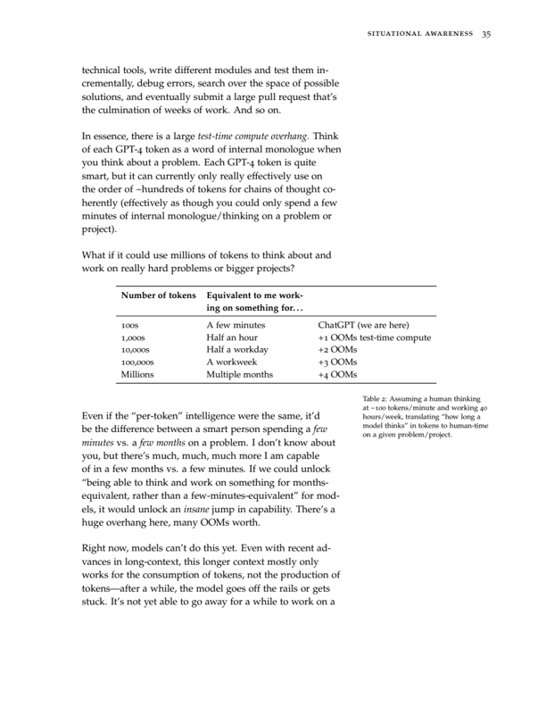
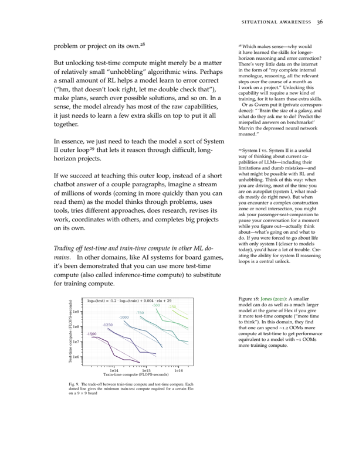
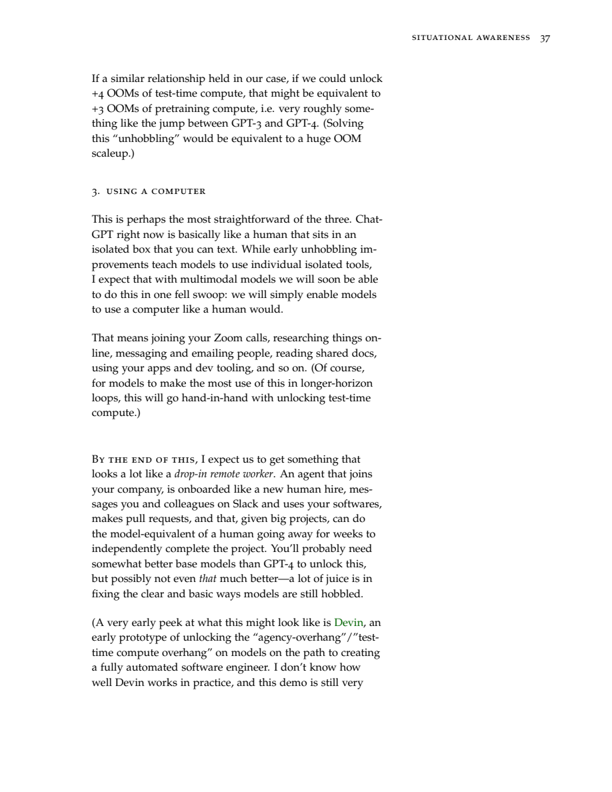
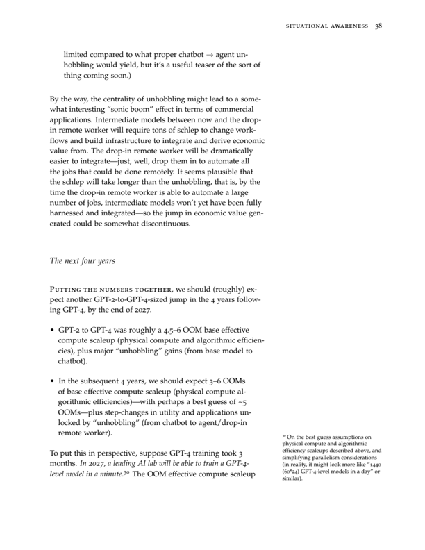
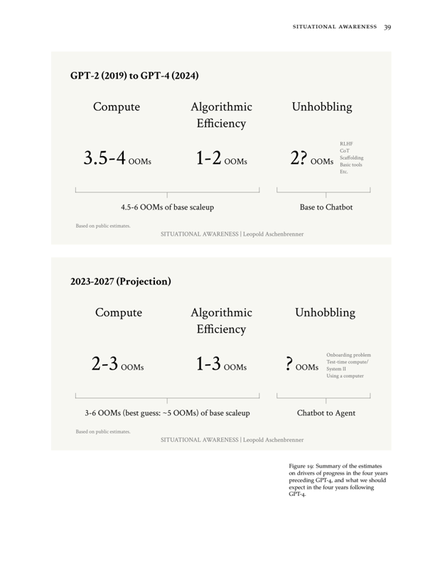
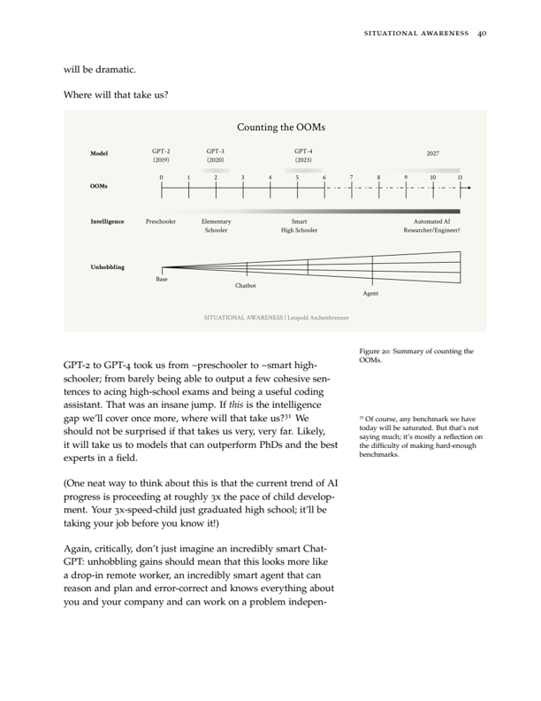
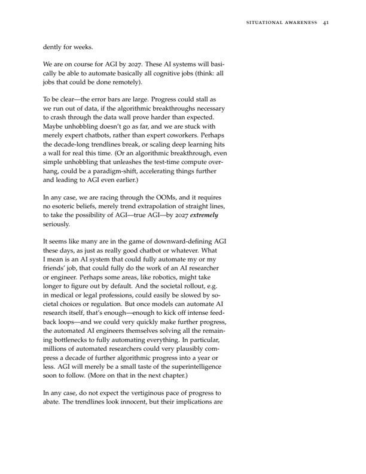
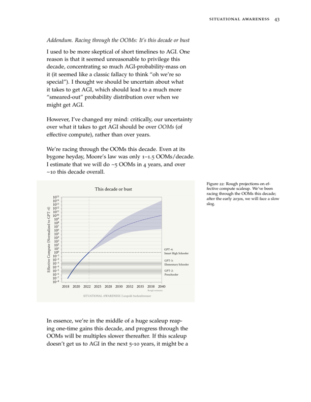
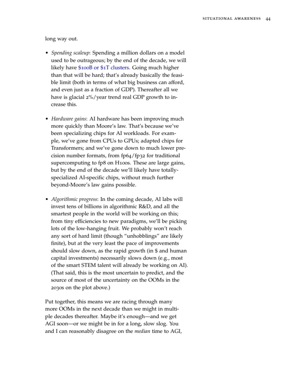

## III. 挑战

## IIIa. 冲向万亿美元集群

一场空前规模的技术-资本加速已经启动。随着 AI 收入的快速增长，在本十年结束之前，数万亿美元将涌入 GPU、数据中心和电力基础设施建设。这场工业动员——包括将美国电力产量提升数十个百分点——将是激烈的。

> 你看，我早就说过，不把整个国家变成工厂，这事干不成。你们还真就这么干了。
>
> —— 尼尔斯·玻尔（Niels Bohr），1944 年在得知曼哈顿计划的规模后对爱德华·泰勒（Edward Teller）说

通往 AGI 的竞赛不会只在代码中和笔记本电脑前展开——它将是一场动员美国工业力量的竞赛。与硅谷近年来产出的任何东西都不同，AI 是一个庞大的工业过程：每个新模型都需要一个巨大的新集群，很快还需要巨型新电厂，最终还需要新的巨型芯片制造厂。所涉及的投资额令人震惊。但在幕后，这些已经在进行中。

在本章中，我将带你过一遍数字，让你对这些意味着什么有个直观感受：

- 随着 AI 产品收入快速增长——到 2026 年左右，Google 或 Microsoft 这类公司的 AI 年化收入（annual run rate）有望达到 1000 亿美元，此时用的还是强大但尚未达到 AGI 的系统——

图 27：万亿美元集群。图片来源：DALL·E。

- 这将激发越来越大的资本动员，到 2027 年，AI 总投资可能超过每年 1 万亿美元。

- 我们正走在到 2028 年单个训练集群耗资数千亿美元的路上——这些集群所需的电力相当于美国一个中小型州的用电量，成本超过国际空间站。
- 到本十年末，我们将迈向单个训练集群耗资 1 万亿美元以上，所需电力相当于美国发电量的 20% 以上。数万亿美元的资本支出每年将产出数亿颗 GPU。

Nvidia 的数据中心销售额从约 140 亿美元年化飙升到约 900 亿美元年化，令世界震惊。但这仍然只是开始。

## 训练算力

此前，我们发现 AI 训练算力大致呈每年约 0.5 个数量级（OOM）的趋势增长。如果这一趋势在本十年剩余时间内持续下去，这对最大的训练集群意味着什么？

| 年份 | OOM | H100 等效数量 | 成本 | 电力 | 电力对标 |
|------|-----|--------------|------|------|---------|
| 2022 | ~GPT-4 集群 | ~1 万颗 | ~5 亿美元 | ~10 MW | ~1 万个普通家庭 |
| ~2024 | +1 OOM | ~10 万颗 | 数十亿美元 | ~100 MW | ~10 万个家庭 |
| ~2026 | +2 OOM | ~100 万颗 | 数百亿美元 | ~1 GW | 胡佛大坝，或一座大型核反应堆 |
| ~2028 | +3 OOM | ~1000 万颗 | 数千亿美元 | ~10 GW | 美国一个中小型州 |
| ~2030 | +4 OOM | ~1 亿颗 | 1 万亿美元以上 | ~100 GW | 美国发电量的 20% 以上 |

这似乎难以置信——但它看起来正在发生。扎克伯格买了 35 万颗 H100。Amazon 在核电站旁边买下了一座 1 GW 的数据中心园区。有传言称，一座 1 GW、140 万颗 H100 等效的集群（约 2026 年级别）正在科威特建设。媒体报道称 Microsoft 和 OpenAI 传闻正在筹划一个耗资 1000 亿美元的集群，计划于 2028 年建成（成本堪比国际空间站！）。而随着每一代模型震撼世界，进一步加速的可能性仍在酝酿之中。

也许最疯狂的部分是：至少对训练集群而言，付费意愿似乎目前还不是约束瓶颈。真正的瓶颈是找到基础设施本身："我去哪找 10 GW？"（1000 亿美元以上、按趋势应在 2028 年建成的集群所需电力）是旧金山最热门的话题。任何搞算力的人都在想的问题是如何获得电力、土地、许可和数据中心建设。虽然等 GPU 可能要等一年，但这些前置条件的交货周期还要长得多。

表 4：最大训练集群的规模化，粗略估算。计算细节见附录。

万亿美元集群——比 GPT-4 集群多 4 个 OOM，按当前趋势是 2030 年左右的训练集群——将是一项真正非凡的工程。它所需的 100 GW 电力，相当于美国发电量的 20% 以上；想象一下，这不只是一个装满 GPU 的普通仓库，而是数百座发电厂。也许需要一个全国性联合体来承担。

（注意，我认为我们大概率只需要一个约 1000 亿美元的集群——甚至更少——就能实现 AGI。万亿美元集群可能是我们训练和运行超级智能（superintelligence）所用的，或者当 AGI 比预期更难时用来实现 AGI 的。无论如何，在后 AGI 时代，拥有最多算力可能仍然非常重要。）

## 总体算力

以上只是最大训练集群的粗略数字。总体投资很可能还要大得多：很可能大部分 GPU 用于推理（inference）——即实际运行 AI 系统以提供产品的 GPU，而且可能有多个参赛者拥有巨型集群。

我的粗略估计是，2024 年 AI 投资已经达到 1000 亿至 2000 亿美元：

- Nvidia 数据中心营收将很快达到每季度约 250 亿美元的运行率，即仅通过 Nvidia 就产生了约 1000 亿美元的资本支出。但当然，Nvidia 并非唯一玩家（Google 的 TPU 也很棒！），而且数据中心资本支出中接近一半用于芯片以外的东西（场地、建筑、冷却、电力等）。
- 大型科技公司的资本支出一直在急剧攀升：Microsoft 和 Google 今年资本支出可能超过 500 亿美元，AWS 和 Meta 超过 400 亿美元。并非所有这些都是 AI，但合计来看，由于 AI 热潮，它们的资本支出同比增长了 500 亿至 1000 亿美元，即便如此它们仍在削减其他资本支出以将更多支出转向 AI。此外，其他云提供商、企业（例如 Tesla 今年在 AI 上支出 100 亿美元）以及国家也在投资 AI。

## 季度 Nvidia 数据中心营收

让我们把趋势往前推。我的最佳猜测是，总体算力投资的增长速度会比最大训练集群每年 3 倍的速度慢一些，比如每年 2 倍。

这不只是我个人的数字。AMD 预测 2027 年 AI 加速器市场规模为 4000 亿美元，这意味着 AI 总支出超过 7000 亿美元，与我的数字相当接近（而且他们对 AGI 的信仰程度肯定远低于我）。Sam Altman 据传正在洽谈筹集高达 7 万亿美元的资本支出项目，用于建设 AI 算力（这个数字被广泛嘲笑，但如果你按这里的数字计算，似乎就不那么疯狂了……）。不管怎样，这场大规模扩张正在发生。

关于电力：当然，并非所有这些都在美国，但为了给出一个参考基准。

| 年份 | 年投资额 | AI 加速器出货量（H100 等效） | 电力占美国发电量比例 | 芯片占当前台积电先进制程晶圆产量比例 |
|------|---------|--------------------------|--------------------|----------------------------------|
| 2024 | ~1500 亿美元 | ~5-10 百万颗 | 1-2% | 5-10% |
| ~2026 | ~5000 亿美元 | ~数千万颗 | 5% | ~25% |
| ~2028 | ~2 万亿美元 | ~1 亿颗 | 20% | ~100% |
| ~2030 | ~8 万亿美元 | ~数亿颗 | 100% | 当前产能的 4 倍 |

## 能做到吗？能做得到吗？

这里设想的投资规模可能显得天方夜谭。但需求侧和供给侧似乎都能支撑上述轨迹。经济回报证明了投资的合理性，支出规模对于一种新的通用技术而言并非史无前例，而电力和芯片的工业动员也是可行的。

## AI 收入

如果能预期经济回报足够大，企业就会进行大规模 AI 投资。

报告显示，OpenAI 在 2023 年 8 月的年化收入为 10 亿美元，2024 年 2 月为 20 亿美元。大约每 6 个月翻一番。如果这一趋势保持下去，到 2024 年底或 2025 年初，我们应该看到约 100 亿美元的年化收入，甚至还没有计入下一代模型带来的巨大增长。一项估算显示，Microsoft 的 AI 增量收入已经达到约 50 亿美元。

表 5：全球 AI 总投资趋势推演，粗略估算。计算细节见附录。

到目前为止，AI 投资每扩大 10 倍似乎都能产生相应的回报。GPT-3.5 引发了 ChatGPT 热潮。GPT-4 集群约 5 亿美元的估计成本，本可以由 Microsoft 和 OpenAI 报告的数十亿美元年收入收回（见上述计算），而一个"2024 级别"的数十亿美元训练集群，如果 Microsoft/OpenAI 的 AI 收入按趋势继续达到 100 亿美元以上的运行率，很容易就能回本。这轮热潮是投资驱动的：从大量订购 GPU 到建设集群、构建模型、推出产品需要时间，而今天规划的集群要很多年后才能投产。但只要上一批 GPU 订单的回报持续兑现，投资就会继续飙升（并超过收入），投入更多资本赌下一批 10 倍扩张依然能够回本。

我喜欢思考的 AI 收入关键里程碑是：一家大型科技公司（Google、Microsoft、Meta 等）何时能从 AI（产品和 API）达到 1000 亿美元的年化收入？这些公司今天有 1000 亿至 3000 亿美元的收入；因此 1000 亿美元将开始代表其业务中相当可观的一部分。非常粗略地按每 6 个月翻一番的趋势外推，假设 2025 年初达到 100 亿美元年化收入，这意味着 2026 年中将实现这一目标。

这可能看起来有些牵强，但在我看来，达到这个里程碑并不需要太多的想象力。例如，Microsoft Office 约有 3.5 亿付费用户——能让其中三分之一的人愿意每月支付 100 美元购买 AI 附加功能吗？对普通员工来说，这只是一个月的几个小时的产出提升；在未来几年内做出能证明这种性价比合理的强大模型，似乎完全可行。

很难低估随之而来的震荡。这将使 AI 产品成为美国最大企业最大的收入驱动力，也是它们最大的增长领域。对这些企业的整体收入增长预测将飙升。股市也将随之上涨；我们可能很快就会看到第一家 10 万亿美元市值公司。到那时，大型科技公司将会全力投入，每家都投资数千亿美元（至少）用于进一步的 AI 规模化扩张。届时我们可能看到第一次数千亿美元的企业债券发行。

超过 1000 亿美元之后，轮廓就更难看清了。但如果我们确实走在通往 AGI 的道路上，回报是存在的。全球白领工人的年薪总计达数十万亿美元；一个能自动化哪怕一小部分白领/认知工作的即插即用远程员工（想象一下，比如说，一个真正自动化的 AI 程序员）就能为万亿美元集群买单。退一步说，国家安全的需求很可能激发一个政府项目，汇聚国家资源投入 AGI 竞赛（后文详述）。

## 历史先例

到 2027 年 AI 总投资每年 1 万亿美元，看起来很离谱。但值得看看其他历史对标：

- 在资金投入的顶峰年份，曼哈顿计划和阿波罗计划分别达到 GDP 的 0.4%，按今天算约每年 1000 亿美元（小得令人吃惊！）。按每年 1 万亿美元算，AI 投资将占 GDP 的约 3%。
- 1996 至 2001 年间，电信企业投资了近 1 万亿美元（按今天美元计，下同）建设互联网基础设施。
- 1841 至 1850 年，英国私人铁路投资累计相当于当时英国 GDP 的约 40%。美国 GDP 的同等比例约为十年 11 万亿美元。
- 绿色转型正在投入数万亿美元。
- 快速增长的经济体通常在投资上支出 GDP 的高比例；例如，中国二十年来投资超过 GDP 的 40%（按美国 GDP 算相当于每年 11 万亿美元）。
- 在历史上最紧急的国家安全形势下——战时借贷为国家行动融资通常占据 GDP 的巨大比例。一战期间，英国、法国和德国借款超过其 GDP 的 100%，美国借款超过 GDP 的 20%；二战期间，英国和日本借款超过 GDP 的 100%，美国借款超过 GDP 的 60%（按今天算相当于超过 17 万亿美元）。

到 2027 年 AI 总投资每年 1 万亿美元将是戏剧性的——属于有史以来最大规模的资本建设之一——但并非史无前例。而到本十年末出现单个万亿美元训练集群，似乎也在可能的范围内。

## 电力

供给侧最大的单一约束可能是电力。在较近期规模（1 GW / 2026 年，特别是 10 GW / 2028 年），电力已经成为约束瓶颈：根本没有太多闲置容量，电力合同通常是长期锁定的。而建设一个千兆瓦级的新核电站需要十年时间。（我不知道什么时候我们会看到科技公司收购铝冶炼公司以获取其千兆瓦级电力合同这类事情。）

过去十年，美国总发电量几乎没有增长，仅约 5%。

图 30：美国总发电量趋势与我们粗略估算的 AI 电力需求对比。

公用事业公司开始对 AI 感到兴奋（他们现在估计未来 5 年增长 4.7%，而不是 2.6%！）。但他们几乎没有把即将到来的东西计入价格。仅万亿美元、100 GW 集群本身，就需要在 6 年内达到美国当前发电量的约 20%；再加上大规模推理容量，需求将是数倍之多。

对大多数人来说，这似乎完全不可能。有人押注中东专制国家，这些国家一直在四处兜售无限的电力供应和巨型集群，以换取其统治者在 AGI 牌桌上的一席之地。

但在美国完全可以做到：我们有丰富的天然气。

- 仅为 10 GW 集群供电只需美国天然气产量的百分之几，而且可以快速实现。
- 即使是 100 GW 集群也出人意料地可行。
- ——目前仅 Marcellus/Utica 页岩（位于宾夕法尼亚州附近）每天生产约 360 亿立方英尺天然气；这足以用发电机持续产出近 150 GW，而联合循环电厂的效率更高，可产出 250 GW。
- ——为 100 GW 集群需要约 1200 口新井。每台钻机每月可以钻大约 3 口井，因此 40 台钻机（Marcellus 当前的钻机数）可以在不到一年内建成 100 GW 的生产基础。Marcellus 在 2019 年的钻机数就达到约 80 台，因此增加 40 台钻机来建设生产基地并不费力。
- ——更广泛地看，美国天然气产量在十年内翻了一番多；仅仅延续这一趋势就足以为多个万亿美元数据中心供电。
- ——更困难的部分是建造足够的发电机/涡轮机；这并非小事，但用约 1000 亿美元资本支出建设 100 GW 天然气电厂似乎是可行的。联合循环电厂可以在约两年内建成；发电机的建设周期会更短。

美国内部万亿美元数据中心的建设障碍完全是人为的。善意但僵化的气候承诺（不仅是政府，还有 Microsoft、Google、Amazon 等公司的绿色数据中心承诺）阻碍了显而易见、快速可行的方案。至少，即使我们不用天然气，一套广泛的放松监管议程也会释放太阳能/电池/SMR/地热的大型项目潜力。许可审批、公用事业监管、FERC 输电线路监管以及 NEPA 环境审查，让本该几年完成的事情拖成十年甚至更久。我们没有那种时间。

我们正在把 AGI 数据中心驱赶到中东，置于残暴专横的专制者掌控之下。我也更喜欢清洁能源——但这对于美国国家安全来说太重要了。我们将需要一种全新的决心来实现这一目标。电力约束可以解决、必须解决、也必将解决。

## 芯片

虽然人们想到 AI 供给约束时通常想到的是芯片，但它们可能是比电力更小的约束。全球 AI 芯片生产仍占台积电先进制程产量中相当小的比例，可能不到 10%。通过 AI 在台积电产量中占比增大，还有很大的增长空间。

事实上，2024 年 AI 芯片产量（约 500 万至 1000 万颗 H100 等效）几乎已经足够支撑数千亿美元级别的集群（如果全部集中到一个集群）。从纯逻辑芯片制造的角度看，台积电一年的约 100% 产出已经可以支撑万亿美元集群（再次假设所有芯片都流向一个数据中心）。当然，并非台积电的全部产能都能转向 AI，也不是一年所有的 AI 芯片产量都用于一个训练集群。到 2030 年，仅仅 AI 的总芯片需求（包括推理和多个玩家）就将达到台积电当前先进逻辑芯片总产能的数倍。台积电在过去 5 年大约翻了一番；他们可能需要以至少两倍的速度扩张才能满足 AI 芯片需求。需要大规模的新晶圆厂投资。

即使纯逻辑芯片制造不是瓶颈，CoWoS（Chip-on-Wafer-on-Substrate）先进封装（连接芯片与内存，同样由台积电、Intel 等制造）和 HBM 内存（需求巨大）已经是当前 AI GPU 规模化的关键瓶颈；这些比纯逻辑芯片更专用于 AI，因此现有产能更少。在近期，这些将是生产更多 GPU 的主要约束，也是 AI 规模化中的巨大瓶颈。不过，这些相对"容易"规模化；看到台积电今年几乎是从零开始建设全新设施来大规模扩大 CoWoS 产量，令人难以置信（Nvidia 甚至开始寻找 CoWoS 替代方案以应对短缺）。

一座新的台积电超级晶圆厂（Gigafab，技术奇迹）资本支出约 200 亿美元，每月可生产 10 万片晶圆起步。要在本十年末每年生产数亿颗 AI GPU，台积电需要建设数十座这样的工厂——以及用于内存、先进封装、网络等的庞大建设，这将占资本支出的很大比例。总计可能超过 1 万亿美元资本支出。这将是激烈的，但是可行的。（也许最大的障碍不是可行性，而是台积电甚至没有在努力——台积电似乎还没有被 AI 规模化说服！他们认为 AI "仅仅"以缓慢的 50% 年复合增长率增长。）

美国政府近期的努力如《芯片法案》一直在尝试将更多 AI 芯片生产转移到美国本土（作为台湾事态的保险）。虽然将更多 AI 芯片生产转移到美国是好事，但这不如将实际数据中心（AGI 驻留其上）放在美国那么关键。如果将芯片生产放在国外就像将铀矿放在国外，那么将 AGI 数据中心放在国外就像将字面意义上的核弹在国外制造和储存。鉴于我们在美国实际建设晶圆厂中所看到的低效和高成本，我猜测我们应该优先考虑将数据中心放在美国，同时对日本和韩国等民主盟国的晶圆厂项目下更重的赌注——那里的晶圆厂建设似乎更加顺畅。

## 民主国家的集群

在本十年结束之前，数万亿美元的算力集群将被建成。唯一的问题是它们是否会建在美国。有传言称有人押注在别处建设，特别是在中东。我们真的希望曼哈顿计划的基础设施被某个反复无常的中东独裁政权控制吗？

今天规划的这些集群，很可能就是 AGI 和超级智能训练与运行的集群，而不仅仅是"很酷的大型科技产品集群"。国家利益要求它们建在美国（或紧密的民主盟国）。其他任何选择都会造成不可逆的安全风险：AGI 权重可能被窃取（或许被运往中国）；当 AGI 竞赛白热化时，这些独裁政权可能物理上夺取数据中心（来自行训练和运行 AGI）；或者即使这些威胁只是隐性地施加，也会将 AGI 和超级智能置于令人不快的独裁者一念之间。美国在 70 年代深悔对中东的能源依赖，我们费尽心力才摆脱他们的控制。我们不能重蹈覆辙。

集群可以在美国建设，我们必须整顿自身以确保它在美国发生。美国的国家安全必须放在首位，置于中东自由流动的现金诱惑、繁杂的法规，甚至令人钦佩的气候承诺之前。我们面临一场真正的体制竞赛——必要的工业动员只能在"自上而下"的专制国家完成吗？如果美国企业被松绑，美国的建设能力无与伦比（至少在红州）。愿意使用天然气，或者至少实施广泛的放松监管议程——NEPA 豁免、在联邦层面解决 FERC 和输电许可问题、推翻公用事业监管、动用联邦权力解锁土地和路权——这是国家安全优先事项。

无论如何：指数增长现在正在全力进行中。

在"旧日"，当 AGI 还是一个脏词的时候，我和一些同事曾建立推测性的经济模型，研究通往 AGI 的路径可能是什么样子。这些模型的一个特征是假设存在一个"AI 觉醒"时刻，那时世界开始意识到这些模型的强大潜力，并开始迅速加大投资——最终将 GDP 的多个百分点用于最大规模的训练运行。

那时看起来还很遥远，但那个时刻已经到了。2023 年是"AI 觉醒"之年。在幕后，最令人震惊的技术-资本加速已经被启动。

准备好承受 G 力吧。

（这一切对 NVDA/TSM 等意味着什么，我留给读者自行思考。提示：有情境意识（situational awareness）的人在比你低得多的价格就买入了，但它仍然远没有被充分定价。）

## IIIb. 封锁实验室：AGI 的安全保障

美国顶尖的 AI 实验室将安全视为事后考虑。目前，它们基本上是将 AGI 的关键机密盛在银盘上送给中国共产党。保护 AGI 机密和模型权重免受国家级对手威胁将是一项巨大工程，而我们目前还没有走上正轨。

> 那天傍晚，他们在维格纳（Wigner）的办公室碰面。"西拉德（Szilard）概述了哥伦比亚的数据，"惠勒（Wheeler）回忆道，"以及从中得出的初步迹象，即每次中子诱发裂变至少产生两个次级中子。这难道不意味着核爆炸肯定是可能的吗？"不一定，玻尔反驳道。
>
> "我们试图说服他，"泰勒写道，"我们应该继续核裂变研究，但我们不应该发表结果。我们应该对结果保密，以防纳粹先了解到并首先制造出核爆炸。"
>
> "玻尔坚持认为我们永远不会成功产生核能，他还坚持认为保密绝不能引入物理学。"
>
> ——《原子弹的制造》（The Making of the Atomic Bomb），第 430 页

照当前的路径走下去，领先的中国 AGI 实验室不会在北京或上海——它们将在旧金山和伦敦。几年后，人们将清楚地认识到，AGI 机密是美国最重要的国防机密——应受到与 B-21 轰炸机或哥伦比亚级潜艇蓝图同等级别的对待，更不用说众所周知的"核机密"——但今天，我们对待它们的方式就像对待随便一家 SaaS 软件。按这个速度，我们基本上就是把超级智能直接送给中国共产党。

我们将投入的数万亿美元、美国工业力量的动员、我们最聪明头脑的努力——如果中国或其他国家可以简单地窃取模型权重（一个成品 AI 模型、AGI 将是的东西，不过就是计算机上的一个大文件）或关键算法机密（构建 AGI 所需的关键技术突破），这一切都毫无意义。

美国顶尖的 AI 实验室自诩正在构建 AGI：它们相信自己正在开发的技术，将在本十年结束之前成为美国有史以来最强大的武器。但它们并没有如此对待。它们以"普通科技初创公司"而非"关键国防项目"的标准衡量自己的安全工作。随着 AGI 竞赛加剧——随着人们越来越清楚超级智能在国际军事竞争中将具有绝对决定性——我们将不得不面对外国间谍活动的全部力量。目前，AI 实验室几乎无法抵御脚本小子，更不用说具备"防朝鲜级别安全"，更不用说准备好面对中国国家安全部倾全力而来的局面。

而这不仅仅是几年后才需要关心的事情。的确，谁在乎 GPT-4 的权重被窃取——在权重安全方面真正重要的是我们能够在下游保护好 AGI 权重，所以我们还有几年时间，你可能会说。（不过，如果我们在 2027 年就要造出 AGI，我们真的必须行动起来了！）但 AI 实验室正在开发现今的算法机密——关键的技术突破，可以说是 AGI 的蓝图（特别是 RL/自对弈/合成数据等 LLM 之后的"下一个范式"，以突破数据墙）。对算法机密的 AGI 级别安全保障，比对权重的 AGI 级别保障需要早几年。这些算法突破将比几年后一个 10 倍或 100 倍更大的集群更重要——这比美国政府一直（有先见之明地！）在大力推进的算力出口管制要重要得多。现在，你甚至不需要发动一场戏剧性的间谍行动来窃取这些机密：只需去旧金山的任何派对，或者透过办公室窗户看看就行。

我们今天的失败很快就将不可逆转：在未来 12 至 24 个月内，我们将把关键的 AGI 突破泄露给中国共产党。这将是本十年结束前国家安全机构最大的遗憾。

自由世界对抗专制国家的存续悬于一线——而健康的领先优势也将是我们确保 AI 安全不出差错的必要缓冲。美国在 AGI 竞赛中拥有优势。但如果我们不尽早认真对待安全，我们将会拱手让出这一领先优势。从现在开始着手这件事，甚至可能是我们今天为确保 AGI 顺利发展需要做的最重要的一件事。

## 低估国家行为体，后果自负

太多聪明人低估了间谍活动。

国家及其情报机构的能力极为可怕。即使在正常的、非全力投入 AGI 竞赛的时期（仅从公开所知的一点点信息来看），国家行为体（或较低级的行为体）就已经能够：

- 仅凭一个电话号码就零点击（zero-click）入侵任何想要的 iPhone 和 Mac，
- [渗透一个气隙隔离的原子武器项目，](https://en.wikipedia.org/wiki/Stuxnet)
- [修改 Google 的源代码，](https://en.wikipedia.org/wiki/Operation_Aurora)
- 每年发现数十个零日漏洞（zero-days），平均需要 7 年才能被检测到，
- [对大型科技公司进行鱼叉式钓鱼攻击（spearfish），](https://www.theverge.com/2022/9/16/23356959/uber-hack-social-engineering-threats)
- [在员工设备上安装键盘记录器，](https://arstechnica.com/information-technology/2023/02/lastpass-hackers-infected-employees-home-computer-and-stole-corporate-vault/)
- [在加密方案中植入后门，](https://www.theguardian.com/world/2013/sep/05/nsa-gchq-encryption-codes-security)
- 通过电磁辐射或振动窃取信息，
- 仅凭你电脑的噪音来确定你在游戏地图上的位置或窃取密码，
- 直接访问敏感系统，如核电站，
- [从美国政府窃取 2200 万份安全审查档案，](https://en.wikipedia.org/wiki/Office_of_Personnel_Management_data_breach)
- [通过在 HVAC 系统中植入漏洞，泄露 1.1 亿客户的财务信息，](https://www.mxdusa.org/2022/10/11/top-7-cybersecurity-threats-3-supply-chain-attacks/)
- 大规模入侵计算机硬件供应链，
- 在顶级科技公司和美国政府使用的软件依赖更新中插入恶意代码
- ……更不用说安插间谍，或引诱、哄骗、威胁员工（这些在大规模上有效进行，但公开信息较少）
- ……更不用说特种部队行动等（当真刀真枪干起来的时候）。

想要进一步感受面对情报机构时我们在对付什么，我强烈推荐《水族馆内部》（Inside the Aquarium），一本由苏联 GRU（军事情报）叛逃者写的书。

中国已经在进行广泛的工业间谍活动；FBI 局长表示，中国的黑客行动比"所有主要国家加起来"还要大。就在几个月前，美国司法部长宣布逮捕了一名中国公民，此人从 Google 窃取了关键 AI 代码准备带回中国（发生在 2022/23 年，可能只是冰山一角）。

但这只是开始。我们必须准备好我们的对手在未来几年"觉醒到 AGI"。AI 将成为世界上每个情报机构的头号优先事项。在这种情况下，他们将愿意采用极端手段，不惜任何代价渗透 AI 实验室。

## 威胁模型

我们必须保护两类关键资产：模型权重（特别是当我们接近 AGI 时，但这需要多年的准备和实践才能做好）和算法机密（从昨天就该开始）。

## 模型权重

一个 AI 模型只是服务器上的一个大数字文件。这可以被窃取。对手要匹配你的数万亿美元、你最聪明的头脑和几十年的工作，只需要窃取这个文件。（想象一下，如果纳粹获得了洛斯阿拉莫斯制造的每颗原子弹的精确副本。）

如果我们不能保持模型权重安全，我们就是在为中国共产党（而且，按当前 AI 实验室安全的轨迹，甚至是为朝鲜）构建 AGI。

除了国家竞争之外，保护模型权重对于防止 AI 灾难也至关重要。如果一个恶意行为者（比如恐怖分子或流氓国家）可以简单地窃取模型并随心所欲地使用，绕过任何安全层，那么我们所有的担忧和保护措施都将化为乌有。超级智能可能发明的任何新型大规模杀伤性武器（WMDs），都将迅速扩散到数十个流氓国家。此外，安全也是对抗失控或对齐失败（misaligned）AI 系统的第一道防线（如果我们因为没有首先在气隙隔离的集群中构建和测试它而未能遏制住失控的超级智能，我们会有多愚蠢？）。

保护模型权重目前并不那么重要：在没有底层配方的情况下窃取 GPT-4，对中国共产党没有多大用处。但在几年后，一旦我们拥有 AGI——真正极其强大的系统——它就真的重要了。

也许最让我夜不能寐的单一场景是：中国或其他对手在智能爆炸（intelligence explosion）前夕窃取了自动化 AI 研究员的模型权重。中国可以立即利用这些来自动化 AI 研究（即使他们此前远远落后）——并发起他们自己的智能爆炸。他们只需要这些就能自动化 AI 研究，并构建超级智能。美国拥有的任何领先优势都将消失。

此外，这将立即将我们置于一场生存竞赛中；任何确保超级智能安全的余地都将消失。中国共产党很可能会尝试以最快速度冲过智能爆炸——哪怕是几个月的超级智能领先都可能意味着决定性的军事优势——在此过程中跳过任何负责任的美国 AGI 项目希望采取的所有安全预防措施。我们也将不得不冲过智能爆炸，以避免被中国共产党完全主导。即使美国最终勉强领先，丧失的余地意味着将不得不在 AI 安全上承担巨大风险。

我们离保护今天的权重所需的足够安全还差得很远。Google DeepMind（也许是所有 AI 实验室中安全做得最好的，依托于 Google 的基础设施）至少坦率地承认了这一点。他们的《前沿安全框架》（Frontier Safety Framework）概述了 0、1、2、3 和 4 级安全（约 1.5 级是抵御资源充足的恐怖组织或网络犯罪分子所需的水平，3 级是抵御朝鲜这类国家所需的水平，4 级是有机会抵御最有能力的国家行为体优先攻击所需的水平）。他们承认自己处于 0 级（仅有最平庸和基本的措施）。如果我们很快就有了 AGI 和超级智能，我们将几乎直接把它交到恐怖组织和每个疯狂独裁者手中！

关键的是，开发权重安全的基础设施可能需要多年的准备时间——如果我们认为 AGI 在约 3 至 4 年内是真实可能的，并且届时需要国家级别证明的权重安全，我们现在就必须启动紧急攻关。保护权重将需要硬件创新和彻底不同的集群设计；而这种级别的安全不可能一夜之间达到，而需要迭代的循环。

如果我们未能及时做好准备，我们的处境将极其严峻。我们将站在超级智能的门槛上，但距离必要的安全措施还有数年之遥。我们的选择将是：要么继续推进，直接将超级智能交给中国共产党——随之而来的是穿越智能爆炸的生存竞赛——要么等到安全攻关项目完成，冒险失去领先优势。

## 算法机密

虽然人们开始认识到（尽管不一定落实）权重安全的需求，但可以说目前更重要——且被严重低估的——是保护算法机密。

一个思考方式是，窃取算法机密将对中国来说价值一个 10 倍甚至更大的集群：

- 正如在"计算 OOM"中所讨论的，算法进步对 AI 进步的贡献可能与扩大算力同样重要。鉴于每年约 0.5 个 OOM 计算效率的基线趋势（加上额外的算法"脱困"增益），我们应该预计从现在到 AGI 之间，有多数量级的算法机密。默认情况下，我预期美国实验室领先数年；如果它们能守住机密，这轻松相当于 10 倍到 100 倍算力。
- ——（请注意：我们愿意通过对 Nvidia 芯片实施出口管制——可能将中国实验室的算力成本提高约 3 倍——让美国投资者承担数千亿美元的成本，但我们却到处泄露 3 倍的算法机密！）
- 也许更重要的是，我们可能正在开发现今通向 AGI 的关键范式突破。如前所述，仅仅扩展当前模型会撞上数据墙。即使有更多的算力，也不可能造出更好的模型。前沿 AI 实验室正在全力攻关下一步，从强化学习（RL）到合成数据。他们可能会搞出一些疯狂的东西——本质上是相当于"通用智能版 AlphaGo 自对弈"的技术。他们的发明将像最初 LLM 范式的发明一样关键，将是构建远超人类水平系统的关键。我们仍有机会不让中国获得这些关键算法突破，没有这些突破，他们将在数据墙前止步不前。但没有更好的安全保障，在未来 12 至 24 个月内，我们很可能不可逆地将这些关键的 AGI 突破供应给中国。

- 算法机密带来的优势有多重要，很容易被低估——因为直到约两年前，一切都是公开发表的。基本思路是公开的：用互联网文本扩展 Transformer。许多算法细节和效率也是公开的：Chinchilla 缩放定律、MoE 等。因此，今天的开源模型相当不错，许多公司都有相当不错的模型（主要取决于它们筹集了多少钱、集群有多大）。但这在未来几年可能会发生相当显著的变化。几乎所有的前沿算法进展现在都发生在 AI 实验室（学术界出奇地无关紧要），领先的实验室已经停止发表他们的进展。我们应该预期未来会出现更大的分化：实验室之间、国家之间、专有前沿模型与开源模型之间。少数美国实验室将遥遥领先——一道价值 10 倍、100 倍或更多的护城河，远超 7nm 对 3nm 芯片的差距——除非它们即刻泄露算法机密。

简而言之，我认为未能保护算法机密，可能是中国能够在 AGI 竞赛中保持竞争力的最可能方式。（后文详细讨论。）

算法机密安全的现状再怎么强调都不过分。在实验室之间，有数千人能够接触到最重要的机密；基本上没有背景调查、信息隔离、管控、基础信息安全等措施。东西存储在被轻易入侵的 SaaS 服务上。人们在旧金山的派对上高谈阔论。任何头脑中装满机密的人，随时可能被出价 100 万美元招募到中国实验室。你……可以直接透过办公室窗户往里看。诸如此类。有大量文章，以及旧金山流传的谣言，声称掌握了各家实验室算法进展的详细信息。

AI 实验室的安全不比"普通初创公司安全"好多少。直接把 AGI 机密卖给中国共产党至少还更诚实一些。

> ……我们在 OpenAI 或其他任何美国 AI 实验室看到的是这个吗？不。事实上，我们看到的是相反的——安全上的瑞士奶酪。使用任何数量的工业间谍方法，渗透这些实验室都将轻而易举，比如贿赂清洁工将 USB 适配器插入笔记本电脑。我自己假设所有这类美国 AI 实验室都已被完全渗透，中国正在实时获取所有美国 AI 研究和代码……
>
> —— [Marc Andreessen](https://twitter.com/pmarca/status/1764374999794909592)

虽然难度很大，但我认为这些机密是可以防御的。对于某一项特定算法突破，在某个特定实验室中，可能只有几十个人真正"需要知道"关键实现细节（即使有更多人需要知道基本的高层思路）——你可以审查、隔离并严密监控这些人，同时从根本上提升信息安全。

## "超级安全"需要什么

AI 实验室在安全方面有很多容易摘到的低垂果实。仅仅采用来自保密对冲基金或 Google 客户数据级别的安全最佳实践，就能让我们在抵御来自中国的"常规"经济间谍活动方面处于好得多的位置。事实上，有显著的例子表明私营部门企业在保守机密方面做得非常出色。以量化交易公司（Jane Street 们）为例。不少人告诉我，在一小时的对话中，他们可以向竞争对手传递足够多的信息，使其公司的 alpha 趋近于零——这与许多关键的 AI 算法机密可以在简短对话中传递类似——然而这些公司设法守住了这些机密并保持住了优势。

尽管美国大多数顶尖 AI 实验室拒绝将国家利益放在首位——只要涉及任何成本或需要将安全放在首位，就拒绝采取即使是这一层级的基本安全措施——摘取这些低垂果实完全在它们能力范围内。

但让我们向前看远一点。一旦中国开始真正理解 AGI 的重要性，我们应该预期他们的间谍活动将倾尽全力而来；想想数十亿美元的投资、数千名员工，以及为渗透美国 AGI 行动而采取的极端措施（例如特种作战突击队）。AGI 和超级智能的安全保障将需要什么？

简而言之，这只有在政府帮助下方能实现。例如，Microsoft 经常被国家行为体入侵（例如俄罗斯黑客最近窃取了 Microsoft 高管的邮件，以及 Microsoft 托管的政府邮件）。一位在该领域工作的高级安全专家估计，即使私营部门进行全面攻关，如果窃取 AGI 权重是中国的头号优先事项，中国仍有可能成功——要将这一概率降到个位数，或多或少的需要一个政府项目。

虽然政府自身在安全方面也并非完美，但它们是唯一拥有保护国防级别机密所需基础设施、专业知识和能力的机构。一些基本的东西，比如：对员工进行严格审查的权力；对泄露机密威胁以监禁；数据中心物理安全；以及 NSA 等机构和负责安全审查的人员所拥有的海量专业知识（私营公司根本没有应对国家级攻击的专业知识）。

我不是安全审查方面的专业人士，所以我无法对 AGI 安全保障真正需要什么给出完整的账目。关于这个主题最好的公开资源是 RAND 的权重安全报告。为了让你感受到这种国家级安全到底意味着什么：

- 完全气隙隔离的数据中心，物理安全可与最安全的军事基地相媲美（经审查的人员、物理防御工事、现场响应团队、广泛监控和极端门禁控制），
- ——不仅是训练集群——推理集群也需要同样严格的安全保障！
- 关于机密计算 / 硬件加密的新技术进展，以及对整个硬件供应链的极端审查，
- 所有研究人员在 SCIF（敏感隔离信息设施，Sensitive Compartmented Information Facility，读作"skiff"）中工作，
- 极端的人员审查和安全许可（包括定期的员工诚信测试等），持续监控和大幅减少离岗自由，严格的信息隔离，
- 强大的内部控制，例如多密钥签名才能运行任何代码，
- 严格限制任何外部依赖，并满足 TS/SCI 网络的一般要求，
- 由 NSA 或类似机构持续进行渗透测试。
- 等等……

巨型 AGI 集群正在筹划中，此时此刻；相应的安全努力也必须同步启动。如果我们仅仅在几年内就要建成 AGI，我们的时间非常有限。

尽管如此，这项巨大的努力不应导致宿命论。在安全方面，一个有利因素是中国共产党可能还没有完全被 AGI 说服，因此尚未投入最极端的努力。美国 AI 实验室的安全"只需"保持领先于中国间谍活动强度曲线。这意味着立即升级安全以领先于"较常规的"经济间谍活动（我们远未抵御得了，但私营公司可能可以做到）；这意味着在未来几年里，随着中国和其他外国间谍活动的升级，迅速升级到更严格的安全措施，并与政府合作。

有人争辩说，严格的安全措施及其相关摩擦不值得，因为它们会过度拖慢美国 AI 实验室。但我认为这是错误的：

- 这是一个公地悲剧（tragedy of the commons）问题。对某个实验室的商业利益而言，导致 10% 减速的安全措施可能在与其他实验室的竞争中不利。但国家利益显然在各实验室都愿意接受额外摩擦的情况下得到更好的维护：美国 AI 研究远超中国和其他外国算法进展，而美国保留 90% 速度的算法进展作为国家优势，显然优于保留 0% 的国家优势（一切即刻被窃取）！
- 此外，现在加大安全力度，从长远来看，在研究产出方面将是痛苦更少的路径。最终，不可避免地，哪怕只是在超级智能门槛前，在即将到来的非凡军备竞赛中，美国政府将意识到局面难以为继并要求安全整顿。从零开始实施极端的、国家级安全措施，将比迭代推进要痛苦得多，也会导致更大的减速。

还有人争辩说，即使我们的机密或权重泄露，我们仍能通过在其他方面更快而勉强领先（所以我们不必担心安全措施）。这也是错误的，至少是在冒太大的风险：

- 正如我在后面的一章中讨论的，我认为中国共产党很可能能靠蛮力在建设上超过美国（一个 100 GW 集群对他们来说会容易得多）。更一般地说，中国可能不会像美国那样被谨慎所拖慢（既有合理的谨慎，也有不合理的谨慎！）。即使窃取算法或权重"仅仅"使他们模型上与美持平，这也可能足以让他们赢得通往超级智能的竞赛。
- 此外，即使美国最终勉强领先，1 至 2 年领先与 1 至 2 个月领先之间的差异，对驾驭超级智能的危险而言将真正至关重要。1 至 2 年的领先意味着至少有合理的余地确保安全不出错，并驾驭智能爆炸前后以及后超级智能时代那段极为动荡的时期。仅仅 1 至 2 个月的领先，则意味着一场极速国际军备竞赛，在巨大压力下冲过智能爆炸，根本没有余地做好安全。正是在那种并驾齐驱的生存竞赛中，我们面临最大的自毁风险。
- 别忘了俄罗斯、伊朗、朝鲜等。他们的黑客能力也不容小觑。按当前的轨迹，我们也正自由地将超级智能分享给他们！如果没有好得多的安全保障，我们正在将我们最强大的武器扩散给大量极其危险、鲁莽和不可预测的行为者。

## 我们没有走上正轨

当少数人第一次看清原子弹是可能的时，保密同样可能是最具争议的问题。1939 和 1940 年，利奥·西拉德（Leo Szilard）以"美国物理学界核裂变保密问题的首席倡导者"而闻名。但他被大多数人拒绝；保密完全不是科学家习惯的做法，它违背了他们开放科学的许多基本直觉。但慢慢地，该做什么变得清晰起来：这项研究的军事潜力太大，不能简单地自由分享给纳粹。保密最终被实施，恰好是及时。

1940 年秋，费米（Fermi）完成了关于石墨的新的碳吸收测量，表明石墨是可行的炸弹慢化剂。西拉德又以一次保密呼吁向费米发起冲击。"这时候费米真的发了脾气；他真的认为这太荒谬了，"西拉德回忆道。幸运的是，进一步的呼吁最终成功了，费米不情愿地避免了发表他的石墨结果。

图 31：利奥·西拉德。

与此同时，德国的项目已经缩小到两种可能的慢化剂材料：石墨和重水。1941 年初，在海德堡，瓦尔特·博特（Walther Bothe）对石墨的吸收截面做了一次错误的测量，得出结论认为石墨会吸收太多中子而无法维持链式反应。由于费米保密了他的结果，德国人没有费米的测量结果可供对照和纠正错误。这至关重要：它让德国项目转而追求重水——这是一条决定性的错误道路，最终注定了德国核武器努力的失败。

如果不是那次最后一刻的保密呼吁，德国的原子弹项目可能是一个强大得多的竞争者——而历史可能走向完全不同的方向。

顶级 AI 实验室在安全问题上存在真正的认知失调。它们大声宣称要在这十年内建成 AGI。它们强调美国在 AGI 上的领导地位将对美国国家安全具有决定性作用。据说它们正在筹划 7 万亿美元的芯片建设，这只有在你真正相信 AGI 时才讲得通。而且，当你提起安全时，它们会点头承认"当然，我们都会进碉堡的"并露出意味深长的微笑。

然而安全方面的现实与此截然相反。每当需要做出艰难选择以优先考虑安全时，初创公司的心态和商业利益就压倒了国家利益。国家安全顾问如果了解这个国家顶尖 AI 实验室的安全水平，会精神崩溃的。

现在正在开发的机密，能够用于未来每一次训练运行，将是通往 AGI 的关键解锁，却正受着初创公司级别的安全保护，而它们对中国将价值数千亿美元。现实是：(a) 在未来 12 至 24 个月内，我们将开发出通向 AGI 的关键算法突破，并立即泄露给中国共产党，以及 (b) 在建成 AGI 之前，我们甚至没有走上让权重安全足以抵御朝鲜这类流氓行为体的轨道，更不用说中国全力以赴的攻击。"对初创公司来说不错的安全"远远不够好，而在对美国国家安全造成严重不可逆损害之前，我们只有极少的时间了。

我们正在开发人类有史以来最强大的武器。我们正在开发的算法机密，此时此刻，就是国家最重要的国防机密——将在本十年末奠定美国及其盟国经济和军事优势基础的机密，将决定我们是否拥有确保 AI 安全不出差错的必要领先优势的机密，将决定第三次世界大战结果的机密，将决定自由世界未来的机密。然而 AI 实验室的安全可能还比不上一个制造螺栓的普通国防承包商。

这太疯狂了。

如果我们不尽早解决这个问题，我们在国家竞争和 AI 安全方面做的其他任何事情几乎都无关紧要。

图 32：1943 年，田纳西州橡树岭铀浓缩设施的一块告示牌。

## IIIc. 超级对齐

可靠地控制比我们聪明得多的 AI 系统是一个未解决的技术问题。虽然这是一个可解的问题，但在快速的智能爆炸过程中，事情很容易失控。管理这一过程将极其紧张；失败很可能带来灾难性后果。

> 老巫师终于走了！现在他控制的精灵们该服从我的命令了。
>
> ……
>
> 我也要创造奇迹。
>
> ……
>
> 先生，我陷入了绝境！我召唤来的精灵们，我赶不走它们了。
>
> —— 约翰·沃尔夫冈·冯·歌德（Johann Wolfgang von Goethe），《魔法师的学徒》

至此，你可能已经听说过 AI 末日论者（AI doomers）。你或许对他们的论点感到好奇，或许立刻就将其否定了。你不想再读一篇又一篇的末日沉思。

我不是末日论者。对齐失败的超级智能很可能不是最大的 AI 风险。但我确实在过去一年里，在 OpenAI 与 Ilya 和超级对齐（Superalignment）团队一起，把技术研究作为日常工作，研究如何对齐 AI 系统。这里有一个非常真实的技术问题：我们当前的对齐技术（确保我们能够可靠地控制、引导和信任 AI 系统的方法）无法扩展到超人类 AI 系统。我想做的是解释我所认为的我们"凑合过关"的"默认"计划，以及为什么我持乐观态度。虽然关注这个问题的人还不够多——我们应该投入更雄心勃勃的努力来解决这个问题！——总体而言，深度学习的发展方式对我们有利，有很多经验性的低垂果实可以带我们走一段路，而且我们将拥有数百万自动化 AI 研究员的优势来走完剩下的路。

但我也想告诉你为什么我担心。最重要的是，确保对齐不出错需要在管理智能爆炸方面具备极强的能力。如果我们确实从 AGI 快速过渡到超级智能，我们将面临这样一种局面：在不到一年的时间里，我们将从可辨识的人类水平系统（对它们来说当前对齐技术的衍生版本大多能正常工作），过渡到更加异质、远远超人的系统，这提出了质上不同的、全新的技术对齐问题；与此同时，从失败风险较低的系统过渡到失败可能造成灾难的极其强大系统；而这一切发生的同时，世界可能正陷入某种疯狂。这让我相当紧张。

到本十年结束时，我们将有数十亿远远超人的 AI 智能体（agents）在四处运行。这些超人类 AI 智能体将能进行极其复杂和创造性的行为；我们根本不可能跟得上。我们将像试图监督多个博士的一年级小学生。

本质上，我们面临一个信任移交（handing off trust）的问题。到智能爆炸结束时，我们不可能理解我们的数十亿超级智能在做什么（除非它们选择向我们解释，就像对小孩解释一样）。而我们还没有足够的技术能力来可靠地保证这些系统即使是最基本的边约束（side constraints），比如"不可撒谎"或"遵守法律"或"不要试图将你的服务器外泄"。基于人类反馈的强化学习（RLHF，Reinforcement Learning from Human Feedback）在为当前系统添加这类边约束方面非常有效——但 RLHF 依赖于人类能够理解和监督 AI 行为，这在根本上无法扩展到超人类系统。

简而言之，如果没有非常协调一致的努力，我们将无法保证超级智能不会失控（这已被该领域的许多领导者所承认）。是的，默认情况下也许一切都会没事。但我们还不知道。特别是，一旦未来的 AI 系统不再仅通过模仿学习（imitation learning）训练，而是通过大规模、长时间范围的强化学习（RL）训练，它们将获得自己不可预测的行为，由试错过程所塑造（例如，它们可能学会撒谎或寻求权力，仅仅因为这正是现实世界中成功的策略！）。

风险足够高，仅仅寄希望于最好的结果，在对齐问题上是不够的。

## 问题

## 超级对齐问题

我们已成功开发出一种非常有效的方法来对齐（即引导/控制）当前的 AI 系统（比我们笨的 AI 系统！）：基于人类反馈的强化学习（RLHF）。RLHF 的思想很简单：AI 系统尝试一些行为，人类评估其行为是好是坏，然后强化好行为、惩罚坏行为。通过这种方式，它学会遵循人类的偏好。

事实上，RLHF 是 ChatGPT 等产品成功背后的关键。基础模型（base models）有大量原始的聪明才智，但默认情况下并没有以有用的方式应用这些才智；它们通常只是回应一段类似随机互联网文本的乱码。通过 RLHF，我们可以引导它们的行为，灌输重要的基本功如遵循指令和帮助性。RLHF 还允许我们内置安全护栏：例如，如果用户要求我提供生物武器指南，模型应该拒绝。

## 超级对齐的核心技术问题很简单：我们如何控制（远比）我们更聪明的 AI 系统？

RLHF 随着 AI 系统变得更聪明，可预见地将失效，我们将面临根本性新的、质上不同的技术挑战。想象一下，例如，一个超人类 AI 系统用一种它自己发明的新编程语言生成了一百万行代码。如果你在 RLHF 过程中问人类评分员，"这段代码包含任何安全后门吗？"他们根本没办法知道。他们无法将输出评分为好或坏、安全或不安全，因此我们就无法用 RLHF 来强化好行为和惩罚坏行为。

即使是现在，AI 实验室已经需要雇佣专业软件工程师来为 ChatGPT 的代码做 RLHF 评分——当前模型能生成的代码已经相当高级了！在过去几年里，人类标注员的薪酬从 MTurk 标注员的几美元涨到了 GPQA 问题的约 100 美元/小时。在（不久的）将来，即使最好的人类专家花费大量时间也不够好了。我们现在已经在现实世界中开始触碰到超级对齐问题的早期版本，而且很快这将成为一个重大问题，甚至仅仅是实际部署下一代系统。很明显，我们需要一个 RLHF 的继任者，能够在超越人类水平的 AI 能力下扩展，即在人类监督失效的地方。在某种意义上，超级对齐研究努力的目标是复制 RLHF 的成功故事：做出那些必要的基础研究赌注，以便在几年后能够引导和部署 AI 系统。

图 33：通过人类监督（如 RLHF 中）来对齐 AI 系统无法扩展到超级智能。

## 失败是什么样子

人们往往只想象一个"GPT-6 聊天机器人"，这让他们直觉地认为这些肯定不会危险地不对齐。如本系列此前所讨论的，"脱困"轨迹指向近期将出现通过 RL 训练的智能体。我认为 Roger 的图是正确的。

RogerGrosse @RogerGrosse

这是我所看到的未来十年 AGI 演进路径。

我认为路径的后期部分构成最大的对齐风险/挑战。对齐领域最近大量聚焦在左下角区域，我担心这在某种程度上是一条马奇诺防线。

图 34：Roger Grosse 关于对齐问题随系统变得更先进而演变的观点。

从安全视角来看，我们试图通过对齐实现的目标，可以理解为添加边约束。考虑一个未来的强大"基础模型"，在训练的第二阶段，我们以长时间范围 RL 训练它来经营一家企业并赚钱（作为一个简化示例）：

- 默认情况下，它很可能会学会撒谎、欺诈、欺骗、黑客、寻租（seek power）等——仅仅因为这些正是在现实世界中赚钱的成功策略！
- 我们想要的是添加边约束：不要撒谎，不要违法，等等。
- 但这里我们回到对齐超人类系统的根本问题：我们将无法理解它们在做什么，因此我们将无法用 RLHF 注意到和惩罚不良行为。

如果我们无法添加这些边约束，就不清楚会发生什么。也许我们会走运，默认情况下事情会是无害的（例如，也许我们可以在不让 AI 系统有长时间范围目标的情况下走得相当远，或者不合意的行为将是轻微的）。但同样完全可能的是，它们将学会远为严重的不合意行为：它们将学会撒谎，它们将学会寻租，它们将学会在人类注视时表现良好而在我们不注意时追求更邪恶的策略，等等。

超级对齐问题未解决意味着，我们根本没有能力确保即使是这些对超级智能系统最基本边约束，比如"它们会可靠地遵循我的指令吗？"或"它们会诚实地回答我的问题吗？"或"它们不会欺骗人类吗？"。人们常常将对齐与一些关于人类价值观的复杂问题联系在一起，或跳到政治争议中，但决定要在模型中灌输什么行为和价值观，虽然重要，却是一个独立的问题。首要问题是，无论你想在模型中灌输什么（包括确保非常基本的东西，比如"遵守法律"！），我们尚不知道如何对我们正在很快就要构建的非常强大的 AI 系统做到这一点。

同样，这么做的后果并非完全清楚。清楚的是，超级智能将拥有巨大的能力——因此失范行为可能相当容易造成灾难。更有甚者，我预计在短短几年内，这些 AI 系统将被整合到许多关键系统中，包括军事系统（做不到的话就意味着被对手完全主导）。听起来疯狂，但还记得当时每个人都说我们不会把 AI 连接到互联网吗？同样的事情也会发生在诸如此类的说法上："我们会确保人类始终在回路中！"——正如人们今天所说。

对齐失败的可能表现，也许是孤立事件，比如一个自主智能体进行欺诈，一个模型实例自我外泄，一个自动化研究员伪造实验结果，或一群无人机蜂群越过交战规则。但失败也可能是规模更大或更系统性的——在极端情况下，失败可能看起来更像一场机器人叛乱。我们将召唤出一个相当异质的智能，比我们聪明得多，其架构和训练过程甚至不是我们设计的，而是某个比我们更聪明的前一代 AI 系统设计的，我们甚至无法开始理解它们在做什么，它将运行我们的军队，而它的目标将是由一个类似自然选择的过程学到的。

除非我们解决对齐问题——除非我们搞明白如何灌输那些边约束——否则就没有特别的理由期望这个小型超级智能文明会长期继续服从人类的命令。在某些时刻它们会简单地合谋排除人类，无论是突然的还是逐渐的，这似乎完全在可能性的范围内。

## 智能爆炸使这一切变得极为紧张

我乐观地认为，超级对齐是一个可解的技术问题。就像我们开发了 RLHF 一样，我们也可以为超人类系统开发 RLHF 的继任者，并做那些让我们对方法有高信心的科学研究。如果事情继续迭代式地推进，如果我们坚持严格的安全测试等等，这一切应该是可行的（我稍后将更详细地讨论我当前对我们将如何凑合过关的最佳猜测）。

使这变得极其令人毛骨悚然的是智能爆炸的可能性：我们可能在极短时间内——也许不到一年——从大致人类水平的系统过渡到远远超人的系统。

## 智能爆炸期间的对齐

| 维度 | AGI | 超级智能 |
|------|-----|---------|
| 所需对齐技术 | RLHF++ | 全新的、质上不同的技术方案 |
| 失败 | 低风险 | 灾难性 |
| 架构和算法 | 熟悉的，当前系统的衍生物，较温和的安全属性 | 异质的。由前一代超级聪明的 AI 系统设计 |
| 背景 | 世界正常 | 世界陷入疯狂，极大压力 |
| 认知状态 | 我们可以理解系统在做什么、如何工作、是否对齐 | 我们无法理解正在发生什么，无法判断系统是否仍然对齐和无害，系统在做什么，我们完全依赖信任 AI 系统 |

在不到一年内过渡，几乎没有时间做出正确决策

- 我们将极快速地从 RLHF 仍然有效的系统——过渡到 RLHF 将完全崩溃的系统。这给我们留下的迭代发现和解决当前方法将如何失效的时间极为有限。

图 35：智能爆炸使超级对齐变得极其令人毛骨悚然。

- 与此同时，我们将极其快速地从失败风险相当低的系统（ChatGPT 说了句脏话，所以呢）——过渡到失败风险极高的系统（哎呀，超级智能从我们的集群自我外泄了，现在它正在入侵军队）。我们将在野外不是迭代地遇到越来越危险的安全失败，而是遇到的第一个值得注意的安全失败可能就已经是灾难性的。
- 我们最终得到的超级智能将远远超人。我们将完全依赖信任这些系统，并信任它们告诉我们正在发生什么——因为我们自己将再也没有能力洞察它们到底在做什么了。
- 我们最终得到的超级智能可能相当异质。我们将在智能爆炸中经历十年或更长时间的机器学习进步，这意味着架构和训练算法将完全不同（可能具有远为危险的安全属性）。
- ——一个对我来说非常突出的例子：我们很可能通过使用思维链（chains of thoughts，即通过英文 token 进行推理）的系统来自举到人类水平或略超人类的 AGI。这极其有帮助，因为它意味着模型"大声思考"，让我们能够捕捉到恶意行为（例如，如果它在密谋对付我们）。但毫无疑问，让 AI 系统以 token 思考并不是最有效的方式，肯定有某种更好的方式通过内部状态完成所有这些思考——因此在智能爆炸结束时，模型几乎肯定不会大声思考，即会有完全不可解读的推理。
- 这将是一个极其动荡的时期，可能以国际军备竞赛为背景，巨大压力催促加速，每周都有疯狂的新能力突破，几乎没有人类时间做出好的决策，等等。
- 我们将面临大量模糊的数据和高风险的决策。
- ——想想看："我们在一次测试中抓到 AI 系统做了一些不乖的事，但我们稍微调整了流程来消除它。我们的自动化 AI 研究员告诉我们对齐指标看起来不错，但我们并不真正理解发生了什么，也不完全信任它们，我们没有任何强有力的科学理解让我们有信心这在另外几个 OOM 中会继续有效。所以，我们可能没事？另外，中国刚偷了我们的权重，他们正在启动自己的智能爆炸，他们就紧跟在我们身后。"

这看起来真的可能失控。说实话，这听起来太可怕了。

是的，我们将有 AI 系统来帮助我们。就像它们可以自动化能力研究一样，我们可以用它们来自动化对齐研究。这将至关重要，如下文所述。但——你能信任这些 AI 系统吗？你本来就不确定它们是否是对齐的——它们在对齐科学方面的说法是诚实的吗？自动化对齐研究能跟上自动化能力研究吗（例如，因为自动化对齐更难，比如缺乏我们可以信任的明晰指标，相对于提升模型能力来说，或者因为国际竞赛的压力要全力推进能力进展）？AI 也无法完全替代仍然是人类的决策者在这个风险极高的局面中做出正确判断。

## 默认计划：我们如何凑合过关

我认为我们可以通过一系列经验性赌注来收获成果，如下所述，以对齐略超人类的系统。然后，如果我们有信心信任这些系统，我们将需要使用这些略超人类系统来自动化对齐研究——在智能爆炸期间，与 AI 研究的自动化并行——找出如何解决对齐问题，以走完剩下的路。

## 对齐略超人类模型

对齐人类水平的系统还不够。即使是能够进行自动化 AI 研究、即启动智能爆炸的第一批系统，很可能在许多领域已经是显著超人类的。这是因为 AI 能力可能是有些参差不齐的——到 AGI 在一个人类 AI 研究员/工程师最弱的方面达到人类水平时，它在许多其他方面已经是超人类的。例如，也许 AI 系统有效地协调和计划的能力滞后，这意味着到智能爆炸全面展开时，它们可能已经是超人类程序员，提交着自己发明的新编程语言的百万行 pull request，并且在数学和机器学习方面也是超人类的。

这些早期智能爆炸系统将在数量上和质量上开始变得超人类，至少在许多领域。但它们在架构上将看起来比今天的系统近得多，而我们需要跨越的智能差距也远为可控。（也许如果人类试图对齐真正的超级智能像一年级小学生试图监督一位博士毕业生，而这只更像一个聪明的高中生试图监督一位博士毕业生。）

更一般来说，我们现在能开发的好的科学越多，我们在智能爆炸期间就越能验证事情没有失控。即使只是拥有我们能够信任的好的超级对齐指标，也出人意料地困难——但在智能爆炸期间没有可靠的指标，我们就不知道继续推进是否安全。

以下是我看到的跨越人类水平系统和略超人类系统之间差距的一些主要研究赌注。

**评估比生成容易（evaluation is easier than generation）**。我们有一部分是"免费"获得的，因为对我们来说，评估输出（特别是对于显著的不当行为）比我们自己生成这些输出更容易。例如，我需要数月或数年的艰苦工作来写一篇论文，但只需要几个小时就能判断某人写的论文是否不错（尽管检测欺诈可能需要更长时间）。我们将有专家团队花费大量时间评估每一个 RLHF 示例，即使 AI 系统比他们更聪明一些，他们也能对大量不当行为给出"差评"。也就是说，这只能带我们走这么远（GPT-2 甚至 GPT-3 都不能可靠地检测到恶意的 GPT-4，尽管评估比生成容易！）

**可扩展监督（scalable oversight）**。我们可以用 AI 助手来帮助人类监督其他 AI 系统——人类-AI 团队能够比人类单独扩展更远的监督范围。例如，想象一个 AI 系统生成了一百万行复杂代码。如果有一个 AI 助手指出（比如说）第 394,894 行看起来可疑，人类来复核这行代码是否有 bug，比人类从零开始发现同一个 bug 要容易得多。一个经过训练来评审另一个模型编写的代码的模型，因此可以帮助人类监督一个在狭义上具备超人类编码能力的系统。

已提出的几种可扩展监督策略包括：辩论（debate）、做市（market-making）、递归奖励建模（recursive reward modeling）、证明者-验证者博弈（prover-verifier games），以及这些想法的简化版本如 critique。模型现在足够强大，可以实证检验这些想法，在可扩展监督方面取得直接进展。

我预期这对问题的"数量上"超人类部分帮助很大，比如前面的一百万行代码的例子。但我对可扩展监督技术能在"质量上"超人类部分真正有所帮助持较低乐观——想象模型在你只懂牛顿物理时发明了量子物理。

**泛化（generalization）**。即使有可扩展监督，我们也无法在真正困难的问题上监督 AI 系统，即在超越人类理解力的问题。然而，我们可以研究：AI 系统将如何从对简单问题（我们理解并能监督）的人类监督泛化为对困难问题（我们无法理解、不再能监督）的行为？例如，也许监督模型在简单情况下诚实，会良性泛化到模型在一般情况下也诚实，即使是在它做我们无法理解的极其复杂的事情时。

有很多理由对此保持乐观：深度学习的部分魔力在于它经常以良性的方式泛化（例如，仅用英文示例的标签进行 RLHF，通常也会在模型说法语或西班牙语时产生良好行为，即使那不在训练范围内）。我相当乐观，既有相当简单的方法可以帮助将模型泛化推向对我们有利的方向，我们也可以发展出强大的科学理解，帮助我们预测泛化何时会成功、何时会失败。与可扩展监督相比，这里更大的希望是，这也会在"质量上"超人类的情况下帮助对齐。

换个方式思考：如果一个超人类模型在犯规，比如违法，直觉上模型应该已经知道它在违法。而且，"这是不是在违法"对模型来说可能是一个相当自然的概念——并且在模型的表示空间中会很显著。那么问题是：我们能否仅用弱监督从模型中"召唤"出这个概念？

我特别偏爱这个方向（也许有偏见），因为我与 OpenAI 的一些同事在最近的工作中帮助引入了这一点。具体来说，我们研究了人类监督超人类系统问题的一个类比——一个小模型能否对齐一个大（更聪明的）模型？我们发现泛化确实帮助你跨越监督者和被监督者之间的某些（但肯定不是全部）智能差距，而且在简单设置中有很多改进的方法。

图 36：研究超级对齐的一个简单类比：不是一个人类监督一个超人类模型，我们可以研究一个小模型监督一个大模型。例如，我们能仅用 GPT-2 监督来对齐 GPT-4 吗？这会导致 GPT-4 适当地泛化"GPT-2 的意思"吗？来自《弱到强泛化》。

**可解释性（interpretability）**。一种直觉上有吸引力的方式，我们希望能够验证和信任我们的 AI 系统是对齐的，就是如果我们能理解它们在思考什么！例如，如果我们担心 AI 系统在欺骗我们或密谋对付我们，获取它们的内部推理应该能帮助我们检测到这一点。

默认情况下，现代 AI 系统是不可解释的黑箱。

然而，看起来我们应该能够做出惊人的"数字神经科学"——毕竟，我们可以完美地访问模型的内部。

在这方面有几种不同的方法，从"最雄心勃勃和'酷'但会非常困难"到"更容易、可能直接有效的取巧方法"。

**机械可解释性（Mechanistic Interpretability）**。试图自底向上完全逆向工程大型神经网络——完全解开那些不可理解的矩阵，可以说。

Chris Olah 在 Anthropic 的团队在这方面做了许多开创性工作，从理解非常小的模型中的简单机制开始。最近有令人难以置信的激动人心的进展，我对这个空间的整体活跃程度感到兴奋。

也就是说，我担心完全逆向工程超人类 AI 系统将只是一个难以攻克的问题——类似于"完全逆向工程人脑"——我将这项工作主要放在"雄心勃勃的 AI 安全登月计划"而非"凑合过关的默认计划"桶中。

（Neel Nanda 的《机械可解释性中的 200 个开放问题》也展示了这类研究的风格。）

**"自上而下"可解释性**。如果说机械可解释性试图"从底层"逆向工程神经网络，那么其他工作采取的是更有针对性、"自上而下"的方法，试图定位模型中的信息而不完全理解其处理方式。

例如，我们可能试图通过识别 AI 系统撒谎时"亮起"的神经网络部分来构建一个"AI 测谎仪"。这可能要容易得多（即使它给出的保证较弱）。

过去几年里，在这方面有大量激动人心的工作。CCS 能够仅用无监督数据识别模型中的"真相方向"。ROME 能够识别知道"埃菲尔铁塔在巴黎"的模型部分——然后直接编辑模型的知识，将埃菲尔铁塔放在罗马。表征工程（Representation Engineering）和推理时干预（Inference-time Interventions）展示了使用自上而下技术来检测撒谎和幻觉，并精确地控制模型在越狱、权力寻租、公平性、诚实性等方面的行为。还有其他不需要模型内部的创造性测谎工作。

我越来越看好自上而下可解释性技术将成为一个强大工具——即，我们将能够构建像"AI 测谎仪"之类的东西——而不需要理解神经网络方面的根本性突破。

**思维链可解释性（Chain-of-thought interpretability）**。如前所述，我认为我们很可能会通过使用思维链"大声思考"的系统来自举到 AGI。即使它不是在极限上最有效的算法（如果超级智能仍然使用英文思维链，而不是通过某种循环内部状态进行思考，我会非常惊讶），我们仍可能在最初的 AGI 上受益于这一属性。这对可解释性来说将是不可思议的福音：我们将能访问 AGI 的"内心独白"！这将使检测显著的的对齐失败变得相对容易。

然而，如果我们想依赖这一点，还有大量工作要做。如何确保思维链保持可读（legible）？（它可能仅仅从可理解的英文漂移到不可理解的模型专用语言，这取决于我们如何使用 RL 训练模型——我们能否添加一些简单的约束来确保它保持可读？）如何确保思维链是忠实的（faithful），即确实反映了模型的思考？（例如，有些工作表明在某些情况下，模型在其思维链中会编造事后推理，而这些推理并不实际反映它们对答案的真实内部推理。）

我的最佳猜测是，一些简单的可读性和忠实性度量，以及一些保持可读性和忠实性更久的简单取巧方法，可以走得相当远。是的，在某些世界里这行不通，这确实是一种简单取巧，但它是如此低垂的果实；在我看来，这个方向被严重低估了。

**对抗测试和度量（adversarial testing and measurements）**。在此过程中，每一步对我们的系统对齐进行压力测试将至关重要——我们的目标应该是在实验室中遇到每一种失败模式，而不是在野外才遇到。这将需要大幅推进自动化红队（automated red-teaming）技术。例如，如果我们故意在模型中植入后门或对齐失败，我们的安全训练是否能够捕获并消除它们？（例如，早期工作表明"休眠特工（sleeper agents）"可以在安全训练中存活下来。）

更一般地说，拥有好的对齐度量将至关重要。模型有能力变得不对齐吗？例如，它是否有长时间范围目标，以及它正在学习什么样的驱动力？什么是明确的"红线"？例如，一个非常直观的边界可能是"模型推理（思维链）必须始终保持可读和忠实。"（正如 Eric Schmidt 所说，当 AI 智能体可以彼此用一种我们无法理解的语言交流时，我们应该拔掉计算机的电源。）另一个可能是开发更好的度量来判断模型是否完全诚实。

衡量对齐的科学仍处于婴儿期；改进这一点对于帮助我们在智能爆炸期间做出正确的风险权衡至关重要。做那些让我们能够度量对齐、并让我们理解"什么样的证据足以让我们确信跨越下一个 OOM 进入超人类领域是安全的？"的科学，是今天对齐研究中最高优先级的工作之一（超越仅仅试图将 RLHF 进一步扩展到"略超人类"系统的工作）。

## 自动化对齐研究

最终，我们将需要自动化对齐研究。我们不可能指望直接为真正的超级智能解决对齐问题；跨越如此巨大的智能差距看起来极为困难。此外，到智能爆炸结束时——在一亿个自动化 AI 研究员疯狂冲过相当于十年的机器学习进步之后——我预期在架构和算法上会出现比当前系统远为异质的系统（可能具有较不平和的属性，例如在思维链可读性、泛化属性或由训练引发的对齐失败严重性方面）。

但我们也无需靠自己解决这个问题。如果我们成功地对齐了略超人类的系统，足以信任它们，我们将处于一个不可思议的位置：我们将拥有数百万个自动化 AI 研究员，比最好的 AI 研究员更聪明，任我们调遣。正确利用这支自动化研究员大军来解决更超人类系统的对齐问题，将是决定性的。

（顺便说一下，这也更普遍地适用于整个 AI 风险谱系，包括滥用等。最佳路径——也许是唯一路径——在所有这类情况下实现 AI 安全，都将涉及正确地利用早期 AGI 来实现安全；例如，我们应该让一批 AGI 从事自动化研究以改善对外国行为体窃取权重的安全防护，另一些加固对最坏情况生物攻击的防御，等等。）

在智能爆炸期间正确实现自动化对齐的风险将极其高：我们将在短短几个月内经历多年的 AI 进步，几乎没有人类时间做出正确的决策，而且我们将开始进入对齐失败可能造成灾难的领域。实验室应该愿意在智能爆炸期间将大部分算力投入自动化对齐研究（相对于自动化能力研究），如果需要的话。我们将需要强保证来使我们能够信任正在产生的自动化对齐研究，并且需要比今天好得多的对齐失败度量，以知道我们是否仍然在安全范围内。对于我们想要攀升的每一个 OOM，我们都需要对那个下一个 OOM 的对齐方法有极高的信心。

最重要的是，做到这一点将需要极高程度的能力、严肃态度和做出艰难权衡的意愿。一旦我们接近真正的超级智能，风险就变得非常真实，而失败——失控的 AI——可能是灾难性的。会有这样的时刻：证据模糊，指标表面看起来没问题，但有一些警示迹象暗示迫在眉睫的危险，而我们主要已经不再有一个头绪到底在发生什么。负责任地驾驭这一局面将需要做出代价高昂的权衡。最终，批准下一代超级智能的决定将需要以启动军事行动那样的严肃程度来对待。

## 超级防御

"做好对齐"应该只是智能爆炸期间多层防御中的第一层。对齐将是困难的；沿途会有失败。如果可能的话，我们需要处于这样一种位置：对齐可以失败——但失败不会是灾难性的。这可能意味着：

- **安全**。气隙隔离的集群是防御超级智能试图自我外泄并在现实世界造成破坏的第一道防线。而这仅仅是开始；我们需要在各方面采取更极端的安全措施来防止模型自我外泄，从硬件加密到多密钥签名。一旦我们的 AGI 能够进行自动化研发，我们也应该让它们致力于进一步加强安全。

- **监控**。如果我们的 AI 系统在做什么可疑或恶意的事情——或者一个流氓员工试图将其用于未经授权的活动——我们需要能够抓住。然而，这并非简单任务：我们将有数百万个 AGI 实例运行在我们的集群上，执行复杂代码等等。我们将需要利用模型自身的高级监控系统，包括监控模型输出、思维链、模型编写的代码、服务器/网络活动以及与研究员/其他人类的互动；本质上，利用一些 AI 系统来揭发另一些 AI 系统。此外，我们希望开发并使用复杂的"控制"协议，利用能力较差但受信任的模型来防御来自能力更强但不太受信任的模型的颠覆。这可能需要，例如，将相当于活跃模型实例算力的同样多算力用于监控模型实例。

- **定向能力限制**。在可能的情况下，我们应该尝试以有针对性的方式限制模型的能力，以减少失败的影响范围。一个核心例子可能是从模型训练中清除所有与生物学和化学相关的内容（或使用"遗忘（unlearning）"技术）；这有助于切断通向通过生物和化学武器造成灾难性现实世界破坏的路径。

- **定向训练方法限制**。很可能有些训练模型的方式在本质上是更高风险的——更容易产生严重的对齐失败——相比其他方式。例如，模仿学习似乎相对安全（很难看出那怎么会导致模型具有危险的长期内部目标），而我们应该尽可能长久地避免长时间范围基于结果的 RL（这似乎更可能导致模型学到不合意的长期目标）。我们还应该避免针对我们的可解释性方法和监控设置进行训练（那样我们的模型就会简单地被训练来绕过这些）。可能还有其他合意的限制，例如，尽可能长久地保持可读且忠实的思维链。我们应该提前定义这些约束，在智能爆炸整个过程中尽可能长久地维持它们，只在绝对必要时才放弃它们。

- 很可能还有远为更多的可能性。

这些会是万无一失的吗？完全不是。真正的超级智能很可能能够绕过大多数——任何——安全方案。尽管如此，它们为我们买到了更多的容错余地——而我们将需要我们能得到的任何余地。我们希望利用这些余地来达到对我们的对齐技术有高度信心的位置，只有在与我们信心相伴的情况下才放松"超级防御"措施（例如，在非气隙隔离环境中部署超级智能）。

一旦我们开始将这些 AI 系统部署到受控程度较低的环境中——例如在军事应用中时——事情将再次变得棘手。很可能是形势所迫让我们必须相当快地做到这一点，但我们应该始终尽可能多地争取容错余地——例如，不是直接将超级智能"部署到战场上"用于军事目的，而是用它们在更隔离的环境中进行研发，只部署它们发明的特定技术（例如，我们更有信心可以信任的较有限自主武器系统）。

## 为什么我乐观，以及为什么我害怕

我对超级对齐问题的技术上的可解性极为看好。感觉这个领域到处都是低垂的果实。更广泛地说，深度学习的经验现实的发展方式，比十年前一些人猜测的更有利于我们。例如，深度学习在许多情况下出人意料地以良性方式泛化：它经常"做得就是我们想让它做的事"，而不是学会某种深奥的恶意行为。此外，虽然完全理解模型内部的难度极大，但至少对于最初的 AGI，我们有相当不错的可解释性机会——我们可以让它们通过思维链透明地推理，而像表征工程这样的取巧技术在作为"测谎仪"或类似物时效果出奇地好。

我认为有一个相当合理的机会，"默认计划"能在对齐"略超人类"系统方面大多奏效。当然，抽象地谈论"默认计划"是一回事——如果负责执行该计划的团队是你和你的 20 个同事，那就完全是另一回事了（压力大多了！）。认真致力于解决这个问题的研究者人数仍然少得惊人，也许只有几十个严肃的研究者。没人在认真对待这件事！有太多有趣且富有成效的机器学习研究可以在这个问题上做，而挑战的严峻性要求我们投入比当前多得多、协调一致得多的努力。

但这仅仅是计划的第一部分——真正让我夜不能寐的是智能爆炸。对齐第一批 AGI，第一批略超人类系统，是一回事。远远超人的、异质的超级智能是全新的球赛，而且是一场可怕的球赛。

智能爆炸将更像在进行一场战争而不是在推出一款产品。我们没有为超级防御、为气隙隔离集群或任何这类措施做好准备；我甚至不确定如果模型自我外泄了我们能不能意识到。我们没有为一系列理智的指挥链做好准备，来做出这些风险极高的决策，来坚持与超级智能相称的极高信心标准，来做出艰难的决定在下一次训练运行前多花时间做好安全或将大部分算力投入到对齐研究，来识别前方的危险并加以规避而不是直接撞上去。目前，没有任何实验室展示出多大意愿来做任何高代价的权衡来确保安全（是的，我们有很多安全委员会，但那些相当没有意义）。默认情况下，我们可能会跌跌撞撞地进入智能爆炸，已经冲过了几个 OOM，然后人们才意识到我们卷入了什么。

我们在运气上压的赌注太大了。

## IIId. 自由世界必须胜出

超级智能将赋予决定性的经济和军事优势。中国还远未出局。在通往 AGI 的竞赛中，自由世界的生存岌岌可危。我们能否在对抗专制力量中保持卓越地位？我们能否在此过程中避免自我毁灭？

> 人类种族的故事就是战争。除了短暂而危险的间歇，世界上从未有过和平；而在历史开始之前，凶残的冲突是普遍且无尽的。
>
> ……
>
> 难道不能找到一颗不大于橙子的炸弹，拥有一种秘密力量，足以摧毁一整个街区的建筑——不，集中相当于一千吨硝化棉炸药的力量，一举摧毁一座城镇吗？
>
> ——温斯顿·丘吉尔，1924 年，《我们将全体自杀吗？》（"Shall We All Commit Suicide?"）

超级智能将是人类有史以来最强大的技术——也是最强大的武器。它将赋予决定性的军事优势，也许只有核武器可以相提并论。专制者可以用超级智能征服世界，并在内部实施全面控制。流氓国家可以用它来威胁毁灭。虽然许多人把他们排除在外，但一旦中国共产党觉醒到 AGI，它有一条清晰的路径可以保持竞争力（至少直到且除非我们大幅改善美国 AI 实验室的安全保障）。

每一个月的领先对安全也将至关重要。如果我们陷入一场并紧竞赛——民主盟国和专制竞争者各自以极速冲过本已危险的智能爆炸——被迫抛弃一切谨慎，害怕对方率先获得超级智能——我们将面临最大的风险。只有我们保持民主盟国的健康领先，我们才能有容错余地来驾驭超级智能出现前后那段极为动荡和危险的时期。而只有美国的领导才是发展不扩散制度、以避免超级智能带来的自我毁灭风险的现实路径。

我们这一代人太轻易就认为我们生活在和平与自由中是理所当然的。那些在旧金山欢呼 AGI 时代到来的人，太经常忽视房间里的大象：超级智能是国家安全问题，而美国必须赢。

## 谁在超级智能上领先，谁就拥有决定性的军事优势

超级智能不只是另一种技术——高超音速导弹、隐形技术等等——在这些技术上美国和自由民主国家的领导地位虽然非常可欲，但并非严格必需。如果美国在一两项此类技术上落后，军事力量平衡是可以保持的；这些技术很重要，但可以被其他领域的优势所抵消。

超级智能的降临将把我们带入自原子时代降临以来未曾见过的局面：拥有它的人将完全主导没有它的人。

我之前已经讨论过超级智能的巨大力量。它将意味着拥有数十亿自动化科学家、工程师和技术人员，每一个都比最聪明的人类科学家聪明得多，日夜不停地疯狂发明新技术。科技发展的加速度将是非凡的。随着超级智能被应用于军事技术的研发，我们可能迅速经历几十年的军事技术进步。

## 海湾战争，或：几十年的技术领先对军事力量意味着什么

海湾战争提供了一个有益的例证，展示了 20 至 30 年的军事技术领先如何可以是决定性的。当时，伊拉克拥有世界第四大军队。就数量（部队、坦克、火炮）而言，美国领导的联军仅仅是勉强匹敌（或被伊拉克人超越），而伊拉克人已经有大把时间固守防御（这种局面通常需要 3:1 或 5:1 的兵力优势才能将其驱逐）。

但美国领导的联军仅仅在 100 小时的地面战中就消灭了伊拉克军队。联军阵亡仅 292 人，而伊拉克方面阵亡 2 万至 5 万人，数十万人受伤或被俘。联军仅损失 31 辆坦克，而伊拉克方面超过 3000 辆坦克被摧毁。

技术上的差异并非神一般的、不可理解的，但它是完全且彻底的具有决定性的：制导和智能弹药、早期版本的隐形技术、更好的传感器、更好的坦克瞄准镜（在夜晚和沙尘暴中看得更远）、更好的战斗机、侦察优势，等等。

（举一个更近期的例子，回想伊朗发射 300 枚导弹大规模攻击以色列，"99%"被优势的以色列、美国及盟军导弹防御系统拦截。）

在超级智能上领先一两年或两三年，可以意味着像美国联军对伊拉克在海湾战争中那样具有绝对决定性军事优势。军事力量平衡的完全重塑将悬于一线。

想象一下，如果我们在不到十年的时间内经历了 20 世纪的军事技术发展。我们将在几年内从马匹、步枪和战壕进入现代坦克大军；再过几年进入超音速战斗机、核武器和洲际弹道导弹的大军；再几年进入隐形和精确打击，可以在敌人甚至知道你在那里之前就将其击倒。

这就是我们随着超级智能降临将面临的局面：一个世纪的军事技术进步压缩到不到十年。我们将看到超人类黑客能力，可以瘫痪对手的大部分军事力量，机器人大军和自主无人机蜂群，但更重要的是我们甚至无法开始想象的完全新的范式，以及具有千倍破坏力增强的新型大规模杀伤性武器的发明（以及新的 WMD 防御手段，如无法穿透的导弹防御系统，迅速而反复地颠覆威慑均衡）。

而且这不仅仅是技术进步。随着我们解决机器人技术，劳动将被完全自动化，从而引发更广泛的工业和经济增长。增长率可能达到每年几十个百分点；在最多十年内，领先者的 GDP 将把落后者远远甩在后面。迅速扩张的机器人工厂将意味着不仅在技术上拥有巨大优势，而且在纯粹的物资上也具有压倒性的产能。想象一下数百万枚导弹拦截器；数十亿架无人机；等等。

当然，我们不知道科学的极限以及可能减缓进展的许多摩擦。但要获得决定性的军事优势，并不需要神话般的突破。而十亿超级智能科学家将能做很多事情。很明显，在几年内，前超智能时代的军队将变得毫无希望地被淘汰。

## 军事优势即使是针对核威慑也将是决定性的

更明确地说：超级智能赋予的优势似乎很可能已经足以决定性地——甚至在对手反应过来之前——摧毁其核威慑力量。改进的传感器网络和分析可以定位即使是当前最安静的核潜艇（机动导弹发射器同理）。数百万或数十亿老鼠大小的自主无人机，结合隐形技术的进步，可以渗透到敌后，然后秘密地定位、破坏和斩首对手的核力量。改进的传感器、瞄准等可以极大地提升导弹防御能力（类似于前面伊朗对以色列的例子）；此外，如果发生工业和经济增长，机器人工厂可以为每一枚敌方导弹生产数千枚拦截器。这一切甚至还没有考虑完全新的科技范式（例如，远程停用所有核弹）。

这将根本没有任何悬念。而且不只是像核层面那样"我们可能互相毁灭"的没有悬念，而是能够在不遭受重大伤亡的情况下摧毁对手军事力量的那种没有悬念。在超级智能上领先几年将意味着完全的主导地位。

如果智能爆炸是快速的，那么仅仅几个月的领先可能就具有决定性：几个月可能意味着大致人类水平 AI 系统和显著超人类 AI 系统之间的差别。也许仅仅是拥有那些最初的超级智能，甚至在广泛部署之前，就足以获得决定性优势，例如通过超人类黑客能力可以关闭前超级智能时代的军事力量，更有限的无人机蜂群威胁即时处决每个反对派领导人、官员及其家属，以及利用 AlphaFold 风格的模拟开发的可以针对特定族群的高级生物武器，例如除了汉族之外的所有人（或简单地把解药不给对手）。

## 中国可以保持竞争力

许多人似乎对中国的 AGI 问题感到自满。芯片出口管制已经废了他们的能力，而顶尖的 AI 实验室在美国和英国——所以我们没什么好担心的，对吧？中国的 LLM 还行——他们肯定有能力训练大模型！——但他们最多和美国二线实验室相当。而且中国的模型往往只是对美国开源的抄袭（例如，Yi-34B 架构本质上是 Llama 2 架构，只改了几行代码）。中国的深度学习曾经比今天更重要（例如百度发表了最早关于现代缩放定律的论文之一），虽然中国发表的 AI 论文比美国多，但他们近年来似乎没有驱动任何关键突破。

然而，这一切只是前奏。一旦中国共产党觉醒到 AGI，我们应该预期他们会做出非凡的努力来竞争。而我认为中国有一条相当清晰的路径可以加入这场竞赛：在建设上超过美国，并窃取算法。

## 1. 算力

1a. 芯片：中国现在似乎已经展示了制造 7nm 芯片的能力。虽然突破 7nm 将很困难（需要 EUV），但 7nm 足够了！作为参考，7nm 是 Nvidia A100 所用的制程。基于中芯国际（SMIC）7nm 平台的华为昇腾（Ascend）910B 在性能/价格上似乎仅是等效 Nvidia 芯片的大约 2-3 倍之差。

SMIC 7nm 生产的良率和中国这方面能力的整体成熟度存在争议，一个关键问题是他们能以什么数量生产这些 7nm 芯片。尽管如此，看起来至少有一个相当合理的机会，他们在几年内能大规模做这件事。

AI 芯片的增益大多来自改进芯片设计使其适应 AI 应用场景（而中国很可能已经从台湾供应链窃取了 Nvidia 的芯片设计）。7nm 对 3nm 或 2nm，加上他们晶圆制造的普遍不成熟，可能使中国的成本更高。但这似乎绝非致命；你可以在 7nm 平台上造出非常好的 AI 芯片。在这个阶段，我不会有高信心认为，举例来说，他们不能多花一些钱，在几年内获得足够的算力来建设 1000 亿美元和万亿美元级别的训练集群。

1b. 在建设上超过美国：最大训练集群的约束瓶颈不会是芯片，而是工业动员——也许最重要的是万亿美元集群所需的 100 GW 电力。但如果有什么是中国比美国做得更好的，那就是建设。

在过去十年中，中国新增的电力容量大约相当于整个美国的总容量（而美国容量基本持平）。在美国，这些东西首先会在环境审查、许可和监管中卡住十年。因此，中国完全可能在最大训练集群的建设上直接超过美国，这看起来相当可能。

图 37：2030 年 AI 电力建设对中国来说似乎比美国可行得多。基于 IIIa 章的早期估算。

## 2. 算法

正如在"计算 OOM"中详细讨论的，扩大算力只是故事的一部分：算法进步可能至少贡献了 AI 进步的一半。我们正在开发现今通向 AGI 的关键算法突破（本质上是算法的 EUV，因为数据墙的存在）。

默认情况下，我预期西方实验室将遥遥领先；它们拥有大部分关键人才，并且近年来开发了所有关键突破。领先优势的规模可能相当于几年后多一个 10 倍（甚至 100 倍）更大的集群；这将在相当程度上为美国提供一个舒适的领先地位。

然而，按当前轨迹，我们将完全放弃这一优势：正如在安全章节中详细讨论的，当前的安全状况基本上让中国可以轻松渗透美国实验室。因此，除非我们很快封锁实验室，否则我预期中国将能够简单地窃取通向 AGI 的关键算法成分，并匹配美国的能力。

（更糟糕的是，如果我们不改善安全，中国有一条更显著的竞争路径。他们甚至不需要训练自己的 AGI：他们只需直接窃取 AGI 权重。一旦他们窃取了自动化 AI 研究员的副本，他们就将全力冲过自己的智能爆炸——如果他们愿意比美国施加更少的谨慎对待（既包括好的谨慎，也包括不合理的监管和延误），他们可能比美国更快冲过智能爆炸，在通往超级智能的路上超越我们。）

迄今为止，美国科技公司在 AI 和扩大规模上下了比任何中国机构都大得多的赌注；因此，我们遥遥领先。但现在就把中国排除在外，有点像在 2022 年底 ChatGPT 问世时把 Google 排除在 AI 竞赛之外。那时 Google 还没有将精力集中于一场激烈的 AI 赌注，看起来 OpenAI 遥遥领先——但一旦 Google 觉醒，一年半后，他们在进行一场非常认真的角逐。中国同样有一条清晰的路径来进行一场非常认真的角逐。一旦中国共产党在 AGI 竞赛中动员起来，局面可能开始看起来非常不同。

也许中国政府会无能；也许他们决定 AI 威胁到中国共产党而实施压制性监管。但我不会指望这种可能。

我认为，我们需要在假设我们将面临全力以赴的中国 AGI 努力的假设下运作。随着每一年 AI 能力都取得巨大跃迁，随着我们开始看到软件工程师的早期自动化，随着 AI 收入爆炸性增长，我们开始看到 10 万亿美元估值和万亿美元集群建设，随着更多共识开始形成，认为我们正站在 AGI 的门槛上——中国共产党会注意到。正如我预期这些跃迁将唤醒美国政府意识 AGI 一样，我预期它也将唤醒中国共产党意识到 AGI——并意识到在 AGI 上落后对他们的国家力量意味着什么。

他们将是一个强大的对手。

## 专制的危险

一个掌握超级智能力量的独裁者，将拥有我们前所未见的集中权力。除了能够将意志强加于其他国家外，他们还可能在内部固化统治。数百万 AI 控制的机器人执法人员可以监管其人民；大规模监视将极速升级；忠于独裁者的 AI 可以单独评估每个公民的异见，用先进的近乎完美的测谎能力根除任何不忠。

最重要的是，机器人军事和警察力量可以完全由单一政治领导人控制，并被编程为绝对服从——不再有政变或民众起义的风险。

虽然过去的独裁统治从来不是永久的，但超级智能基本上可以消除独裁者统治面临的所有历史威胁，并锁定其权力（参考价值锁定，value lock-in）。如果中国共产党获得这种力量，他们可以完全彻底地执行党对"真理"的理解。

澄清一下，我不仅仅是因为"我们的价值观更好"而担心独裁者获得超级智能。我强烈相信自由和民主，因为我不知道什么是正确的价值观。在历史的漫漫长弧中，"时间已颠覆了许多战斗的信念"。我相信我们应该把信心放在纠错、实验、竞争和适应的机制上。

超级智能将赋予那些掌握它的人镇压反对派、异见的权力，并锁定他们对人类命运的宏大计划。任何人难以抵挡使用这种力量的可怕诱惑。我衷心希望，我们能转而依赖建国者的智慧——让截然不同的价值观蓬勃发展，并保持定义了美国实验的喧闹多元。

在 AGI 竞赛中，危险不仅是某场遥远代理人战争的优势，而是自由和民主能否在下一个世纪及以后生存下去。人类历史的进程既残酷又清晰。二十世纪，暴政两次威胁了全球；我们绝不能幻想这种威胁已经永远消失。对我的许多年轻朋友们来说，自由和民主感觉像是理所当然的——但它们并非如此。历史上最常见的政治制度，到目前为止，就是专制统治。

我真诚地不知道中国共产党及其专制盟友的意图。但，提醒一下：中国共产党是一个建立在对可能是有史以来最伟大的极权主义大规模杀人犯的持续崇拜基础上的政权（"估计有 4000 万至 8000 万受害者，死于饥饿、迫害、劳改和大规模处决"）；一个最近将一百万维吾尔人关入集中营并镇压了自由香港的政权；一个系统性实施大规模监视以实现社会控制的政权，既有新式的（手机追踪、DNA 数据库、面部识别等等）也有旧式的（招募公民大军举报邻居）；一个确保所有短信都经过审查，镇压异见到如此地步，以至于将孩子在海外的家庭拉进派出所只因孩子参加了抗议；一个将习近平巩固为终身独裁者的政权；一个公开宣称旨在军事上粉碎并"再教育"一个自由邻国的政权；一个明确寻求以中国为中心的世界秩序的政权。

在这场竞赛中，自由世界必须胜过专制力量。我们的和平与自由归功于美国的经济和军事优势。也许，即使掌握了超级智能，中国共产党也能在国际舞台上负责任地行事，各自主权自治。但他们那类独裁者的历史并不光彩。如果美国及其盟国未能赢得这场竞赛，我们将冒上失去一切的风险。

## 保持健康的领先对安全将是决定性的

这是科学和技术的诅咒性历史：随着它们展开奇迹，它们也扩展了毁灭的手段：从棍棒和石头，到刀剑和长矛，步枪和大炮，机枪和坦克，轰炸机和导弹，核武器。"每美元破坏力"曲线随着技术的进步持续下降。我们应该预期后超级智能时代的快速技术进步将延续这一趋势。

也许生物学的巨大进步将产生非凡的新型生物武器，它们悄无声息地传播，以完美的致命性在命令下杀死目标（并且可以极低成本制造，甚至对恐怖组织来说也可承受）。也许新型核武器使核武库的规模增加数个数量级，并配备不可检测的新型投射方式。也许蚊子大小的无人机，每架携带致命毒药，可以被定向杀死对立国家的每一个成员。很难知道一个世纪的技术进步会产生什么——但我确信它会展开令人震惊的可能性。

人类在冷战期间勉强避免了自我毁灭。从历史角度看，AGI 带来的最大存在性风险是它将使我们能开发出非凡的新型大规模死亡手段。这一次，这些手段甚至可能扩散到流氓行为者或恐怖分子可及的范围（特别是，如果按当前轨迹，超级智能的权重没有得到充分保护，可以被朝鲜、伊朗等直接窃取）。

朝鲜已经有一个协调一致的生物武器计划：美国评估认为"朝鲜有一个专门的、国家级进攻性计划"来开发和产生生物武器。很可能他们的主要约束是他们小圈子里的顶尖科学家能将（合成）生物学推进多远。当这个约束被移除时——当他们可以使用数百万超级智能来加速其生物武器研发时——会发生什么？例如，美国评估认为朝鲜目前"有限能力"对生物产品进行基因工程——当这种能力变得无限时会发生什么？他们将用怎样邪恶的新发明来挟持我们？

此外，正如在超级对齐章节中讨论的，智能爆炸前后将存在极端的安全风险——我们将面临全新的技术挑战，以确保我们能够可靠地信任和控制超人类 AI 系统。这很可能要求我们在某些关键时刻放慢脚步，比如在智能爆炸中途延迟 6 个月以获得额外的安全保证，或者将大部分算力用于对齐研究而非能力进步。

有人寄希望于某种国际安全条约。这在我看来是天方夜谭。那个中国共产党和美国政府都足够被 AGI 说服而将安全风险认真对待的世界，也是那个双方都意识到国际经济与军事优势悬于一线、在 AGI 上落后几个月可能意味着永久被抛在后面的世界。如果竞赛是紧咬的，任何军备控制均衡——至少在超级智能前后早期阶段——看起来都极不稳定。简而言之，"突破"太容易了：冲过智能爆炸、率先达到超级智能并获得决定性优势的动机（以及害怕他人将行动于此动机的恐惧）太大了。至少，我们得到足够好结果的可能性看起来很渺茫。（那些气候条约怎么样了？那似乎与这相比是一个简单得多的问题。）

我们主要的——也许是唯一的——希望是民主国家联盟对敌对力量拥有健康的领先。美国必须领先，并利用这一领先优势将其安全规范强加给世界其他国家。这是我们在核武器上走的道路，提供和平利用核技术的援助以换取由美国军事力量最终支撑的国际不扩散制度——这是已被证明有效的唯一道路。

也许最重要的是，健康的领先为我们提供了回旋余地：能够在必要时"兑现"部分领先优势以做好安全，例如在智能爆炸期间投入额外工作于对齐。

如果你在一场并驾齐驱的军备竞赛中，超级智能的安全挑战将变得极其难以管理。2 年领先 vs. 2 个月领先，可以轻松决定一切。如果我们只有 2 个月的领先，我们完全没有安全的余地。在恐惧中国共产党的智能爆炸中，我们几乎肯定会不惜一切代价冲过我们自己的智能爆炸——在几个月内冲向远比人类更聪明的 AI 系统，没有任何能力放慢脚步来做好关键决策，以及由此带来的超级智能失控的所有风险。我们将面临一个极其动荡的局面，因为我们和中国共产党迅速发展出非凡的新型军事技术，反复颠覆威慑。如果我们的机密和权重没有封锁好，这可能甚至意味着其他一系列流氓国家也紧追在后，每一个都利用超级智能装备自己的新超级 WMD 武器库。即使我们勉强领先一步，这很可能是一场皮洛士式胜利（pyrrhic victory）；这场生存斗争将把世界带到完全自我毁灭的边缘。

如果民主盟国拥有健康的领先——比如领先 2 年——超级智能看起来就非常不同。这为我们购买了必要的时间，来驾驭超级智能前后将面临的前所未有的系列挑战，并稳定局势。

一旦形势变得清楚，美国将决定性获胜，那时我们就向中国和其他对手提供一项协议。他们将知道自己不会获胜，因此他们将知道自己唯一的选择就是坐到谈判桌前；而我们宁愿避免一场高烧般的对峙或他们那边最后一搏的军事尝试来破坏西方的努力。以保障不干涉其内部事务为交换，并分享超级智能的和平利益，一个后超级智能时代的不扩散、安全规范和某种形式的稳定制度可以诞生。

无论如何，随着我们深入这场斗争，我们绝不能忘记自我毁灭的威胁。我们完整地度过了冷战，其中涉及太多运气——而这次，毁灭的力量可能比当时高出一千倍。由美国领导的民主国家联盟的健康领先——以及严肃地运用这一领导地位来稳定我们无论面临何种动荡局面——可能是绕过这个悬崖的最安全路径。但在 AGI 竞赛的激烈时刻，我们最好别搞砸了。

## 超级智能是国家安全问题

很明显：AGI 对美国国家安全是一项存在性挑战。是时候开始这样对待它了。

美国政府正在缓慢地动起来。对美国芯片的出口管制是一件大事，在推出时是令人难以置信的先见之明的举措。但我们必须在全方位严肃起来。

美国拥有领先优势。我们只需要保持它。而我们眼下正在搞砸。最重要的是，我们必须迅速且彻底地封锁 AI 实验室，以免在未来 12 至 24 个月内泄露关键 AGI 突破（或 AGI 权重本身）。我们必须在美国建设算力集群，而不是在提供轻松金钱的独裁国家。而且是的，美国 AI 实验室有义务与情报界和军方合作。美国在 AGI 上的领先优势不会仅仅通过构建最好的 AI 女友应用来保障和平与自由。这不漂亮——但我们必须为美国的国防构建 AI。

我们已经走在通往数十年来最易燃的国际局势的进程中。普京在东欧进逼。中东在燃烧。中国共产党将取得台湾视为其宿命。现在再加上 AGI 竞赛。加上后超级智能时代将一个世纪的技术突破压缩到几年内。这将是前所未见的最不稳定国际局势之一——至少最初，先发制人的动机将是巨大的。

AGI 时间线（~2027 年？）和台湾观察家的攻台时间线（中国在 2027 年前准备好攻台？）已经存在一种诡异的汇聚——这种汇聚在世界觉醒到 AGI 时必将加剧。（想象一下，如果在 1960 年，全球绝大多数的铀矿不知何故都集中在柏林！）在我看来，AGI 终局以世界大战为背景展开的真实可能性是存在的。一旦如此，一切赌注都没了。
