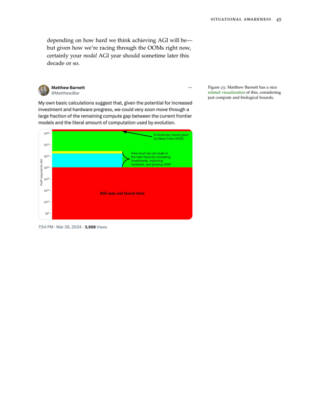
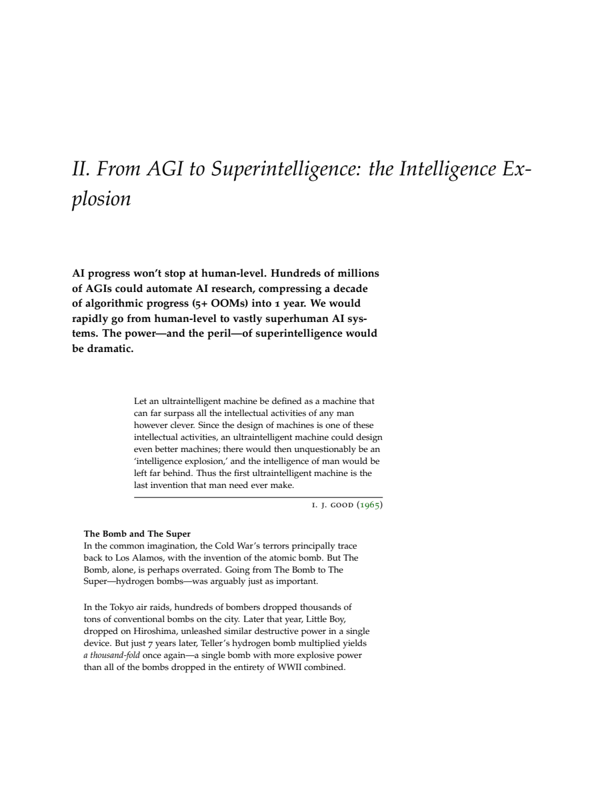

## 四、大工程（The Project）

随着通向 AGI 的竞赛愈演愈烈，国家安全部门（national security state）必将介入。美国政府（USG）将从沉睡中苏醒，到 2027/2028 年，我们会看到某种形式的政府 AGI 大工程。没有一家创业公司能驾驭超级智能。在某个 SCIF（敏感隔离信息设施）里，终局即将上演。

> 我们必须保持好奇，去探究这样一组对象——数百座发电厂、数千枚炸弹、在国家机构中聚集的数万人——如何能够追溯到几个坐在实验室工作台前讨论某一种原子奇特行为的人。
>
> ——Spencer R. Weart

如今，各种"AI 治理"方案层出不穷：从对前沿 AI 系统发放许可证，到制定安全标准，再到为学术界提供数亿美元计算资源的公共云。这些似乎都出于善意——但在我看来，它们犯了一个范畴错误（category error）。

我觉得美国政府会让一个旧金山随机创业公司去开发超级智能，这件事本身就是疯的。想象一下，如果当年我们造原子弹的时候，是让 Uber 随便弄弄。

超级智能——远比人类更聪明的 AI 系统——将拥有巨大的力量，从开发新型武器到驱动经济爆发式增长。超级智能将成为国际竞争的中心；几个月的领先优势在军事冲突中可能具有决定性意义。

那些在潜意识中已将我们短暂的历史喘息期内化的人，会产生一种错觉，认为这不会唤醒更为原始的力量。与我们之前的许多科学家一样，旧金山的伟大头脑们希望，他们能够掌控自己所降生恶魔的命运。现在，他们仍然可以——因为他们是少数拥有局勢感知（situational awareness）的人，是少数理解自己在构建什么的人。但在未来几年，世界将苏醒，国家安全部门也将苏醒，历史将凯旋归来。

正如此前的许多时刻——新冠疫情、"二战"——美国看起来像在方向盘前睡着了，然后，顷刻之间，政府以最超凡的方式挂挡启动。会有一个时刻——就在几年后，只需再经历几次"2023 年级别"的模型能力和 AI 话语跃升——届时一切将变得清晰：我们正站在 AGI 的门槛上，超级智能紧随其后。尽管具体机制尚有诸多变数，但不管怎样，美国政府将执掌舵柄；领先的实验室将（"自愿"）合并；国会将为芯片和电力拨款数万亿美元；一个民主国家联盟将形成。

创业公司在很多方面都很出色——但一家创业公司自身，根本无力负责美国最重要的国防项目。我们需要政府介入，才能有一线希望抵御我们将面临的全面间谍威胁；私人的 AI 努力恐怕等于直接将超级智能交到中共手上。我们需要政府来确保哪怕是最基本的、说得过去的指挥链（chain of command）；不能让随机的 CEO（或随机的非营利董事会）手握核按钮。我们需要政府来管理超级智能的严峻安全挑战，来驾驭智能爆炸（intelligence explosion）的战争迷雾。我们需要政府部署超级智能，以防御任何随之而来的极端威胁，以度过随后将出现的极度动荡和不稳的国际局势。我们需要政府动员一个民主国家联盟，以赢得与威权力量的竞赛，并为世界其他地区锻造（并强制执行）一项防扩散（nonproliferation）制度。我希望事情不必如此——但我们需要政府。（是的，无论哪届政府。）

无论如何，我的核心主张不是规范性的，而是描述性的。几年后，大工程（The Project）将启动。

### 通向大工程之路

深深刻在我记忆中的一段事态转折，是 2020 年 2 月下旬至 3 月中旬。在二月的最后几周和三月初的那几天，我陷入了彻底的绝望：显然，我们正处于新冠疫情的指数曲线上——一场瘟疫即将席卷全国，医院即将崩溃——然而几乎没有人认真对待。纽约市长仍在将新冠恐惧斥为种族主义，并鼓励人们去看百老汇演出。我能做的只有买口罩和做空市场。

然而，仅仅几周之内，整个国家就关闭了，国会拨款了数万亿美元（字面意义上超过 GDP 的 10%）。提前看到指数的走向太难了，但当威胁足够逼近、足够具有存在性时，非凡的力量就被释放了出来。反应来得迟、粗糙、笨拙——但它来了，且是戏剧性的。

AI 领域未来几年的感觉将与此相似。我们现在处于中局（midgame）。2023 年已经是一次剧烈的转折。AGI 从一个你不敢与之关联的边缘话题，变成了参议院重要听证会和世界领导人峰会的主题。考虑到我们仍处于如此早期，美国政府参与的程度已经令我印象深刻。再来几次"2023"，奥弗顿之窗（Overton window）将被彻底炸开。

随着我们穿越 OOM，跃升将继续。到 2025/2026 年左右，我预计会出现下一次真正令人震惊的阶梯式变化；AI 将为大型科技公司带来每年 1000 亿美元以上的收入，并在原始问题解决智力上超越博士生。正如新冠股市崩盘让许多人认真对待新冠一样，我们将拥有万亿美元市值的公司，AI 狂热将无处不在。如果这还不够，到 2027/2028 年，我们将在 1000 亿美元以上的集群上训练模型；成熟的 AI 智能体（agents）/即插即用的远程工作者将开始大规模自动化软件工程和其他认知工作。每一年，加速感都将令人眩晕。

虽然许多人尚未看到 AGI 的可能性，但最终共识将形成。有些人，像 Szilard，比其他人更早看到了原子弹的可能性。他们的警觉起初并未被接受；炸弹的可能性被认为是遥远的（或者至少，人们觉得保守和得体的做法是淡化这种可能性）。Szilard 热切的保密呼吁被嘲笑和无视。但随着越来越多的实证结果出现，许多最初持怀疑态度的科学家开始意识到炸弹是可能的。一旦大多数科学家开始相信我们正站在炸弹的门槛上，政府也相应地看到了国家安全迫切性之重大——曼哈顿计划（Manhattan Project）由此启动。

随着 OOM 从理论外推变为（非凡的）经验现实，渐渐地，领先的科学家、高管和政府官员之间也将形成共识：我们正站在门槛上，站在 AGI 的门槛上，站在智能爆炸的门槛上，站在超级智能的门槛上。而在这一过程中的某个节点，我们将看到 AI 首次真正令人恐惧的演示：也许是常被讨论的"帮助新手制造生物武器"，或是自主入侵关键系统，或是其他完全不同的东西。一切将变得清晰：这项技术将成为一项绝对决定性的军事技术。即使我们幸运到不至于卷入大规模战争，中共很可能已经注意到并启动了一项令人生畏的 AGI 努力。也许，最终（不可避免地）发现中共渗透了美国领先 AI 实验室，将引发巨大的震动。

大约在 2026/2027 年左右，华盛顿的气氛将变得凝重。人们将开始本能地感受到正在发生的事情；他们将感到害怕。从五角大楼的大厅到国会的闭门简报，"我们需要一个 AGI 曼哈顿计划吗？"这个每个人心中都有的、显而易见的问题将回响。起初缓慢，然后猛然间，一切将变得清晰：这正在发生，事情将变得疯狂，这是自原子弹发明以来美国国家安全面临的最重要挑战。以某种形式，国家安全部门将深度介入。大工程将是必要的回应，实际上也是唯一可行的回应。

当然，这是一个极度简略的叙述——很多事情取决于共识何时、以何种方式形成，关键的警示信号，等等。华盛顿以其功能失调而闻名。正如新冠疫情，甚至曼哈顿计划一样，政府将会极度迟钝和笨拙。在 1939 年爱因斯坦（由 Szilard 起草）致总统的信之后，一个铀咨询委员会成立了。但官员们无能，最初几乎没有发生什么。例如，Fermi 只获得了 6000 美元（约合今天的 13.5 万美元）来支持他的研究，即便是这样也不容易，等了几个月才拿到。Szilard 认为，当局的短视和迟钝至少将项目推迟了一年。1941 年 3 月，英国政府终于得出结论：炸弹是不可避免的。美国委员会最初完全无视这份英国报告长达数月——直到 1941 年 12 月，一项全面的原子弹工作才终于启动。

在实践中，这种运作方式可以有很多种。需要明确的是，这不一定是字面意义上的国有化，AI 实验室的研究人员成为军队雇员或类似情况（尽管也不排除这种可能！）。[^113] 相反，我预期的是更圆滑的组织协调。与国防部的关系可能看起来像国防部与波音或洛克希德·马丁的关系。也许通过国防合同或类似机制，主要云算力提供商、AI 实验室和政府之间将建立一个合资实体，使其在功能上成为国家安全部门的项目。就像 AI 实验室在 2023 年"自愿"向白宫做出承诺一样，西方实验室可能会或多或少地"自愿"同意合并到国家努力中。而且国会很可能必须参与，考虑到涉及数万亿美元的投资，以及制衡的需要。[^114] 所有这些细节如何敲定，则是另一个故事了。

[^113]: 注意，虽然私营公司帮助开发核武器组件，但它们绝不被允许拥有一枚完整组装的核武器。相比之下，我在此提出的"AGI 政府项目"的主流版本，对于 WMD（大规模杀伤性武器）参考类别而言，已经是前所未有的私有化了。

[^114]: 国会——甚至副总统！——都不知道曼哈顿计划的存在。我们可能不应该在这里重蹈覆辙；我甚至建议，大工程的关键官员需要参议院确认。

但到 2026 年末/2027/2028 年，它将被启动。核心 AGI 研究团队（几百名研究人员）将转移到一个安全地点；万亿级集群将以创纪录速度建成；大工程将启动。

### 为什么大工程是唯一的出路

我对政府不抱任何幻想。政府面临各种局限和不良激励。我是美国私营部门的坚定信徒，几乎从不主张政府对技术或工业进行重度干预。

我曾经也将同样的框架应用于 AGI——直到我加入了一家 AI 实验室。AI 实验室在有些方面非常出色：它们能够将 AI 从一个学术科学项目带到商业大舞台，方式只有创业公司才能做到。但归根结底，AI 实验室仍然是创业公司。我们根本就不应该期望创业公司有能力处理超级智能。

这里没有好的选项——但我看不到其他出路。当一项技术对国家安全如此重要时，我们将需要美国政府。

### 超级智能将是美国最重要的国防项目

我在之前的篇章中讨论过超级智能的力量。在几年之内，超级智能将彻底颠覆军事力量平衡。到 2030 年代初期，美国的全部武库（无论你喜欢与否，它是全球和平与安全的基石）可能会过时。这不仅是现代化的问题，而是彻底的替代。

简而言之，AGI 的发展显然将属于更像核武器而非互联网的类别。是的，它当然是两用的——但核技术也是两用的。民用应用会有它们的时代。但在 AGI 终局的迷雾中，无论是好是坏，国家安全将是主要背景。

我们将需要在几年内彻底重塑美国军力，面对快速的技术变革——否则将有被做到这一点的对手完全压倒的风险。也许最重要的是，最初的优先任务将是部署超级智能用于防御应用，开发对抗措施以在无数新型威胁中生存：对手的超人级黑客能力、可以对我们核威慑实施先发制人打击的新型隐形无人机蜂群、可被武器化的合成生物学进步的扩散、动荡的国际（和国内）权力斗争，以及失控的超级智能项目。

无论名义上是否为私有，AGI 项目将需要是、也将是，从本质上讲，一个国防项目，它需要与国家安全部门进行极其密切的合作。

### 超级智能需要一条清醒的指挥链

超级智能的力量——以及挑战——将属于一个与我们在科技公司中所习惯的一切完全不同的参考类别。这一点似乎相当清楚：这不应该由某个随机的 CEO 单方面指挥。事实上，在私人实验室开发超级智能的世界里，个别 CEO 完全有可能拥有字面意义上政变美国政府的能力。[^115] 想象一下，如果 Elon Musk 对核武库拥有最终指挥权。[^116]（或者如果某个随机的非营利董事会可以决定夺取核武库的控制权。）

[^115]: 到那时，甚至不需要 AI 实验室员工的配合，因为他们届时已基本被自动化了。

[^116]: 正如 Sam Altman 曾经说过的，每一年我们离 AGI 更近一步，每个人都会增加 10 点疯狂值。

这也许显而易见，但：作为一个社会，我们已经决定民主政府应该控制军队；[^117] 超级智能，至少在最初，将是最强大的军事武器。激进的方案不是大工程；激进的方案是把赌注押在私人 AI CEO 行使军事权力并成为仁慈的独裁者上。

（事实上，在私人 AI 实验室的世界里，情况可能比随机的 CEO 手握核按钮还要糟糕——AI 实验室糟糕的安全状况之一，就是其内部控制的彻底缺失。也就是说，随机的 AI 实验室员工（未经任何审查）可能在不被察觉的情况下变节。）

[^117]: 事实上，政府拥有最大火力是一项巨大的文明成就！与其像中世纪那样人人对人人混战，我们通过法院、多元制度和类似机制来解决争端。

我们将需要一条清醒的指挥链——以及负责任地运用可媲美 WMD 的武器所需的所有其他流程和保障措施——这需要政府来实现。在某种意义上，这只是一个伯克式的（Burkean）论证：制度、宪法、法律、法院、制衡、规范和共同对自由民主秩序的奉献（例如，将军拒绝服从非法命令）等制约政府权力的东西，已经经受住了数百年的考验。而特殊 AI 实验室的治理结构，则在第一次经受考验时就崩溃了。美国军方如果愿意，实际上已经可以杀死美国的几乎每一个平民，或夺取权力——而我们控制政府对核武器的权力的方式，并不是通过大量拥有自己核武库的私人公司。只有一条指挥链和一套制度，已经证明自己能够胜任这一任务。

再说一次，也许你是一个真正的自由意志主义者（libertarian），在规范层面持不同意见（让 Elon Musk 和 Sam Altman 各自指挥自己的核武库！）。[^118] 但一旦变得明确，超级智能是国家安全的核心问题，我确信华盛顿的男男女女将这样看待它。

[^118]: 或者也许你会说，直接开源一切就好了。单纯开源一切的问题在于，这不会是一个百花齐放的美好世界，而是一个中共可以自由获取美国开发的超级智能、可以超越建设（并施以更少的谨慎/监管）并接管世界的世界。当然，另一个问题是超级 WMD 向每个流氓国家和恐怖组织的扩散。我不认为这会善终。这有点像完全没有政府更可能导致暴政（或毁灭）而非自由。

无论如何，随着我们更接近 AGI，人们高估了开源的重要性。考虑到集群成本飙升至数千亿美元，关键的算法秘密现在是专有的而非像几年前那样发表，将是由 2-3 个左右的领先玩家来构建 AGI，而不是某个快乐的去中心化程序员社区。

我确实认为，另一种形式的开源将继续发挥重要作用：落后几年的模型被开源，帮助技术的好处广泛扩散。

### 超级智能的民用

当然，这并不意味着超级智能的民用应用将保留给政府。

- 核链式反应首先作为政府项目被驾驭——核武器永久保留给政府——但民用核能作为私人项目蓬勃发展（在 60 年代和 70 年代，环保主义者将其关闭之前）。
- 波音公司制造了 B-29（"二战"期间最昂贵的国防研发项目，比曼哈顿计划更昂贵）以及 B-47 和 B-52 远程轰炸机，均与军方合作——之后将这项技术用于波音 707，这款商用飞机开启了喷气时代。而今天，虽然波音只能向政府出售隐形战斗机，但它可以自由地私下开发和销售民用喷气机。
- 雷达、卫星、火箭、基因技术、"二战"工厂等等，也是如此。

超级智能的初始发展将由国家安全的迫切需求主导，以度过并稳定一个极度动荡的时期。超级智能的军事用途将保留给政府，安全规范将被强制执行。但一旦最初的危机过去，自然的路径是由参与国家联盟的公司（以及其他公司）私下推进民用应用。

即使在有大工程的世界里，一个私人的、多元的、基于市场的、繁荣的超级智能民用应用生态系统也会有它的时代。

### 安全

我在本系列的之前篇章中已对此进行了长篇讨论。在目前的轨迹上，我们不如放弃拥有任何美国 AGI 努力；中国可以立即窃取所有算法突破和模型权重（字面意义上的超级智能的副本）。在目前的轨迹上，我们甚至不清楚是否能实现"防朝鲜级别"的超级智能安全。在私人创业公司开发 AGI 的世界里，超级智能将扩散到数十个流氓国家。这完全站不住脚。

如果我们要对此稍微认真一点，我们显然需要把这些东西锁住。大多数私人公司未能认真对待这一点。但无论如何，如果我们最终要面对中国间谍活动的全部力量（例如，窃取权重是国安部的第一优先级），一家私人公司可能不可能达到足够好的安全性。届时，需要在很大程度上获得美国情报界的广泛合作，才能充分确保 AGI 的安全。这将对 AI 实验室和核心 AGI 研究团队施加侵入性限制：从极端审查到持续监控，到在 SCIF 中工作，到减少离开的自由；而且它将需要只有政府才能提供的基础设施，最终包括 AGI 数据中心本身的物理安全。

在某种意义上，仅安全一项就足以使政府项目成为必要——如果我们不能把这些东西锁住，自由世界的卓越性和 AI 安全都注定要完蛋。（事实上，我认为这很可能是最终触发因素中的主要因素：一旦中共渗透 AGI 实验室的事实变得清晰，每一位参议员、众议员和国家安全官员都会……对此有强烈的看法。）

### 安全

简而言之：我们有很多把这件事搞砸的方式——从确保我们能够可靠地控制和信任将很快掌管我们经济和军事的数十亿超级智能体（超级对齐问题，superalignment problem），到控制新型大规模杀伤手段被滥用的风险。

有些 AI 实验室声称致力于安全：承认他们正在构建的东西如果失控，可能造成灾难，并承诺在时机到来时做必要之事。我不确定我们能否将每一位美国人的生命托付给他们的承诺。更重要的是，到目前为止，他们尚未展现出为他们自己所承认正在构建的那些东西所必需的能力、可信度或严肃性。

本质上，它们是创业公司，具有所有通常的商业激励。竞争可能推动所有各方直接冲过智能爆炸，而至少会有一些行为体愿意将安全抛在一边。特别是，我们可能希望"花费一部分我们的领先优势"来获得解决安全挑战的时间，但西方实验室需要协调才能做到这一点。（当然，私人实验室的 AGI 权重届时将已被窃取，因此他们的安全预防措施甚至都不重要；我们将听任中共和朝鲜的安全预防措施的摆布。）

一种答案是监管。在 AI 发展较为缓慢的世界里，这可能是合适的，但我担心监管根本无法应对智能爆炸的挑战的本质。所需要的，不太像是花几年时间做仔细的评估，并通过官僚机构推动一些安全标准。它更像是打一场战争。

我们将面临一个疯狂的年份，局势每周都在极其迅速地变化，基于模糊数据的艰难决策关乎生死，解决方案——甚至问题本身——事先不可能完全清晰，而是取决于"战争迷雾"中的能力，这将涉及疯狂的权衡，比如"我们对齐测量的某些指标看起来模糊，我们不再真正理解正在发生什么，也许还好，但有一些警示信号表明下一代超级智能可能会失控，我们是否应该将下一次训练运行推迟 3 个月，以在安全上获得更多信心——但糟糕，最新情报报告显示中国窃取了我们的权重，正在以自己的智能爆炸全速前进，我们该怎么办？"。

我不确信政府项目能胜任处理这一问题——但"由创业公司开发超级智能"的替代方案，似乎比普遍认知中更接近"祈祷最好的结果"。我们需要一条能够为做出这些艰难权衡带来所需严肃性的指挥链。

### 稳定国际局势

智能爆炸及其直接后果将带来人类有史以来面临的最动荡和紧张的局势之一。我们这代人不习惯这一点。但在这个初始阶段，手头的任务不是打造酷产品，而是以某种方式，绝望地，熬过这个阶段。

我们将需要政府项目来赢得与威权力量的竞赛——并给予我们清晰的领先优势和必要的喘息空间，以应对这一局势的危险。如果不能防止超级智能模型权重的瞬间失窃，我们不如放弃。我们将希望整合西方的努力：汇聚我们最好的科学家，使用我们能找到的每一块 GPU，确保数万亿美元的集群建设在美国进行。我们将需要保护数据中心免受对手的破坏，或直接攻击。

也许最重要的是，将需要美国的领导力来建立——并在必要时强制执行——一项防扩散制度。我们将需要压制俄罗斯、朝鲜、伊朗和恐怖组织，使他们无法利用自己的超级智能来开发能让他们挟持世界的技术和武器。我们将需要使用超级智能来加固关键基础设施、军事和政府的安全，以防御极端的新的黑客能力。我们将需要使用超级智能来稳定生物学或类似领域进展中的攻防平衡。我们将需要开发工具以安全地控制超级智能，并关闭来自他人不慎项目中产生的失控超级智能。AI 系统和机器人将以 10-100 倍以上于人类的速度运转；一切都将极其迅速地开始发生。我们需要做好准备，应对将长达一个世纪的技术进步压缩到几年中所产生的任何其他六西格玛级别的剧变——以及伴随而来的威胁。

至少在这个初始阶段，我们将面临最非凡的国家安全迫切需求。也许，没有人能胜任这一任务。但在我们拥有的选项中，大工程是唯一清醒的选择。

### 大工程不可避免；但好与不好则不是

最终，我这里的核心主张是描述性的：无论我们喜欢与否，超级智能不会看起来像一家旧金山创业公司，而是会以某种方式主要处于国家安全领域。在过去一年里，我经常向我的旧金山朋友们提起大工程。也许最让我惊讶的是，大多数人对这个想法感到多么惊讶。他们根本没有考虑过这种可能性。但一旦他们考虑了，大多数人都同意这似乎是显而易见的。如果我们对自己认为正在构建的东西的判断至少有一点正确的话，当然，到最后这将是（某种形式的）一个政府项目。如果一家实验室明天开发出了字面意义上的超级智能，当然联邦政府会介入。

一个重要的自由变量不是"是否"，而是"何时"。政府是直到我们处于智能爆炸之中才意识到正在发生什么——还是提前几年意识到？如果政府项目是不可避免的，那么越早似乎越好。我们将非常需要那几年时间来进行安全冲刺计划，让关键官员跟上节奏并做好准备，建立一个正常运作的合并实验室，等等。如果政府只在最后一刻介入（而秘密和权重届时将已被窃取），事情将更加混乱。

另一个重要的自由变量是我们可以团结的国际联盟：既包括一个更紧密的民主国家联盟来开发超级智能，也包括向世界其他地区提供更广泛的利益分享提议。

- 前者可能看起来像《魁北克协议》（Quebec Agreement）：丘吉尔和罗斯福之间的一项秘密协定，汇集他们的资源开发核武器，同时不相互使用或未经彼此同意对他人使用。我们将希望纳入英国（DeepMind）、东亚盟友如日本和韩国（芯片供应链），以及北约/其他核心民主盟友（更广泛的工业基础）。联合的努力将拥有更多的资源、人才和对整个供应链的控制；在安全、国家安全和军事挑战上实现紧密协调；并为运用超级智能的力量提供有益的制衡。
- 后者可能看起来像"原子用于和平"（Atoms for Peace）、国际原子能机构（IAEA）和《不扩散核武器条约》（NPT）。我们应该承诺与更广泛的国家群体（包括非民主国家）分享超级智能的和平利益，并承诺不对他们攻击性地使用超级智能。作为交换，他们放弃追求自己的超级智能项目，对 AI 系统的部署做出安全承诺，并接受对双重用途应用的限制。希望是这一提议减少军备竞赛和扩散的激励，并将广泛联盟纳入美国主导的伞下，为后超级智能世界秩序奠定基础。

也许最重要的自由变量仅仅是：不可避免的政府项目是否会有能力。它将如何组织？我们怎样才能把这件事做成？制衡将如何运作，一条清醒的指挥链是什么样子的？几乎没有关注被投入到弄清楚这些。[^119] 几乎所有其他 AI 实验室和 AI 治理的政治活动都是边角料。这才是大局。

[^119]: 对我那些进步研究（Progress Studies）的同仁们：你们应该思考这件事，这将是你们智识事业的顶峰！你们花了所有时间研究美国政府研究机构、它们在过去半个世纪的衰落，以及如何使它们重新有效。告诉我：我们将如何使大工程有效？

### 终局（The Endgame）

所以，到 2027/2028 年，终局将启动。到 2028/2029 年，智能爆炸将正在进行；到 2030 年，我们将召唤出超级智能，带着它的全部力量和威力。

无论他们让谁负责大工程，都将面临一项地狱般的任务：构建 AGI，并快速构建 AGI；将美国经济置于战时状态，制造数亿块 GPU；把所有东西锁住，清除间谍，抵御中共的全面攻击；以某种方式管理一亿个疯狂自动化 AI 研究的 AGI，在一年内实现十年的跃升，并很快产出远比最聪明的人类更聪明的 AI 系统；以某种方式让这一切不至于失控，不产生试图从人类监督者手中夺取控制权的失控超级智能；使用那些超级智能来开发任何必需的新技术以稳定局势并保持对对手的领先，迅速重塑美军以整合这些技术；同时驾驭可能是有史以来最紧张的国际局势。我得说，他们最好是厉害的角色。

*图 38：Oppenheimer 和 Groves。*

对于我们这些接到召唤参与其中的人来说，这将是……压力巨大的。但这将是我们的责任，为自由世界——以及全人类——服务。如果我们熬过来，并能够回望那些岁月，那将是我们做过的最重要的事情。而且，无论他们找到的安全设施是什么，它大概不会有如今 AI 研究人员那荒谬到过分的待遇，但也不会太糟。旧金山已经像一个独特的 AI 研究人员大学城；大概这不会有什么不同。仍然是那个奇怪的小圈子，白天为扩展曲线（scaling curves）焦虑，周末聚在一起，闲聊 AGI 和当下的实验室政治。

只是——好吧——赌注将无比真实。

*图 39：首次受控核裂变反应四周年纪念日，原子科学家在芝加哥大学重聚。*

沙漠见，朋友们。

---

## 五、告别之言（Parting Thoughts）

> 我至今记得 1941 年春天。那时我意识到，核弹不仅是可能的——它是不可避免的。这些想法迟早不会只属于我们。过不了多久，每个人都会想到它们，某个国家会将它们付诸行动……
>
> 而且没有人可以谈论这件事。我度过了许多不眠之夜。但我确实意识到它可能有多么、多么严重。那时我不得不开始服用安眠药。这是唯一的办法，从那时起我就没有停过。已经 28 年了，我想在这 28 年里我没有漏掉过一晚。
>
> ——James Chadwick
>
> （诺贝尔物理学奖得主，1941 年英国政府关于原子弹不可避免性报告的作者，该报告最终推动了曼哈顿计划的启动）

在这个十年结束时，我们将已经建造出超级智能。这是本系列大多数篇幅所讨论的内容。对我交谈过的大多数旧金山人来说，屏幕就在这里变黑了。但此后的十年——2030 年代——将至少同样波澜壮阔。到 2030 年代末，世界将被彻底地、面目全非地改变。一个新的世界秩序将被锻造。但可惜——那是另一个时间的故事了。

我们必须暂时收笔。让我最后再说几句。

### AGI 现实主义（AGI Realism）

这一切令人难以深思——许多人做不到。"深度学习正在撞墙！"他们每年都这样宣告。这不过是又一个科技泡沫，评论家们自信地说。但即使在身处旧金山震中的人群中，话语也已两极分化为两种从根本上不严肃的集结号角。

在一端是末日论者（doomers）。他们多年来一直痴迷于 AGI；我对他们的先见之明给予很大的肯定。但他们的思考已经僵化，脱离了深度学习的经验现实，他们的提议幼稚且不可行，并且他们未能正视非常真实的威权威胁。关于 99% 毁灭概率的疯狂宣称、无限期暂停 AI 的呼吁——这些显然不是正途。

在另一端是 e/accs（有效加速主义者）。狭义上讲，他们有一些好的观点：AI 的进步必须继续。但在他们肤浅的 Twitter 垃圾帖之下，他们是虚假的；是只想打造他们的包装器创业公司、而非直视 AGI 的玩票者。他们声称是美国自由的坚定捍卫者，却抗拒不了不光彩独裁者金钱的诱惑歌。事实上，他们是真正的停滞主义者。在他们试图否认风险的过程中，他们否认了 AGI；本质上，我们能得到的只是酷炫聊天机器人，它们当然不危险。（以我的标准，那算是令人失望的加速主义。）

但在我看来，这个领域中最聪明的人已经汇聚到一种不同的视角，一种我称之为 AGI 现实主义（AGI Realism）的第三条道路。其核心信条很简单：

- **1. 超级智能是国家安全问题。** 我们正在快速建造比最聪明的人类更聪明的机器。这不是又一个酷炫的硅谷繁荣；这不是某个随机的程序员社区在写一个无害的开源软件包；这不是游戏和娱乐。超级智能将是狂野的；它将是人类有史以来建造的最强大武器。对我们任何参与其中的人来说，这将是我们做过的最重要的事情。

- **2. 美国必须领先。** 自由的火炬无法在习近平先得到 AGI 之后存活。（而且，现实地说，美国的领导力也是实现安全 AGI 的唯一路径。）这意味着我们不能简单地"暂停"；这意味着我们需要快速扩大美国的电力生产，以在美国建造 AGI 集群。但这也意味着业余创业公司的安全性、将核机密交给中共的做法，已经不行了；意味着核心 AGI 基础设施必须由美国控制，而不是由中东的某个独裁者控制。美国 AI 实验室必须将国家利益放在首位。

- **3. 我们不能搞砸。** 认识到超级智能的力量也意味着认识其危险。存在非常真实的安全风险；非常真实的所有这一切会失控的风险——无论是人类利用所带来的毁灭性力量进行相互毁灭，还是因为，是的，我们正在召唤的外星物种是我们尚无法完全控制的。这些是可控的——但随性应对将不可接受。驾驭这些危险需要优秀的人带来一种尚未被提供的严肃性。

随着加速的加剧，我只会预期话语变得更加刺耳。但我最大的希望是，将有一些人感受到即将到来之事的重量，并将其视为一份庄严的责任召唤。

### 假如我们是对的呢？

在这一点上，也许你觉得我和所有其他旧金山人都彻底疯了。但请想一想，哪怕只是片刻：假如他们是对的呢？这些是发明并构建了这项技术的人；他们认为 AGI 将在本十年内被开发出来；而且，尽管存在相当广泛的光谱，他们中的许多人非常认真地认为，通向超级智能的道路将如我在本系列中所描述的那样展开。

几乎可以肯定，我在故事的重要部分上有误；如果现实比这疯狂的任何程度都要接近，误差条将非常大。此外，正如我一开始所说的，我认为存在广泛的可能性范围。但我认为变得具体是重要的。而在本系列中，我已阐述了我目前认为对于本十年剩余时间——这十年——最有可能的单一情景。

因为——它开始变得真实，非常真实。几年前，至少对我来说，我认真对待这些想法——但它们是抽象的，被隔离在模型和概率估计中。现在它感觉极为本能。我能看到它。我能看到 AGI 将如何被建造。这不再是关于人脑尺寸的估计和假设和理论外推和所有那些——我可以基本上告诉你 AGI 将在哪个集群上训练以及何时建成，我们将使用的大致算法组合，未解决的问题和解决它们的路径，将重要的人员名单。我能看到它。这是极其本能的。当然，在 2023 年初全面加杠杆做多英伟达是很好很好的，但历史的负担是沉重的。我不会选择这些。

但最可怕的觉悟是，**没有一支精锐团队来应对这件事。** 小时候，你对世界有一种美化的看法，认为当事态变得严重时，有那些英雄科学家、那些极其能干的军人、那些冷静的领导者，他们会出手，他们会拯救局面。并非如此。世界小得难以置信；当面具脱落，通常只是幕后的几个人是活着的玩家（live players），是在绝望地试图阻止事情崩溃的人。

此刻，世界上也许有几百人意识到什么即将冲击我们，理解事情即将变得多么疯狂，拥有局勢感知。我大概亲自认识，或与每一个可能合理运营大工程的人只有一度分隔。幕后那几个绝望地试图阻止事情崩溃的人，就是你和你的朋友们，以及他们的朋友们。就是这样。就这些。

总有一天，这一切将不再由我们掌控。但现在，至少在未来几年的中局里，世界的命运取决于这些人。

自由世界会胜利吗？

我们会驯服超级智能，还是它驯服我们？

人类会再一次躲过自我毁灭吗？

赌注毫不逊于此。

这些人是伟大而可敬的人。但他们毕竟只是人。很快，AI 将执掌世界，但我们还将迎来最后一搏。愿他们最后的守护为人类带来荣耀。

---

## 附录（Appendix）

### 关于计算量粗略估算的一些额外细节

**训练计算量**

**年份。** OpenAI 的 GPT-4 技术报告指出，GPT-4 于 2022 年 8 月完成训练。此后我们大致按照每年 0.5 个 OOM 的趋势进行推算。

**H100-等效数。** Semianalysis、摩根大通等估计 GPT-4 是在 2.5 万块 A100 上训练的，而 H100 的性能是 A100 的 2-3 倍。

**成本。** 人们经常引用类似"GPT-4 训练花费 1 亿美元"这样的数字，仅使用 GPU 的租金成本（即类似于"租用这种规模的集群 3 个月进行训练需要多少钱"）。但这是个错误。重要的是实际构建集群的大致成本。如果你想要世界上最大的集群之一，你不能仅仅租用 3 个月！而且，你需要的算力不仅仅用于旗舰训练运行：会有大量的去风险实验、失败的运行、其他模型等等。

近似估算 GPT-4 集群成本：

- 公开估计表明 GPT-4 集群约为 2.5 万块 A100。
- 假设每 A100 每小时 1 美元，运行 2-3 年，得出大约 5 亿美元的成本。
- 或者，你可以按每块 H100 约 2.5 万美元成本、1 万 H100-等效来估算，而英伟达 GPU 约占集群成本的一半（其余为电力、物理数据中心、冷却、网络、维护人员等）。（例如，这份总拥有成本分析估计，大型集群约 40% 的成本是 H100 GPU 本身，另有约 13% 支付给英伟达用于 Infiniband 网络。然而，如果在该计算中排除资本成本，GPU 约占成本的 50%，加上网络，英伟达获得集群成本的略超 60%。）

**每美元 FLOP 在每代英伟达产品中有所改善，但幅度不大。** 例如，H100 → B100 大概是 1.5 倍 FLOP/$：B100 实际上是两块 H100 拼接在一起，但零售价不到 2 倍成本。但 B100 多少是个例外。它们出奇地便宜，可能是因为英伟达想碾压竞争对手。相比之下，A100 → H100 在每美元 FLOP 上几乎没有改善（芯片好 2 倍但不含 fp8，成本大约 2 倍），如果算上 fp8 的改进，大约 1.5 倍——而那还是两年的代际。

虽然我认为利润率压缩会带来一些进一步的每美元 FLOP 改善的顺风，但由于 GPU 变得极度受限，它们也可能变得更昂贵。AI 芯片专业化的收益将继续，但我不清楚是否还会有改变游戏的每美元 FLOP 的技术改进，考虑到芯片已经相当为 AI 专门化（例如为 Transformer 专门化，且已经达到 fp8/fp4 精度），摩尔定律如今步履蹒跚，而其他瓶颈组件如内存和互联正在以更慢的速度改善。如果你看 Epoch 的数据，过去十年中，顶级 ML GPU 的每美元 FLOP 似乎不到 10 倍的改善，鉴于上述原因，我预计这甚至会放缓而非加速。

大约每年 35% 的每美元 FLOP 改善，将给出 +4 OOM 集群的 1 万亿美元成本。也许每美元 FLOP 改善更快，但数据中心的资本支出也将变得更加昂贵——因为你需要实际建设新的电力，前期大量的资本支出，而不仅仅是租赁现有的已折旧电厂。

这些毕竟只是粗略的数字。如果例如 1 万亿美元的集群可以更高效地完成，实际在计算量上产生更多像 +4.5 OOM 的增益，这也完全在误差条范围内。

**电力。** 一块 H100 是 700W，但你需要大量的数据中心电力（冷却、网络、存储）；Semianalysis 估计每块 H100 约 1400W。

每瓦 FLOP 还有一些收益可挖，但一旦我们耗尽了 AI 芯片专业化的收益（见上一脚注），例如降到最低精度，这些似乎较为有限（主要是芯片工艺改进，缓慢）。话虽如此，随着电力变得更加受限（从而成为成本的更大比例），芯片设计可能会专门化为更高的能效，哪怕牺牲 FLOP。不过，冷却、网络、存储等仍有电力需求（在上面的 H100 数据中，已大约占电力需求的一半）。

对于这些粗略的估算，让我们在此按每 H100-等效 1 kW 来计算；再次说明，这些只是粗略的估算。（如果出现了意外的每瓦 FLOP 突破，我预期同样的电力支出，只是 OOM 计算增益更大。）

**电力参考类别。** 一个 10 GW 集群连续运行一年，是 87.6 TWh。相比之下，俄勒冈州每年消耗约 27 TWh 电力，华盛顿州每年消耗约 92 TWh。

一个 100 GW 集群连续运行一年，是 876 TWh，而美国全年总发电量约为 4,250 TWh。

点击此处返回"训练计算量"表格。

### 总体算力

**今年的 H100-等效数。** 我估计英伟达在 2024 年将出货约 500 万块数据中心 GPU。其中少部分是 B100，我们将它们计为 2 倍以上的 H100。然后还有其他 AI 芯片：TPU、Trainium、Meta 的定制芯片、AMD GPU 等。

**台积电产能。** 台积电每月具有超过 15 万片 5nm 晶圆的产能，正在提升至每月 10 万片 3nm 晶圆，另外还有约 15 万片 7nm 晶圆每月；总计约为每月 40 万片晶圆。

假设每片晶圆大约 35 块 H100（H100 采用 5nm 工艺制造）。以 2024 年 500-1000 万 H100-等效量计算，这相当于 2024 年年度 AI 芯片生产所需的 15 万-30 万片晶圆。

取决于在该范围中的位置，以及我们是否将 7nm 生产计算在内，这大约占年度领先制程晶圆生产的 3%-10%。

点击此处返回"总体算力"表格。
