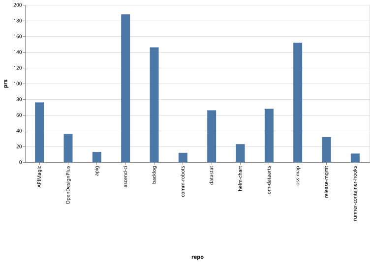
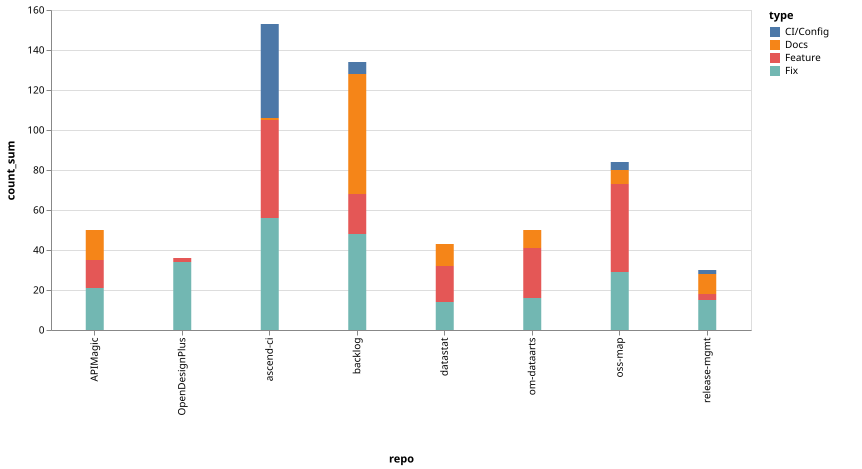
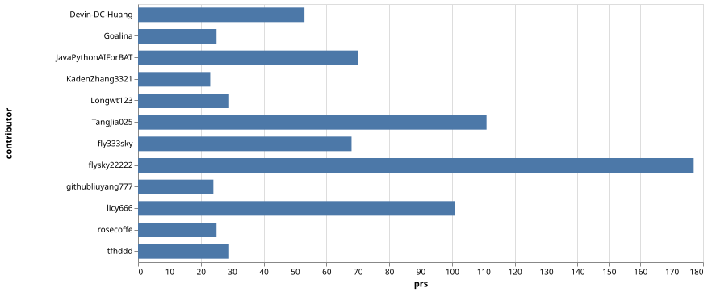
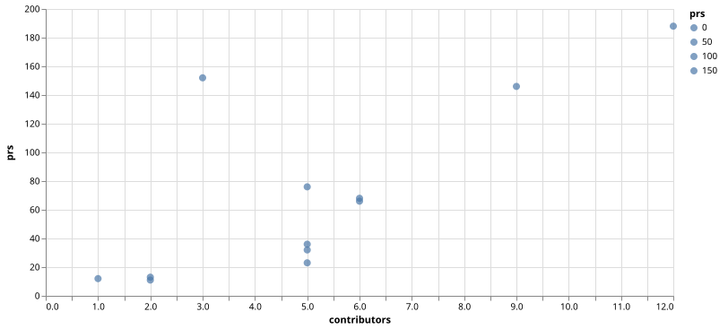

# opensourceways 组织月度代码合入分析报告

> 周期: **2026-06-24 ~ 2026-07-24** (30 天)  
> 数据来源: **GitHub Search API** (实时) | 图表: **Microsoft Flint-Chart** → Vega-Lite → SVG  
> 统计口径: 仅 merged PR

---

## 一、总览

| 指标 | 数值 |
|------|------|
| 总合入 PR | **1,001** |
| 活跃仓库 | **75** |
| 活跃贡献者 | **47** 人 |
| 日均 PR | **~33** |

---

## 二、仓库活跃度排行

| # | 仓库 | PRs | Feature | Fix | CI/Config | Docs | 贡献者 |
|---|------|-----|---------|-----|-----------|------|--------|
| 1 | **ascend-ci-deployment** | 188 | 49 | 56 | 47 | 1 | 12 |
| 2 | **oss-map** | 152 | 44 | 29 | 4 | 7 | 3 |
| 3 | **backlog** | 146 | 20 | 48 | 6 | 60 | 9 |
| 4 | **APIMagic** | 76 | 14 | 21 | 0 | 15 | 5 |
| 5 | **om-dataarts** | 68 | 25 | 16 | 0 | 9 | 6 |
| 6 | **datastat-manage-website** | 66 | 18 | 14 | 0 | 11 | 6 |
| 7 | **OpenDesignPlus** | 36 | 2 | 34 | 0 | 0 | 5 |
| 8 | **release-mgmt** | 32 | 3 | 15 | 2 | 10 | 5 |
| 9 | **helm-chart-value** | 23 | 1 | 1 | 2 | 0 | 5 |
| 10 | **apig-openapi-registry** | 13 | 1 | 0 | 0 | 0 | 2 |
| 11 | **community-robots** | 12 | 0 | 0 | 3 | 9 | 1 |
| 12 | **runner-container-hooks** | 11 | 1 | 6 | 1 | 1 | 2 |
| 其余 63 个仓库 | | ~178 | — | — | — | — | — |

### 集中度

| 层级 | 占比 |
|------|------|
| TOP 3 (ascend-ci + oss-map + backlog) | **48.6%** |
| TOP 6 (+APIMagic + om-dataarts + datastat) | **69.6%** |

---

## 三、PR 类型分布

排名前 8 仓库的 PR 类型分布。ascend-ci-deployment 的 CI/Config 类 PR 占比显著（47/188 = 25%），backlog 以文档需求类为主（60/146 = 41%），oss-map 和 om-dataarts 则是功能型 PR 的主力仓库。

---

## 四、贡献者排行

| # | GitHub ID | PRs | 活跃仓库数 | 主要仓库 |
|---|-----------|-----|-----------|---------|
| 1 | **flysky22222** | 177 | 15 | om-dataarts, APIMagic, datastat, backlog |
| 2 | **TangJia025** | 111 | 7 | backlog (主力) |
| 3 | **licy666** | 101 | 3 | oss-map (主力) |
| 4 | **JavaPythonAIForBAT** | 70 | 5 | ascend-ci-deployment (主力) |
| 5 | **fly333sky** | 68 | 8 | om-dataarts, APIMagic, datastat |
| 6 | **Devin-DC-Huang** | 53 | 1 | oss-map |
| 7 | **tfhddd** | 29 | 2 | ascend-ci-deployment |
| 8 | **Longwt123** | 29 | 4 | ascend-ci-deployment |
| 9 | **rosecoffe** | 25 | 9 | release-mgmt, 多仓维护 |
| 10 | **Goalina** | 25 | 1 | release-mgmt |
| 11 | **githubliuyang777** | 24 | 9 | OpenDesignPlus, 多仓维护 |
| 12 | **KadenZhang3321** | 23 | 3 | ascend-ci-deployment |

> ⚠️ **bus factor 极高**: flysky22222 一人占 17.7% PR。前 5 人占 52%。三个核心仓库各有单人依赖。

---

## 五、贡献者 - PR 密度关系

每个仓库的贡献者人数与 PR 总数的关系。oss-map 仅 3 人完成 152 PR（人均 51），是效率最高但也最脆弱的数据采集仓库。ascend-ci-deployment 有 12 人协作（人均 16），是团队化程度最高的 CI 基础设施仓库。

---

## 六、关键发现

### 功能产出 TOP 3

1. **oss-map (44 feature PRs)**: 数据采集系统大规模重构——项目 key 平铺、LLM 统一调用、多公司导出、技术新闻采集、maintainer 手动编辑面板
2. **ascend-ci-deployment (49 feature PRs)**: Liqo 多集群调度、Volcano NPU 调度、ARM64 集群接入、Karmada 联邦集群、vllm-ascend-recipes runner
3. **om-dataarts (25 feature PRs)**: TTFHW 测试看板全面上线、蓝区贡献采集、运营质量 baseline 建表、社区 discussion 采集

### 风险

| 风险 | 等级 | 说明 |
|------|------|------|
| bus factor | 🔴 | flysky22222 独揽 177 PR（17.7%），oss-map 仅 3 人 |
| backlog 伪活跃 | 🟡 | 60/146 PR 是文档需求类 |
| ascend-ci 高危变更 | 🟡 | 频繁的 buildkitd/DNS/PVC 修复暗示基础设施稳定性不足 |

### 趋势

- **Liqo + Karmada 多集群落地**: ascend-ci 正从单集群走向联邦化
- **TTFHW 看板跨仓联动**: om-dataarts + APIMagic + datastat 三仓同步推进
- **oss-map 数据采集重构进入深水区**: 代码变更量极大，需关注 review 质量

---

*报告生成: Claude Code KG Agent · 图表: Microsoft Flint-Chart + Vega-Lite · 数据: GitHub API*
